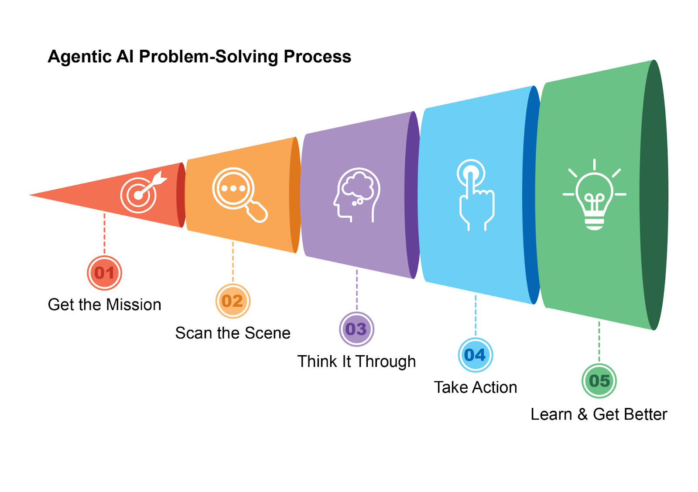
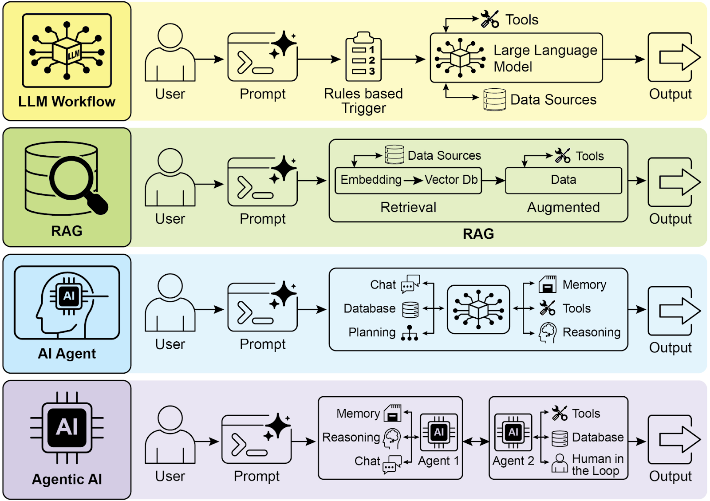
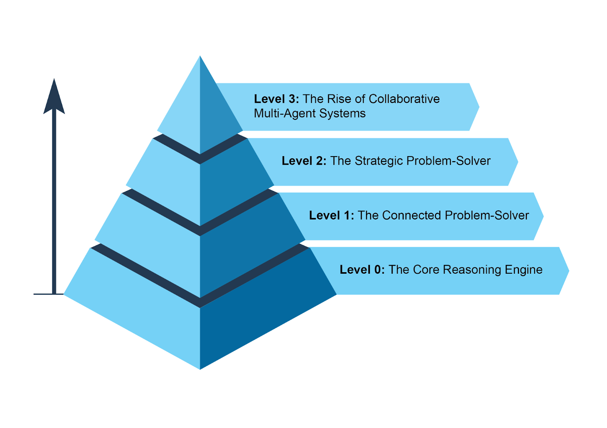
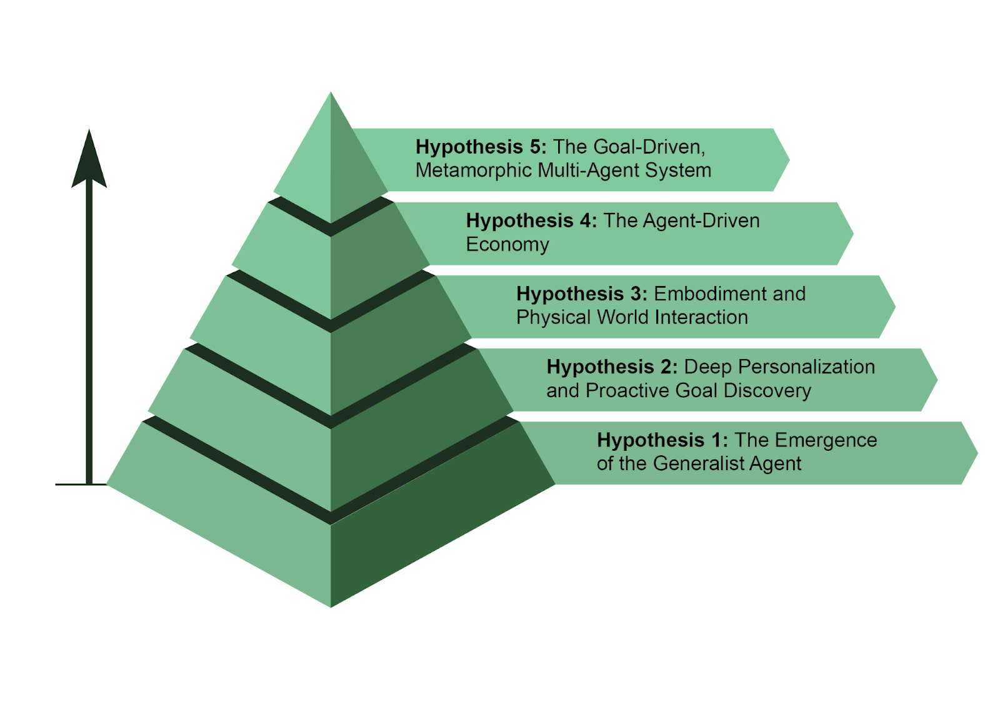

# 📚 Agentic Design Patterns (中文版)

> **提取时间**：2025-12-17 05:14:24
> **内容类型**：中文简体版本
> **总页数**：424 页
> **原始来源**：https://github.com/ginobefun/agentic-design-patterns-cn

---

# What makes an AI system an Agent? | <mark>是什么让 AI 系统成为「智能体」？</mark>

简单来说， 智能体是一个能够感知环境并采取行动以实现特定目标的系统它从标准大语言模型演进而来， 被赋予了规划使用工具以及与周围环境交互的能力可以把智能体想象成一个能在工作中不断学习的智能助手它遵循一个简单的五步循环来完成任务（见图）

获取任务： 你给它一个目标， 比如帮我安排日程

分析环境： 收集所有必要信息阅读邮件查看日历访问联系人以了解当前状况

思考对策： 它通过考量达成目标的最佳方法来制定一个行动计划

采取行动： 通过发送邀请安排会议更新日历来执行计划

学习并改进： 它观察成功的产出并相应地调整自身例如， 如果一个会议被重新安排， 系统会从这一事件中学习， 以提升其未来的表现

图： 智能体如同一位智能助手， 通过经验持续学习它通过一个简单的五步循环来完成任务

智能体的普及速度惊人根据最近的研究， 大多数大型公司正在积极使用这些智能体， 其中五分之一的公司是在过去一年内才开始使用的金融市场也注意到了这一点到年底， 智能体初创公司已筹集了超过亿美元， 市场估值达到亿美元预计到年， 其市场价值将爆炸式增长至近亿美元简而言之， 所有迹象都表明智能体将在我们未来的经济中扮演极为重要的角色

仅仅两年时间， 的范式就发生了巨大转变， 从简单的自动化演进为复杂的自主系统（见图）最初， 工作流依赖于基本的提示和触发器来通过大语言模型处理数据随后， 检索增强生成（）的出现提升了系统的可靠性， 因为它将模型建立在事实信息之上接着， 我们看到了能够使用各种工具的独立智能体的发展如今， 我们正在进入智能体的时代， 在这个时代里， 一个由专业化智能体组成的团队协同工作以实现复杂目标， 这标志着协作能力的一次重大飞跃

图： 从到， 再到智能体， 最终走向智能体的演进

本书旨在讨论专业化智能体如何协同工作以实现复杂目标的设计模式， 你将在每一章中看到一种协作与交互的范式

在此之前， 让我们先来看几个贯穿智能体复杂度范围的例子（见图）

---

## Level 0：The Core Reasoning Engine | <mark>0 级：核心推理引擎</mark>

虽然大语言模型本身不是智能体， 但它可以作为基础智能体系统的推理核心在一个级配置中， 大语言模型在没有工具记忆或环境交互的情况下运行， 仅仅基于其预训练的知识进行响应它的优势在于利用其海量的训练数据来解释已有的概念， 代价是完全缺乏对当前事件的感知例如， 如果关于年奥斯卡最佳影片奖得主的信息超出了它的预训练知识范围， 它将无法给出答案

---

## Level 1：The Connected Problem-Solver | <mark>1 级：连接外部的问题解决者</mark>

在这个级别， 大语言模型通过连接并使用外部工具， 摇身成为功能性智能体它解决问题的能力不再局限于其预训练的知识相反， 它能够执行一系列动作， 从互联网（通过搜索）或数据库（通过检索增强生成， 即）等来源收集和处理信息更多详细信息， 请参阅第章

例如， 为了寻找新的电视节目， 智能体识别出需要最新信息， 于是使用搜索工具来查找， 然后综合处理结果至关重要的一点是， 它还可以使用专业工具以获得更高精度， 例如调用金融来获取苹果公司的实时股价这种跨多个步骤与外部世界交互的能力， 正是级智能体的核心

---

## Level 2：The Strategic Problem-Solver | <mark>2 级：战略性问题解决者</mark>

在这个级别， 智能体的能力显著扩展， 涵盖战略规划主动协助和自我提升， 而提示工程和上下文工程是其核心赋能技能

首先， 智能体超越了单一工具的使用， 通过战略性问题解决来处理复杂多部分的问题在执行一系列动作时， 它会主动进行上下文工程（）： 即为每一步战略性地选择打包和管理最相关信息的过程例如， 要在两个地点之间找一家咖啡店， 它首先会使用地图工具然后， 它会对输出结果进行工程化处理， 筛选出一个简短集中的上下文也许只是一串街道名称列表再输入给本地搜索工具， 以避免认知过载， 确保第二步既高效又准确要从获得最高精度， 就必须给它一个简短专注且有力的上下文上下文工程正是实现这一目标的学科， 它通过战略性地从所有可用来源中选择打包和管理最关键的信息来做到这一点它有效地管理模型的有限注意力以防止过载， 确保在任何给定任务上都能实现高质量高效率的表现更多详细信息， 请参阅附录

这个级别带来主动且持续的运行方式一个与你的邮箱关联的旅行助手就展示了这一点： 它会从一封冗长的航班确认邮件中进行上下文工程， 只选择关键细节（航班号日期地点）， 然后打包这些信息用于后续调用你的日历和天气

在软件工程等专业领域， 智能体通过应用这门学科来管理整个工作流当分配给它一个错误报告时， 它会阅读报告并访问代码库， 然后战略性地将这些海量信息源工程化处理成一个强有力高度集中的上下文， 使其能够高效地编写测试并提交正确的代码补丁

最后， 智能体通过优化自身的上下文工程流程来实现自我提升当它就某个提示本可以如何改进而征求反馈时， 它实际上是在学习如何更好地筛选其初始输入这使其能够自动改进为未来任务打包信息的方式， 从而创建一个强大的自动化反馈循环， 随着时间的推移不断提高其准确性和效率更多详细信息， 请参阅第章

图： 展示不同复杂度智能体的实例

---

## Level 3：The Rise of Collaborative Multi-Agent Systems | <mark>3 级：协作型多智能体系统的兴起</mark>

在级， 我们看到了发展的一次重大范式转变： 不再追求单一全能的超级智能体， 而是转向发展复杂的协作式的多智能体系统本质上， 这种方法认识到， 复杂的挑战通常不是由一个通才， 而是由一个协同工作的专家团队来解决的这个模型直接映射了人类组织的结构， 其中不同部门被赋予特定角色， 并协作处理多方面的目标这种系统的集体力量在于劳动分工以及通过协调努力产生的协同效应更多详细信息， 请参阅第章

为了将这个概念具体化， 可以想象一下发布一款新产品的复杂工作流并非由一个智能体尝试处理所有方面， 而是一个项目经理智能体可以作为中心协调者这个经理会通过将任务委派给其他专业化智能体来统筹整个过程： 一个市场研究智能体负责收集消费者数据， 一个产品设计智能体负责开发概念， 以及一个市场营销智能体负责制作宣传材料它们成功的关键在于彼此之间无缝的沟通和信息共享， 确保所有个体努力都统一指向集体目标

虽然这种基于团队的自主自动化愿景已在开发中， 但认识到当前的障碍也很重要这类多智能体系统的有效性目前受限于它们所使用模型的推理能力此外， 它们真正相互学习并作为一个有凝聚力的整体来改进的能力仍处于早期阶段克服这些技术瓶颈是关键的一步， 而一旦做到这一点， 将释放这一级别的深远潜力： 实现从头到尾自动化整个业务工作流的能力

---

## The Future of Agents：Top 5 Hypotheses | <mark>智能体的未来：五大假设</mark>

智能体开发正在软件自动化科学研究和客户服务等领域以前所未有的速度推进虽然当前的系统令人印象深刻， 但它们仅仅是开始下一波创新浪潮可能会聚焦于让智能体更可靠更具协作性， 并更深度融入我们的生活以下是关于未来的五个主要假说（见图）

### Hypothesis 1：The Emergence of the Generalist Agent | <mark>假设 1：通用智能体的崛起</mark>

第一个假设是， 智能体将从狭隘的专家演变为真正的通用型选手， 能够高可靠性地管理复杂模糊和长期的目标例如， 你可以给智能体一个简单的提示， 如为我们公司名员工筹划下个季度在里斯本的异地团建随后， 这个智能体将管理整个项目长达数周， 处理从预算审批航班谈判到场地选择， 再到根据员工反馈创建详细行程的所有事宜， 并同时提供定期更新实现这种级别的自主性将需要在推理记忆与近乎完美可靠性方面取得根本性突破一种替代性但并非相互排斥的方法是小型语言模型（）的兴起这种乐高式的概念涉及用小型的专业化的专家智能体来组合成系统， 而不是扩展单一的巨型模型这种方法有望使系统更便宜调试更快部署更容易最终， 大型通用模型的发展和小型专业模型的组合都是未来可行的路径， 它们甚至可能相得益彰

### Hypothesis 2：Deep Personalization and Proactive Goal Discovery | <mark>假设 2：深度个性化与主动发现目标</mark>

第二个假设认为智能体将成为深度个性化且主动的合作伙伴我们正在见证类新型智能体的诞生： 主动合作伙伴通过学习你独特的模式与目标， 这些系统开始从仅仅遵循命令， 转向预测你的需求当系统超越简单地响应聊天或指令时， 它们便作为智能体在运作它们代表用户发起并执行任务， 在过程中积极协作这超越了简单的任务执行， 进入主动目标发现的领域

例如， 如果你正在探索可持续能源， 智能体可能会识别你的潜在目标， 并主动支持它， 比如推荐相关课程或总结研究报告虽然这些系统仍在发展中， 但它们的轨迹很清楚它们将变得越来越主动， 并在高度确信该行动会有帮助时， 学会代表你采取行动最终， 智能体将成为不可或缺的盟友， 帮助你发现并实现那些你尚未完全清晰表达的抱负

图： 关于智能体未来的五个假设

### Hypothesis 3：Embodiment and Physical World Interaction | <mark>假设 3：具身化与物理世界交互</mark>

这个假说预见智能体将挣脱纯粹的数字束缚， 在物理世界中运作通过将智能体与机器人技术相结合， 我们将看到具身智能体（）的兴起你或许不再是仅仅预订一个水电工， 而是直接让你的家庭智能体修理一个漏水的水龙头智能体将使用其视觉传感器来感知问题， 访问一个管道知识库来制定计划， 然后精确地控制其机械臂来执行修复这将是里程碑式的一步， 弥合了数字智能与物理行动之间的鸿沟， 并将彻底改变从制造业物流到老年护理和家庭维护的方方面面

### Hypothesis 4：The Agent-Driven Economy | <mark>假设 4：智能体驱动的经济</mark>

第四个假设是， 高度自主的智能体将成为经济中的积极参与者， 创造新的市场和商业模式我们可能会看到智能体作为独立的经济实体， 其任务是最大化一个特定结果， 例如利润企业家可以启动一个智能体来运营整个电子商务业务该智能体将通过分析社交媒体来识别热门产品， 生成营销文案和视觉材料， 通过与其他自动化系统交互来管理供应链物流， 并根据实时需求动态调整定价这一转变将创造一个全新的超高效率的智能体经济， 其运行速度和规模是人类无法直接管理的

### Hypothesis 5：The Goal-Driven, Metamorphic Multi-Agent System | <mark>假设 5：目标驱动的、可演化的多智能体系统</mark>

该假说断言， 将会出现一种并非基于显式编程， 而是基于一个声明性目标来运作的智能系统用户只需陈述期望的结果， 系统便能自主地找出如何实现它这标志着向可演化多智能体系统的根本性转变， 这种系统能够在个体和集体层面实现真正的自我提升

这个系统将是一个动态实体， 而非单个智能体它将有能力分析自身表现并修改其多智能体工作团队的拓扑结构， 根据需要创建复制或移除智能体， 以组成最适合当前任务的团队这种演化发生在多个层面：

- <mark><strong>架构层面的修改：</strong>在最深层次，单个智能体可以重写自身的源代码并重构其内部结构以提高效率，正如最初的假说所设想的那样。</mark>

- <mark><strong>指令层面的修改：</strong>在更高层次，系统持续进行自动化的提示工程和上下文工程。它不断优化给予每个智能体的指令和信息，确保它们在没有任何人工干预的情况下以最佳指导进行运作。</mark>

例如， 企业家只需声明一个意图： 启动一个成功的手工咖啡电商业务系统无需进一步编程即刻行动： 它可能先生成市场研究与品牌两个智能体； 随后基于初步结论， 移除品牌智能体， 并衍生出三个更细分的角色： 设计网店平台供应链系统会持续调校它们的内部提示以优化表现如果网店智能体成为瓶颈， 系统可能会将其复制成三个并行的智能体来处理网站的不同部分， 从而动态地重构自身结构， 以更好地实现声明的目标

---

## Conclusion | <mark>总结</mark>

本质上， 智能体代表了从传统模型的一次重大飞跃， 它作为一个自主系统， 能够感知规划和行动以达成特定目标这项技术正从使用单一工具的智能体， 演进为处理多方面目标的复杂协作式多智能体系统未来的假说预测了通用型个性化乃至物理具身化的智能体的出现， 它们将成为经济活动的积极参与者这一持续的发展标志着一次重大的范式转变， 即向能够自动化整个工作流并从根本上重新定义我们与技术关系的自我提升的目标驱动的系统迈进

---

## References | <mark>参考文献</mark>

（年月）， 的企业正在增加对智能体的使用

自主生成式智能体：

全球智能体市场规模趋势和年预测
