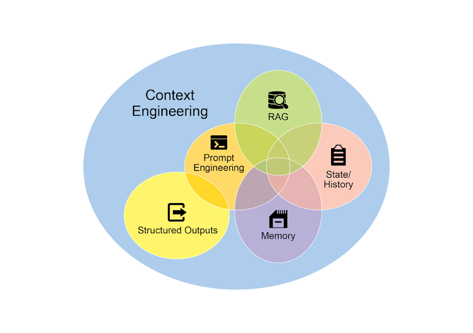
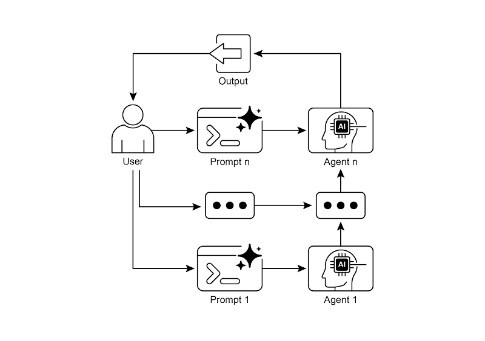

# 📚 Agentic Design Patterns (中文版)

> **提取时间**：2025-12-17 05:14:24
> **内容类型**：中文简体版本
> **总页数**：424 页
> **原始来源**：https://github.com/ginobefun/agentic-design-patterns-cn

---

# Chapter 1：Prompt Chaining | <mark>第一章：提示链</mark>

## Prompt Chaining Pattern Overview | <mark>提示链模式概述</mark>

提示链模式， 也称为管道模式， 是利用大语言模型处理复杂任务的一种强大范式它不期望用单一步骤解决复杂问题， 而是采用分而治之策略其核心思想是将难题拆解为一系列更小更易管理的子问题每个子问题通过专门设计的提示独立解决， 前一步的输出传递给下一步作为输入

这种顺序处理技术天然具备模块化和清晰性特点通过分解复杂任务， 每个独立步骤都变得更易于理解和调试， 从而使整个流程更加稳健更具可解释性链条中的每一步都可以被精心设计和优化， 专注于解决整体问题中的某个特定方面， 最终带来更精准更聚焦的输出

上一步的输出成为下一步的输入， 这一点至关重要这种信息传递建立起一个依赖链（链式结构由此得名）， 前序操作的上下文和结果引导后续处理这使得模型能够在先前工作的基础上不断深化理解， 逐步接近最终期望的解决方案

提示链不仅能分解问题， 还能整合外部知识与工具每一步都可以指示模型调用外部系统或数据库， 极大丰富其知识和能力， 突破训练数据的局限这让模型从孤立的个体， 演变为更广阔智能系统中的关键组件

单一提示的局限性： 对于包含多个子任务的复杂任务， 使用单一复杂提示往往效率不高模型可能难以同时满足多项约束和指示， 从而出现以下问题： 忽视部分指令上下文漂移（）早期错误被放大上下文超出窗口导致信息不足， 以及因认知负担加重而产生幻觉

例如， 要求模型在单次调用中同时完成分析市场报告总结要点识别趋势和草拟邮件等多项任务， 失败概率极高模型或许能给出不错的总结， 但在提取精确数据或撰写得体邮件这类更细致的环节上， 就很容易出错

通过顺序分解提升可靠性： 提示链通过将复杂任务分解成一个聚焦的顺序性的工作流， 显著提升了可靠性与可控性以上述例子来说， 一个流水线或链式方法可以描述如下：

初始提示（总结）： 请总结以下市场研究报告的核心发现： 报告文本模型的唯一焦点是总结， 这大大提高了第一步的准确性

第二个提示（识别趋势）： 基于以上总结， 请识别出三大新兴趋势， 并提取支持每个趋势的具体数据： 第一步的输出这个提示的约束性更强， 并且直接建立在一个经过验证的输出之上

第三个提示（撰写邮件）： 请起草一封简洁的邮件给市场团队， 概述以下趋势及其支持数据： 第二步的输出

这种分解让我们可以对过程进行更精细的控制每一步都更简单更明确， 从而降低了模型的认知负荷， 带来更准确更可靠的最终输出

这种模块化类似于计算流水线： 每个函数执行特定操作后， 将结果传递给下一步为了确保每个任务的响应都精确无误， 我们还可以在每个阶段为模型赋予不同角色例如， 在上述场景中， 初始提示可指定模型扮演市场分析师， 后续提示指定为行业分析师， 第三个提示则指定为专业文档撰写人

结构化输出的作用： 提示链的可靠性高度依赖于步骤间传递数据的完整性如果一个提示的输出模棱两可或格式不佳， 后续的提示可能会因错误的输入而失败为了缓解这一问题， 指定一个结构化的输出格式至关重要， 例如或

例如， 趋势识别步骤的输出可以格式化为对象：

```json path=null start=null
```

这种结构化格式确保数据可被机器读取， 能够被精确解析并无歧义地插入到下一个提示中这样可以减少因解析自然语言而产生的错误， 是构建稳健多步骤大语言模型应用的重要环节

---

## Practical Applications & Use Cases | <mark>实际应用场景</mark>

提示链是一种通用模式， 可应用于构建智能体系统的多种场景其核心效用在于将复杂问题分解为顺序的可管理的步骤以下是一些实际应用和用例：

信息处理工作流： 许多任务涉及对原始信息进行多重转换例如， 总结一份文档， 提取关键实体， 然后用这些实体查询数据库或生成报告一个提示链可能如下所示：

提示从给定的或文档中提取文本内容

提示总结清洗后的文本

提示从总结或原文中提取特定实体（如姓名日期地点）

提示使用这些实体搜索内部知识库

提示结合总结实体和搜索结果， 生成最终报告

此方法被广泛应用于自动化内容分析驱动的研究助手开发以及复杂报告生成等领域

复杂问答： 回答需要多步推理或信息检索的复杂问题是提示链的典型应用场景例如， 年股市崩盘的主要原因是什么？ 政府的应对政策又是什么？

提示识别用户查询中的核心子问题（崩盘原因政府对策）

提示研究或检索关于年崩盘原因的信息

提示研究或检索关于年股市崩盘的政府对策信息

提示将步骤和的信息整合成一个连贯的答案， 回答原始问题

这种顺序处理的方法是构建具备多步推理和信息整合能力的系统的关键当一个问题无法仅凭单一信息解决， 而必须经过一系列逻辑步骤或整合多个信息源才能作答时， 这种模式就显得尤为重要

例如， 一个针对特定主题生成详尽报告的研究智能体会执行混合计算工作流首先， 系统会检索大量相关文章然后， 需要从每篇文章中提取关键信息， 这一任务可以针对所有来源并发执行由于各个提取任务相互独立， 这个阶段非常适合采用并行处理， 从而实现效率最大化

然而， 一旦各自的提取任务完成， 整个流程就转变为顺序执行系统必须先汇集整合所有提取的数据， 再将其综合成一份逻辑连贯的初稿， 最后对初稿进行审阅和润色， 形成最终报告后续的每一个阶段在逻辑上都依赖于前一阶段的顺利完成， 环环相扣这正是提示链模式发挥作用的时刻： 汇集的数据成为后续综合步骤的输入， 而综合生成的文本又成为最后审阅步骤的输入因此， 复杂工作流通常采用混合模式： 对独立的数据采集任务并行处理， 对依赖关系明确的整合与优化步骤使用提示链

数据提取和转换： 将非结构化文本转换为结构化格式通常需要一个迭代过程， 通过多轮迭代可以提升输出的准确性和完整性

提示尝试从发票中提取特定字段（如姓名地址金额）

处理： 检查是否提取了所有必需的字段， 以及是否符合格式要求

提示（条件判断）： 如果字段缺失或格式不正确， 构建一个新提示， 要求模型专门查找缺失或处理格式不正确的信息， 并可提供上一次失败的上下文

处理： 再次验证结果如有必要， 重复此过程

输出： 提供经过验证的结构化数据

这种顺序处理的方法论， 尤其适用于从表单发票或邮件等非结构化来源中进行数据提取与分析例如， 在对进行识别时， 采用分解式的多步方法会远比单次请求更为有效

首先， 系统调用大语言模型从图像中提取文本随后， 模型处理这些原始输出进行数据规范化， 比如将一千零五十这样的文本转换为数值由于精确数学计算对大语言模型来说是一项挑战， 在后续步骤中， 系统会将需要的算术运算交给外部计算器执行模型负责识别需要的运算， 将规范化后的数字传递给计算工具， 然后将精确结果整合回来通过文本提取数据规范化外部工具调用的链式流程， 系统可获得精确结果， 这是单次模型调用难以实现的

内容生成工作流： 复杂内容的创作通常被分解为不同阶段， 包括初步构思搭建大纲起草和修订等

提示基于用户的兴趣爱好， 生成个主题

处理： 允许用户选择一个主题或自动选择最好的一个

提示基于选定的主题， 生成详细的大纲

提示基于大纲的第一点， 撰写初稿

提示在提供前一部分上下文的情况下， 根据大纲的第二点撰写草稿， 并以此类推完成所有要点

提示审阅和润色完整的初稿， 确保连贯性语气和语法

这种方法适用于多种自然语言生成任务， 比如自动撰写创意故事编写技术文档以及生成其他结构化文本内容

有状态的对话智能体： 虽然完善的状态管理架构需要比顺序链接更复杂的方法， 但提示链为维持对话连续性提供了基础机制核心思想是将每轮对话构建为新提示， 系统性地融入先前交互产生的信息或提取的实体

提示处理用户的第一轮发言， 识别意图和关键实体

处理： 更新对话状态， 包含意图和实体

提示基于当前状态， 生成响应或识别下一个所需的信息

在后续的对话中重复此过程， 用户的每一句新话语都会启动一个新的处理链， 并充分利用不断积累的对话历史（即状态）

这一原则对于开发对话智能体至关重要， 使智能体在多轮对话中保持上下文理解和逻辑连贯性通过保留对话历史， 系统就能够理解并恰当地回应那些依赖于先前交换信息的后续输入

代码生成和优化： 功能性代码的生成通常是一个多阶段的过程， 它要求将问题分解为一系列可有序执行的逻辑操作

提示理解用户的需求， 生成伪代码或大纲

提示基于大纲， 编写初始版本的代码

提示识别代码中可能存在的错误或需要改进的地方（使用静态分析工具或另外调用一次模型）

提示基于识别出的问题， 重写或优化代码

提示添加文档或测试用例

在辅助软件开发等应用中， 提示链的价值在于将复杂编码任务分解为一系列可管理的子问题， 这种模块化结构降低了模型在每一步的复杂度更重要的是， 这种方法允许我们在两次模型调用之间插入确定性逻辑， 从而在工作流中实现中间数据处理输出验证和条件分支等功能通过这种方式， 一个原本可能导致不可靠或不完整结果的单一复杂请求， 被转化为由底层执行框架管理的结构化操作序列

多模态和多步推理： 分析包含多种模态（如图像文本表格）的数据时， 必须将问题分解为更小的基于提示的任务例如， 要解读一张复杂的图像， 其中不仅有图片和文本， 还有对特定文本段的高亮标注， 以及采用表格来解释每个标签的情况， 就需要采用这样的方法

提示从用户的图像请求中提取并理解文本内容

提示将提取出的图像文本与其对应的标签进行关联

提示利用表格来解读已收集到的信息， 以确定最终需要输出的内容

---

## Hands-On Code Example | <mark>实践示例</mark>

实现提示链的方法有很多， 从直接在脚本中依次调用函数， 到利用专门的框架来管理控制流状态和组件集成， 形式不一像以及谷歌智能体开发套件（）这类框架， 能为构建和执行多步流程提供结构化的环境， 这对于复杂的系统架构尤其有益

为了演示， 和是非常合适的选择， 因为它们的核心就是为组合操作链（）和图（）而设计的为线性序列提供了基础的抽象， 而则在此基础上进一步扩展， 支持有状态和循环计算， 这对于实现更复杂的智能体行为至关重要本示例将聚焦于一个基础的线性序列

下面的代码实现了一个两步的提示链， 它就像一个数据处理流水线第一步旨在解析非结构化文本并提取特定信息； 第二步则接收上一步的输出， 并将其转换为结构化的数据格式

要运行此示例， 首先需要安装必要的库：

```bash path=null start=null
```

请注意， 可以替换为其他模型提供商的相应库包此外， 你必须在运行环境中配置好所选语言模型（如或）的密钥

代码已维护在此处

```python path=null start=null

# 为了更好的安全性，建议从。env 文件加载环境变量

# 确保你的 OPENAI_API_KEY 已在。env 文件中设置

# 初始化语言模型（推荐使用 ChatOpenAI）

# --- 提示 1

# --- 提示 2

# --- 使用 LCEL 构建链 ---

# StrOutputParser() 会将 LLM 的消息输出转换为一个简单的字符串。

# 完整的链将提取链的输出传递给转换提示中的 'specifications' 变量。

# --- 运行链 ---

# 接收输入文本并执行链。

# print("\n--- 打印最终输出的 JSON ---")
```

**运行输出（译者添加）：**

```json
```

这段代码演示了如何使用库来处理文本它利用了两个独立的提示： 一个从输入字符串中提取技术规格， 另一个将这些规格格式化为对象模型被用来与语言模型进行交互， 确保输出是可直接使用的字符串格式表达式语言（）， 也就是代码中的符号， 被用来优雅地将这些组件链接在一起代码首先构建了一个， 负责提取规格然后， 接收前一个链的输出， 并将其作为输入传给负责转换格式的提示最后， 我们提供了一段描述笔记本电脑的示例文本， 并通过方法让按顺序执行这两个步骤， 打印出最终提取并格式化好的字符串

---

## Context Engineering and Prompt Engineering | <mark>上下文工程和提示工程</mark>

上下文工程（， 见图）是一门系统性的学科， 它研究的是在模型生成词元（）之前， 如何为其设计构建并提供一个完整的信息环境这一方法论主张， 模型输出的质量与其说取决于模型自身的架构， 不如说更依赖于所提供上下文的丰富程度



图： 上下文工程是一门为构建丰富全面信息环境的学科， 因为高质量的上下文是实现高级智能体性能的首要因素

它代表了对传统提示工程（）的一次重大演进， 后者主要聚焦于优化用户当前调用的输入上下文工程则将这一范畴大大拓宽， 囊括了多个信息层面比如系统提示（）可以作为一套基础指令， 用来定义的运行参数， 比如你是一位技术文档撰写者， 你的语气必须正式且精准

上下文还会通过外部数据得到进一步丰富这包括检索到的文档， 即主动从知识库中获取信息以支撑其回答， 例如获取一个项目的技术规范它同样也包含工具输出， 这来源于调用外部接口获取实时数据， 比如查询日历以确定用户的空闲时间这些显式数据会与关键的隐式数据（如用户身份交互历史和环境状态）相结合其核心原则是： 即便是最先进的模型， 如果提供给它的运行环境视图是有限或结构不良的， 其表现也会大打折扣

因此， 这种实践将任务的重点从仅仅回答问题重构为为智能体构建全面的操作全貌举例来说， 一个经过上下文工程的智能体不会只是简单地回应查询， 而是会首先整合用户的空闲时间（工具输出）与邮件接收者的职业关系（隐式数据）以及过往的会议纪要（检索到的文档）这使得模型能够生成高度相关个性化且具有实际价值的输出工程二字体现在创建稳定的流水线， 以便在运行时获取和转换这些数据， 并建立反馈循环来持续提升上下文的质量

为了实现这一点， 我们可以使用专门的调优系统来大规模自动化这一改进过程例如， 像谷歌的提示优化器这类工具， 可以通过系统性地评估模型响应（基于一组样本输入和预定义的评估指标）来提升模型性能这种方法能有效地让提示和系统指令适配不同的模型， 而无需大量手动重写通过为这类优化器提供样本提示系统指令和一个模板， 它就能够程序化地优化上下文输入， 为实现复杂的上下文工程所需的反馈循环提供一种结构化的方法

正是这种结构化的方法， 将一个基础的工具与一个更复杂更具上下文感知能力的系统区分开来它将上下文本身视为一个核心组件， 极度重视智能体知道什么何时知道以及如何使用这些信息这一实践的核心是确保模型能全面洞悉用户的意图历史背景及其当前所处的环境归根结底， 上下文工程是将无状态的聊天机器人提升为能力强大具备情境感知能力系统的关键方法论

---

## At a Glance | <mark>要点速览</mark>

问题所在： 用单个提示处理复杂任务， 往往会让大语言模型不堪重负， 导致性能骤降过高的认知负荷会增加模型出错的概率， 例如忽略指令丢失上下文生成错误信息等这种大而全的指令， 很难有效管理多个约束条件和环环相扣的推理步骤， 最终导致输出结果既不可靠， 也不准确

解决之道： 提示链模式的精髓在于化整为零， 它将一个复杂的问题分解为一系列更小且环环相扣的子任务， 从而提供了一套标准化的解法链条中的每一步都使用一个高度聚焦的提示来执行特定操作， 极大地提升了可靠性与可控性上一步的输出会作为下一步的输入， 由此创建出一个逻辑清晰的工作流， 逐步构建出最终的解决方案这种模块化的策略， 让整个过程更易于管理和调试， 并允许在步骤之间集成外部工具或结构化数据该模式是开发能够规划推理和执行复杂工作流的高级智能体系统的基础

适用场景： 如果一项任务过于复杂， 单个提示难以胜任； 或涉及多个独立的处理步骤； 或需要在步骤间与外部工具交互； 亦或在构建需要多步推理和状态维持的智能体系统时， 都可考虑使用此模式

**Visual summary** | <mark>可视化总结</mark>



图： 提示链模式智能体从用户处接收一系列提示， 链条中前一个智能体的输出， 会成为下一个智能体的输入

---

## Key Takeaways | <mark>核心要点</mark>

以下是本章的核心要点：

提示链将复杂任务分解为一系列更小更聚焦的步骤， 也被称为流水线模式（）

- <mark>链条中的每一步都涉及一次大语言模型调用或特定的处理逻辑，并以上一步的输出作为输入。</mark>

- <mark>此模式能够提升与语言模型进行复杂交互时的可靠性与可管理性。</mark>

- <mark>像 LangChain/LangGraph 和谷歌智能体开发套件（ADK）这类框架，为定义、管理和执行这些多步序列提供了强大的工具。</mark>

---

## Conclusion | <mark>结语</mark>

通过将复杂问题解构为一系列更简单更易于管理的子任务， 提示链为驾驭大语言模型提供了一个稳健的框架这种分而治之的策略， 通过让模型在同一时间只专注于一个特定操作， 显著增强了输出结果的可靠性与可控性

作为一项基础性模式， 它为开发能够进行多步推理工具集成和状态管理的高级智能体铺平了道路归根结底， 掌握提示链是构建那些能够执行复杂工作流能力远超单一提示具备上下文感知能力的强大系统的关键所在

---

## References | <mark>参考文献</mark>

的官方文档：

官方文档：

提示工程指南链式提示：

官方文档：

官方文档：

谷歌开发者中心：

提示优化器：
