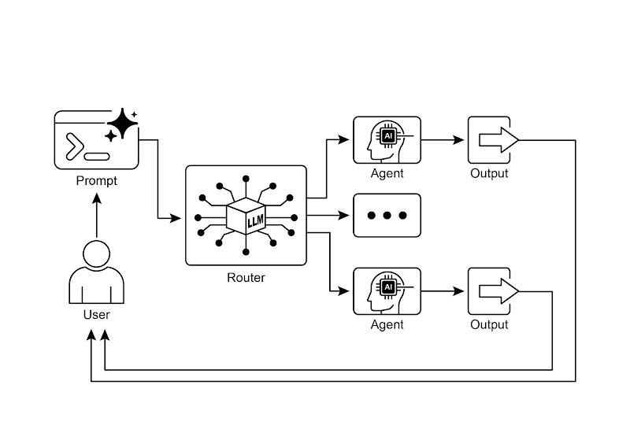

# 📚 Agentic Design Patterns (中文版)

> **提取时间**：2025-12-17 05:14:24
> **内容类型**：中文简体版本
> **总页数**：424 页
> **原始来源**：https://github.com/ginobefun/agentic-design-patterns-cn

---

# Chapter 2：Routing | <mark>第二章：路由</mark>

## Routing Pattern Overview | <mark>路由模式概述</mark>

提示链虽然是执行确定性线性工作流的基础方法， 但在需要自适应响应的场景下显得力不从心现实场景中， 智能体系统往往要根据环境状态用户输入或上一步的执行结果等情境信息， 从多个可选方案中选择合适的行动路径路由（）机制就是实现这种控制流分发的关键技术， 它决定该将请求交给哪个功能模块工具或子流程处理

路由为智能体引入了条件分支能力， 让系统不再沿着固定流程执行， 而是能根据实际情况动态选择最优的后续动作， 从而实现更灵活更懂上下文的智能行为

以客户咨询智能体为例集成路由功能后， 系统会先识别用户的真实意图， 然后将请求分发到对应的处理单元： 简单问题交由问答智能体处理， 账户查询则调用数据库检索工具， 复杂问题则升级到人工处理， 而非采用单一的预设响应路径

因此， 具有路由功能的智能体可以：

分析用户的请求

基于查询的意图将其路由到相应的处理路径：

查订单调用订单查询子智能体或工具链

问产品调用产品目录检索子智能体或工具链

求技术支持查阅故障排除手册或转人工

意图不明转到澄清子智能体追问细节

路由模式的核心在于评估与决策机制， 即判断请求类型并确定执行路径常见的实现方式包括：

基于大语言模型的路由（）： 通过提示词引导语言模型分析输入并输出特定的分类标识或指令， 以指示下一步的执行目标例如， 提示词可以要求模型分析以下用户查询并仅输出类别： 订单状态产品信息技术支持或其他智能体系统读取该输出后， 据此将工作流导向相应的处理路径

向量路由（）： 将输入查询转换为向量嵌入（详见第章）， 然后与代表不同路由或能力的嵌入向量进行比较， 将查询路由到嵌入相似度最高的路径此方法适用于语义路由场景， 其决策基于输入的语义含义而非仅仅关键词匹配例如， 帮我退款和订单有问题想取消虽然措辞不同， 但向量距离相近， 因此都会被路由到退款处理流程

规则路由（）： 基于关键词模式或从输入中提取的结构化数据， 使用预定义规则或逻辑（如语句语句）进行决策此方法比大模型路由更快速且具有确定性， 但在处理复杂语境或新颖输入时灵活性较低

机器学习路由（）： 采用判别式模型（如分类器）， 该模型在少量标注数据上经过专门训练以执行路由任务虽然在概念上与向量路由方法有相似之处， 但其关键特征在于监督微调过程， 通过调整模型参数来创建专门的路由功能此技术与大模型路由的区别在于， 其决策组件并非在推理时执行提示词的生成式模型， 而是将路由逻辑编码在微调后模型的学习权重中虽然在预处理阶段可能使用大语言模型生成合成数据以扩充训练集， 但实时路由决策本身并不涉及大模型

路由机制可在智能体运行周期的多个节点实施： 可在初始阶段对主要任务进行分类， 可在处理链的中间点确定后续操作， 也可在子程序中从给定工具集中选择最合适的工具

和智能体开发套件（）等计算框架为定义和管理此类条件逻辑提供了明确的构造凭借基于状态的图架构， 特别适合复杂的路由场景， 其中决策取决于整个系统的累积状态类似地， 提供了用于构建智能体能力和交互模型的基础组件， 这些组件是实现路由逻辑的基础在这些框架提供的执行环境中， 开发人员可定义可能的操作路径， 以及决定计算图中节点间转换的函数或基于模型的评估

路由的实现使系统能够超越确定性的顺序处理它促进了更具适应性的执行流程的开发， 能够动态且恰当地响应更广泛的输入和状态变化

---

## Practical Applications & Use Cases | <mark>实际应用场景</mark>

路由模式是自适应智能体系统设计中的关键控制机制， 使系统能够根据可变输入和内部状态动态调整执行路径， 从而提供必要的条件逻辑层， 其应用范围涵盖多个领域

人机交互： 在虚拟助手或驱动的辅导系统等场景中， 路由用于解释用户意图通过对自然语言查询的初步分析， 系统可确定最合适的后续操作， 无论是调用特定的信息检索工具升级至人工操作员， 还是根据用户表现选择课程中的下一个模块这使系统能够超越线性对话流程， 进行上下文相关的响应

数据处理流水线： 在自动化数据和文档处理流水线中， 路由充当分类和分发功能系统基于内容元数据或格式对传入的数据（如电子邮件支持工单或负载）进行分析， 然后将每项内容导向相应的工作流， 例如销售线索处理流程针对或格式的特定数据转换功能， 或紧急问题升级路径

多智能体协作： 在涉及多个专业工具或智能体的复杂系统中， 路由充当高级调度器由用于搜索总结和分析信息的不同智能体组成的研究系统， 会使用路由器根据当前目标将任务分配给最合适的智能体类似地， 编码助手在将代码片段传递给正确的专业工具之前， 会使用路由来识别编程语言和用户意图（调试解释或翻译）

归根结底， 路由提供了创建功能多样化和上下文感知系统所必需的逻辑仲裁能力它将智能体从预定义序列的静态执行器转变为能够在变化条件下决定完成任务最有效方法的动态系统

---

## Hands-On Code Example (LangChain) | <mark>实战示例

在代码中实现路由涉及定义可能的路径以及决定选择哪条路径的逻辑和等框架为此提供了特定的组件和结构基于状态的图结构对于可视化和实现路由逻辑特别直观

以下代码演示了使用和生成式构建的简单类智能体系统它设置了一个协调员， 根据请求的意图（预订信息查询或不明确）将用户请求路由到不同的模拟子智能体处理器系统使用语言模型对请求进行分类， 然后将其委派给适当的处理函数， 模拟了多智能体架构中常见的基本委派模式

首先， 确保你安装了必要的库：

```bash path=null start=null
```

你还需要在环境中设置所选语言模型（如）的密钥

```python path=null start=null

#

# 确保你的 API 密钥环境变量已设置 (如 GOOGLE_API_KEY)

# --- 定义模拟的子智能体处理器 (等同于 ADK 中的 sub_agents) ---

# --- 定义协调员的路由链 (等同于 ADK 协调员的指令) ---

# 这个链负责决定将任务委派给哪个处理器。

# --- 定义委派逻辑 (等同于 ADK 基于 sub_agents 的自动流) ---

# 使用 RunnableBranch 根据路由链的输出进行路由。

# 为 RunnableBranch 定义分支

# 创建 RunnableBranch。它会接收路由链的输出，

# 并将原始输入 ('request') 路由到相应的处理器。

# 将路由链和委派分支组合成一个可执行单元

# 路由链的输出 ('decision') 会连同原始输入 ('request') 一起

# 传递给 delegation_branch。

# --- 使用示例 ---

```

译者注： 代码已维护在此处

**运行输出（译者添加）：**

```text

```

如前所述， 这段代码使用库和的模型构建了一个简单的类智能体系统它定义了三个模拟的子智能体处理器： 和， 分别用于处理特定类型的请求

核心组件是， 它通过指示模型将用户请求分为三类： 或随后使用路由链的输出将原始请求委派给相应的处理函数根据模型的判断， 将请求数据发送到或将这些部分组合在一起： 先进行路由决策， 然后把请求转给选定的处理器， 最后从处理器的响应中提取并返回最终结果

主函数通过三个示例请求展示了系统的实际用法， 说明不同的输入如何被路由并由各个模拟智能体处理为了保证稳定性， 代码还包含了语言模型初始化的错误处理整体代码结构类似一个简化的多智能体框架： 中央协调器根据意图把任务分配给各个专长不同的智能体

---

## Hands-On Code Example (Google ADK) | <mark>实战示例

智能体开发套件（）是用于构建智能体系统的框架， 提供了一个用于定义智能体能力与行为的结构化环境与基于显式计算图的架构相比， 中的路由通常是通过定义一组独立的工具来实现， 这些工具对应智能体的各项功能框架的内部逻辑会在用户发起查询时选择合适的工具， 借助底层模型将用户意图匹配到相应的功能处理器

这段代码演示了如何使用构建应用它设置了一个协调员智能体， 根据预设指令将用户请求分发给两个专门的子智能体： 负责预订的和提供通用信息的各子智能体再调用各自的工具来模拟处理请求， 展示了智能体系统中基本的任务委派模式

```python path=null start=null

#

# Colab 代码链接

# 安装依赖

# --- 定义工具函数 ---

# 这些函数模拟了专业智能体的具体行动。

# --- 从函数创建工具 ---

# --- 定义配备了各自工具的专业子智能体 ---

# --- 定义带有明确委派指令的父智能体 ---

# 定义了 sub_agents 默认就会启用由大语言模型驱动的委派。

# --- 执行逻辑 ---
用给定的请求运行协调员智能体并进行委派

运行示例的主函数

# 使用示例

```

译者注： 代码已维护在此处

该脚本包含一个主协调员和两个专职子智能体： 和每个子智能体都配有一个， 用于封装模拟操作的函数用来模拟处理航班和酒店预订， 用来模拟查询信息脚本中还包含一个， 作为协调器在无法委派请求时的备用处理， 不过在当前的主流程中， 并没有明确使用它来处理委派失败的情况

协调员的主要职责是分析收到的用户消息， 并将其分派给或子智能体因为协调员定义了子智能体， 的流程会自动完成这种分派函数会初始化一个， 创建用户和会话， 然后用该将用户请求提交给协调员来处理方法会处理请求并生成事件， 代码从这些事件的中提取最终的响应文本

主函数通过用不同的请求来演示， 展示了协调员如何把预订类请求交给负责预订的子智能体， 把查询类信息请求交给信息查询子智能体

---

## At a Glance | <mark>要点速览</mark>

问题所在： 智能体系统往往需要应对各种各样的输入和情境， 单一的线性流程无法满足这一需求简单的顺序工作流缺乏基于上下文做出决策的能力如果没有为特定任务选择正确工具或子流程的机制， 系统将保持僵化且缺乏适应性这一局限性使得构建能够管理真实世界用户请求的复杂性和可变性的成熟应用变得困难

解决之道： 路由模式通过在智能体操作框架中引入条件逻辑， 提供了标准化解决方案它使系统能够首先分析传入查询以确定其意图或性质， 然后基于此分析， 智能体动态地将控制流导向最合适的专业工具函数或子智能体这一决策可由多种方法驱动， 包括提示大语言模型应用预定义规则或使用基于嵌入的语义相似度最终， 路由将静态的预定执行路径转变为能够选择最佳可能操作的灵活且具上下文感知的工作流

适用场景： 当智能体必须根据用户输入或当前状态在多个不同的工作流工具或子智能体之间做出选择时， 应使用路由模式此模式对于需要对传入请求进行分类或分派以处理不同类型任务的应用至关重要， 例如客户支持机器人需要区分销售咨询技术支持和账户管理问题， 并将每种类型的请求路由到相应的处理模块

**Visual summary** | <mark>可视化总结</mark>



路由模式利用一个大语言模型作为路由器

---

## Key Takeaways | <mark>核心要点</mark>

路由使智能体能够根据条件， 动态决定工作流的下一步

它允许智能体处理多样化的输入并适应其行为， 超越了线性的执行方式

路由逻辑可以使用大语言模型基于规则的系统或嵌入相似度来实现

像和这样的框架， 为在智能体工作流中定义和管理路由提供了结构化的方法， 尽管它们的架构方式有所不同

---

## Conclusion | <mark>结语</mark>

路由模式是构建真正动态且能响应变化的智能体系统的关键环节通过实施路由， 系统得以超越简单的线性执行流程， 使智能体能够就如何处理信息响应用户输入以及使用可用工具或子智能体做出智能决策

路由在各个领域都有应用， 从客户服务聊天机器人到复杂的数据处理流水线分析输入并根据条件引导工作流的能力， 是创建能够处理真实世界任务固有可变性的智能体的基础

使用和的代码示例展示了两种不同但都有效的路由实现方法基于图的结构提供了一种可视化和明确的方式来定义状态与转换， 非常适合具有复杂路由逻辑的多步骤工作流另一方面， 通常侧重于定义独立的能力（工具）， 并依赖框架将用户请求路由到适当的工具处理器的能力， 这对于具有明确定义的离散操作集的智能体来说可能更简单

掌握路由模式对于构建能根据不同场景和上下文智能选择响应或执行操作的智能体至关重要， 是打造灵活可靠的智能体应用的核心要素

---

## References | <mark>参考文献</mark>

官网：

谷歌智能体开发套件官方文档：
