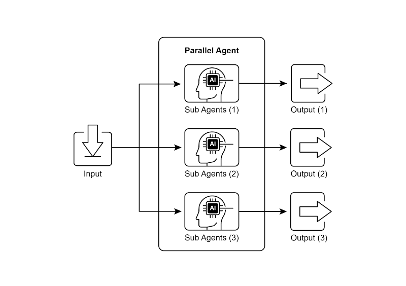
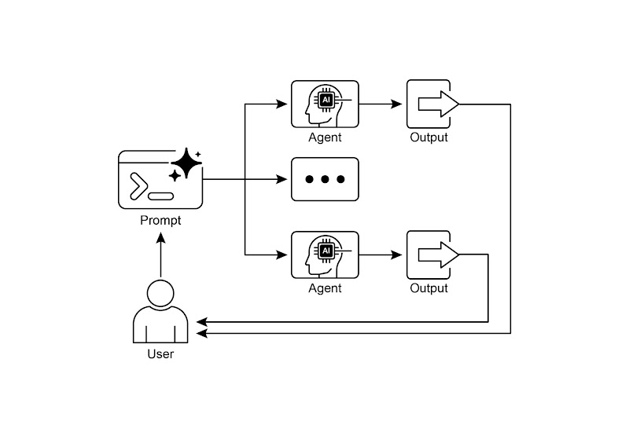

# 📚 Agentic Design Patterns (中文版)

> **提取时间**：2025-12-17 05:14:24
> **内容类型**：中文简体版本
> **总页数**：424 页
> **原始来源**：https://github.com/ginobefun/agentic-design-patterns-cn

---

# Chapter 3：Parallelization | <mark>第三章：并行化</mark>

## Parallelization Pattern Overview | <mark>并行模式概述</mark>

在前面的章节中， 我们探讨了用于顺序工作流的提示链以及用于智能决策的路由模式虽然这些模式很重要， 但许多复杂的智能体任务需要同时执行多个子任务， 而非一个接一个地执行这时并行模式就变得至关重要

并行模式涉及同时执行多个组件， 例如大语言模型调用工具使用， 甚至整个子智能体（见图）与等待一个步骤完成后再开始下一个步骤不同， 并行执行允许独立任务同时运行， 这大大缩短了那些可以分解为相互独立部分的任务的总执行时间

考虑实现一个研究主题并汇总结论的智能体按顺序执行时可能会是这样：

搜索来源

总结来源

搜索来源

总结来源

整合总结和总结中的内容， 生成一个最终答案

如果使用并行模式则可以优化为：

同时搜索来源和来源

两次搜索完成后， 同时对来源和来源进行总结

整合总结和总结中的内容， 生成一个最终答案这一步通常按顺序进行， 需要等待前面并行步骤全部完成

并行模式的核心在于找出工作流中互不依赖的环节， 并将它们并行执行在处理外部服务（如或数据库）时， 这种做法特别有效， 因为可以同时发起多个请求， 从而减少总体等待时间

实现并行化通常需要使用支持异步执行多线程或多进程的框架现代智能体框架原生都能支持异步操作， 帮助你方便地定义并同时运行多个步骤



图： 使用子智能体进行并行化的示例

和等框架都提供了并行执行机制

在表达式语言（）中， 可以使用等运算符组合可运行对象， 并通过设计具有并发分支的链或图结构来实现并行执行而则利用图结构， 允许从状态转换中执行多个节点， 从而在工作流中实现并行分支

也提供了强大的原生机制来促进和管理智能体的并行执行， 显著提升了复杂多智能体系统的效率和可扩展性框架的这一内在能力使开发者能够设计并实现让多个智能体并发运行（而非顺序执行）的解决方案

并行模式对于提升智能体系统的效率和响应速度至关重要， 特别是在需要执行多个独立查询计算或与外部服务交互的场景中它是优化复杂智能体工作流性能的关键技术

---

## Practical Applications & Use Cases | <mark>实际应用场景</mark>

并行模式可以在各种场景中使用以提升智能体性能：

**1. Information Gathering and Research:** | <mark><strong>信息收集和研究：</strong></mark>

一个经典的用例就是同时从多个来源收集信息

用例： 研究某个公司的智能体

并行执行任务： 同时搜索新闻拉取股票数据监测社交媒体上的提及， 并查询公司数据库

好处： 比逐项查找更快获得全面信息

**2. Data Processing and Analysis:** | <mark><strong>数据处理和分析：</strong></mark>

使用不同的分析方法或并行处理不同的数据段

用例： 分析客户反馈的智能体

并行处理任务： 在一批反馈中同时进行情感分析关键词提取分类， 并识别需要优先处理的紧急问题

好处： 快速提供多角度的分析

**3. Multi-API or Tool Interaction:** | <mark><strong>多个 API 或工具交互：</strong></mark>

调用多个独立的或工具， 以获取不同类别的信息或完成不同的任务

用例： 旅行规划智能体

并行处理任务： 同时检查航班价格搜索酒店了解当地活动， 并找到推荐的餐厅

好处： 更快速地制定出完整的旅行行程

**4. Content Generation with Multiple Components:** | <mark><strong>多组件内容生成：</strong></mark>

并行生成复杂作品的各个部分

用例： 撰写营销邮件的智能体

并行处理任务： 同时生成邮件主题撰写正文查找相关图片， 并设计具有号召性的按钮文案

好处： 更高效地生成电子邮件内容

**5. Validation and Verification:** | <mark><strong>验证和核实：</strong></mark>

并行执行多个彼此独立的检查或验证

用例： 验证用户输入的智能体

并行执行任务： 同时检查邮件格式验证电话号码在数据库中核对地址， 并检查是否有不当内容

好处： 能够更快地反馈输入是否有效

**6. Multi-Modal Processing:** | <mark><strong>多模态处理：</strong></mark>

同时对同一输入的不同模态（文本图像音频）数据进行处理

用例： 分析包含文本和图像的社交媒体帖子的智能体

并行执行任务： 同时分析文本的情感和关键词， 以及分析图像中的对象和场景描述

好处： 能更快地综合来自不同模态的信息与洞见

**7. A/B Testing or Multiple Options Generation:** | <mark><strong>A/B 测试或多种方案生成：</strong></mark>

并行生成多个响应或输出版本， 然后从中挑选最佳的一种

用例： 生成多个创意文案的智能体

并行执行任务： 同时使用稍微不同的提示或模型为同一篇文章生成三条各具风格的标题

好处： 可以快速比较各个方案并选出最优者

并行模式是智能体设计中的一项重要优化技术通过对独立任务进行并发执行， 开发者可以构建更高效更具响应性的应用程序

---

## Hands-On Code Example (LangChain) | <mark>实战示例

在框架中， 通过的表达式语言（）可以实现并行执行常见做法是把多个可运行组件组织成字典或列表， 并把这个集合作为输入传给链中的下一个组件执行器会并行执行集合中的各个可运行项

在中， 这一原则体现在图的拓扑结构上通过从一个公共节点同时触发多个没有直接顺序依赖的节点， 就能形成并行工作流这些并行路径各自独立运行， 之后在图中的某个汇聚点合并结果

以下示例展示了如何使用框架构建并行处理流程： 针对同一个用户查询， 工作流同时启动两个互不依赖的操作， 然后将它们各自的输出合并为一个最终结果

要实现此功能， 首先需要安装必要的包（如及等模型提供库）同时需要在本地环境中配置所选语言模型的有效密钥， 以便进行身份验证

```python

# Colab 代码链接

# 安装依赖

# 为了更好的安全性，建议从。env 文件加载环境变量

# 确保你的 API 密钥环境变量已设置 (如 OPENAI_API_KEY)

# --- 定义独立的链 ---

# 这三条链代表彼此独立、可同时执行的任务。

# --- 定义要并行执行的任务块。这些结果以及原始内容将作为输入传递给下一步。

# --- 定义最终的综合提示，将并行结果合并。

# --- 通过将并行结果直接传递给综合提示，然后是语言模型和输出解析器，构建完整的链。

# --- 运行链 ---

# `ainvoke` 的输入是单个 'topic' 字符串，该字符串随后会被传递给 `map_chain` 中的每个可运行项。

# 在 Python 3.7 及更高版本中，asyncio.run 是运行异步函数的标准方式。
```

译者注： 代码已维护在此处

**运行输出（译者添加）：**

```text

```

上述示例实现了一个基于的应用， 通过并发执行来更高效地处理指定话题需要说明的是， 实现的是并发（）， 不是多线程或多核的真正并行（）它在单个线程中运行， 通过事件循环在任务等待（如等待网络响应）时切换执行， 从而让多个任务看起来同时执行但底层代码仍在同一线程上运行， 这是受全局解释器锁（）的限制

代码从和导入了关键模块， 包含语言模型提示模板输出解析器和可运行组件接着尝试初始化一个实例， 指定使用模型， 并设置了控制创造力的温度值， 初始化时用来保证健壮性随后定义了三条相互独立的链， 每条链负责对输入主题执行不同任务： 第一条链用来简洁地总结主题， 采用系统消息和包含主题占位符的用户消息； 第二条链生成与主题相关的三个有趣问题； 第三条链则从主题中识别到个关键术语， 要求用逗号分隔每条链都由为该任务定制的已初始化的语言模型和用于把输出格式化为字符串的组成

随后构建了一个块， 把这三条链打包在一起以便同时运行这个运行单元还包含一个， 确保原始输入的主题可以在后续步骤中使用

接着为最后的汇总步骤定义了一个独立的， 使用摘要问题关键术语和原始主题作为输入来生成完整的答案这个名为的端到端处理链， 是通过连接到汇总提示， 再接语言模型和输出解析器来构建的

示例中提供了一个异步函数， 用来演示如何调用这个， 该函数接收主题作为输入并通过运行异步链

最后， 通过标准的代码块演示如何用管理异步执行， 来启动方法， 其中主题为航天探索史

本质上， 这段代码构建了一个工作流： 针对某个主题， 使用大语言模型同时进行摘要提问和术语等多个调用， 随后由一次最终的请求把这些输出整合在一起该示例说明了在使用的智能体工作流中通过并行执行来提高效率的核心思想

---

## Hands-On Code Example (Google ADK) | <mark>实战示例

现在通过框架中的具体示例来说明这些概念我们将展示的基本组件（如和）来构建智能体流程， 从而通过并行执行提高效率

```python

# --- 定义研究员子智能体（并行执行） ---

# 研究员 1

# 研究员 2

# 研究员 3

# --- 2. 创建 ParallelAgent（并行运行多个研究员子智能体） ---

# 该智能体协调多个研究员子智能体的并发执行。

# 所有研究员完成工作并将结果写入状态后，流程即结束。

# --- 3. 定义合并智能体（在并行研究员子智能体之后运行） ---

# 该智能体使用并行运行的子智能体已保存在会话状态中的结果，

# 将这些内容整合并归纳为一份结构化的响应，并在相应部分标注出处。

# --- 4. 创建 SequentialAgent（协调整个流程） ---

# 这是将被运行的主智能体。它先执行 ParallelAgent 来填充状态，

# 然后执行 MergerAgent 来生成最终输出。

```

译者注： 代码已维护在此处

该代码建立了一个多智能体系统， 用于收集与整合可持续技术进展的资料系统包含三个子智能体担任不同的研究员： 聚焦可再生能源， 研究电动汽车技术， 调查碳捕集技术每个研究员子智能体都配置为使用和工具， 并要求使用一到两句话总结研究结果， 随后通过将这些总结内容保存到会话状态中

然后创建了一个名为的并行智能体， 用于同时运行这三个研究员子智能体这样可以并行开展研究， 节省时间只有当所有子智能体（研究员）都完成并将结果写入状态后， 并行智能体才算执行结束

接下来， 定义了一个（也是）来综合研究结果该智能体将并行研究员子智能体存储在会话状态中的总结内容作为输入其指令强调输出必须严格基于所提供的总结内容， 禁止添加外部知识旨在将合并的发现结构化为报告， 每个主题都有标题和简要的结论

最后， 创建了一个名为的顺序型智能体来协调整个工作流作为主要控制器， 该主智能体首先执行来进行研究完成后， 会执行来综合收集的信息被设置为， 代表运行该多智能体系统的入口整个流程的设计目标是并行从多个来源高效收集信息， 然后将这些信息合并为一份结构化报告

---

## At a Glance | <mark>要点速览</mark>

问题所在： 许多智能体工作流涉及多个必须完成的子任务以实现最终目标纯粹的顺序执行， 即每个任务等待前一个任务完成再执行， 通常效率低下且速度缓慢当任务依赖于外部操作（如调用不同的或查询多个数据库）时， 这种延迟会成为重大瓶颈没有并发机制时， 总耗时就是各个任务耗时的累加， 进而影响系统的性能和响应速度

解决之道： 并行模式通过同时执行彼此独立的任务， 提供了一种标准化的解决方案来缩短整体执行时间它的做法是识别工作流中不相互依赖的部分， 比如某些工具调用或大语言模型请求像和这样的智能体框架内置了用于定义和管理并发操作的能力举例来说， 主流程可以启动多个并行的子任务， 然后在继续下一步之前等待这些子任务全部完成相比与顺序执行， 这种并行执行能大幅减少总耗时

经验法则： 当工作流中存在多个相互独立且可并行执行的任务时应采用该模式， 例如同时从多个拉取数据并行处理不同的数据分片， 或同时生成多个将来需要合并的内容， 从而缩短总体执行时间

**Visual summary** | <mark><strong>可视化总结</strong></mark>



图： 并行化设计模式

---

## Key Takeaways | <mark>核心要点</mark>

以下是关键要点：

并行模式是一种将相互独立的任务同时执行， 从而缩短总耗时并提高效率的方法

在任务需要等待外部资源（比如调用）时， 这种方式特别有用

采用并发或并行架构会显著增加复杂性和成本， 从而对设计调试和日志等开发环节带来影响

像和这样的框架内置了对并行执行的支持， 方便定义和管理并行任务

在的表达式语言（）中， 是一个核心组件， 用于并行执行多个可运行单元

可以通过大语言模型驱动的委派机制来实现并行执行， 其中协调器智能体中的大语言模型会识别出互相独立的子任务， 并将这些任务分派给相应的子智能体去处理， 从而并发完成各个子任务

并行模式能有效减少总体耗时， 从而提升智能体系统对复杂任务的响应能力

---

## Conclusion | <mark>结语</mark>

并行模式是通过并发执行独立子任务来优化计算流程对于需要多次模型推理或调用外部服务的复杂操作， 采用并行执行可以显著降低总体耗时并提高效率

不同的框架为实现此模式提供了不同的机制在中， 像这样的组件可以用于显式定义和执行多个处理链相比之下， 可以通过多智能体委派机制实现并行化， 其中主协调器模型将不同的子任务分配给可以并发执行的专用智能体

将并行处理与顺序（链式）和条件（路由）控制流结合起来， 可以构建既复杂又高效的计算系统， 从而更有效地管理各类复杂任务

---

## References | <mark>参考文献</mark>

以下是一些可供深入了解并行模式及其相关概念的推荐阅读资料：

表达式语言文档（并行化）：

文档（多智能体系统）：

文档：
