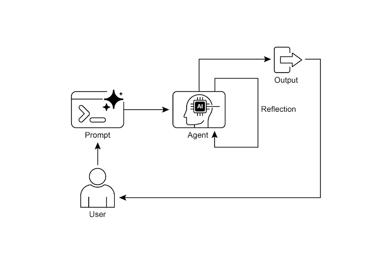
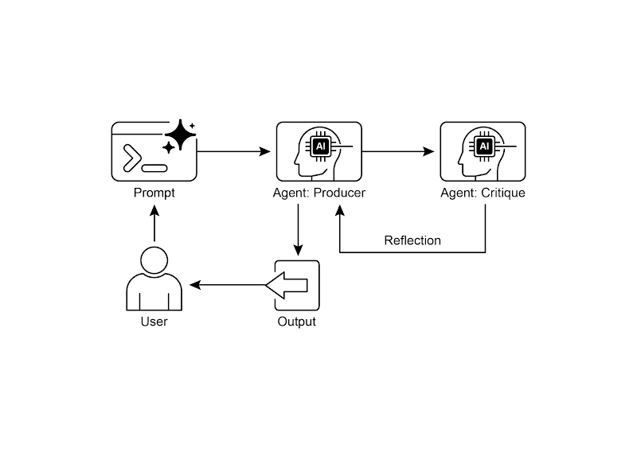

# 📚 Agentic Design Patterns (中文版)

> **提取时间**：2025-12-17 05:14:24
> **内容类型**：中文简体版本
> **总页数**：424 页
> **原始来源**：https://github.com/ginobefun/agentic-design-patterns-cn

---

# Chapter 4：Reflection | <mark>第四章：反思</mark>

## Reflection Pattern Overview | <mark>反思模式概述</mark>

在前面的章节中， 我们探讨了智能体的基础模式： 用于顺序执行的提示链（）用于动态路径选择的路由（）， 以及用于并发任务执行的并行模式（）这些模式使智能体能够更高效更灵活地执行复杂任务然而， 即使工作流设计再精妙， 智能体初始输出或计划也未必最优准确或完整这正是反思（）模式发挥作用之处

反思模式是指智能体评估自己的工作输出和内部状态， 并利用评估结果改进性能和优化响应这是一种自我纠正或自我改进的形式通过这种形式， 智能体可以根据反馈内部剖析及与期望标准的比较， 来不断地优化输出调整方法反思有时也可由独立的智能体来承担， 其职责是专门分析初始智能体的输出

反思模式与简单顺序链或路由模式有着本质区别前者只是将输出直接传给下一步， 或是在不同路径中做出选择； 而反思模式则引入了反馈循环在这种模式下， 智能体并非简单地产出结果就结束了它会回过头来审视自己的输出（或其生成过程）， 找出潜在的问题和改进空间， 并依据这些洞察生成更优的版本， 或是修正其后续的行动策略

这个过程通常包括以下步骤：

执行： 智能体执行任务或生成初始版本的输出

评估剖析： 智能体（通常借助另一个大语言模型调用或一组规则）对上一步的结果进行分析该过程旨在检查其事实准确性内容连贯性风格完整度是否遵循指令以及其他相关标准

反思优化： 根据上一轮的剖析结果， 智能体将确定具体的改进方向这可能涉及几个方面： 生成一个更为精炼的输出为后续步骤调整参数， 甚至是修正整体计划

迭代（可选， 但很常见）： 随后， 智能体便会将优化后的输出或调整过的方法付诸执行， 并循环往复地进行整个反思过程， 直到最终结果令人满意， 或满足了预设的停止条件

反思模式的一个关键且高效的实现方式， 是将流程拆分为两个独立的逻辑角色： 生产者（）和评论者（）这通常被称为生成器评论者（）或生产者审查者（）模型虽然单个智能体也能进行自我反思， 但使用两个专用的智能体（或两个具有不同系统提示的独立大语言模型调用）通常能产出更稳健更客观的结果

生产者智能体： 主要职责是完成任务的初始执行它完全专注于生成内容， 无论是编写代码起草博客文章还是制定计划它会接收初始提示， 并据此生成输出的第一个版本

评论者智能体： 该智能体的唯一使命就是评估由生产者生成的输出它会被赋予一套不同的指令， 通常还包含一个独特的角色设定（例如你是一位高级软件工程师你是一位严谨的事实核查员）评论者的指令引导它根据特定标准分析生产者的工作， 如事实准确性代码质量风格要求和完整性， 旨在发现问题提出改进建议并给出结构化的反馈

这种职责分离非常有效， 因为它避免了智能体自我审查时产生的认知偏见评论者智能体以全新视角审视输出， 完全专注于发现错误和改进空间它的反馈意见随后传回给生产者智能体， 生产者据此对内容进行修改和优化实战部分和代码示例都采用了这种双智能体模型： 使用特定的创建评论者角色， 而示例明确区分了生产者和审查者两个智能体

实现反思模式通常需要构建包含反馈循环的智能体工作流这可以通过在编码实现迭代循环， 或使用支持状态管理和根据评估结果进行条件跳转的框架来完成虽然单步评估和优化可以在或链中实现， 但真正的迭代反思通常需要更复杂的编排

反思模式对于构建能产出高质量结果应对复杂任务并展现自我意识与适应能力的智能体非常重要它让智能体不再只是执行指令， 而是发展出更成熟的推理与内容生成能力

需要特别注意反思模式与目标设定和监控（见第章）的联系目标为智能体的自我评估提供最终基准， 监控则跟踪其进度在许多实际情形中， 反思会充当纠偏机制： 利用监控反馈分析偏离之处并据此调整策略这样的协同作用使智能体从单纯执行者变成有目的的自主适应以实现目标的系统

此外， 当模型能保持对话记忆时， 反思模式的有效性显著增强（见第章）对话历史为评估阶段提供关键上下文， 使智能体不仅能孤立评估输出， 还能结合先前交互用户反馈和不断演变的目标进行评估这使智能体能从过去的评价反馈中学习并避免重复错误没有记忆， 每次反思都是独立事件； 有了记忆， 反思成为累积性的循环， 每个轮次都建立在上一轮基础上， 从而实现更智能更具上下文感知的优化

---

## Practical Applications & Use Cases | <mark>实际应用场景</mark>

当输出质量准确性或对复杂约束的遵从性至关重要时， 反思模式非常有用：

**1. Creative Writing and Content Generation:** | <mark><strong>创意写作和内容生成：</strong></mark>

对生成的文本故事诗歌或营销文案进行润色和改进

- <mark><strong>用例：</strong>撰写博客文章的智能体。</mark>
- <mark><strong>反思：</strong>先写一篇草稿，再从流畅性、语气和表达清晰度等方面进行检查，随后根据反馈重写草稿。反复进行，直到文章符合质量要求。</mark>
- <mark><strong>好处：</strong>产生更精致、更有效的内容。</mark>

**2. Code Generation and Debugging:** | <mark><strong>代码生成和调试：</strong></mark>

编写代码识别错误并修复它们

- <mark><strong>用例：</strong>编写 Python 函数的智能体。</mark>
- <mark><strong>反思：</strong>编写初始代码，运行测试或静态分析，识别错误或低效之处，然后基于这些发现优化代码。</mark>
- <mark><strong>好处：</strong>生成更健壮、功能更完整的代码。</mark>

**3. Complex Problem Solving:** | <mark><strong>复杂问题解决：</strong></mark>

在多步推理任务中， 对中间步骤或所提出的解决方案进行评估和审查

- <mark><strong>用例：</strong>解决逻辑推理类谜题的智能体。</mark>
- <mark><strong>反思：</strong>提出一个行动步骤，评估该步骤是否有助于推进问题的解决或引入矛盾；如发现问题，则回退并尝试其他步骤。</mark>
- <mark><strong>好处：</strong>增强智能体在复杂问题情境中分析和解决问题的能力。</mark>

**4. Summarization and Information Synthesis:** | <mark><strong>摘要和信息综合：</strong></mark>

对摘要进行润色， 使其更准确完整且简明

- <mark><strong>用例：</strong>总结长文档的智能体。</mark>
- <mark><strong>反思：</strong>先生成一份初步摘要，再将其与原文的要点对照，找出遗漏或不准确之处，随后对摘要进行修订，补充缺失信息并提高准确性。</mark>
- <mark><strong>好处：</strong>生成更准确、更全面的摘要。</mark>

**5. Planning and Strategy:** | <mark><strong>规划和策略：</strong></mark>

评估所提计划， 找出存在的问题并提出改进建议

- <mark><strong>用例：</strong>规划一系列行动以实现特定任务的智能体。</mark>
- <mark><strong>反思：</strong>制定计划，模拟执行或根据限制评估可行性，然后根据评估结果对计划进行改进与调整。</mark>
- <mark><strong>好处：</strong>制定更有效、更符合实际的计划。</mark>

**6. Conversational Agents:** | <mark><strong>对话智能体：</strong></mark>

回顾对话中的前几轮交流， 以保持上下文连贯纠正误会并提升回答的质量

- <mark><strong>用例：</strong>客户支持聊天机器人。</mark>
- <mark><strong>反思：</strong>在用户回复后，回顾整个对话和上一次生成的内容，确认信息前后连贯并针对用户的最新输入做出准确回应。</mark>
- <mark><strong>好处：</strong>实现更自然、更高效的沟通。</mark>

反思模式为智能体系统增加了一层元认知能力， 使其能从自己处理过程和输出中学习， 从而产生更智能更可靠更高质量的结果

---

## Hands-On Code Example (LangChain) | <mark>实战示例

要实现完整的迭代反思流程， 需要具备状态管理和循环执行的机制虽然诸如这类基于图的框架， 或自定义的过程式代码可以原生支持这些功能， 但通过（表达式语言）的组合语法， 就能清晰地演示反思模式的核心原理

本示例使用库和的模型实现反思循环， 迭代生成并优化一个计算阶乘的函数流程从任务提示开始， 生成初始代码， 然后由扮演高级软件工程师角色的智能体提出改进建议并反复迭代， 直到确定代码已无可改进或达到最大迭代次数时结束， 最终输出完善后的代码

首先确保已安装必要的库：

```bash
```

还需要为选择的语言模型（例如）设置密钥

```python

# Colab 代码链接

# 安装依赖

# 从。env 文件加载环境变量（如 OPENAI_API_KEY）

# 检查 API 密钥是否设置

# 使用 gpt-4o 或其他模型，并设置较低的温度值以获得更稳定的输出

展示了通过多步骤反思循环， 逐步改进函数的方法

# --- 核心任务的提示词 ---

# --- 反思循环 ---

# 构建对话历史，为每一步提供必要的上下文信息。

# 在第一次迭代时，生成初始代码；在后续迭代时，基于上一步的反馈优化代码。

# 第一次迭代时，只需要任务提示词。

# 后续迭代时，除了任务提示词，还包含上一步的代码和反馈。

# 然后要求模型根据反馈意见优化代码。

# --- 反思阶段 ---

# 创建一个特定的提示词，要求模型扮演高级软件工程师的角色，对代码进行仔细的审查。

# 如果代码完美符合要求，则结束反思循环。

```

译者注： 代码已维护在此处， 同时补充了输出结果作为参考

代码首先设置环境加载密钥， 并初始化模型， 使用低温度值以获得稳定的输出核心任务由一个提示定义， 要求创建一个计算阶乘的函数， 要求包含完整的文档处理边界情况（如的阶乘）以及对负数输入的错误处理

函数负责协调整个迭代优化过程在循环中， 第一次迭代由大语言模型基于任务提示生成初始代码； 之后的迭代则根据上一步给出的建议优化代码

还有一个独立的反思者角色， 同样由大语言模型扮演但使用不同系统提示它以高级软件工程师的身份来评审生成的代码是否符合原始需求， 并以问题列表的形式提供反馈意见， 或在没有发现问题时返回循环会持续进行， 直到评审认为代码已无可改进或达到最大迭代次数

会话历史在每一步都会保留并传递给语言模型， 为生成改进和反思阶段提供上下文最后， 脚本在循环结束时打印出最终代码版本

---

## Hands-On Code Example (Google ADK) | <mark>实战示例

现在我们来看一个使用实现的示例具体来说， 代码采用生成器评论者架构来演示反思模式， 其中一个组件（生成器）产生初始结果或方案， 另一个组件（评论者）提出反馈建议， 帮助生成器不断改进， 最终得到更完善更准确的输出

```python

# Colab 代码链接

# 第一个智能体生成初始草稿。

# 第二个智能体评审第一个智能体的草稿。

# 确保生成者在评论者之前运行。

# 执

# 1. 生成者运行 -> 将其段落保存到 state['draft_text']。

# 2. 评论者运行 -> 读取 state['draft_text'] 并将其字典输出保存到 state['review_output']。
```

译者注： 代码已维护在此处

该示例展示了在中使用顺序智能体管道来生成和审查文本它定义了两个实例： 和生成器智能体负责根据指定主题撰写一段简短且信息量高的初稿， 并将结果存为状态键审查者智能体则作为事实核查者， 从读取内容并核实事实准确性审查者的输出是一个结构化字典， 包含两个键： 和， 其中状态的值包括和， 而字段是对状态判断的补充说明， 具体的值保存在状态键

然后通过名为的来控制两个智能体的执行顺序， 确保先执行生成器智能体， 再执行审查者智能体整体流程是生成器先生成并保存文本， 然后审查者读取状态并执行事实核查， 再将核查发现的内容保存回状态这种管道化的设计便于用独立的智能体完成结构化的内容创作与审查注意： 对于感兴趣的用户， 还可使用的实现类似功能

在结束前需要注意， 虽然反思模式能显著提升输出质量， 但也有重要的权衡其迭代过程虽有效， 却可能带来更高的成本和更长的延迟， 因为每次改进往往都要发起一次新的模型调用， 因此对时间敏感的场景并不适合另外， 该模式占用的内存也会较多， 因为随着每轮迭代的进行， 会话历史会不断增长， 包含最初的输出评价意见和后续的改进内容

---

## At a Glance | <mark>要点速览</mark>

问题所在： 智能体的初始输出通常不够理想， 存在不准确不完整或未能满足复杂要求的问题基本智能体工作流缺乏内置过程让智能体识别和修复自己的错误为了解决这一点， 可以让智能体先自我评估， 或通过引入独立的智能体来审查和指出问题， 确保初始回答不会直接作为最终结果

解决之道： 反思模式通过引入自我纠错和改进机制来解决问题它建立反馈循环， 其中生产者智能体生成输出， 然后评论者智能体（或生产者本身）根据预定义标准评估输出相关的反馈建议随后用于生成改进版本这种生成评估和优化的迭代过程逐步提高最终结果的质量， 产生更准确连贯和可靠的结果

经验法则： 当最终输出的质量准确性和细节比速度和成本更重要时应考虑使用反思模式它对于生成高质量的长篇内容编写和调试代码创建详细计划等任务非常有效当任务需要更高的客观性或涉及专业评估（常规生产者可能会遗漏）， 建议采用独立的评论者智能体以提高输出质量

**Visual summary** | <mark><strong>可视化总结</strong></mark>



图： 反思设计模式之自我反思



图： 反思设计模式之生产者和评论者智能体

---

## Key Takeaways | <mark>核心要点</mark>

反思模式的主要优势在于它可以通过反复自我修正和改进输出， 显著提高质量准确性和遵循更复杂的指令

它包括执行评估评价和改进的反馈循环对于需要高质量准确性或细腻表述的任务， 反思是不可或缺的

一个有效的方法是采用生产者评论者模型， 由一个独立的智能体（或基于提示的不同角色）来评估初始输出通过职责分离可以提高评判的客观性， 并提供更专业更有条理的反馈

然而， 这些好处以增加延迟和成本为代价， 同时还有超出模型上下文窗口或被服务限流的风险

虽然完整的迭代反思通常依赖有状态的工作流（例如）， 但在中也可以用实现一次性的反思步骤， 将生成的输出传给评论者以进行评审并据此改进

可以通过一系列串联的工作流程来促进反思： 一个智能体生成输出， 另一个智能体对其进行评审， 并据此进行后续改进

该模式使智能体能够自我修正， 并随着时间不断提高表现

---

## Conclusion | <mark>结语</mark>

反思模式为智能体的工作流程提供了自我修正的关键手段， 使其能通过多次迭代而不是一次性完成任务来持续改进具体做法是形成一个循环： 系统先生成初稿， 然后按照既定标准对其进行评估， 最后根据评估结果生成更完善的输出这种评估既可以由智能体自己完成（自我反思）， 也可以由一个专门的评论者智能体来执行通常后一种方式更有效， 也是该模式的一个重要架构决策

虽然要实现完全自主的多步骤反思需要可靠的状态管理架构， 但其核心思想可以通过生成评审改进的循环清晰地呈现作为一种控制结构， 反思可以与其他基础模式结合使用， 从而构建更稳健功能更强大的智能体系统

---

## References | <mark>参考文献</mark>

以下是有关反思模式和相关概念的进一步阅读资源：

使用强化学习训练语言模型以实现自我纠正，

表达式语言文档：

文档：

智能体开发套件文档（多智能体系统）：
