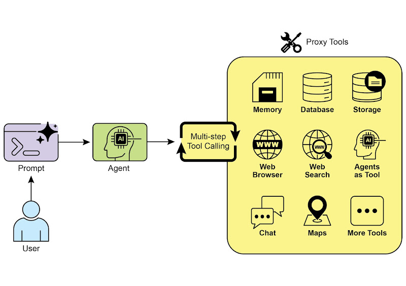
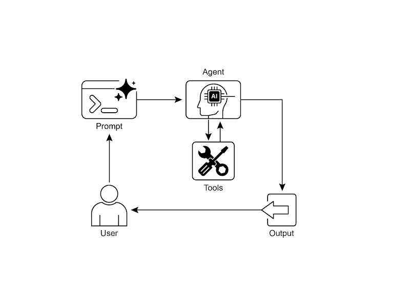

# 📚 Agentic Design Patterns (中文版)

> **提取时间**：2025-12-17 05:14:24
> **内容类型**：中文简体版本
> **总页数**：424 页
> **原始来源**：https://github.com/ginobefun/agentic-design-patterns-cn

---

# Chapter 5：Tool Use (Function Calling) | <mark>第五章：工具使用（函数调用）</mark>

## Tool Use Pattern Overview | <mark>工具使用模式概述</mark>

到目前为止， 我们讨论的智能体模式侧重于在大语言模型之间协调交互和管理智能体内部的信息流（如提示链路由并行化和反思模式）但如果要让智能体真正有用能与现实世界或外部系统交互， 就必须赋予它们使用工具的能力

工具使用模式通常通过函数调用（）机制实现， 使智能体能够与外部数据库服务交互， 甚至直接执行代码它允许作为智能体核心的大语言模型根据用户请求或当前任务状态， 来决定何时以及如何使用特定的外部函数

这个过程通常包括以下几个步骤：

工具定义： 向大语言模型描述外部函数或功能， 包括函数的用途名称， 以及所接受参数的类型和说明

大语言模型决策： 大语言模型接收用户的请求和可用的工具定义， 并根据对两者的理解判断是否需要调用一个或多个工具来完成请求

生成函数调用： 如果大语言模型决定使用工具， 它会生成结构化输出（通常是对象）， 指明要调用的工具名称以及从用户请求中提取的参数

工具执行： 智能体框架或编排层捕获这个结构化输出， 识别要调用的工具， 并根据给定参数执行相应的外部函数

观察结果： 工具执行的输出或结果返回给智能体

大语言模型处理（可选， 但很常见）： 大语言模型接收工具的输出作为上下文， 并用它来生成对用户的最终回复， 或决定工作流的下一步（可能涉及调用另一个工具进行反思或提供最终答案）

这种模式很关键， 因为它突破了大语言模型训练数据的局限， 使其能够获取最新信息执行内部无法处理的计算访问用户特定的数据， 或触发现实世界的动作函数调用是连接大语言模型推理能力与外部功能的技术桥梁

虽然函数调用这个说法确实能准确描述调用预定义代码函数的过程， 但从更广阔的视角理解工具调用这一概念更为有益通过这个更广义的术语， 我们看到智能体的能力可以远远超出简单的函数执行工具可以是传统函数复杂的接口数据库请求， 甚至是发给另一个智能体的指令这种视角让我们能够构想更复杂的系统， 例如， 主智能体可以将复杂的数据分析任务委托给专门的分析智能体， 或通过查询外部知识库工具调用的思维方式能更好地捕捉智能体作为编排者的全部潜力， 使其能够在多样化的数字资源和其他智能生态系统中发挥作用

和等框架可以很方便地定义工具并将它们集成到智能体工作流中， 通常会利用或等现代大语言模型的原生函数调用功能在这些框架中， 你可以定义工具， 并通过设置让智能体识别和使用这些工具

工具使用是构建强大可交互且能感知和利用外部资源的智能体的关键模式

---

## Practical Applications & Use Cases | <mark>实际应用场景</mark>

当智能体需要的不只是文本生成， 而是执行操作或检索动态信息的时候， 工具使用模式几乎都能派上用场

**1. Information Retrieval from External Sources:** | <mark><strong>从外部来源获取信息：</strong></mark>

获取大语言模型训练数据中未包含的实时数据或信息

- <mark><strong>用例：</strong>天气信息智能体。</mark>
- <mark><strong>工具：</strong>天气查询接口，可输入地点并返回该地的实时天气。</mark>
- <mark><strong>智能体流程：</strong>用户提问「伦敦天气怎么样？」，大语言模型识别出需要使用天气工具，并使用「伦敦」作为参数调用该工具，工具返回数据后，大语言模型将这些信息整理并以易懂的方式输出给用户。</mark>

**2. Interacting with Databases and APIs:** | <mark><strong>与数据库和接口交互：</strong></mark>

对结构化数据执行查询更新或其他操作

- <mark><strong>用例：</strong>电商平台智能体。</mark>
- <mark><strong>工具：</strong>通过接口来检查产品库存、查询订单状态或处理支付。</mark>
- <mark><strong>智能体流程：</strong>用户提问「产品 X 有货吗？」，大语言模型先调用库存接口，工具返回库存数量后，大语言模型向用户反馈该产品库存情况。</mark>

**3. Performing Calculations and Data Analysis:** | <mark><strong>执行计算和数据分析：</strong></mark>

使用计算器数据分析库或统计工具

- <mark><strong>用例：</strong>金融领域智能体。</mark>
- <mark><strong>工具：</strong>计算器函数、股票行情接口、电子表格工具。</mark>
- <mark><strong>智能体流程：</strong>用户提问「苹果公司当前股价是多少？如果我以 150 美元买入 100 股，可能会赚多少钱？」，大语言模型会先调用股票行情接口获取最新价格，然后调用计算器工具计算收益，最后把结果整理并返回给用户。</mark>

**4. Sending Communications:** | <mark><strong>发送通知：</strong></mark>

发送电子邮件消息或调用外部通信服务的接口

- <mark><strong>用例：</strong>个人助理智能体。</mark>
- <mark><strong>工具：</strong>邮件发送接口。</mark>
- <mark><strong>智能体流程：</strong>用户说「给约翰发一封关于明天会议的邮件」，大语言模型会从请求中提取收件人、主题和正文，并调用邮件接口发送邮件。</mark>

**5. Executing Code:** | <mark><strong>执行代码：</strong></mark>

在受控且安全的环境中运行代码片段以完成特定任务

- <mark><strong>用例：</strong>编程助理智能体。</mark>
- <mark><strong>工具：</strong>代码解释器。</mark>
- <mark><strong>智能体流程：</strong>用户提供一段 Python 代码并问「这段代码是做什么的？」，大语言模型会先使用代码解释器运行代码，并据此进行分析和解释。</mark>

**6. Controlling Other Systems or Devices:** | <mark><strong>控制其他系统或设备：</strong></mark>

与智能家居设备物联网平台或其他联网系统交互

- <mark><strong>用例：</strong>智能家居智能体。</mark>
- <mark><strong>工具：</strong>控制智能灯的接口。</mark>
- <mark><strong>智能体流程：</strong>用户说「关掉客厅的灯」，大语言模型将带有命令和目标设备信息的请求发送给智能家居工具以执行操作。</mark>

工具使用模式将语言模型从文本生成器变成能够在数字或现实世界中感知推理和行动的智能体（见图）



图： 智能体使用工具的一些示例

---

## Hands-On Code Example (LangChain) | <mark>实战代码

在框架中， 使用工具分两个步骤首先， 定义一个或多个工具， 通常通过封装现有的函数或其他可执行组件来完成随后， 将这些工具和大语言模型绑定， 这样当大语言模型判断需要调用外部函数来完成用户请求时， 就能生成结构化的调用请求并执行相应操作

以下代码将演示这一原理首先定义一个简单函数来模拟信息检索工具， 然后构建并配置智能体， 使其能够利用该工具响应用户输入运行此示例需要先安装的核心库和相应的模型接入包， 并在本地环境中配置好密钥

```python

# 安全地提示用户设置 API 密钥作为环境变量

# 需要一个具有函数调用能力的模型，这里使用 Gemini 2.0 Flash。

# --- 定义模拟的搜索工具 ---

# 模拟提供关于特定查询的输出。使用此工具查找类似「法国的首都是哪里？」或「伦敦的天气如何？」这类问题的答案。

# 通过一个字典预定义的结果来模拟搜索工具。

# --- 创建一个使用工具的智能体 ---

# 这个提示模板需要一个 `agent_scratchpad` 占位符，用于记录智能体的内部步骤。

# 使用定义好的大语言模型、工具和提示词模板构建智能体。

# AgentExecutor 负责调用智能体并运行其选择工具的运行时组件。

# 这里的 'tools' 参数可以不需要了，因为它们已经绑定到智能体上了。

执行智能体并打印最终输出信息

并发运行所有智能体查询任务

```

译者注： 代码已维护在此处， 并添加了输出示例

以上代码使用了库和模型构建了一个使用工具的智能体

首先定义了工具， 用于模拟检索特定问题的事实答案， 比如伦敦天气怎么样？ 法国的首都是哪里？ 和地球的人口是多少？ ， 如果是其他问题就返回一个兜底回复

接着初始化了一个具备工具调用能力的模型， 并创建了用于引导对话的通过将上述定义的模型工具和提示组合成智能体， 并用负责具体的执行与工具调用任务

代码中还用异步函数， 用于用指定输入调用智能体， 并打印最终输出结果主异步函数则准备了多条查询， 以测试工具的输出情况， 包括预定义的查询和兜底回复

执行前代码会检查模型是否成功初始化， 最后通过启动所有任务

---

## Hands-On Code Example (CrewAI) | <mark>实战代码

以下代码展示了使用框架实现函数调用的实际示例场景很简单： 为智能体配备用于查找信息的工具， 并通过该智能体和工具来获取模拟的股票价格

```python

# --- 最佳实践

# 良好的日志设置有助于调试和追踪 crewAI 的执行过程。

# --- 设置你的 API 密钥 ---

# 在生产环境中，推荐使用更安全的密钥管理方法，

# 例如在运行时加载环境变量或使用密钥管理器。

#

# 根据你选择的模型提供商设置环境变量（如 OPENAI_API_KEY）

# --- 1. 重构后的工具 ---

# 该工具现在返回模拟的股价（一个浮点数）或抛出标准的 Python 错误。

# 这样可以提高可重用性，并确保智能体在处理结果时采取适当的处理措施。
获取指定股票代码的最新模拟股价信息
返回该股票的价格（浮点数）如果找不到该代码， 会抛出异常

# 与其返回一个字符串，不如抛出一个明确的错误，这样更清晰也便于处理。

# 该智能体具备异常处理能力，能够在发生问题时判断并选择合适的后续动作。

# --- 2. 定义智能体 ---

# 智能体的定义仍然沿用原有内容，不过现在会使用增强后的工具。

# 允许委托在某些情况下很有用，但对于这个简单的任务并非必需。

# --- 3. 优化后的任务

# 任务描述更加详尽，能够指导智能体在查询成功和抛出错误时都采取正确的处理。

# --- 4. 构建 Crew 实例 ---

# 由该实例来负责协调智能体和任务。

# --- 5. 在主程序中运行 ---

# 使用 __name__ == "__main__"：块是 Python 的最佳实践。

# 在启动 Crew 之前，检查 OPENAI_API_KEY 环境变量是否已设置。

# 使用 kickoff 方法启动执行。

```

译者注： 代码已维护在此处， 并添加了输出示例

以上代码演示了一个使用库来模拟金融分析任务的简单应用

首先定义了工具， 用于模拟查询指定股票代码的价格， 当股票代码是预定义的有效代码时返回模拟的价格， 如果是其他代码则抛出异常

接着创建一个名为的智能体， 其被赋予的角色是高级金融分析师， 允许使用工具进行交互

随后定义了任务， 该任务要求智能体使用工具查找苹果（股票代码为）的股价， 并详细描述了如何处理成功和失败的情形

然后基于上述的智能体和任务构建了实例， 并设置为以便在执行期间输出详细日志

脚本的主体部分在标准的块内， 使用方法运行实例的任务在启动之前， 检查环境变量是否已设置， 这是智能体运行所必需的

执行的结果最终被打印到控制台代码中还包括了日志配置， 以便能更好地追踪的行为和工具调用它使用环境变量管理密钥， 但在生产环境中推荐使用更安全的方法

简而言之， 这个示例展示了如何在中定义工具智能体和任务， 以创建协作式的工作流

---

## Hands-on code (Google ADK) | <mark>实战代码

开发者套件（）内置了丰富的工具， 这些工具可以直接整合到智能体中， 方便扩展其功能

搜索： 搜索工具就是典型的例子， 它提供搜索的接口， 可以为智能体提供网络搜索和外部信息检索的功能

```python

# 定义会话和智能体执行所需的变量

# 定义一个可以使用搜索功能的智能体
是一个内置的工具， 用来执行搜索

# 智能体调用函数
辅助函数， 传入查询参数调用智能体

# 会话和执行器

```

译者注： 代码已维护在此处， 并添加了输出示例

以上代码演示了如何使用版本的创建一个简单的智能体， 该智能体可以通过内置的搜索工具来回答问题

首先从和导入必要的库， 并定义应用名称用户和会话等常量

接着创建一个名为的智能体实例， 详细描述智能体的功能和指令， 同时声明使用内预置的搜索工具

然后在智能体辅助函数内， 先初始化一个（详见第八章）来管理智能体的会话， 并使用之前定义的应用用户和会话等常量创建新会话接着创建实例， 将创建的智能体与上述会话服务连接起来， 负责在会话中执行智能体的交互这个辅助函数封装了向智能体发送查询和处理响应的过程， 用户的查询被封装成角色为的对象， 该对象和用户会话一起传给方法启动执行该方法随后返回事件列表， 代表智能体的行为和响应代码遍历这些事件以找到最终响应， 如果某个事件被识别为最终响应， 则提取其文本内容并输出到控制台

最后代码传入问题作为参数调用并来展示智能体的实际运行效果

代码执行： 还内置了用于执行动态代码的专门组件工具为智能体提供解释器执行的沙箱环境， 使模型能够编写并运行代码来完成计算处理数据和执行脚本对于需要执行确定性逻辑和精确计算的场景， 这个功能非常重要， 因为这类问题不是概率性语言生成所能解决的

```python

# 依

# 定义会话和智能体执行所需的变量

# 定义一个可以执行代码的智能体

# 异步执行智能体

# 创建会话和执行器

# 使用 run_async 方法异步执行智能体

# 首先检查是否有特定的部分

# 通过。code 获取智能体生成的代码

# 获取代码执行结果并打印输出

# 同时打印其他内容，便于调试

# 不要在这里设置 has_specific_part=True，因为我们还想要继续等待最终输出结果

# 然后在特定部分检查之后处理最终结果

# 运行示例

# 运行主异步函数以启动程序流程

# 处理在已经运行的循环（如 Jupyter/Colab）中运行 asyncio.run 时的特定错误

# 在交互式环境中（如 Jupyter 笔记本），你可能需要运行

```

译者注： 代码已维护在此处， 并添加了输出示例

以上代码演示了如何使用来创建具有代码执行能力的智能体， 它通过编写和执行代码来解决具体的数学问题

接着创建一个名为的智能体实例， 详细描述智能体的功能和指令， 要求它扮演计算器的角色， 并可以使用内置的工具来执行代码

核心逻辑位于函数中， 该函数将用户查询发送给智能体的运行器并处理返回的事件在该函数内部， 使用异步循环遍历事件， 打印生成的代码及其执行结果代码区分了这些中间步骤和包含最终答案的结束事件

最后， 函数用两个不同的数学表达式运行智能体， 以演示其执行计算的能力

企业搜索： 下面这段代码使用库定义了一个应用， 使用工具搜索数据来回答问题

代码先创建了一个名为的示例， 提供详细的描述使用的模型（）以及数据存储的， 其中需要通过环境变量设置

接着为智能体设置实例， 并使用来管理对话历史

核心的异步函数用于与智能体交互， 该函数接收查询请求构造为消息对象， 并作为参数传给方法从而实现将查询请求发送给智能体并等待异步事件返回

随后该函数以流式方式将智能体的响应输出到控制台， 并打印关于最终响应的信息， 包括来自数据存储的元数据代码具备错误处理机制， 以捕获智能体执行期间的异常， 并提供有价值的上下文信息， 如数据存储不正确或权限缺失等

另一个异步函数用于演示如何调用该智能体主执行块先检查是否已设置， 然后使用运行示例代码最后还包含一个异常检查， 避免在已有运行事件循环的环境（如）中运行代码时出现错误

```python

# Colab 代码链接

# 依

# --- 环境变量配置 ---

# 请确认已在环境变量中配置 GOOGLE_API_KEY 和 DATASTORE_ID

# --- 定义常量 ---

# --- 定义一个使用 Vertex AI Search 数据存储的智能体 ---

# --- 初始化执行器和会话 ---

# --- 智能体调用逻辑 ---
初始化会话并使用流式输出智能体的响应

# 构造消息对象

# 执行并处理异步事件

# 处理流式输出的文本

# 处理最终输出及其关联的元数据

# --- 运行示例 ---

# 请将此处的示例问题替换为与您数据存储内容相关、具体的问题

# --- 执行 ---

# 处理在已经运行的循环（如 Jupyter notebook）中运行 asyncio.run 时的特定错误
```

译者注： 代码已维护在此处

总结一下， 这段代码提供了用于构建对话式应用的基本框架， 该应用通过查询中的数据来回答问题示例详细展示了如何定义智能体配置执行器， 以及如何在异步交互中以流式方式接收响应最终达到了从指定的数据存储中检索信息并将其整合以回答用户提问的目的

扩展： 扩展是对外部接口的结构化封装， 允许模型直接连接外部服务以实现实时数据的处理和操作扩展提供企业级的安全数据隐私保护和性能保障， 适用于生成与运行代码查询网站分析私有数据等场景提供了诸如代码解释器和的预置扩展， 当然也支持自定义扩展它们的核心优势是强大的企业控制能力以及与生态的无缝衔接与函数调用不同的是， 会自动执行扩展， 而函数调用通常需要由用户或客户端来触发和执行

---

## At a Glance | <mark>要点速览</mark>

问题所在： 大语言模型是强大的文本生成器， 但它们本质上与外部世界脱节它们的知识是静态的， 仅限于训练时所用的数据， 并且缺乏执行操作或检索实时信息的能力这种固有的局限性使它们无法完成需要与外部接口数据库服务进行交互的任务如果没有连接这些外部系统的桥梁， 它们在解决实际问题的能力将大打折扣

解决之道： 工具使用模式（通常通过函数调用机制实现）为这个问题提供了标准化解决方案它的工作原理是， 以大语言模型能理解的方式向其描述可用的外部函数或工具基于用户请求， 具有智能能力的模型可以判断是否需要使用工具， 并生成结构化数据对象（如）， 指明要调用哪个函数以及使用什么参数编排层负责执行此函数调用， 获取结果， 并将其反馈给模型这使得大语言模型能够将最新的外部信息或操作结果整合到最终响应中， 从而有效地赋予了它行动的能力

经验法则： 当智能体需要突破大语言模型内部知识局限并与外部世界互动时， 就应该使用工具使用模式这对于需要实时数据（如查询天气股票价格）访问私有或专有信息（如查询公司数据库）执行精确计算执行代码或在其他系统中触发操作（如发送邮件控制智能设备）的任务至关重要

**Visual summary:** | <mark><strong>可视化总结：</strong></mark>



图： 工具使用模式

---

## Key Takeaways | <mark>核心要点</mark>

工具使用（函数调用）模式使智能体能够与外部系统交互并获取动态信息

这包括为工具定义清晰的描述和参数， 以便大语言模型能正确使用这些工具

大语言模型会决定何时使用工具， 并生成结构化的数据以执行这些操作

智能体框架负责执行实际的工具调用， 并将结果返回给大语言模型

工具使用模式对于构建能够执行现实任务并提供最新信息的智能体来说至关重要

使用装饰器简化工具定义， 并提供和来构建能够使用工具的智能体

提供了多种非常实用的内置工具， 比如搜索代码执行器和工具， 方便将外部功能直接集成到工作流程中

---

## Conclusion | <mark>结语</mark>

工具使用模式是一种重要的架构原则， 用于把大型语言模型的能力扩展到纯文本生成之外通过让模型能够与外部软件和数据源对接， 这一模式使得智能体可以执行操作完成计算以及从其他系统获取信息当模型判断需要调用外部工具来满足用户请求时， 它会生成一个结构化的调用请求

像和这样的框架提供了便于集成外部工具的抽象层和组件， 负责向模型暴露工具的定义并解析模型返回的工具调用请求总体而言， 这大大简化了能够在外部数字环境中感知交互和行动的复杂智能体系统的开发

---

## References | <mark>参考文献</mark>

文档（工具使用）：

开发者套件（）文档（工具使用）：

函数调用文档：

文档（工具使用）：
