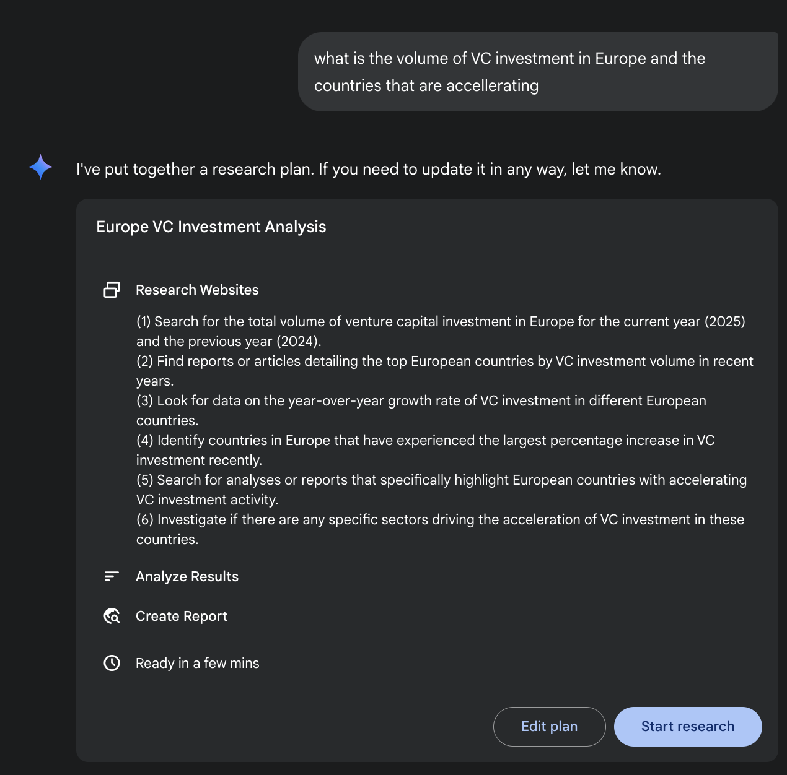
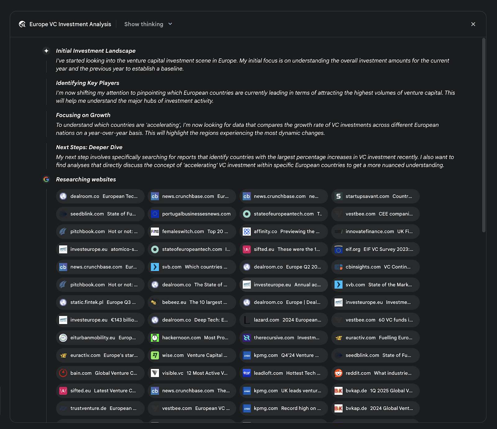
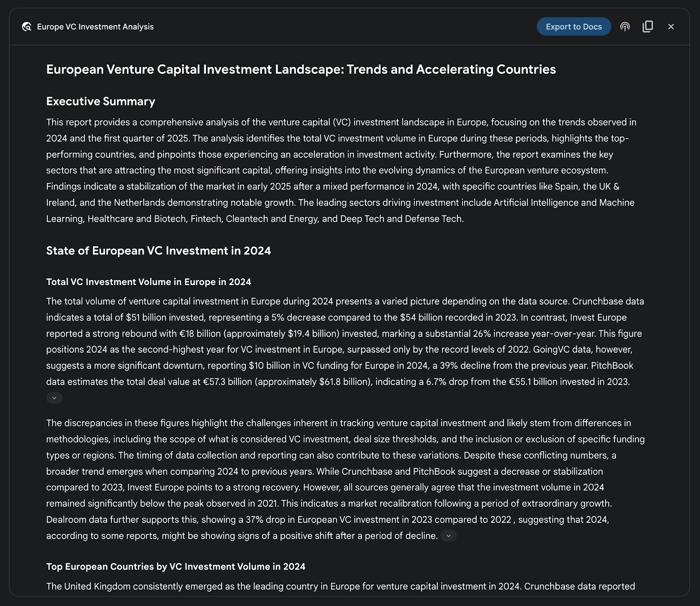
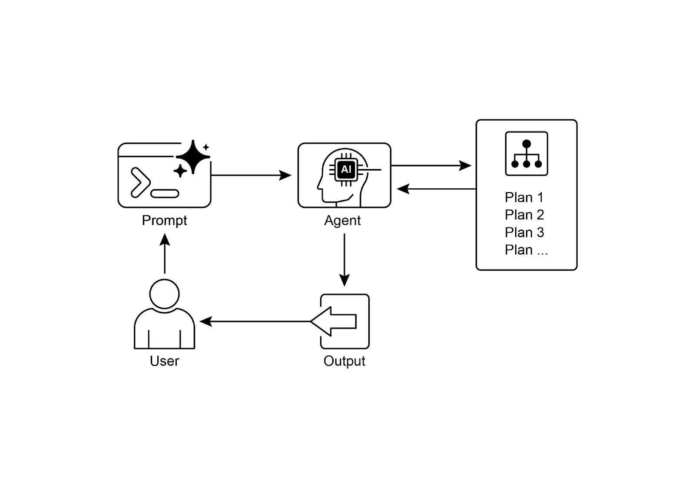

# 📚 Agentic Design Patterns (中文版)

> **提取时间**：2025-12-17 05:14:24
> **内容类型**：中文简体版本
> **总页数**：424 页
> **原始来源**：https://github.com/ginobefun/agentic-design-patterns-cn

---

# Chapter 6：Planning | <mark>第六章：规划</mark>

智能行为远不止对眼前输入作出反应它需要前瞻性， 需要把复杂任务拆解为更小且可管理的步骤， 并制定实现预期结果的策略这正是规划模式发挥作用之处其核心在于： 智能体（或智能体系统）能够制定一系列行动， 使系统从初始状态迈向目标状态

---

## Planning Pattern Overview | <mark>规划模式概览</mark>

在的语境下， 把规划智能体看作可以委派复杂目标的专家会更容易理解当你请它组织团队外出活动时， 你声明了需要它做什么目标及其约束条件而不是定义如何做智能体的核心任务是自主规划通往该目标的路径： 首先是要弄清楚当前状况（如预算人数日期）和目标状态（如已经成功预订的外出活动）， 然后找出将两者衔接起来的最佳行动步骤而且这个计划并非预先存在的， 而是根据请求即时生成的

这一过程的关键是灵活应变初步计划只是出发点， 而非僵硬的指令智能体的真正能力在于接纳新信息， 并在遇到阻碍时调整路线比如， 当首选场地临时无法使用或选定的餐饮服务已约满时， 有能力的智能体不会就此终止， 而是会根据新的约束重新评估可选方案， 制定替代计划， 如建议更换场地或调整日期

然而， 我们必须认识到灵活性与可预测性之间的权衡动态规划是一个专用工具， 而非万能解当问题的解决方法已经清楚且可以重复时， 让智能体遵循预先设定的固定流程通常更有效通过限制智能体的自主性， 可以降低不确定性和不可预测行为的风险， 从而确保结果更加可靠一致因此， 是否采用规划型智能体还是简单的任务处理型智能体， 关键点在于： 如何做的方案是否需要探索， 还是已经明确了？

---

## Practical Applications & Use Cases | <mark>实际应用场景</mark>

规划是自主系统的核心计算过程之一， 它使智能体能够在动态或复杂的环境中， 设计出一连串动作来实现特定目标该过程把高层次的目标转化为由若干可执行的具体步骤组成的结构化计划

在流程自动化等领域， 规划用于编排复杂工作流例如， 新员工入职这样的业务流程可以分解成一系列有序的子任务， 如创建系统账户分配培训课程与各部门协调等智能体会制定计划， 并按逻辑顺序执行这些步骤， 调用必要的工具或与各类系统交互， 以处理各项依赖关系

在机器人与自主导航中， 规划是进行状态空间遍历的核心无论是实体机器人还是虚拟主体， 系统都需要生成路径或动作序列， 从起始状态到达目标状态这个过程要在遵守环境约束（如避障或遵守交通法规）的前提下， 优化时间能耗等指标

这种模式对结构化的信息整合也至关重要当任务需要生成研究报告等复杂输出时， 智能体可以制定包含信息收集数据归纳内容结构化与迭代打磨等阶段的计划在涉及多步骤问题解决的客户支持场景中， 智能体也能制定并执行一套系统化流程来进行诊断实施解决方案并在必要时升级处理

本质上， 规划模式使智能体不再局限于简单的被动反应， 而是能够以目标为导向地行动它为解决那些需要一系列相互关联步骤才能完成的问题， 提供了必要的逻辑框架

---

## Hands-on code (Crew AI) | <mark>实战代码

接下来我们将演示如何使用框架实现规划模式该模式中， 智能体先制定多步骤的计划来解决复杂问题， 然后按步骤依次执行该计划

```python

# 从。env 文件加载环境变量（如 OPENAI_API_KEY）

# 明确指定使用的模型

# 定义一个目标明确且聚焦的智能体

# 定义一个更结构化且输出明确的任务

# 创建一个 Crew 实例来执行任务

# 开始执行

```

译者注： 代码已维护在此处

此代码使用库创建一个在给定主题上进行规划并撰写摘要的智能体

代码先导入依赖的库， 包括与， 并从文件加载环境变量随后为智能体指定并使用了一个语言模型接着创建名为的智能体， 设定其角色和目标： 先制定计划然后撰写简洁的摘要， 并在背景介绍中强调在规划与技术写作方面的专长随后定义一个任务： 明确要求先生成计划再就强化学习在中的重要性这个主题撰写摘要， 并对输出格式作出具体要求最后使用该智能体与任务构建实例， 设置为顺序处理， 并调用启动任务并打印结果

---

## Google DeepResearch | <mark>Google 深度研究</mark>

深度研究（， 见图）是一个面向自主信息检索与整合的智能体系统它通过一个多步骤动态迭代的智能体流程调用搜索引擎， 系统性地探索复杂主题该系统能够处理大量网络来源， 评估所收集数据的相关性与知识缺口， 并发起后续搜索来弥补这些空白最终产出是经过筛选并带有引用来源的结构化多页摘要

进一步来说， 系统并非一次性的问答事件， 而是受控的持续运行的过程它会先把用户的提示拆解成多个要点的研究计划（见图）， 再呈现给用户审阅与修改， 以便在开始执行前共同确定研究方向一旦计划获批， 智能体便会开启循环的搜索与分析过程这个过程并非简单地执行预设搜索， 而是根据获取到的信息不断生成和调整查询， 主动发现知识盲点核对数据并解决冲突



图： 深入研究智能体使用搜索引擎作为工具， 生成详细的执行计划

一个关键的架构要点是系统对整个流程的异步管理能力这样的设计使得可能涉及数百个来源的研究具备抵御单点故障的能力， 并允许用户中途离开， 待任务完成后再收到通知系统还能整合用户提供的文档， 把私有资料和网络搜索到的信息相结合最终产出不是简单堆砌的要点列表， 而是结构化的多页报告在整合阶段， 模型会对收集到的信息进行严格评估， 提炼主要主题并按逻辑分成章节， 形成连贯的叙述报告通常是交互式的， 如音频简介图表及指向原始引用来源的链接， 便于用户核查和进一步探索除整合后的结论外， 模型还会明确返回其搜索与参考的完整来源清单（见图）， 以引用的形式呈现， 确保透明并可直接访问原始资料整个过程把一次简单的查询转化为全面且系统化的知识成果



图： 一个深入研究计划执行示例， 展示了使用搜索作为工具来检索各类网络来源的信息

通过减少手动数据获取和整合数据所需的大量时间和资源投入， 深度研究为信息发现提供了更结构化更全面的方法在各类复杂多维的研究任务中， 这一系统的价值尤为明显

例如， 在进行竞争分析时， 可以让智能体系统有条不紊地收集并汇总市场趋势竞争对手产品规格来自不同渠道的公众舆情以及营销策略等信息这个自动化流程替代了手动跟踪多个竞争对手的繁琐工作， 使分析师能把精力放在更高层次的战略解读上， 而不是耗费在数据采集上（见图）



图： 深度研究智能体生成的最终结果， 基于搜索获取的资料进行分析

同样在学术研究中， 该系统也是进行大规模文献综述的有力工具它可以识别并概括重要论文， 梳理概念在多篇文献中的演变轨迹， 并勾勒出某一领域的新兴研究方向， 从而大大加快学术研究中最初且通常最耗时的阶段

这种方法之所以高效， 是因为它将反复的搜索与筛选过程自动化了， 而这正是手动研究的主要瓶颈系统能在与人类研究者同样多的时间内处理更多类型更丰富的信息来源， 从而实现更全面的覆盖更广的分析范围还有助于降低选择性偏差的风险， 并更容易发现那些不太显眼但可能至关重要的信息， 从而得出更可靠更有依据的结论

---

## OpenAI Deep Research API | <mark>OpenAI 深度研究接口</mark>

深度研究接口（）是一款专为自动化复杂研究任务而设计的工具它利用高级智能体模型， 能够独立推理规划， 并从真实世界来源整合信息不同于简单的问答模型， 它接收高层次的问题并自主拆解为若干子问题， 借助内置工具进行网络搜索， 最终给出结构化且带有引用的报告通过该接口可以用编程的方式控制整个流程撰写本书时可使用模型生成高质量的调研内容， 而模型则可用于对延迟更敏感的场景

深度研究接口很有用， 因为它能将本需数小时人工调研的工作自动化， 产出用于商业战略投资决策或政策建议的专业级数据驱动的报告其主要优势包括：

结构化有引用的输出： 它生成结构清晰的报告， 在文中插入与来源关联的引用， 从而使结论可核查并有数据支撑

透明度： 与中的抽象过程不同， 该接口会展示所有中间步骤， 包括智能体的推理它执行的具体网络搜索查询以及运行的任何代码这使得对答案的生成过程可以进行更细致的调试与分析， 并更清楚地了解最终结果是如何形成的

可扩展性： 它支持模型上下文协议（）， 使开发者能够将智能体连接到私有知识库和内部数据源， 将公共网络研究与专有信息结合

要使用该接口， 你需要向端点发送请求， 指定模型输入提示词和智能体可以使用的工具输入通常包括定义智能体角色和期望输出格式的， 以及还必须包含工具， 并添加其他可选工具， 如或自定义工具（见第章）用于处理内部数据

```python

# 使用你的 API 密钥初始化 OpenAI 客户端

# 定义智能体的角色和用户的研究问题

# 调用深度研究 API

# 访问响应并将其中的最终报告提取并打印出来

# 访问内联引用和元数据

# 检查中间步骤

# 1. 推理步骤

# 2. 网络搜索调用

# 3. 代码执行
```

译者注： 代码已维护在此处

以上代码演示了如何使用接口来执行深度研究首先需要使用你的初始化客户端， 用于身份验证随后定义智能体的角色（专业研究员）， 并设置关于司美格鲁肽对全球医疗体系经济影响的研究话题接着向模型发起接口请求， 传入预设的系统消息和用户查询， 同时请求自动生成推理摘要并启用网络搜索功能完成调用后， 代码会提取并打印最终生成的报告

随后， 代码会从报告的注释中读取并展示内联引用与元数据， 包括被引用的文本标题链接以及在报告中出现的位置最后， 它还会检查并打印模型执行过的中间步骤的细节， 如推理步骤网络搜索调用（含执行的查询）以及代码执行步骤

---

## At a Glance | <mark>要点速览</mark>

问题所在： 复杂问题往往不能靠一次操作解决， 需要提前规划才能达成目标如果没有结构化的方法， 智能体系统就难以处理包含多个步骤和相互依赖的任务， 也难以把高层次的目标拆解成可管理的可执行的小任务结果就是： 面对复杂目标时难以有效制定策略， 产出不完整或错误的结论

解决之道： 规划模式的做法是先由智能体制定一个清晰的计划， 再据此推进目标它将高层次的目标拆解为一系列更小可执行的步骤或子目标， 使系统能够有条不紊地管理复杂工作流编排各类工具， 并按逻辑顺序处理依赖关系大语言模型尤其擅长此类任务， 能够基于其广泛的训练数据生成合理有效的计划借助这种结构化方法， 可以把简单的被动式智能体变成主动的战略执行者， 能够实现复杂目标并在必要时灵活调整计划

经验法则： 当用户请求复杂到无法由单一动作或工具完成时， 应采用此模式它适用于自动化多步骤流程， 例如生成详尽的研究报告办理新员工入职或开展竞品分析凡是任务需要通过一系列相互依赖的操作才能得到最终综合性结果的场景， 都应考虑使用规划模式

**Visual summary:** | <mark>可视化总结：</mark>



图： 规划模式

---

## Key Takeaways | <mark>核心要点</mark>

规划使智能体能够把复杂目标拆解为一系列可按顺序执行的具体步骤， 从而更有效地完成任务

它对于处理多步骤任务实现工作流程自动化以及在复杂环境中导航等场景至关重要

大语言模型可根据任务描述生成多步骤的方案， 从而实现对任务的规划与执行

通过明确的提示词或在任务设计中要求分解出规划的步骤， 可以促使智能体框架产生这种规划行为

深度研究会把搜索引擎作为工具来代替我们检索与分析来源， 具备反思规划与执行能力

---

## Conclusion | <mark>结语</mark>

总之， 规划模式是把智能体系统从简单的被动响应者， 提升为战略性目标导向执行者的基础能力现代大语言模型提供了核心支撑， 能够自主将高层次目标拆解为连贯且可执行的步骤该模式既可用于简单的线性任务（如智能体制定并遵循写作计划）， 也可扩展到更复杂更加动态的系统以深度研究智能体为例， 它能制定迭代性的研究计划， 并根据获取的信息持续不断调整和演进总体而言， 规划模式在人类意图转化为自动化执行方面起到桥梁作用， 使智能体能够管理复杂流程并产出全面综合的结果

---

## References | <mark>参考文献</mark>

深度研究（功能）：

深度研究介绍：

深度研究介绍：
