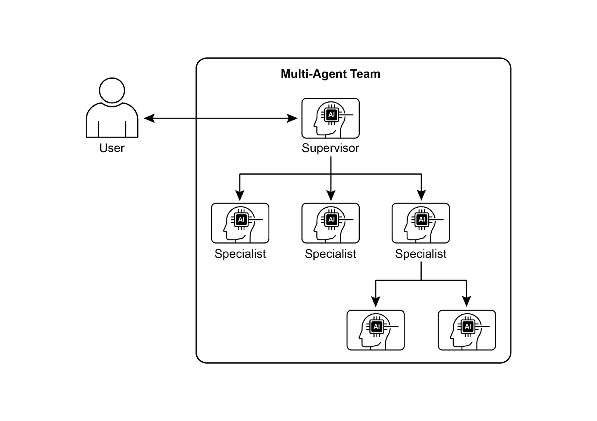
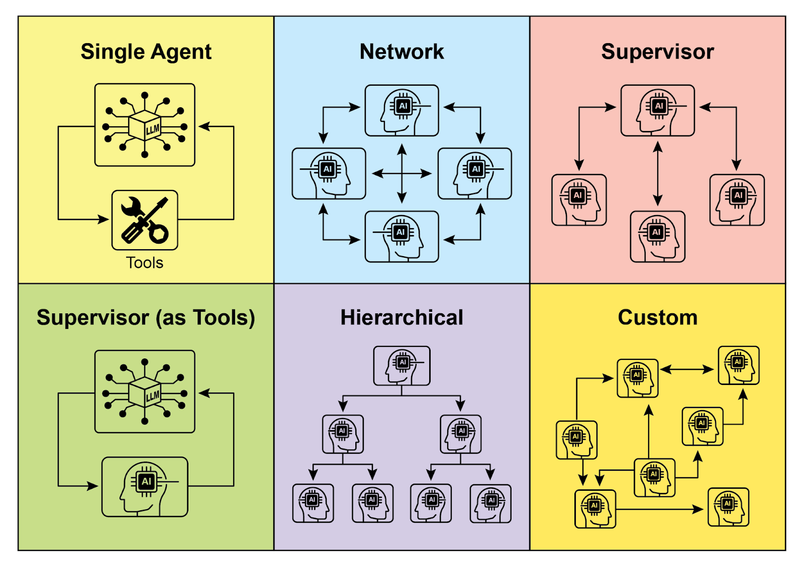
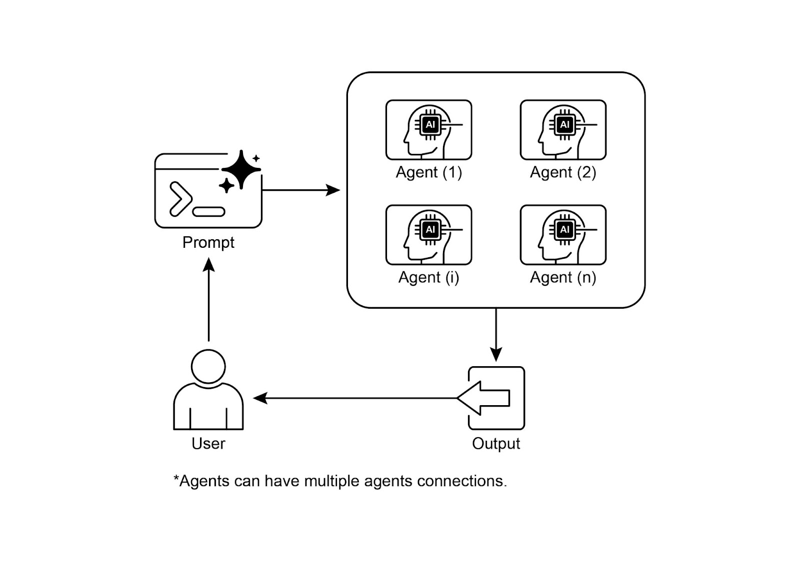

# 📚 Agentic Design Patterns (中文版)

> **提取时间**：2025-12-17 05:14:24
> **内容类型**：中文简体版本
> **总页数**：424 页
> **原始来源**：https://github.com/ginobefun/agentic-design-patterns-cn

---

# Chapter 7：Multi-Agent Collaboration | <mark>第七章：多智能体协作</mark>

单智能体在处理任务明确范围清晰的问题时表现良好， 但在面对更复杂的跨领域任务时往往力不从心多智能体协作模式通过组织一组相互合作各司其职的专长型智能体来克服这些限制这种模式基于任务分解原则， 将高层次目标拆解为若干独立的子问题， 然后将每个子问题分配给拥有相应工具数据权限或推理能力的智能体来处理， 以发挥各自优势

例如， 一个复杂的研究问题可以这样拆分： 由研究智能体负责信息检索数据分析智能体负责统计处理综合智能体负责生成最终报告这类系统的效果不仅源于分工， 更取决于智能体之间的通信机制为此需要标准化的通信协议和共享机制， 使智能体之间能够交换数据委派子任务和协调行动， 以确保最终结果的连贯一致

这种分工协作架构具有多项优势， 包括更强的模块化可扩展性和鲁棒性因为单个智能体的故障不一定会导致整个系统瘫痪更重要的是， 通过分工协作， 多智能体系统能够发挥协同效应， 其整体表现往往超越任何单个智能体的能力上限

---

## Multi-Agent Collaboration Pattern Overview | <mark>多智能体协作模式概览</mark>

多智能体协作模式是指设计由多个独立或半独立智能体组成的系统， 它们之间协同工作以实现共同目标每个智能体通常承担明确的角色， 拥有与整体目标一致的目标， 并可以使用不同的工具或知识库其强大之处在于智能体之间的互动与协同， 能够产生超越单体能力的协同效应

协作可以有多种形式：

顺序交接： 一个智能体完成任务后将输出交给另一个智能体继续处理， 形成管道式工作流（类似于规划模式， 但涉及不同的智能体）

并行处理： 多个智能体同时处理同一问题的不同部分， 最后将各自的结果进行合并

辩论与共识： 在多智能体协作中， 来自不同视角和信息来源的智能体通过讨论和评估各种方案， 最终形成共识或得出更加可靠的决策

层级结构： 管理型智能体可以根据各个执行型智能体的工具权限或插件能力， 动态分配任务并汇总结果每个智能体也可以负责一组相关工具， 而不是让单个智能体承担所有工具调用的责任

专家团队： 由研究员撰稿人编辑等在各自领域具备专业知识的智能体组成， 他们协同合作， 共同完成复杂的任务

评审者模式： 一组智能体先生成初始输出（如计划草稿或答案）， 另一组智能体随后严格评估该输出是否符合政策安全性合规性正确性质量要求以及组织目标原始输出的智能体或最终智能体再据此反馈来改进输出这种模式对于代码生成学术写作逻辑检查以及确保伦理合规方面尤其有效， 其优势包括更强的稳定性更高的质量， 以及显著减少幻觉和其他错误的可能性

多智能体系统（见图）的设计主要包括三个方面： 明确每个智能体的角色和职责建立用于信息交换的通信通道， 以及制定引导它们协同工作的任务流程或交互协议



图： 多智能体系统示例

和等框架通过提供智能体任务和交互流程的组件， 实现这些协作模式这种方法对于那些需要多种专业知识包含多个独立阶段， 或者能从不同智能体间相互验证信息中受益的场景特别有效

---

## Practical Applications & Use Cases | <mark>实际应用场景</mark>

多智能体协作是一种强大且通用的模式， 适用于许多不同的领域：

复杂研究与分析： 多个智能体可以协同完成一个研究项目， 采用和人类研究团队类似的分工形式比如一个智能体负责搜索学术数据库， 另一个负责整理和总结要点， 第三个负责发现和归纳趋势， 第四个将这些信息整合成最终报告

软件开发： 设想由多个专职智能体协同开发软件的场景需求分析智能体负责需求分析， 开发智能体负责编写代码， 测试智能体负责测试， 文档智能体负责编写文档它们的输出可以相互可见， 协同开发和验证各个组件

创意内容生成： 在策划一项营销活动时， 可以由多个专长不同的智能体共同配合， 比如负责市场调研的智能体负责撰写文案的智能体负责设计素材的智能体（使用图像生成工具）， 以及负责社媒排期的智能体， 它们协同工作完成整个活动

财务分析： 多智能体系统还可以用于分析金融市场， 不同的智能体分别负责获取股票数据分析新闻情绪分析技术面以及生成投资建议

客户支持： 一线客户支持智能体可以处理用户的常见咨询， 在遇到复杂或专业性强的问题时， 会按问题复杂度将工单升级给相应的专业智能体（如技术专家智能体或计费专家智能体）

供应链优化： 智能体可以代表供应链中的不同节点（如供应商制造商分销商）， 通过协作来优化库存物流和排期， 以应对不断变化的需求或其他突发的情况

网络分析与故障修复： 在自主运维系统中， 采用多智能体架构对故障定位和问题处理也特别有用多个专职智能体可以协同进行问题排查与修复， 并提出最优处理建议它们还可以与现有的机器学习模型和运维工具无缝集成， 既利用现有系统， 又能发挥生成式带来的额外价值

将任务拆分给多个专业智能体并精心协调它们的协作， 可以让开发者构建出更具模块化和可扩展性的系统， 从而解决单个整体智能体无法应对的复杂问题这正是多智能体协作模式的核心价值所在

---

## Multi-Agent Collaboration：Exploring Interrelationships and Communication Structures | <mark>多智能体协作：研究各智能体之间的关系与通信体系</mark>

理解智能体之间如何交互和通信是设计高效多智能体系统的基础如图所示， 智能体间的互联关系和通信模型形成一个谱系， 从最简单的单智能体场景到复杂的定制协作框架每种模型各有优劣， 会影响多智能体系统的整体效率稳定性和灵活性

### 1. Single Agent | <mark>单智能体</mark>

在最基本的层面上， 单智能体独立运行， 不需要与其他智能体进行直接交互或通信虽然这种模型易于实现和管理， 但其能力本质上受限于单个智能体的职责和资源它适合那些能被分解为独立子问题的场景， 其中每个子问题都可以交给单个自给自足的智能体来解决

### 2. Network | <mark>网络化</mark>

网络模型向协作迈出了重要一步， 多个智能体以去中心化点对点的方式直接交互， 能够共享信息资源乃至分担任务这种模型结构更具弹性， 因为某个智能体的故障不一定会影响整个系统然而， 在大规模非结构化的网络中， 如何控制通信开销并确保决策的一致性仍然是个挑战

### 3. Supervisor | <mark>监督者</mark>

在监督者模型中， 专门的监督者智能体负责监督和协调下级智能体的工作监督者充当通信任务分配和冲突解决的中心枢纽， 能带来清晰的职责分工并简化管理和控制然而， 这种层级结构也会带来单点故障问题（即监督者本身）， 而且当下级智能体数量过多或任务非常复杂时， 监督者可能成为整体系统的瓶颈

### 4. Supervisor as a Tool | <mark>将监督者视为工具</mark>

这种模型是监督者概念的细微扩展， 监督者的角色不再直接指挥和控制， 而是通过提供资源指导或分析来辅助其他智能体监督者可能提供工具数据或计算服务， 帮助其他智能体更高效地完成任务， 而不是干预或支配它们的每一步行动此方法旨在发挥监督者的能力， 同时避免僵化的自上而下的控制

### 5. Hierarchical | <mark>层级</mark>

层级模型基于监督者概念创建了一个多层组织结构： 高层级的监督者负责监督低层级监督者， 最底层则由具体的执行智能体组成该架构非常适合于可以拆分为若干子问题的复杂任务， 每一层负责管理特定的子问题通过这种分层管理， 它为应对复杂性和实现可扩展性提供了清晰的结构， 并允许在既定边界内进行分工决策



图： 智能体以各种方式进行通信和交互

### 6. Custom | <mark>自定义</mark>

自定义模型代表了多智能体系统设计的终极灵活性， 允许为特定问题或应用精确定制相互关系和通信结构它既可以是融合了已有模型特点的混合方案， 也可以是针对独特环境约束和机会时产生的全新设计自定义模型通常用于优化特定性能指标处理高度动态环境或将领域特定知识纳入系统架构的场景设计与实现这类模型通常要求对多智能体系统原理有深入理解， 并需慎重规划通信协议协调机制及可能出现的涌现行为

总之， 为多智能体系统选定相互关系与通信模型是一个关键的设计决策各种模型各有优劣， 哪种最合适取决于任务复杂度智能体数量所需自治程度对系统鲁棒性的要求以及可接受的通信开销未来， 多智能体系统领域可能会继续改进这些模型， 并探索新的协作智能范式

---

## Hands-On code (Crew AI) | <mark>实战代码

以下代码演示了如何使用框架创建一个赋能的创作团队， 来撰写一篇关于趋势的博客程序首先配置环境， 从文件中加载密钥核心部分定义了两个智能体： 研究员智能体负责查找和总结趋势， 写手智能体负责编写博客文章

根据上述要求定义了两个任务： 调研趋势任务和撰写博客任务， 其中写作任务依赖于调研任务的输出然后将这些智能体和任务组装成实例， 并按顺序执行任务主函数使用方法启动此实例， 编排智能体之间的协作以产出目标结果最后程序会在控制台打印执行的结果， 即生成的博客文章

```python

加载环境变量并检查所需的密钥

使用模型初始化并运行用于内容创建的智能体创作团队

# 定义要使用的语言模型

# 更新为 Gemini 2.0 系列的模型以获得更好的性能和功能

# 如需最新的特性，可以使用 "gemini-2.5-flash" 模型

# 定义具体的角色和目标的智能体

# 为智能体定义任务

# 创建 Crew 实例
译者注： 的类在最新版本中， 参数只接受布尔值（或）， 不再支持整数级别（）

# 启动 Crew 实例

```

接下来， 我们将深入探讨框架内的更多示例， 重点介绍层级并行和顺序三种协调模式， 并演示如何将智能体作为一个工具来使用

---

## Hands-on Code (Google ADK) | <mark>实战代码

以下代码演示了如何在中通过创建父子智能体关系来建立多层级结构

代码中采用了两种方式来定义智能体： 和继承自的自定义用于处理非大语言模型任务， 在这个示例中， 它只是发出任务成功完成事件

另外一个名为的智能体使用大语言模型（这里使用模型）并被要求扮演迎宾人员接着使用自定义的来实例化

随后创建名为的父智能体， 同样指定了模型与指令， 要求它将问候任务分派给， 将具体的任务执行分派给这样就通过把和作为的子智能体， 建立了父子关系代码接着断言此关系已正确设置， 并打印消息表示智能体层级关系已成功创建

```python

# 通过继承 BaseAgent 类实现自定义智能体
一个自定义的非基于大语言模型的智能体

自定义任务的实现逻辑

# 这里是自定义逻辑所在

# 在这个示例中，我们只是返回一个简单的事件

# 定义具有明确功能的智能体

# LlmAgent 需要指定使用的模型

# 实例化自定义智能体

# 创建一个父智能体并声明其子智能体列表

# 父智能体的描述和指令应该能够指导其委派子智能体的逻辑

# ADK 框架会自动建立上述层级关系

# 如果在初始化后检查，这些断言将成立

```

下一个示例演示了如何在框架中使用创建迭代工作流

代码定义了两个智能体： 和是自定义智能体， 用于检查会话状态中的字段值如果为， 会终止循环； 否则， 它会发出事件以继续循环

是使用模型的智能体， 用来执行具体任务； 如果是最后一步， 则将会话设置为

示例中创建了名为的， 配置为最多循环次（）， 并将和作为子智能体顺序执行最终效果是最多执行次循环， 如果检测到状态为则提前终止循环

```python

# 最佳实践：将自定义智能体定义为完整的、自描述的类
一个自定义的智能体， 用于检查会话是否为状态

检查状态并产生事件以继续或停止循环

# 满足条件时终止循环

# 否则，发出简单事件以继续循环

# 说明：LlmAgent 必须指定使用的模型和清晰的指令

# 使用 LoopAgent 编排工作流

# 此轮询器现在将执行 'process_step' 智能体

# 然后执行 'ConditionChecker' 智能体

# 重复执行直到状态为 'completed' 或达到 10 次循环
```

下面的代码演示了如何通过中的来构建线性工作流

代码首先使用库定义了由两个智能体组成的顺序流水线： 和

智能体的名称是， 它的输出将存储在会话状态的属性下智能体的名称是， 它的作用是分析存储在中的信息并给出摘要

然后创建一个名为的来编排这两个子智能体的执行当使用原始输入传入并开始运行流水线时， 会先执行并把结果写入会话状态的属性下， 随后再执行， 根据它的指令读取状态中的信息并继续处理这样的结构便于构建多步流程， 使一个智能体的输出作为下一个智能体的输入， 是常见的多步骤或数据处理流水线模式

```python

# 该智能体的输出将保存到 session.state["data"]

# 该智能体会使用上一步的输出

# 通过指令告诉它如何查找和使用上一步的输出

# 当使用原始输入运行 pipeline 时，Step1 先执行，

# 它的响应会保存到 session.state["data"] 中，然后

# Step2 再执行，按照指令使用状态中的信息
```

下面的代码示例演示了如何通过中的来实现多个智能体任务的并行执行

智能体声明需要并行运行两个子智能体： 和

智能体被要求获取给定位置的天气， 并将结果保存在会话状态中的属性中； 智能体则被要求搜索给定主题的头条新闻， 并将其保存在会话状态中的属性中这两个子智能体都使用模型

负责编排这些子智能体的并行执行， 收集执行结果并存储在会话状态中最后， 示例展示了如何在智能体执行完成后从会话状态中获取收集的天气和新闻数据

```python

# 在实际场景中最好将查询数据的逻辑定义为智能体的工具

# 为了简单起见，在这个示例中，我们将查询数据的逻辑放在了智能体的指令中

# 定义两个并行运行的子智能体：weather_fetcher 和 news_fetcher

# 使用 ParallelAgent 编排子智能体并行执行
```

最后一个示例演示了中的智能体作为工具使用场景， 使智能体能够以类似于函数调用的方式利用另一个智能体的能力

代码中使用框架中的和类定义图像生成系统它由两个智能体组成： 父智能体和子智能体

函数是一个简单的工具， 用来模拟图像创建并返回模拟图像数据则负责根据接收到的提示词使用此工具

智能体负责先构思出富有创意的图像提示词， 然后使用被封装后的工具来调用智能体这里起到桥梁作用， 允许一个智能体将另一个智能体用作工具

当智能体调用工具时， 使用智能体输出的提示词调用智能体然后智能体使用该提示词调用工具

最后， 生成的图像（或模拟数据）通过智能体输出整个架构展示了分层的智能体体系， 上层智能体负责编排， 下层专用智能体负责具体执行任务

```python

# 1. 一个简单的函数工具

# 遵循分离操作与推理的最佳实践
基于文本提示生成图像

要生成的图像的详细描述
包含状态和生成的图像字节的字典

# 在实际实现中，这里将调用真实的图像生成 API

# 但是为了简便起见，在这个示例中，我们仅返回模拟的图像数据

# 工具返回原始字节，智能体将处理 Part 创建

# 2. 将 ImageGeneratorAgent 重构为 LlmAgent

# 它现在能接收并使用传给它的参数了

# 3. 将智能体封装在 AgentTool 中

# 这里的描述对父智能体是可见的

# 4. 父智能体保持不变。
```

---

## At a Glance | <mark>要点速览</mark>

问题所在： 复杂问题往往超出单个智能体的能力范围， 因为单个智能体可能不具备处理复杂任务所需的各种专业技能或特定工具的访问权限这种限制造成了瓶颈， 降低了系统的整体效率和可扩展性从而导致单个智能体在处理复杂的跨领域任务时变得低效， 容易产出不完整或次优的结果

解决之道： 多智能体协作模式通过创建由多个相互协作的智能体组成的系统， 提供了标准化解决方案复杂问题被分解为更小更易管理的子问题， 每个子问题分配给具有解决该问题所需工具和能力的专业智能体处理这些智能体按预定义的通信协议和交互模型（如顺序交接并行工作流或层级委派）协同工作这样的智能体分工协作方法能够产生协同效应， 实现单个智能体无法达成的结果

经验法则： 当某个任务对于单个智能体过于复杂并且可以拆分为多个各自需要专业技能或工具的子任务时， 应使用此模式它非常适合从多样化专业知识并行处理或具有多个阶段的工作流程中受益的问题， 例如复杂的研究与分析软件开发或创意内容生成等

**Visual summary:** | <mark>可视化总结：</mark>



图： 多智能体设计模式

---

## Key Takeaways | <mark>核心要点</mark>

多个智能体通过协同合作， 完成一个共同的目标

该模式通过明确分工的专业角色可独立执行的任务以及智能体间协同通信机制， 来实现智能体间的协作

协作可以有多种形式， 如顺序交接并行处理辩论式讨论或层级结构等

该模式非常适合处理需要多种专业技能或包含多个独立阶段的复杂问题

---

## Conclusion | <mark>结语</mark>

本章探讨了多智能体协作模式， 展示了在系统内协同多个专长不同的智能体所带来的优势我们分析了多种协作模型， 强调了该模式在不同领域应对复杂多阶段问题的重要性对智能体协作的理解还引出了对它们如何与外部环境交互的进一步思考

---

## References | <mark>参考文献</mark>

多智能体协作机制： 大语言模型综述，

多智能体系统协作的力量，
