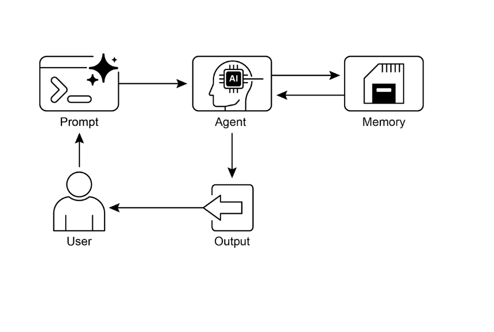

# 📚 Agentic Design Patterns (中文版)

> **提取时间**：2025-12-17 05:14:24
> **内容类型**：中文简体版本
> **总页数**：424 页
> **原始来源**：https://github.com/ginobefun/agentic-design-patterns-cn

---

# Chapter 8：Memory Management | <mark>第 8 章：记忆管理</mark>

有效的记忆管理是智能体保留信息的关键与人类类似， 智能体需要多种类型的记忆才能高效运行本章将深入探讨记忆管理， 重点聚焦于智能体的即时（短期）和持久（长期）记忆需求

在智能体系统中， 记忆指智能体从过往交互观察和学习经验中保留并利用信息的能力这一能力使智能体能够做出明智决策维持对话上下文， 并持续改进智能体记忆通常可分为两大主要类型：

短期记忆（上下文记忆）： 类似于工作记忆， 存储当前正在处理或近期访问的信息

对于基于大语言模型的智能体， 短期记忆主要存在于上下文窗口内该窗口包含最近的对话消息智能体回复工具调用结果以及当前交互中的反思内容， 这些信息共同为后续的响应和决策提供上下文支撑

上下文窗口的容量有限， 限制了智能体可直接访问的近期信息范围高效的短期记忆管理需要在有限空间内选择性地保留最相关信息， 可通过总结旧对话片段或强调关键细节等技术实现

具有长上下文窗口的模型虽然扩大了短期记忆容量， 允许在单次交互中保存更多信息， 但这种上下文仍然是短暂的， 会话结束后即丢失， 且每次处理成本高昂效率较低

因此， 智能体需要不同类型的记忆来实现真正的持久化， 从过往交互中回忆信息并构建持久的知识库

长期记忆（持久记忆）： 充当一个长期知识库， 用于存储智能体在各种交互场景任务执行或长时间跨度内需要保留的信息

数据通常存储在智能体的运行时环境之外， 常见于数据库知识图谱或向量数据库中在向量数据库中， 信息被转换为数值向量并存储， 使智能体能够基于语义相似性而非精确关键词匹配来检索数据， 这个过程被称为语义搜索

当智能体需要长期记忆中的信息时， 会查询外部存储检索相关数据并将其整合到短期上下文中以便随时使用， 从而将先验知识与当前交互信息相结合

---

## Practical Applications & Use Cases | <mark>实际应用场景</mark>

记忆管理对于智能体至关重要， 使其能够持续跟踪信息并在长时间运行中表现出智能行为这一能力是智能体超越基础问答展现高级智能的关键主要应用场景包括：

聊天机器人和对话式： 维持对话流程依赖于短期记忆聊天机器人需要记住先前的用户输入才能提供连贯的回答长期记忆使聊天机器人能够调取用户偏好过往问题或过往对话记录， 从而提供个性化且连续一致的交互体验

任务导向型智能体： 处理多步骤任务的智能体需要借助短期记忆来跟踪已完成步骤当前进度状态及总体目标这些信息通常存储在任务上下文或临时缓存中长期记忆对于访问非即时上下文的用户特定数据至关重要

个性化体验服务： 提供定制化交互的智能体利用长期记忆系统来存储和调用用户偏好历史行为模式及个人信息这种能力使得智能体能够动态调整其响应策略和建议内容

学习与性能优化： 智能体通过从历史交互中学习来持续改进自身的性能表现成功的策略方案错误经验以及新获取的知识都被存储在长期记忆中， 为未来的自适应优化提供支持强化学习智能体正是通过这种方式保存习得的策略和知识体系

信息检索（）： 为问答场景设计的智能体需要访问知识库（即长期记忆）， 这一功能通常在检索增强生成（）框架中实现智能体通过检索相关文档和数据资源来支撑其回答的准确性和完整性

自主控制系统： 机器人或自动驾驶车辆需要记忆系统来存储地图信息导航路线物体位置以及学习获得的行为模式这包括用于实时环境感知的短期记忆和用于通用环境知识存储的长期记忆

记忆能力使智能体能够维护历史记录实现持续学习提供个性化交互， 并有效处理复杂的时序依赖性问题

---

## Hands-On Code：Memory Management in Google Agent Developer Kit (ADK) | <mark>实战代码：Google ADK 中的记忆管理</mark>

提供了一套结构化的上下文与记忆管理方法， 包含多个可直接应用于实际场景的组件深入理解中会话（）状态（）和记忆（）这三个核心概念， 对于构建需要信息持久化能力的智能体至关重要

正如人类交流需要记忆， 智能体同样需要具备回忆历史对话的能力， 才能进行连贯自然的交流通过三个核心概念及其配套服务， 简化了上下文管理的复杂性

每次与智能体的交互都可视为一个独立的对话， 而智能体往往需要访问历史交互数据通过以下架构组织这些信息：

（会话）： 一个独立的聊天会话， 记录特定交互过程中的消息和执行动作（事件）， 同时存储与该对话相关的临时数据（状态）

（状态， ）： 存储在会话内部的数据， 仅包含与当前活跃聊天会话相关的上下文信息

（记忆）： 一个可检索的信息知识库， 数据来源包括历史聊天记录和外部数据源， 为超越当前对话范围的数据检索提供支持

提供专门的服务组件， 它们是构建有状态上下文感知的智能体的关键要素负责管理聊天会话（对象）， 处理会话的创建记录和终止， 而负责长期知识（）的存储与检索

和均提供多种配置选项， 允许开发者根据应用需求选择合适的存储方案比如内存存储适用于测试环境， 数据不会持久化， 在重启后会丢失对于需要持久化存储和可扩展性等需求， 支持使用数据库和云服务

---

## Session：Keeping Track of Each Chat | <mark>Session：跟踪每次聊天</mark>

中的对象用于跟踪和管理独立的聊天会话

当用户与智能体开始对话时， 会生成一个对象（）该对象封装特定对话线程的所有相关数据， 包括唯一标识符（）按时间顺序记录的事件对象用于会话临时数据（也称为状态）的存储区域， 以及指示最后更新时间的时间戳（）

开发者通常通过与对象交互负责管理对话会话的生命周期， 包括启动新会话恢复先前会话记录会话活动（含状态更新）识别活跃会话以及删除会话数据等

内置了多种实现， 具有不同的会话历史和临时数据存储机制例如适用于测试环境， 因为它不会在应用重启后保持数据持久化

```python

# 示例：使用 InMemorySessionService

# 注意：数据不会持久化，应用重启后会丢失，仅适用于本地开发和测试环境。
```

如果你需要将数据保存到自行管理的数据库中， 还可以选择

```python

# 示例：使用 DatabaseSessionService

# 这适用于需要持久存储的生产环境或开发环境。

# 你需要配置数据库 URL（例如，用于 SQLite、PostgreSQL 等）。

# 安装依赖：pip install google-adk[sqlalchemy] 和数据库驱动（例如，PostgreSQL 的 psycopg2）

# 使用本地 SQLite
```

此外， 还有， 它使用上的基础设施以满足可扩展的生产部署要求

```python

# 示例：使用 VertexAiSessionService

# 这适用于 Google Cloud Platform 上需要可扩展性的生产环境，利用 Vertex AI 基础设施进行会话管理。

# 安装依赖：pip install google-adk[vertexai] 以及 GCP 设置/身份验证

替换为你的项目
替换为你所需的位置

# 与此服务一起使用的 app_name 应对应于 Reasoning Engine ID 或名称
替换为你的资源名称

# 使用此服务时，将 REASONING_ENGINE_APP_NAME
```

选择合适的至关重要， 因为它决定了智能体的交互历史和临时数据如何存储以及持久化方式

每次消息交换都遵循以下流程： 接收消息后， 通过检索或创建对应的， 智能体利用的上下文（包括状态和历史交互）来处理消息， 接着智能体生成响应并更新状态， 将其封装为事件， 方法记录该事件并更新状态然后继续等待下一条消息理想情况下， 在交互结束时应该使用方法终止会话

以上过程展示了如何通过管理特定的历史和临时数据来维持连续性

---

## State：The Session's Scratchpad | <mark>State：会话暂存区</mark>

在中， 每个代表聊天会话的都包含一个状态组件， 类似于智能体在该特定对话期间的临时工作记忆记录整个聊天历史， 而则存储和更新与当前会话相关的动态信息

本质上是一个字典， 以键值对形式存储数据其主要功能是帮助智能体保留和管理对话连贯性所需的关键信息， 例如用户偏好任务进展增量数据收集， 或影响后续智能体行为的条件标志

状态结构由字符串键与可序列化类型值组成， 包括字符串数字布尔值列表以及包含这些基本类型的字典状态是动态的， 在整个对话过程中不断演化这些更改的持久性取决于所使用的

可以通过键前缀来管理数据范围和持久性， 从而实现有效的状态组织不带前缀的键属于会话级别的数据

该前缀的数据为用户级别， 与用户关联， 可以跨多个会话使用

该前缀的数据为应用级别， 可以在应用内被所有用户共享

该前缀标识临时数据， 仅在当前处理轮次内有效， 不会被持久化

智能体通过统一的字典访问所有状态数据负责处理数据的检索合并和持久化状态更新应该通过向会话历史添加事件来实现这样可以确保跟踪的完整性在持久化服务中的正确保存以及安全的状态变更

简单方法： 使用（用于智能体的文本输出）如果只需将智能体的最终响应直接保存到状态中， 这是最简单的方法定义时， 只需指定要使用的属性会识别此参数设置， 并创建必要的操作来将响应保存到状态中我们来看一个通过实现状态更新的代码示例

```python

# 从 Google ADK 导入必要的类

# 定义一个带有 output_key 的 LlmAgent。

# --- 设置 Runner 和 Session ---

# --- 运行智能体 ---

# --- 检查更新后的状态 ---

# 在 runner 完成处理所有事件后正确检查状态。
```

在幕后， 会识别， 并在调用时自动创建带有的必要操作

标准方法： 使用（用于更复杂的场景）当需要进行更复杂的操作时， 例如同时更新多个键保存非纯文本内容针对特定作用域（如或）， 或者执行与智能体最终文本回复无关的更新时， 需要手动构建状态变更的字典（即）， 并将其放在要附加的的中让我们来看一个示例：

```python

# --- 定义推荐的基于工具的方法 ---
在用户登录事件时更新会话状态
此工具封装了与用户登录相关的所有状态更改
参数：
： 由自动提供， 提供对会话状态的访问
返回：
确认操作成功的字典

# 通过提供的上下文直接访问状态。

# 获取当前值或默认值，然后更新状态。

# 这样更清晰，并且将逻辑集中在一起。

# --- 使用演示 ---

# 在实际应用中，LLM 智能体会决定调用此工具。

# 在这里，我们模拟直接调用以进行演示。

# 1. 设置

# 2. 模拟工具调用（在实际应用中，ADK Runner 执行此操作）

# 我们手动创建一个 ToolContext 仅用于此示例。

# 3. 执行工具

# 4. 检查更新后的状态
```

此代码演示了一种基于工具的方法来管理应用程序中的用户会话状态它定义了一个工具函数， 负责在用户登录时更新会话状态

该函数接收由提供的对象， 用于访问和修改会话的状态字典在工具内部， 它会递增， 将设置为， 记录（时间戳）， 并添加临时标志

代码的演示部分模拟了此工具的使用方式它设置了一个内存会话服务， 并创建了一个包含预定义状态的初始会话随后手动创建来模拟执行工具的环境使用此模拟上下文调用函数最后， 代码再次检索会话以展示状态已通过工具执行而更新其目的是展示与在工具外部直接操作状态相比， 将状态变更封装在工具内部可以使代码更加清晰和内聚

重要警告： 严禁在检索会话后直接修改字典， 因为这会绕过标准的事件处理机制此类更改不会被记录在会话的事件历史中， 可能无法被持久化， 引起并发问题， 并且不会更新时间戳等关键元数据更新会话状态的推荐方法包括： 在上使用参数（专门用于智能体的最终文本输出）， 或在通过添加事件时， 在中包含状态变更的内容主要用于读取现有数据

总而言之， 在设计状态时， 应保持简洁， 使用基本数据类型， 使用具体清晰的名称及合适前缀的键， 避免深度嵌套， 并始终通过来更新状态

---

## Memory：Long-Term Knowledge with MemoryService | <mark>记忆：使用 MemoryService 实现长期知识管理</mark>

在智能体系统中， 组件负责维护单个对话的聊天历史（事件）和临时数据（状态）然而， 为了让智能体能够在多次交互中持久保存信息或访问外部数据， 需要实现长期知识管理功能这一功能由提供支持

```python

# 示例：使用 InMemoryMemoryService

# 这适用于本地开发和测试，不需要在应用重启后保持数据持久化的场景。

# 因为应用停止时记忆内容会丢失。
```

从概念上来说， 和管理的是单个聊天会话的短期记忆， 而由管理的长期知识则充当持久化且可搜索的知识库该知识库可能包含来自多次历史交互或外部数据源的信息

通过接口定义， 为管理这种可搜索的长期知识建立了规范其主要功能包括： 信息添加（从会话中提取内容并使用方法存储）和信息检索（允许智能体使用方法查询存储库并获取相关数据）

提供多种实现来创建这种长期知识存储适用于测试目的的临时存储解决方案， 但其数据在应用程序重启后不会保留对于生产环境， 通常采用该服务利用的检索增强生成（）服务， 提供可扩展持久化且支持语义搜索的能力（有关的详细信息， 请参阅第章）

```python

# 示例：使用 VertexAiRagMemoryService

# 这适用于 GCP 上的可扩展生产环境，利用 Vertex AI RAG 实现持久、可搜索的记忆。

# 需要安装依赖：pip install google-adk[vertexai]、GCP 设置/身份验证，以及 Vertex AI RAG 语料库。

# 你的 Vertex AI RAG 语料库的资源名称
替换为你的语料库资源名称

# 检索的可选配置
要检索的结果数量
向量相似性的阈值

# 使用此服务时，add_session_to_memory 和 search_memory 等方法将与指定的 Vertex AI RAG 语料库交互。
```

---

## Hands-On Code：Memory Management in LangChain and LangGraph | <mark>代码实战：使用 LangChain 和 LangGraph</mark>

在和中， 记忆是创建智能自然流畅的对话应用的关键组件它使智能体能够记住历史交互信息从反馈中学习并适应用户偏好

的记忆功能通过引用存储的历史记录来丰富当前提示词， 并记录最新的交互内容供将来使用随着智能体处理更复杂的任务， 这种能力对提升效率和用户满意度至关重要

短期记忆： 其作用域限于单个会话， 它提供即时上下文， 但完整的历史对话记录可能超出大语言模型的上下文窗口限制， 导致错误或性能下降将短期记忆作为智能体状态的一部分管理， 通过检查点机制实现持久化， 允许随时恢复会话继续执行

长期记忆： 跨会话存储用户特定数据或应用级别数据， 并在对话之间共享它保存在自定义的命名空间中， 可在任何会话的任何时间被检索提供存储机制来保存和检索长期记忆， 使智能体能够永久保留知识

提供了多种工具来管理对话历史， 从手动控制到链内自动集成

： 手动记忆管理对于想在链之外简单直接地控制对话历史， 类是理想选择它支持手动跟踪对话交互

```python

# 初始化历史对象

# 添加用户和 AI 消息

# 访问消息列表
```

： 链的自动化记忆管理若需将记忆功能直接集成到链中， 是更好的选择它维护对话内容的缓冲区并提供给提示词其行为可通过两个关键参数配置：

： 一个字符串参数， 用于指定提示词模板中存储聊天历史的变量名称， 默认值为

： 布尔值参数， 控制历史记录的处理方式若为（默认值）， 则返回单个格式化的字符串， 适用于标准的大语言模型； 若为， 则返回消息对象列表， 适用于聊天模型

```python

# 初始化记忆

# 保存对话轮次

# 将记忆加载为字符串
```

下面的例子演示将记忆功能集成到后， 模型能够访问对话历史并提供上下文相关的响应

```python

# 1. 定义 LLM 和提示词模板

# 2. 配置记忆

# memory_key 设置为 "history" 与提示词中的变量匹配

# 3. 构建链

# 4. 运行对话
```

对于聊天模型， 建议设置以使用结构化的消息对象列表

```python

# 1. 定义聊天模型和提示

# 2. 配置记忆

# 设置 return_messages=True 对聊天模型来说至关重要

# 3. 构建链

# 4. 运行对话
```

长期记忆的类型： 长期记忆使系统能够跨对话保存信息， 提供更深层次的上下文理解和个性化服务类比人类记忆机制， 它可分为以下三种类型：

语义记忆： 事实记忆存储具体的事实信息和概念知识， 例如用户偏好或领域知识它为智能体的响应提供事实依据， 实现更加个性化和相关的交互这类信息可以作为持续更新的用户档案（以格式保存的文档）或一个独立的文档集合进行管理

情景记忆： 经历记忆回忆过往事件或行为序列对于智能体， 情景记忆通常用于记忆如何完成特定任务在实践中， 常通过少样本示例提示实现， 智能体从历史成功的交互序列中学习， 以正确执行任务

程序性记忆： 规则记忆关于如何执行任务的记忆， 包括智能体的核心指令和行为规范， 通常体现在系统提示词中常见做法是智能体通过修改自身提示词来实现自适应和改进一种有效技术是反思机制， 即向智能体呈现当前指令和近期交互记录， 要求其自主优化指令内容

以下伪代码示例演示了智能体如何运用反思机制来更新存储在中的程序记忆：

```python

# 更新智能体指令的函数

# 从存储中获取当前指令

# 创建提示以要求大语言模型反思对话并生成改进后的指令

# 从大语言模型获取新的指令

# 将改进后的指令保存回存储

# 使用指令生成响应的函数

# 从存储中检索最新的指令

# 使用检索到的指令格式化提示词

#。.. 应用逻辑继续执行
```

将长期记忆以格式存储起来每个记忆条目通过自定义命名空间（类似文件夹结构）和唯一键名（类似文件名）组织这种层次化结构便于信息的系统化组织和高效检索以下代码示例演示如何使用来实现记忆的存储获取和搜索操作

```python

# 实际嵌入函数的占位符

# 在实际应用中，使用适当的嵌入模型

# 初始化内存存储。对于生产环境，请使用基于数据库的存储方式。

# 为特定用户和应用上下文定义命名空间

# 1. 将记忆放入存储
此记忆的键

# 2. 通过其命名空间和键获取记忆

# 3. 在命名空间内搜索记忆，按内容过滤并按与查询的向量相似性排序。
```

---

## Vertex Memory Bank | <mark>Vertex Memory Bank 服务</mark>

是中的托管服务， 为智能体提供持久化长期记忆该服务利用模型异步分析对话历史， 提取关键事实信息和用户偏好

这些信息被持久化存储， 按预定义范围（如用户）组织， 并通过智能更新机制整合新数据和解决信息冲突启动新会话时， 智能体通过完整数据检索或基于嵌入的相似性搜索来获取相关记忆这一流程使智能体能够维持跨会话的连续性， 并根据检索到的记忆信息提供个性化响应

智能体的执行器与服务交互（该服务需预先初始化）该服务负责自动存储智能体对话过程中生成的记忆内容每个记忆条目通过唯一的和标记， 确保可以被准确检索

```python

```

可以与无缝集成， 提供开箱即用的体验对于其他智能体框架（如和）的用户， 也通过调用提供支持感兴趣的读者可以通过在线代码示例， 了解这些集成方案的实现

---

## At a Glance | <mark>要点速览</mark>

问题所在： 智能体系统需要记住过往交互信息以执行复杂任务并提供连贯体验若缺少记忆机制， 智能体将处于无状态， 无法维持对话上下文从经验中学习或提供个性化响应这从根本上将它们限制在简单的一次性交互中， 无法处理多步骤流程或不断变化的用户需求核心问题在于如何有效管理单次对话的即时信息与长期积累的持久知识

解决之道： 标准解决方案是实现区分短期与长期存储的双组件记忆系统短期上下文记忆位于大语言模型的上下文窗口内， 保存最近的交互数据以维持对话流程对于必须持久化的信息， 长期记忆解决方案采用外部数据库（通常是向量存储）进行高效的语义检索

智能体框架（如）提供专门的组件来管理记忆， 例如（对话线程）和（临时数据）专门的组件用于与长期知识库交互， 允许智能体检索相关历史信息并整合到当前上下文中

经验法则： 当智能体需要执行的任务超越单一问题回答时， 应采用此模式对于必须在整个对话中维持上下文跟踪多步骤任务进度或通过回忆用户偏好和历史来个性化交互的智能体， 记忆管理至关重要当智能体需要基于过去的成功失败或新获得的信息进行学习或自适应调整时， 也应该实施记忆管理

**Visual summary** | <mark><strong>可视化总结</strong></mark>



图： 记忆管理设计模式

---

## Key Takeaways | <mark>核心要点</mark>

快速回顾记忆管理的核心要点：

记忆机制对于智能体的事件跟踪经验学习和个性化交互至关重要

对话式系统同时依赖短期记忆（管理单次聊天中的即时上下文）和长期记忆（维护跨多个会话的持久化知识）

短期记忆（处理即时内容）具有临时性， 通常受限于大语言模型的上下文窗口容量或框架的上下文传递机制

长期记忆（存储持久化内容）利用外部存储系统（如向量数据库）在不同聊天会话间保存信息， 并通过搜索机制进行访问

诸如之类的框架通过特定组件管理记忆： （管理聊天线程）（存储临时聊天数据）和（提供可搜索的长期知识库）

的负责管理聊天会话的完整生命周期， 包括历史记录（事件日志）和临时数据（状态信息）

的是一个用于存储临时聊天数据的字典结构前缀标识符（）明确数据归属范围及其持久化特性

在框架中， 状态更新应通过或在添加事件时进行， 而非直接修改状态字典

的专用于将信息存入长期存储系统， 并支持智能体通过工具接口进行搜索检索

提供诸如等实用工具， 能够自动将单次对话历史注入提示词中， 使智能体具备即时上下文回忆能力

通过存储机制实现高级长期记忆功能， 支持跨用户会话保存和检索语义事实情景经历乃至可更新的程序规则

作为托管服务， 通过自动提取存储和检索用户特定信息， 为智能体提供持久化长期记忆， 从而在和等框架中实现个性化连续对话

---

## Conclusion | <mark>结语</mark>

本章深入探讨了智能体系统中记忆管理这一关键任务， 阐明了临时上下文信息与长期持久化知识之间的本质区别我们剖析了各类记忆机制的架构原理及其在构建智能体系统中的实际应用， 并详细介绍了框架如何通过和等组件来实现记忆管理

在掌握了智能体短期与长期记忆技术的基础上， 我们将继续探索智能体如何实现学习和自适应下一个核心模式学习与适应将探讨智能体如何基于新的经验和数据输入， 动态调整其认知模式行为策略和知识体系

---

## References | <mark>参考文献</mark>

的记忆管理：

的记忆管理：

智能体引擎的：
