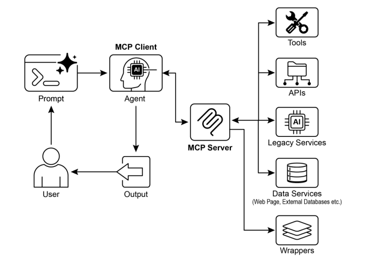

# 📚 Agentic Design Patterns (中文版)

> **提取时间**：2025-12-17 05:14:24
> **内容类型**：中文简体版本
> **总页数**：424 页
> **原始来源**：https://github.com/ginobefun/agentic-design-patterns-cn

---

# Chapter 10：Model Context Protocol | <mark>第 10 章：模型上下文协议</mark>

要让大语言模型（）成为高效的智能体， 仅具备多模态生成能力是不够的智能体还需要与外部环境交互， 比如获取实时数据调用外部软件执行具体操作模型上下文协议（， ）正是为此而生， 它为与外部资源的交互提供了标准化接口， 是实现一致可预测集成的关键机制

## MCP Pattern Overview | <mark>MCP 模式概览</mark>

想象一个通用适配器， 能让任何大语言模型（）轻松接入各种外部系统数据库或工具， 而无需为每个系统单独开发定制方案， 这正是的核心价值是一个开放标准， 统一规范了和等主流大语言模型与外部应用数据源工具之间的通信方式可以将它理解为通用连接机制， 极大简化了大语言模型获取上下文执行操作与系统交互的过程

基于客户端服务器架构运行协议明确定义了服务器如何对外提供三类核心元素： 数据（称为资源）交互模板（本质上是提示词）可执行功能（称为工具）客户端会使用这些元素， 这里的客户端可以是应用， 也可以是智能体本身这种标准化架构极大简化了将集成到不同操作环境的复杂度

不过需要认识到， 本质上是一个智能体接口的协议规范， 其实际效果很大程度上取决于底层的设计质量这里存在一个潜在风险： 开发者可能只是简单地将现有的老旧套上外壳， 而没有针对智能体的特殊需求进行优化举个例子， 假如某个票务系统的只支持逐个查询工单详情， 那么当智能体需要汇总大量高优先级工单时， 就会因为频繁调用而变得缓慢且不准确

要让智能体真正发挥效能， 底层需要针对性改进， 增加过滤排序等确定性功能， 帮助非确定性的智能体更高效工作这说明了一个重要原则： 智能体无法神奇地取代传统的确定性工作流程， 反而往往需要更强大的确定性支持才能成功

还需要注意， 虽然能够封装各种， 但这些的输入输出格式未必是智能体能够理解的一个要真正有用， 其数据格式必须对智能体友好， 而这一点协议本身无法强制保证

举个例子： 若为文档存储系统创建的服务器只返回文件， 而智能体无法解析内容， 那么这样的设计没有什么实际意义更好的做法是先构建能返回文本版本（如格式）的， 让智能体能真正读取和处理内容这揭示了一个重要原则： 设计集成时， 不能只关注连接机制， 更要深入考虑数据交换的本质， 才能确保真正的兼容性和实用性

## MCP vs. Tool Function Calling | <mark>MCP 与工具函数调用</mark>

模型上下文协议（）与工具函数调用是两种不同的技术机制， 它们都能够让大语言模型与外部能力（包括各类工具）进行交互并执行具体操作尽管这两种技术都致力于增强的能力， 使其不再局限于单纯的文本生成， 但它们在实现方法和抽象层级上存在显著差异

工具函数调用本质上是大语言模型向特定预定义工具或功能发出的直接调用请求需要说明的是， 在技术语境下， 工具和函数这两个术语通常可互换使用， 指的是同一类可执行的外部能力

这种交互模式的核心特征是一对一通信架构： 首先基于对用户意图的理解（特别是需要外部能力才能完成的请求）， 按既定格式构造调用请求； 随后， 应用程序代码接收并执行请求， 最终将结果返回给处理当前工具函数调用的具体实现往往是各平台厂商的专有方案， 不同提供商之间的实现方式和接口规范存在明显差异和不兼容性

相比之下， 是用于大语言模型发现通信和利用外部能力的标准化接口作为开放协议， 它促进了与广泛工具系统的交互， 旨在建立一个开放生态， 让任何兼容工具都可被任何兼容访问这使得不同系统可以相互连接灵活组合反复利用

通过采用这种去中心化的协作模式， 显著提高了系统互通性， 让既有服务焕发新价值这一策略的优势在于： 只需为老旧或异构服务包装一层兼容接口， 就能将它们接入现代生态这些服务继续独立运行， 但现在可以组合成新的应用和工作流， 由统一调度这种方式无需昂贵的系统重写， 就能提升整体灵活性和可重用性

以下是与工具函数调用之间基本区别的详细分析：

特性工具函数调用模型上下文协议（）
标准化程度厂商专有实现， 不同提供商采用各自的格式和实现方案开放的标准化协议， 推动不同与工具间的互操作能力
功能范围直接调用执行特定预定义功能的机制构建与外部工具发现和通信的完整框架体系
系统架构与应用工具处理逻辑间的点对点直接交互基于客户端服务器架构， 支持应用连接多种服务器
发现机制在会话上下文中静态配置可用工具列表支持工具能力的动态发现和查询机制
可复用性工具集成与特定应用和平台深度绑定推动可独立部署的服务器开发， 支持跨平台复用

可以将工具函数调用类比为一套为专门定制的工具， 比如特定的扳手和螺丝刀这种方案对执行固定任务集合的工作环境十分高效相比之下， 则类似于建立一套通用化标准化的电源接口系统本身不直接提供具体工具， 而是构建开放的基础设施， 允许任何厂商生产的兼容设备都能接入并正常工作， 从而打造一个能够动态扩展持续演进的工具生态系统

简而言之， 函数调用提供对有限特定功能的直接访问， 而则构建了标准化通信框架， 使能够发现并利用广泛的外部资源生态系统

对于功能需求简单的应用， 专用工具集已足够； 但对于需要高度适应性涉及多系统复杂交互的应用， 采用这样的通用标准协议是构建可持续演进架构的关键

## Additional considerations for MCP | <mark>MCP 的其他考虑因素</mark>

虽然框架提供了强大的功能， 但要在特定场景中充分评估其适用性， 我们还需要考虑几个关键因素让我们来详细了解一下这些方面：

工具资源提示词： 理解这些组件各自的角色很关键资源指的是静态数据（比如文件或数据库记录）， 工具则是可以执行操作的功能（比如发送邮件或调用）， 而提示词就像是指导如何与资源或工具进行交互的模板， 确保整个交互过程既规范又高效

可发现性： 的一大优势是， 客户端能够实时查询服务器， 动态获取可用的工具和资源列表这种即时发现的机制特别适合需要灵活适应新功能而无需重新部署的智能体

安全性： 无论通过什么协议开放工具和数据， 都需要完善的安全保障的实现必须包含身份验证和权限控制， 确保只有授权客户端才能访问指定服务器， 并限定其可执行的操作范围

实现： 尽管是开放标准， 但实际落地可能较为复杂好在一些厂商正在简化这个过程， 比如和等模型提供商推出的， 帮助开发者处理了大量模板代码， 让创建和连接客户端与服务器变得更轻松

错误处理： 一套完善的错误处理机制非常重要协议需要明确规定如何将各种错误情况（比如工具执行失败服务器无法连接或者请求格式有误）清晰地反馈给， 这样它才能理解问题所在， 并尝试其他的解决方案

本地远程服务器： 服务器既可以部署在智能体所在的本地机器上， 也可以放在远程服务器中本地部署通常用于追求更快响应速度和更好保护敏感数据； 远程架构则更适合需要在组织内共享工具资源支持灵活扩展的场景

按需批处理： 既支持实时交互的按需调用， 也能应对大规模的批量处理具体选择哪种方式要看实际应用需求， 可能是需要即时反馈的对话型智能体， 也可能是对数据记录进行批处理的分析流程

传输机制： 协议还定义了底层的通信传输层对于本地交互， 可以使用基于的标准输入输出来实现高效的进程间通信对于远程连接， 则采用和服务器发送事件（）等友好协议， 以实现持久高效的客户端服务器通信

采用客户端服务器模型来标准化信息流理解各组件如何交互， 是掌握高级智能体行为的关键：

大语言模型（）： 作为整个系统的智能核心， 它负责处理用户请求制定执行计划， 并判断何时需要调用外部资源或执行具体操作

客户端： 这是一个包装了的应用程序， 扮演中间人角色， 将的意图转化为符合标准的请求它的主要职责是发现可用的服务器建立连接并维护通信

服务器： 相当于通往外部世界的桥梁， 向经过授权的客户端开放一系列工具资源和提示模板每个服务器通常专注于某个特定领域， 比如对接企业内部的数据库系统邮件服务平台或者公共接口

可选的第三方服务： 这些是服务器实际管理和对接的外部工具应用或数据源， 也是最终执行具体操作的终端无论是查询专有数据库与平台进行交互， 还是调用天气获取实时数据， 都是通过这些第三方服务来完成的

核心交互流程如下：

发现阶段： 客户端会代表去查询服务器， 了解它具体提供哪些能力服务器会返回一份清单， 详细列出可用的工具（例如）资源（例如）和提示词

请求构建： 根据需求决定要使用哪个工具， 比如说想要发送邮件它会构建一个具体的请求， 明确指定要调用的工具（）以及必要的参数信息（收件人邮件主题正文内容等）

客户端通信： 客户端拿到构建好的请求后， 会按照标准格式将这个调用请求发送给对应的服务器

服务器执行： 服务器收到请求后， 会先进行客户端身份验证和请求合法性检查， 确认无误后才会通过底层软件接口（比如调用邮件的函数）来执行具体的操作

响应和上下文更新： 操作执行完成后， 服务器会按照标准格式将响应结果返回给客户端这个响应会告诉客户端操作是否成功， 并附带相关的输出信息（比如发送邮件后得到的确认编号）客户端随后将这些结果反馈给， 帮助它更新当前的任务上下文， 为下一步操作做好准备

## Practical Applications & Use Cases | <mark>实际应用场景</mark>

极大地拓展了和大语言模型的应用范围， 使其更加灵活强大以下是九个典型应用场景：

数据库集成： 通过， 和智能体能够轻松对接数据库中的结构化数据并进行交互比如借助数据库工具箱， 智能体可以直接用自然语言指令来查询数据集， 实时获取信息生成报表或者更新记录

生成式媒体编排： 让智能体能够整合各类先进的生成式媒体服务通过媒体生成工具， 智能体可以调用生成图片使用制作视频通过合成语音或利用创作音乐， 为应用提供动态内容创作能力

外部交互： 为提供了标准化的外部调用方式智能体可以获取实时天气查询股价发送邮件， 还能与系统等业务平台对接， 大幅拓展语言模型的应用范围

基于推理的信息提取： 借助强大的推理能力， 实现了比传统搜索更高效的信息提取传统搜索只能返回整篇文档， 而智能体能深入分析文本， 精准提取出直接回答用户问题的具体条款数据或关键陈述

自定义工具开发： 开发者可以基于实际需求构建专属工具， 并通过服务器（比如使用）对外开放这样就能把企业内部的专业功能或私有系统以标准化易用的方式提供给和各种智能体， 无需对本身进行任何修改

标准化通信桥梁： 在和应用程序之间建立了一个统一的通信层， 不仅降低了系统集成的复杂度， 还促进了不同提供商和应用平台之间的互操作性， 让开发复杂的智能体系统变得更加简单高效

复杂工作流编排： 通过整合多个开放的工具和数据源， 智能体能够协调执行高度复杂的多步骤工作流程例如， 它可以从数据库提取客户信息， 自动生成个性化的营销图片， 撰写定制化的邮件内容， 最后完成发送， 整个过程都是通过调用不同的服务来实现

物联网设备控制： 还可以帮助与物联网设备进行交互智能体能够通过向智能家居设备工业传感器或机器人发送控制指令， 实现对物理系统的自然语言控制和自动化管理

金融服务自动化： 在金融领域， 让能够对接各种金融数据源交易平台和合规系统智能体可以分析市场行情执行交易指令提供个性化的理财建议， 或者自动完成监管报表， 同时确保所有通信都符合安全标准和规范要求

简而言之， 让智能体能够实时获取来自数据库和网络资源的信息， 还能够通过整合处理多方数据来执行发送邮件更新记录控制设备完成复杂任务等操作此外， 还支持各类媒体生成工具， 为应用提供更丰富的能力

## Hands-On Code Example with ADK | <mark>实战示例

本节内容将演示智能体如何连接到提供文件系统操作的本地服务器， 使其能够与本地文件系统进行交互

### Agent Setup with MCPToolset | <mark>智能体设置

想要让智能体具备文件系统交互能力， 需要先创建一个文件（例如放在目录下）在对象的列表中实例化这里有个特别需要注意的地方： 记得把列表里的替换成你本地系统上一个真实存在的目录绝对路径， 而且要确保服务器有权限访问这个目录这个目录会作为智能体进行文件操作时的根目录

```python

# 创建一个可靠的绝对路径，指向与这个 agent 脚本同目录下的 'mcp_managed_files' 文件夹。

# 这样确保 agent 能够直接工作，无需修改路径配置。

# 在生产环境中，应该指向一个更持久和安全的存储位置。

# 确保目标目录在 agent 需要使用之前就存在。

# 可选

# 例如，只允许读取文件
```

（）是及更高版本内置的工具， 能够直接运行中的包， 无需全局安装它本质上是一个包运行器， 常用于运行以包形式发布的社区服务器

为了让智能体开发套件（）能够正确识别文件作为可发现的包， 我们需要创建一个文件这个文件需要和放在同一个目录下

```python
```

当然， 还有其他支持的命令可供使用例如， 可以按如下方式连接到：

```python
```

在上下文中， 是基于的命令行工具， 用于在临时隔离的环境中执行命令它允许直接运行工具和包， 无需全局安装或影响项目环境， 并可通过服务器调用

```python
```

现在服务器已经搭建完成， 下一步就是建立连接了

### Connecting the MCP Server with ADK Web | <mark>使用 ADK Web 连接 MCP 服务器</mark>

首先， 执行在终端中导航到的父目录（例如）并运行：

```bash
```

等浏览器里显示出的操作界面后， 从智能体菜单里选择接下来你可以试试下面这些指令：

- <mark>「显示此文件夹的内容。」</mark>
- <mark>「读取 <code>sample.txt</code> 文件。」（假设 <code>sample.txt</code> 位于 <code>TARGET_FOLDER_PATH</code>。）</mark>
- <mark>「<code>another_file.md</code> 里有什么？」</mark>

## Creating an MCP Server with FastMCP | <mark>使用 FastMCP 创建 MCP 服务器</mark>

是一个专门为简化服务器开发而设计的高级框架它通过提供抽象层来封装协议的复杂性， 让开发者能够把精力集中在核心业务逻辑上

这个库最大的特点是可以用简单的装饰器来快速定义工具资源和提示模板特别值得一提的是它的模式自动生成功能， 它会智能地解析函数的签名类型注解和文档字符串， 自动生成模型所需的接口规范， 这种自动化机制大大减少了手动配置的工作量， 也降低了出错的可能性

除了基础的工具创建功能， 还支持像服务器组合和代理这样的高级架构模式这意味着你可以用模块化的方式开发复杂的多组件系统， 还能把现有的服务无缝对接到可访问的框架里另外， 还内置了对高效分布式可扩展的驱动应用的优化支持

### Server setup with FastMCP | <mark>使用 FastMCP 设置服务器</mark>

举个简单的例子， 假设服务器提供了一个基础的问候功能等服务器启动运行后， 智能体和其他客户端就能通过协议来调用这个功能了

```python

# 这个脚本演示了如何使用 FastMCP 创建一个简单的 MCP 服务器。

# 它暴露了一个名为 'greet' 的工具，用于生成个性化问候语。

# 确保你已经安装了 FastMCP

# 初始化 FastMCP 服务器。

# 这个装饰器将 greet 函数注册为 MCP 工具。

# 函数的注释将成为 LLM 看到的工具描述。

# 或
```

这个脚本定义了一个名为的函数， 根据人名生成个性化问候语函数上方的装饰器会自动将其注册为或其他程序可调用的工具利用函数的注释以及类型注解， 自动告知智能体工具的使用方法所需参数和返回结果

运行此脚本时， 会启动一个服务器， 在监听请求这样函数就成为可通过网络访问的服务我们可以配置智能体连接到此服务器， 在完成复杂任务的过程中调用问候功能服务器将持续运行， 直到手动停止

### Consuming the FastMCP Server with an ADK Agent | <mark>使用 ADK 智能体连接 FastMCP 服务器</mark>

可以将智能体配置为客户端， 使其能够使用正在运行的服务器具体做法是用服务器的网络地址（通常是）来配置

还可以添加参数， 限制智能体只能使用服务器提供的特定工具， 比如问候功能当用户发出问候这样的请求时， 智能体内置的大语言模型会识别通过可用的工具， 用作为参数调用， 最后将服务器响应返回给用户这展示了如何将通过暴露的自定义工具集成到智能体

要实现这样的配置， 我们需要准备一个智能体配置文件（比如放在目录下的）这个文件会创建一个智能体实例， 并通过来和正在运行的服务器建立连接

```python

# 定义 FastMCP 服务器的地址。

# 确保 fastmcp_server.py（前面定义的）正在这个端口上运行。

# 可选

# 例如，只允许读取文件
```

该脚本定义了一个名为的智能体， 基于模型智能体被设定为友好助手， 专门负责问候用户代码为其配备了执行任务所需的工具配置连接到运行在的独立服务器， 即前面示例中的服务器智能体被授权使用该服务器上的问候工具这段代码搭建了系统的客户端部分， 创建了一个明确任务目标并知晓所需外部工具的智能体

需要在目录下创建一个文件， 以确保能将智能体识别为可发现的包

具体操作步骤： 首先打开新终端窗口， 运行启动服务器然后在终端中进入的上级目录（例如）， 执行命令待浏览器显示界面后， 从智能体菜单中选择此时可输入问候这样的指令进行测试， 智能体将调用服务器上的工具生成响应

## At a Glance | <mark>要点速览</mark>

问题所在： 要让大语言模型真正成为有效的智能体， 它们不能只停留在文本生成层面， 还需要具备与外部环境交互的能力， 既能获取实时数据， 又能调用外部软件如果没有统一的通信标准， 每次把大语言模型和外部工具或数据源对接都要从头定制开发， 既复杂又难以复用这种临时凑合的做法严重限制了系统的扩展性， 也让构建复杂互联的系统变得异常困难和低效

解决之道： 模型上下文协议（）提供了一个标准化的解决方案， 它就像是大语言模型和外部系统之间的通用接口这个开放的标准化协议明确定义了如何发现和使用外部能力采用客户端服务器架构， 让服务器能够向所有兼容的客户端提供工具数据资源和交互提示由大语言模型驱动的应用作为客户端， 可以按需发现并使用这些资源， 整个过程都是可预测的这种标准化方式促成了一个可互操作可复用组件的生态系统， 大大简化了复杂智能体工作流的开发难度

经验法则： 当你需要构建复杂可扩展的企业级智能体系统， 而且这些系统要和各种各样的外部工具数据源打交道时， 就应该考虑使用协议特别是在不同大语言模型和工具之间的互操作性很重要， 或者智能体需要动态发现新功能而不用重新部署的情况下， 是最佳选择但如果你的应用比较简单， 只需要调用有限几个固定功能， 那直接用工具函数调用可能就够用了

**Visual summary** | <mark><strong>可视化总结</strong></mark>



图： 模型上下文协议

## Key Takeaways | <mark>核心要点</mark>

以下是核心要点：

模型上下文协议（）是一个开放标准， 它为大语言模型和外部应用数据源工具之间的通信提供了统一的规范

这个协议采用客户端服务器架构， 明确定义了如何对外提供和使用各种资源提示模板和工具

智能体开发套件（）既支持连接现有的服务器， 也支持把里的工具通过服务器对外提供

这个框架让服务器的开发和管理变得更简单， 特别适合把用写的工具封装成服务

通过媒体生成服务工具， 智能体可以很方便地调用的各种生成式媒体能力， 比如和

让大语言模型和智能体不再局限于文本生成， 而是能够真正与现实世界系统交互， 获取动态信息， 执行具体操作

## Conclusion | <mark>结语</mark>

模型上下文协议（）是一个开放标准， 它为大语言模型和外部系统之间的通信提供了一套通用规范这个协议采用客户端服务器架构， 使能够通过标准化工具访问资源利用提示词并执行操作允许与数据库交互管理生成式媒体工作流控制物联网设备以及自动化金融服务实际示例演示了设置智能体与服务器通信， 包括文件系统服务器和使用构建的服务器， 说明了其与智能体开发套件（）的集成是开发扩展到基本语言能力之外的交互式智能体的关键组件

## References | <mark>参考文献</mark>

模型上下文协议（）文档（最新版本）

文档

媒体生成服务工具

数据库工具文档（最新版本）