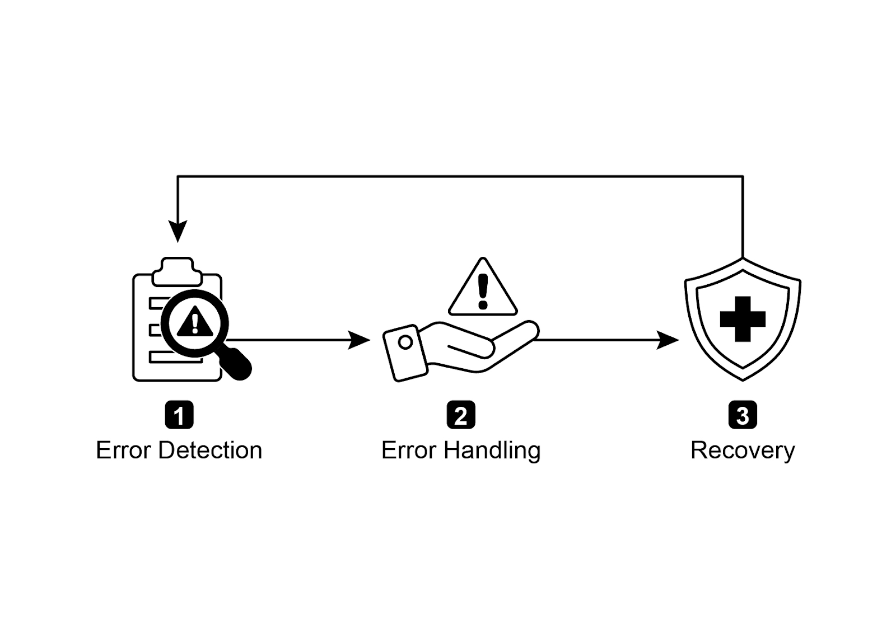
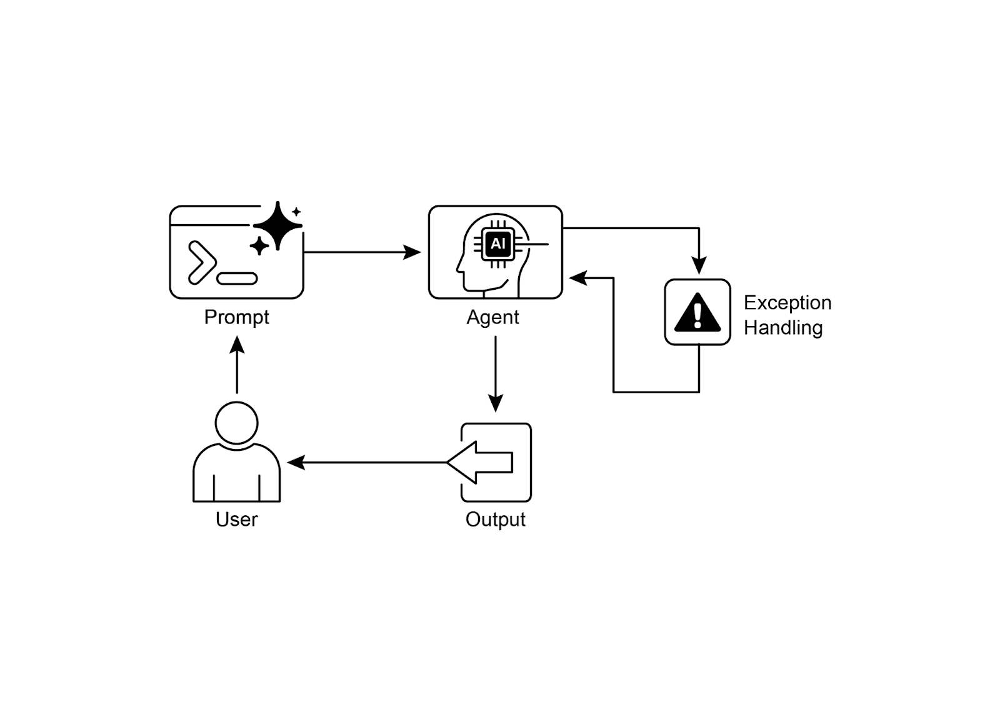

# 📚 Agentic Design Patterns (中文版)

> **提取时间**：2025-12-17 05:14:24
> **内容类型**：中文简体版本
> **总页数**：424 页
> **原始来源**：https://github.com/ginobefun/agentic-design-patterns-cn

---

# Chapter 12：Exception Handling and Recovery | <mark>第 12 章：异常处理与恢复</mark>

为使智能体（）能够在多样化的现实环境中可靠运行， 它们必须具备管理突发状况错误和故障的能力正如人类能适应意外的障碍， 智能体（）也需要强大的系统来检测问题启动恢复程序， 或者至少确保可控的失败这项基本要求构成了异常处理与恢复模式的基础

该模式专注于开发具有出色的耐用性和韧性的智能体， 使其在面对各种困难和异常时仍能保持不间断的功能和操作完整性它强调主动准备和被动响应策略的重要性， 以确保即使在面临挑战时也能持续运行这种适应能力对于智能体在复杂且不可预测的环境中成功运行至关重要， 最终能提升它们的整体效能和可信赖度

处理意外事件的能力确保了系统能够智能且稳定可靠， 从而让人们对其部署和性能抱有更大信心集成全面的监控和诊断工具， 进一步增强了智能体快速识别和解决问题的能力， 防止潜在的中断， 并确保在不断变化的条件中更平稳地运行这些先进系统对于维护操作的完整性和效率至关重要， 增强了它们管理复杂性和不可预测性的能力

此模式有时可以与反思模式结合使用例如， 如果初次尝试失败并引发异常， 反思过程可以分析该失败， 并采用更完善的方法（如改进提示词）重新尝试任务， 以解决错误

# Exception Handling and Recovery Pattern Overview | <mark>异常处理与恢复模式概述</mark>

异常处理与恢复模式解决了智能体管理运行故障的需求该模式涉及预测潜在问题（如工具错误或服务不可用）并制定缓解策略这些策略可能包括错误日志记录重试回退优雅降级和通知此外， 该模式还强调了恢复机制（如状态回滚诊断自我纠正和上报升级）， 以使智能体恢复到稳定运行状态实施此模式可增强智能体的可靠性和鲁棒性， 使其能够在不可预测的环境中运行实际应用示例包括： 聊天机器人管理数据库错误交易机器人处理金融错误， 以及智能家居智能体解决设备故障该模式确保智能体在遇到复杂情况和失败时仍能继续有效运行


图： 智能体异常处理与恢复的关键组件

错误检测： 这一环节需要细致地识别运行中出现的问题具体可能表现为工具输出的无效或格式错误特定错误（如或状态码）服务或响应时间异常延长， 以及偏离预期格式的混乱无意义响应此外， 系统还可能部署其他智能体或专用监控系统进行更主动的异常监测， 从而在潜在问题升级前及时捕捉它们

错误处理： 一旦检测到错误， 必须制定周密的响应计划这包括在日志中详细记录错误详情以便后续调试和分析（日志记录）重试操作或请求（有时会稍作调整参数）可能是一种可行的策略， 特别是对于瞬时错误（重试）
采用替代策略或方法（回退机制）可确保部分功能保持运行当无法立即完全恢复时， 智能体可维持部分功能以提供基础服务（优雅降级）最后， 对于需要人工干预的情况， 向操作人员或其他智能体发出警报（通知机制）可能成为关键措施

恢复： 该阶段旨在将智能体或系统恢复到稳定且可运行的状态这可能涉及撤销最近的更改或事务， 以消除错误的影响（状态回滚）深入调查错误原因是防止再次发生的关键可能需要通过自我纠正机制或重新规划过程， 调整智能体的计划逻辑或参数， 以避免将来出现相同错误在复杂或严重的情况下， 将问题上报给人工操作员或更高级系统（升级处理）可能是最佳解决方案

实施这种健壮的异常处理和恢复模式， 可以将智能体从脆弱不可靠的系统转变为强大可靠的组件， 能够在充满挑战和高度不可预测的环境中有效且有韧性地运行这确保了智能体即使在面临意外状况时也能保持功能最大限度地减少停机时间， 并提供无缝可靠的体验

# Practical Applications & Use Cases | <mark>实际应用与用例</mark>

对于部署在真实世界场景中的任何智能体而言， 都无法保证有完美的条件， 因此异常处理与恢复也至关重要

- <mark><strong>客户服务聊天机器人：</strong>如果聊天机器人在尝试访问客户数据库时数据库暂时宕机，它不应直接崩溃。相反，它应该检测到 API 错误，告知用户临时问题，或许建议稍后再试，或将查询上报给人工客服。</mark>

- <mark><strong>自动化金融交易：</strong>交易机器人在尝试执行交易时可能会遇到「资金不足」或「市场休市」的错误。它需要通过记录错误来处理这些异常，而不是重复尝试相同的无效交易，并可能通知用户或调整其策略。</mark>

- <mark><strong>智能家居自动化：</strong>控制智能灯具的智能体可能由于网络问题或设备故障而无法打开灯。它应该检测到此故障，或许进行重试，如果仍不成功，则通知用户灯无法打开，并建议手动干预。</mark>

- <mark><strong>数据处理智能体：</strong>负责处理一批文档的智能体可能会遇到损坏的文件。它应该跳过损坏的文件，而不是中止整个过程，同时记录错误，继续处理其他文件，并在最后报告跳过的文件。</mark>

- <mark><strong>网页抓取智能体：</strong>当网页抓取智能体遇到 CAPTCHA、网站结构变更或服务器错误（例如，404 Not Found、503 Service Unavailable）时，它需要优雅地处理这些情况。这可能包括暂停、使用代理或报告失败的具体 URL。</mark>

- <mark><strong>机器人与制造：</strong>执行装配任务的机械臂可能由于未对准而抓取组件失败。它需要检测到此故障（例如，通过传感器反馈），尝试重新调整，重试抓取，如果仍然失败，则提醒人类操作员或切换到其他组件。</mark>

简而言之， 要构建一个不仅智能， 还能在面对现实世界的复杂性时， 能够可靠有韧性且用户友好的智能体， 该模式就其基础

# Hands-On Code Example (ADK) | <mark>使用 ADK 的实战代码</mark>

异常处理和恢复对于系统的鲁棒性和可靠性至关重要例如， 当智能体调用工具失败时， 此类失败可能源于不正确的工具输入， 或工具所依赖的外部服务出现问题

```python

```

此代码使用的及三个子智能体（）定义了一个强大的位置检索系统是第一个智能体， 尝试使用工具获取精确的位置信息充当备用智能体， 通过检查状态变量来判断主要查询是否失败如果主要查询失败， 备用智能体将从用户查询中提取城市信息， 并使用工具是序列中的最后一个智能体它负责审查存储在状态中的位置信息该智能体将向用户清晰地呈现最终结果如果未找到位置信息， 它会向用户致歉确保这三个智能体按预定顺序执行这种结构为位置信息检索提供了一种分层的方法

# At a Glance | <mark>要点速览</mark>

问题所在： 在现实环境中运行的智能体不可避免地会遇到无法预见的情况错误和系统故障这些干扰范围很广， 从工具故障网络问题到无效数据， 威胁着智能体完成任务的能力如果没有结构化的方法来管理这些问题， 智能体在面对意外障碍时可能会变得脆弱不可靠， 并容易完全失效这种不可靠性， 使得要将它们部署在对性能一致性要求极高的关键或复杂应用中变得困难

解决之道： 异常处理与恢复模式为构建强大且有弹性的智能体提供了标准化的解决方案它使智能体具备了预测管理和从操作失败中恢复的智能体式（）能力该模式涉及主动错误检测（例如监控工具输出和响应）和被动处理策略（例如用于诊断的日志记录瞬时故障的重试或使用回退机制）对于更严重的问题， 它定义了恢复协议， 包括恢复到稳定状态通过调整计划进行自我纠正， 或将问题上报给人类操作员这种系统化的方法确保智能体能够保持操作完整性， 从失败中学习， 并在不可预测的环境中可靠地运行

经验法则： 任何部署在动态真实世界环境且对操作可靠性要求极高的智能体， 在这些场景中可能遭遇系统故障工具错误网络问题或不可预测的输入

# Visual Summary | <mark>可视化总结</mark>



图： 异常处理模式

# Key Takeaways | <mark>核心要点</mark>

需要记住的关键点：

- <mark>「异常处理与恢复」对于构建强大且可靠的智能体至关重要。</mark>

- <mark>此模式涉及检测错误、优雅地处理错误以及实施恢复策略。</mark>

- <mark>错误检测涉及验证工具输出、检查 API 错误代码以及使用超时机制。</mark>

- <mark>处理策略包括日志记录、重试、回退、优雅降级和通知。</mark>

- <mark>故障恢复专注于通过诊断、自我纠正或上报来恢复稳定运行。</mark>

- <mark>此模式确保智能体即使在不可预测的现实世界环境中也能有效运行。</mark>

# Conclusion | <mark>结语</mark>

本章探讨了异常处理与恢复模式， 这对于开发健壮且可靠的智能体至关重要该模式阐述智能体如何识别和管理意外问题生成适当响应并恢复到稳定操作状态本章讨论了该模式的各个方面， 包括错误检测通过日志记录重试和回退等机制来处理这些错误， 以及使智能体或系统恢复正常功能的策略通过几个领域的实际应用展示了异常处理与恢复模式在处理现实世界复杂性和潜在故障方面的相关性这些应用表明， 为智能体配备异常处理能力有助于提高在动态环境中的可靠性和适应性

# References | <mark>参考文献</mark>

代码大全（第版）微软出版社

迈向多智能体强化学习的容错性预印本

利用智能迁移提高异构多智能体物联网系统的容错性和可靠性
