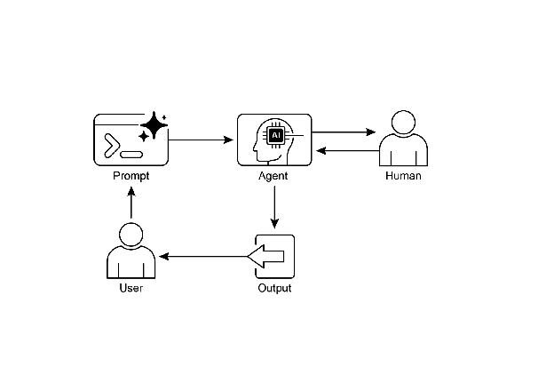

# 📚 Agentic Design Patterns (中文版)

> **提取时间**：2025-12-17 05:14:24
> **内容类型**：中文简体版本
> **总页数**：424 页
> **原始来源**：https://github.com/ginobefun/agentic-design-patterns-cn

---

# Chapter 13：Human-in-the-Loop | <mark>第 13 章：人机协同</mark>

人机协同（， ， 即人类在决策环路中直接参与）模式代表了智能体开发和部署中的一项关键策略它有意地将人类认知的独特优势（如判断力创造力和细致入微的理解力）与的计算能力和效率结合起来这种战略性整合不仅仅是一种选择， 而且往往是一种必需， 尤其是当系统日益深入地嵌入到关键决策过程中时

人机协同的核心原则是确保在道德约束下运行， 遵守安全协议， 并以最佳效率实现其目标这些考量在具有复杂性模糊性或重大风险的领域尤为重要， 因为在这些领域， 的错误或误解可能带来严重后果在这种情况下， 完全自主（即系统在没有任何人工干预的情况下独立运行）往往是不明智的人机协同模式承认这一现实， 并强调即使技术日新月异， 人类的监督战略性输入和协作互动仍然不可或缺

人机协同方法从根本上围绕着人工智能与人类智能之间的协同作用展开人机协同模式并不将视为人类工作者的替代品， 而是将其定位为一种增强和提升人类能力的工具这种增强可以采取多种形式， 从自动化常规任务到提供数据驱动的洞察以辅助人类决策最终目标是创建一个协作生态系统， 使人类和智能体都能利用各自的独特优势， 实现任何一方都无法单独取得的成果

在实践中， 人机协同模式可以通过多种方式实现一种常见的方法是让人类担任验证者或审查者， 检查的输出以确保准确性并识别潜在错误另一种实现方式是让人类主动引导的行为， 实时提供反馈或进行纠正在更复杂的设置中， 人类可以作为合作伙伴与协作， 通过交互式对话或共享界面共同解决问题或制定决策无论具体实现方式如何， 人机协同模式都强调了保持人类控制和监督的重要性， 确保系统始终与人类的伦理价值观目标和社会期望保持一致

## Human-in-the-Loop Pattern Overview | <mark>人机协同模式概述</mark>

人机协同（）模式将人工智能与人类输入相结合， 以增强智能体的能力这种方法认为， 最佳的性能往往需要自动化处理与人类洞察力的结合， 尤其是在具有高度复杂性或伦理考量的场景中人机协同模式并非取代人类输入， 而是通过确保关键判断和决策基于人类理解， 从而增强人类的能力

人机协同模式包含几个关键方面： 人类监督（）， 涉及监控智能体的性能和输出（例如， 通过日志审查或实时仪表板）， 以确保其遵守准则并防止不良后果当智能体遇到错误或模糊场景时， 需要干预与纠正， 此时智能体可能请求人类干预； 人类操作员可以纠正错误提供缺失数据或指导智能体， 这也有助于智能体未来的改进用于学习的人类反馈（）被收集并用于优化模型， 这在诸如基于人类反馈的强化学习（）等方法中尤为突出， 其中人类偏好直接影响智能体的学习轨迹决策增强（）是指智能体向人类提供分析和建议， 由人类做出最终决定， 通过生成的洞察力来增强人类决策， 而非完全自主人机协作（）是一种合作互动， 人类和智能体各自贡献其优势； 常规数据处理可能由智能体负责， 而创造性问题解决或复杂谈判则由人类管理最后， 上报策略（）是既定的协议， 规定了智能体应在何时以及如何将任务上报给人类操作员， 以防止在超出智能体能力的情况下出错

实施人机协同模式使得智能体能够在不允许或不可行完全自主的敏感行业中得到应用它还通过反馈循环提供了一种持续改进的机制例如， 在金融领域， 大额企业贷款的最终批准需要人类信贷员来评估领导者品格等定性因素同样， 在法律领域， 正义和问责的核心原则要求人类法官对量刑等涉及复杂道德推理的关键决策保留最终决定权

注意事项： 尽管人机协同模式有其好处， 但它也存在一些显著的注意事项， 其中最主要的是缺乏可扩展性虽然人类监督能提供高准确性， 但操作员无法管理数百万个任务， 这就需要进行权衡， 通常使用一种混合方法， 将自动化用于规模化， 将人机协同模式用于保证准确性此外， 该模式的有效性在很大程度上取决于人类操作员的专业知识； 例如， 虽然可以生成软件代码， 但只有熟练的开发人员才能准确识别细微错误并提供正确的指导来修复它们这种对专业知识的需求也适用于使用人机协同模式生成训练数据时， 因为人类标注者可能需要接受专门培训， 以学习如何纠正才能产生高质量的数据最后， 实施人机协同模式会引发严重的隐私问题， 因为敏感信息在暴露给人类操作员之前通常必须经过严格的匿名化处理， 这又增加了一层流程复杂性

## Practical Applications & Use Cases | <mark>实际应用与用例</mark>

人机协同模式在众多行业和应用中都至关重要， 特别是在那些对准确性安全性伦理或细致入微的理解有极高要求的领域

内容审核： 智能体可以快速过滤海量内容， 筛查违规行为（例如仇恨言论或垃圾信息）然而， 一些模棱两可或处于边缘地带的内容需要上报给人类审核员进行审查并做出最终决定， 以确保细致入微的判断和遵守复杂的政策

自动驾驶： 虽然自动驾驶汽车能自主处理大多数驾驶任务， 但在无法自信应对的复杂不可预测或危险情况下（例如极端天气或异常路况）， 需要将控制权交还给人类驾驶员

金融欺诈检测： 系统可以根据模式标记可疑交易但是， 高风险或模棱两可的警报通常会发送给专业分析师， 由他们进行深入调查联系客户， 并最终确定交易是否具有欺诈性

法律文件审查： 可以快速扫描和分类数千份法律文件， 以识别相关条款或证据接着， 对于关键案件， 还需要专业法律人士审查的发现， 核实其准确性上下文和法律含义

客户支持（复杂咨询）： 聊天机器人可以处理常规的客户咨询如果用户的问题过于复杂情绪过于激动， 或者需要无法提供的情感共鸣时， 需要将对话转接给服务专家进行处理

数据标注： 模型通常需要大量标注数据进行训练为确保准确标注图像文本或音频， 人类需要参与到这个过程中， 为提供学习所需的真实值（）随着模型的发展， 这是一个持续的过程

生成式优化： 当使用大语言模型生成创意内容（例如营销文案或设计理念）时， 专业编辑或设计师会审查和优化输出， 确保其符合品牌准则， 能与目标受众产生共鸣， 并确保输出内容的质量

自治网络： 系统能够利用关键性能指标（）和已识别的模式来分析警报预测网络问题和流量异常然而， 一些关键的决策（例如处理高风险警报）经常被上报给专业分析师这些分析师会进行进一步调查， 并决定是否批准网络变更

该模式展示了一种实用的实施策略它利用来提高可扩展性和效率， 同时保持人类监督， 以确保质量安全和伦理合规性

人机监督（， 即人类在环路之上监督并设定策略）是该模式的另一种变体， 其中人类专家负责定义总体策略， 然后由处理即时操作以确保合规性我们来看两个具体的例子：

自动化金融交易系统： 在此场景中， 人类金融专家设定总体投资策略和规则例如， 人类可能定义策略为： 保持科技股和债券的投资组合， 对任何单一公司的投资不超过， 并在任何股票价格低于其购买价时自动卖出然后， 实时监控股票市场， 在这些预定义条件满足时立即执行交易正在基于人类操作员设定的较慢更具战略性的策略来处理即时高速的行动

现代化呼叫中心： 在此场景中， 经理为客户互动建立高级策略例如， 经理可能设定规则， 如任何提到服务中断的电话应立即转接给技术支持专员， 或者如果客户的语气表现出高度沮丧， 系统应主动提出将他们转接给人工坐席然后， 系统会处理最初的客户互动， 实时倾听并解释他们的需求它通过即时转接电话或提供上报选项来自主执行经理的策略， 而无需为每个个案都进行人工干预这使得能够根据人类操作员提供的较慢战略性的指导来管理大量的即时行动

## Hands-On Code Example | <mark>实战代码示例</mark>

为了演示人机协同模式， 智能体可以识别需要人工审查的场景并发起上报流程这允许在智能体的自主决策能力有限或需要复杂判断的情况下进行人工干预这不是一个孤立的功能； 其他流行的框架也采用了类似的功能例如， 也提供了实现此类交互的工具

```python

# 占位符，用于替换实际的工具实现

# 模拟转交给专家处理

# 获取客户信息

```

此代码提供了使用的框架来创建一个围绕人机协同框架设计的技术支持智能体该智能体作为智能的第一道防线， 配置了具体指令， 并配备了像和这样的工具来管理完整的支持工作流上报工具是人机协同设计的核心部分， 确保复杂或敏感的案例被转交给人类专家

该架构的一个关键特性是通过专用回调函数实现的深度个性化能力在使用大语言模型之前， 该函数会从智能体的状态中动态检索客户特定数据， 例如他们的姓名等级和购买历史然后， 此上下文作为系统消息被注入到提示中， 使智能体能够提供高度定制化和信息充分的并引用用户历史的回复通过将结构化工作流与必要的人类监督和动态个性化相结合， 此代码展示了如何使用开发复杂且强大的支持解决方案的实践范例

## At a Glance | <mark>要点速览</mark>

问题背景（）： 系统， 包括先进的大语言模型， 在处理需要细致入微的判断伦理推理或对复杂模糊上下文有深刻理解的任务时往往力不从心在事关重大的场景使用完全自主的会带来巨大风险， 因为错误可能导致严重的安全财务或伦理后果这些系统缺乏人类所拥有的内在创造力和常识性推理能力因此， 在关键决策过程中完全依赖自动化通常是不明智的， 并且可能损害系统的整体有效性和可信度

模式价值（）： 人机协同（）模式通过将人类监督战略性地整合到工作流中， 提供了一种标准化的解决方案这种自主式方法创建了一种共生伙伴关系， 其中处理计算密集型任务和数据处理， 而人类则提供关键的验证反馈和干预通过这样做， 人机协同模式确保的行动与人类价值观和安全协议保持一致这种协作框架不仅降低了完全自动化的风险， 而且通过不断从人类输入中学习来增强系统的能力最终， 这会带来更稳健准确和合乎伦理的结果， 这是人类或任何一方都无法单独实现的

经验法则： 当在医疗金融或自动驾驶系统等错误会带来严重安全伦理或财务后果的领域使用时， 请使用此模式对于涉及大语言模型（）无法可靠处理的模糊性和细微差别的任务（如内容审核或复杂的客户支持上报）， 该模式至关重要另外， 当目标是利用高质量人工标注的数据持续改进模型， 或优化生成式的输出以满足特定质量标准时， 也应采用人机协同模式

**Visual summary** | <mark>**可视化总结：**</mark>



图： 人机协同设计模式

## Key Takeaways | <mark>核心要点</mark>

核心要点包括：

人机协同（）将人类的智能和判断力整合到工作流中

它对于复杂或高风险场景下的安全性伦理性和有效性至关重要

关键方面包括人类监督干预用于学习的反馈以及决策增强

上报策略对于智能体了解何时应转交给人类至关重要

人机协同模式实现了负责任的部署并持续改进

人机协同模式的主要缺点是其固有的可扩展性不足（在准确性和处理量之间造成了权衡）以及它对高技能领域专家进行有效干预的依赖

其实施带来了运营上的挑战， 包括需要培训人类操作员以生成数据， 以及需要通过匿名化敏感信息来解决隐私问题

## Conclusion | <mark>结语</mark>

本章探讨了至关重要的人机协同（）模式， 强调了其在创建稳健安全和合乎伦理的系统中的作用我们讨论了将人类监督干预和反馈整合到智能体工作流中如何能显著提高其性能和可信度， 尤其是在复杂和敏感的领域实际应用展示了人机协同模式的广泛效用， 从内容审核医疗诊断到自动驾驶和客户支持实战代码让我们了解如何通过上报机制促进这些人机交互随着能力的不断进步， 人机协同模式仍然是负责任发展的基石， 确保人类价值观和专业知识始终处于智能系统设计的核心

## References | <mark>参考文献</mark>

机器学习中的人机协同综述，
