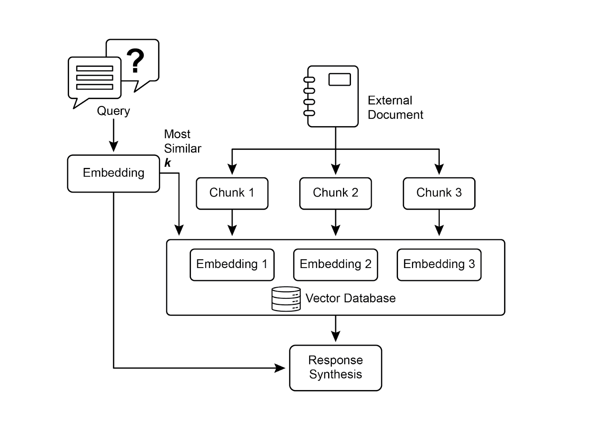
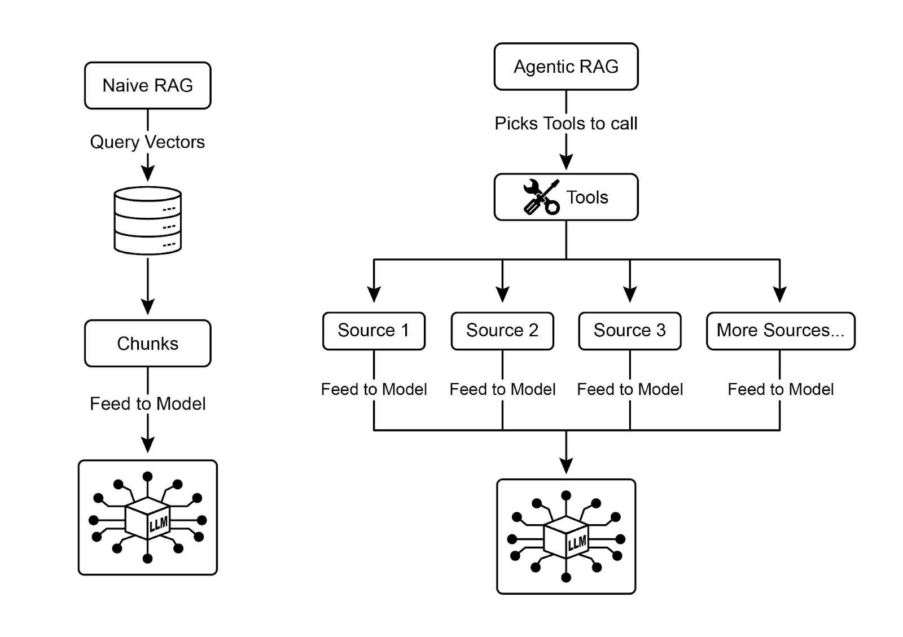
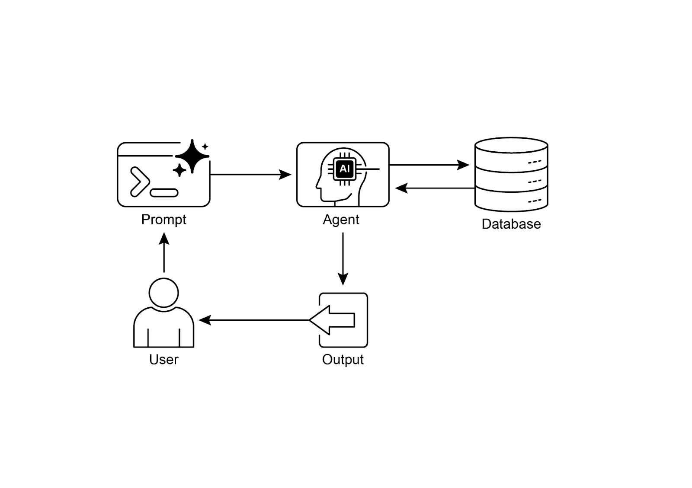
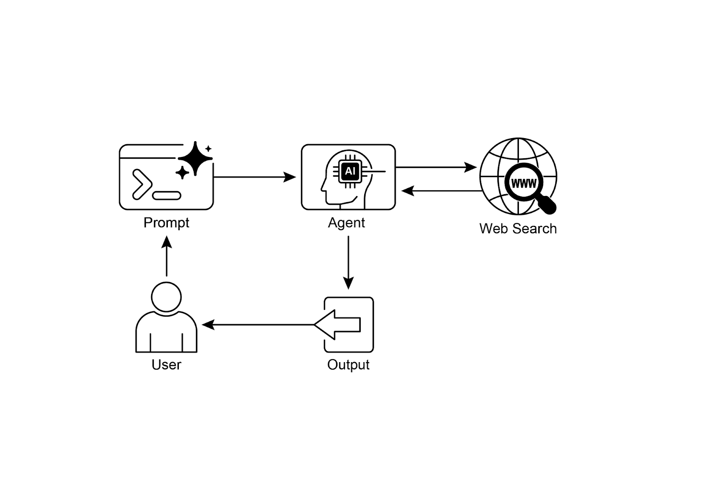

# 📚 Agentic Design Patterns (中文版)

> **提取时间**：2025-12-17 05:14:24
> **内容类型**：中文简体版本
> **总页数**：424 页
> **原始来源**：https://github.com/ginobefun/agentic-design-patterns-cn

---

# Chapter 14：Knowledge Retrieval (RAG) | <mark>第 14 章：知识检索（RAG）</mark>

大语言模型（）在生成类人文本方面表现出强大的能力然而， 它们的知识库通常受限于其训练数据， 而这限制了它们获取实时信息特定的公司数据或高度专业化细节的能力知识检索（， 即检索增强生成）解决了这一限制使能够访问并整合外部的当前的特定上下文的信息， 从而增强其输出的准确性相关性和事实基础

对于智能体而言， 这一点至关重要， 因为它允许智能体将其行动和响应建立在实时的可验证的数据之上， 而不仅仅是静态的训练数据这种能力使它们能够准确地执行复杂任务， 例如访问最新的公司政策以回答特定问题， 或在下单前检查当前库存通过整合外部知识， 将智能体从简单的对话者转变为高效的数据驱动工具， 并能够执行有意义的工作

---

## Knowledge Retrieval (RAG) Pattern Overview | <mark>知识检索（RAG）模式概述</mark>

知识检索（）模式通过在生成响应前授予访问外部知识库的权限， 从而显著增强其能力允许查找信息， 而不是仅仅依赖其内部的预训练的知识， 就像人类可能查阅书籍或搜索互联网一样这一过程使能够提供更准确最新且可验证的答案

当用户向带的系统提出问题或发出提示词（）时， 该查询不会直接发送给相反， 系统首先会搜索一个庞大的外部知识库一个高度组织的文档数据或网页库以获取相关信息这种搜索不是简单的关键字匹配， 而是一种能理解用户意图和言语背后含义的语义搜索初步搜索会提取出最相关的信息片段或信息块这些提取出的片段随后被增强或添加到原始中， 创建出一个内容更丰富信息更全面的查询最后， 这个增强后的被发送给借助这些检索数据提供的附加上下文， 能够生成一个流畅自然且有事实依据的响应

框架带来了几项显著优势它允许访问最新信息， 从而克服了其静态训练数据的限制这种方法将响应建立在可验证数据的基础之上， 降低了幻觉（即生成虚假信息）的风险此外， 还可以利用公司内部文档或中的专业知识该过程的关键优势是能够提供引用， 指明信息的具体来源， 从而增强响应的可信度和可验证性

为了全面理解的工作原理， 必须掌握几个核心概念（见图）：

嵌入（）： 在的语境中， 嵌入是以数字形式表示文本， 例如词语短语或整个文档这些表示以向量（即数字的列表）的形式存在其核心思想是在一个数学空间中捕捉不同文本片段之间的语义含义和关系含义相近的词语或短语， 其嵌入在向量空间中的距离也更近例如， 在一个简单的二维图表中， （猫）一词可能由坐标表示， 而（小猫）也会位于非常接近的相比之下， （小汽车）一词的坐标则可能在很远的位置， 如， 反映了其不同的含义实际上， 这些嵌入存在于维度高得多的空间中， 拥有数百甚至数千个维度， 从而能够对语言有非常细致的理解

文本相似度： 文本相似度是衡量两段文本相似程度的指标既可以是表层的词语重叠度（词汇的相似度）， 也可以是更深层次的基于含义的相似度语境下的文本相似度对于在知识库中找到与用户查询最相关的信息至关重要

例如， （法国的首都是哪里？ ）和（哪个城市是法国的首都？ ）这两个句子， 虽然措辞不同， 但问的是同一个问题一个好的文本相似度模型会识别到这一点， 并给予这两个句子很高的相似度得分， 即使它们只有少数几个相同的词通常这就是通过计算文本的嵌入来实现的

语义相似度与距离： 语义相似度是一种更高级的文本相似度形式， 它纯粹关注文本的含义和上下文， 而不仅仅是所用的词语其目标是理解两段文本是否传达了相同的概念或思想语义距离与语义相似度相反； 高语义相似度意味着低语义距离， 反之亦然在中， 语义搜索依赖于找到与用户查询语义距离最小的文档

例如， 和除了之外没有共同的词语然而， 一个理解语义相似度的模型会识别出它们指的是同一事物， 并认为它们高度相似这是因为它们的嵌入在向量空间中会非常接近， 表明语义距离很小， 这正是智能搜索的体现有了它， 即使在用户的措辞与知识库中的文本不完全匹配时， 也能找到相关信息



图： 核心概念： 分块嵌入和向量数据库

文档分块： 分块是将大型文档分解成更小更易于管理的小块或块（）的过程为了让系统高效工作， 不能将整个大型文档输入给， 而是处理这些较小的块文档的分块方式对于保留信息的上下文和含义非常重要

例如， 一份页的用户手册不会被其视为一整块文本， 分块策略会将其分解为章节段落甚至句子比如， 故障排除章节将与安装指南分为不同的块当用户询问特定问题时， 系统就会检索到与故障排除最相关的块， 而不是整本手册这使得检索过程更快， 提供给的信息也更聚集更贴合用户的即时需求

文档分块后， 系统必须采用检索技术来为特定的查询找到最相关的片段主要方法是向量搜索， 它利用嵌入和语义距离来寻找与用户问题具有相似概念的块是另一种较早但仍有价值的技术， 它是一种基于关键字的算法， 不能理解语义， 仅根据词频对块进行排序为了兼得两者之长， 通常会采用混合搜索方法， 将的关键字精度与语义搜索的上下文理解相结合这种融合实现了更稳健与准确的检索， 既能捕捉字面的匹配， 又能把握概念的相关性

向量数据库： 向量数据库是一种专门用于高效存储和查询嵌入的专用类型数据库在文档被分块并转换为嵌入后， 这些高维向量被存储在向量数据库中传统的检索技术， 如基于关键字的搜索， 善于查找到包含查询中出现确切词语的文档， 但缺乏对语言的深入理解它们无法识别出毛茸茸的猫科动物伴侣就是猫的意思， 而这正是向量数据库的优势所在它们专为语义搜索而构建通过将文本存储为数字向量， 它们可以根据概念含义来查找结果， 而非仅仅依赖关键字重叠

当用户的查询也被转换为向量时， 数据库会使用高度优化的算法（如）快速在数百万个向量中搜索， 并找到在含义上最接近的向量这种方法对来说要优越得多， 因为即使在用户的措辞与源文档完全不同的情况下， 它也能发现相关上下文本质上， 其他技术搜索的是词语， 而向量数据库搜索的是含义

这项技术有多种实现形式， 从像和这样的托管数据库， 到和等开源解决方案即使是现有数据库， 例如和（使用扩展）， 也可以使用向量搜索功能进行增强核心检索机制通常由的或的等库提供支持， 这些库对系统的效率至关重要

的挑战： 尽管功能强大， 模式也并非没有挑战一个主要问题是， 当回答一个查询所需的信息无法在单个块满足， 而是分散在文档的多个部分甚至多个文档中时， 检索器可能无法收集到所有需要的上下文， 导致答案不完整或不准确

系统的有效性也高度依赖于分块和检索过程的质量； 如果检索到不相关的块， 会引入噪声并迷惑此外， 系统面临的一个重大阻碍是有效地综合可能相互矛盾的来源信息

除此之外， 另一个挑战是要求整个知识库都经过预处理， 并且存储在专门的数据库中， 如向量数据库或图数据库这是一项相当大的工程因此， 这些知识需要定期的同步以保持更新在处理像公司维基这样不断变化的来源时， 这就是一项至关重要的任务整个过程可能对性能产生显著影响， 增加延迟运营成本以及最终中使用的数量

总之， 检索增强生成（）模式在使的知识更渊博更可靠方面， 产生了巨大飞跃通过将外部知识检索无缝集成到生成过程中， 解决了单用时的一些核心局限嵌入和语义相似度等基础概念， 结合关键字和混合搜索等检索技术， 使系统能够智能地找到相关信息， 并通过策略性分块使其变得易于管理

整个检索过程由专门的向量数据库提供支持， 这些数据库旨在存储并高效的处理针对数百万个嵌入的大规模查询尽管在检索碎片化或矛盾信息方面仍然存在挑战， 但使能够生成符合上下文的， 且基于可验证事实的答案， 从而增强了人们对的信任和应用价值

图（）： 是一种先进的形式， 它利用知识图谱而非简单的向量数据库进行信息检索它通过在结构化知识库中导航数据实体（节点）之间的显式关系（边）来回答复杂查询其一个关键优势是能够综合来自多个文档中的碎片化信息来生成答案， 而这正是传统的一个常见短板通过理解这些联系， 能够提供与上下文相符更细致的响应

其用例包括复杂的金融分析将公司与市场事件联系起来， 以及用于发现基因和疾病之间关系的科学研究然而， 其主要缺点是构建和维护高质量知识图谱带来的巨大复杂性成本和专业知识与更简单的向量搜索系统相比， 这个系统的灵活性也较差， 并且可能引入更高的延迟系统的有效性完全取决于底层图结构的质量和完整性因此， 为复杂问题提供了卓越的上下文推理能力， 但实现和维护成本要高得多总而言之， 在需要进行深度互联洞察的场景上， 相较于标准的速度和简单性， 其表现更处出色

智能体式（）： 该模式的一个演进版本， 被称为智能体式（见图）， 引入了一个推理和决策层， 以显著提高信息提取的可靠性一个智能体一个专门的组件不仅是检索和增强信息， 还扮演着知识守门员和提炼者的关键角色它不是被动地接受初步检索到的数据， 而是主动审查其质量相关性和完整性， 如下列场景所示

首先， 智能体擅长反思和来源验证如果用户问： 我们公司关于远程工作的政策是什么？ 标准的可能会同时找出一篇年的博客文章和年的官方政策文件智能体则会分析这些文件的元数据， 识别出年的政策是最新最权威的来源， 并舍弃掉过时的博客文章， 只将正确的上下文发送给以获得精确答案



图： 智能体式引入了一个推理智能体， 主动评估协调和提炼检索到的信息， 以确保最终响应更准确更可信

其次， 智能体善于解决知识冲突想象一位财务分析师问： 项目第一季度的预算是多少？ 系统检索到两份文件： 一份是初步提案， 预算为欧元； 另一份是最终财务报告， 预算为欧元一个智能体式会识别出这种矛盾， 将财务报告作为更可靠的来源优先处理， 并向提供核实后的数字， 确保最终答案基于最准确的数据

第三， 智能体可以执行多步推理来综合复杂答案如果用户问： 我们的产品特性和定价与竞争对手相比如何？ 智能体会将此问题分解为独立的子查询它会分别搜索自己产品的特性定价， 以及竞争对手的特性定价在收集完这些独立信息后， 智能体会将它们综合成一个结构化的可比较的上下文， 然后再提供给， 从而生成一个简单检索无法产生的全面答案

第四， 智能体可以识别知识差距并使用外部工具假设一个用户问： 市场对我们昨天发布的新产品有何即时反应？ 智能体在每周更新的内部知识库中搜索， 没有发现相关信息识别到这一差距后， 它可以激活一个工具例如一个实时网络搜索来查找最近的新闻文章和社交媒体情绪然后， 智能体利用这些新收集的外部信息提供一个最新的答案， 克服了公司内部静态数据库的局限性

智能体式的挑战： 虽然功能强大， 但智能体层也带来了其自身的挑战主要缺点是复杂性和成本显著增加设计实现和维护智能体的决策逻辑及工具集成需要大量的工程投入， 并增加了计算开销这种复杂性也导致延迟增加， 因为智能体的反思工具使用和多步推理周期比标准的直接检索流程要花费更多时间此外， 智能体本身也可能成为新的错误来源； 一个有缺陷的推理过程可能导致它陷入无用的循环错误理解任务或不当的丢弃相关信息， 降低最终的响应质量

总结： 智能体式代表了标准检索模式的精巧演进， 将其从一个被动的数据管道转变为一个主动的问题解决框架通过嵌入一个能够评估来源协调冲突分解复杂问题并使用外部工具的推理层， 智能体极大地提高了生成答案的可靠性和深度这一进步使更加值得信赖和能干， 尽管它需要仔细管理系统复杂性延迟和成本方面的重要权衡

---

## Practical Applications & Use Cases | <mark>实践应用与用例</mark>

知识检索（）正在改变大语言模型（）在各行各业的应用方式， 使它们能够提供更准确更具上下文相关性响应的能力

应用包括：

- <mark><strong>企业搜索与问答</strong>：组织可以开发内部聊天机器人，利用人力资源政策、技术手册和产品规格等内部文档来回应员工的询问。RAG 系统从这些文档中提取相关部分，为 LLM 的响应提供信息。</mark>

- <mark><strong>客户支持与服务台</strong>：基于 RAG 的系统可以通过访问产品手册、常见问题解答（FAQ）和支持工单中的信息，为客户查询提供精确且一致的响应。这可以减少常规问题上人工干预的需求。</mark>

- <mark><strong>个性化内容推荐</strong>：RAG 不再是简单的关键字匹配，而是能够识别并检索与用户偏好或历史互动的语义相关内容（文章、产品），提供更具相关性的推荐。</mark>

- <mark><strong>新闻与时事摘要</strong>：LLM 可以与实时新闻源集成。当被问及某个时事时，RAG 系统会检索最近的文章，使 LLM 能够生成最新的摘要。</mark>

通过整合外部知识， 将的能力从简单的通信扩展到作为知识处理系统来工作

---

## Hands-On Code Example (ADK) | <mark>使用 ADK 的实战代码</mark>

为了说明知识检索（）模式， 我们来看三个例子

首先， 是如何使用进行， 并基于搜索结果让回答由于涉及访问外部信息， 工具是一个具备内置检索机制， 能够增强知识的直接例子

```python

```

其次， 本节说明了如何在中利用功能提供的代码演示了如何从初始化这允许建立到语料库的连接通过指定语料库资源名称以及可选参数（如和）来配置该服务这些参数会影响检索过程定义了要检索的最相似结果数量为检索结果的语义距离设置了一个限制此设置使智能体能够从指定的语料库中执行可扩展且持久的语义知识检索该过程有效地将的功能集成到智能体中， 从而支持开发基于事实数据的响应

```python

```

---

## Hands-On Code Example (LangChain) | <mark>使用 LangChain 的实战代码</mark>

第三， 让我们用来看一个完整的例子

```python

```

这段代码展示了用和实现的检索增强生成（）流水线该过程首先从一个文本文档创建知识库， 该文档被分割成块并转换为嵌入然后， 这些嵌入被存储在向量存储中， 以便进行高效的信息检索

中的用于管理两个关键函数之间的工作流： 和函数查询向量存储， 以根据用户输入识别相关的文档块随后， 函数利用检索到的信息和预定义的提示词模板， 使用大语言模型（）生成响应方法允许通过流水线执行查询， 展示了系统生成上下文相关输出的能力

---

## At a Glance | <mark>要点速览</mark>

问题所在： 大语言模型（）拥有令人印象深刻的文本生成能力， 但从根本上受其训练数据的限制这些知识是静态的， 意味着它不包含实时信息或私有的特定领域的数据因此， 它们的响应可能过时不准确， 或缺乏任务所需的特定上下文在要求答案及时且基于事实的应用中， 这一差距限制了它们的可靠性

解决之道： 检索增强生成（）模式通过将连接到外部知识源， 提供了一个标准化的解决方案当收到查询时， 系统首先从指定的知识库中检索相关信息片段然后， 这些包含及时和特定上下文的片段附加到原始提示词中以丰富它这个增强后的提示词随后被发送给， 使其能够生成一个准确可验证且基于外部数据的响应这个过程有效地将从一个闭卷推理者转变为一个开卷推理者， 从而显著增强了其实用性和可信度

经验法则： 当你需要基于其原始训练数据之外的特定最新或专有信息， 来回答问题或生成内容时， 应当使用模式它非常适合用于构建基于内部文档的问答系统客户支持机器人， 以及需要可验证的基于事实且响应中带引用的应用

## Visual Summary | <mark>可视化总结</mark>


知识检索模式： 一个智能体查询和检索来自结构化数据库的信息



图： 知识检索模式： 一个智能体根据用户查询从公共互联网上查找和综合信息

---

## Key Takeaways | <mark>核心要点</mark>
- <mark>知识检索（RAG）通过允许 LLM 访问外部的、最新的和特定的信息来增强其能力。</mark>

- <mark>该过程包括检索（在知识库中搜索相关片段）和增强（将这些片段添加到 LLM 的提示词中）。</mark>

- <mark>RAG 帮助 LLM 克服诸如训练数据过时等限制，减少「幻觉」，并实现特定领域知识的整合。</mark>

- <mark>RAG 允许提供可归因的答案，因为 LLM 的响应是基于检索到的来源的。</mark>

- <mark>GraphRAG 利用知识图谱来理解不同信息片段之间的关系，使其能够回答需要综合多个来源数据的复杂问题。</mark>

- <mark>智能体式 RAG 超越了简单的信息检索，它使用一个智能体来主动地对外部知识进行推理、验证和提炼，从而确保答案更准确、更可靠。</mark>

- <mark>实际应用涵盖企业搜索、客户支持、法律研究和个性化推荐。</mark>

---

## Conclusion | <mark>结语</mark>

总之， 检索增强生成（）通过将大语言模型（）连接到外部的最新的数据源， 解决了其静态知识的核心局限该过程首先检索相关信息片段， 然后增强用户的提示词， 使能够生成更准确更具上下文感知能力的响应这得益于嵌入语义搜索和向量数据库等基础技术， 可以根据含义而非仅仅是关键字来查找信息通过将输出建立在可验证的数据之上， 显著减少了事实性错误， 并允许使用专有信息， 通过引用增强了可信度

一个更高级的演进版本， 智能体式， 引入了一个推理层， 能够主动验证协调和综合检索到的知识， 以获得更高的可靠性同样， 像这样的专门方法利用知识图谱来导航显式的数据关系， 使系统能够综合回答高度复杂相互关联的查询

这种智能体可以解决冲突信息， 执行多步查询， 并使用外部工具查找缺失的数据虽然这些先进方法增加了复杂性和延迟， 但它们极大地提高了最终响应的深度和可信度这些模式的实际应用已经正在改变各行各业， 从企业搜索和客户支持到个性化内容交付尽管存在挑战， 仍然是使知识更渊博更可靠更有用的关键模式最终， 它将从闭卷的对话者转变为强大的开卷的推理工具

---

## References | <mark>参考文献</mark>
知识密集型自然语言处理任务的检索增强生成

开发者文档检索增强生成

使用图的检索增强生成

与： ， 检索增强生成（）： 从理论到实现，

语料库
