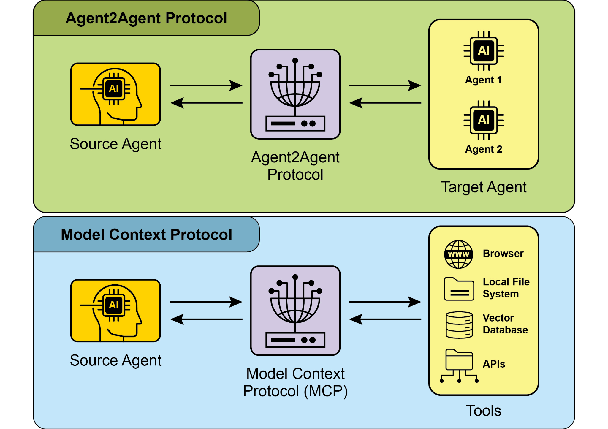
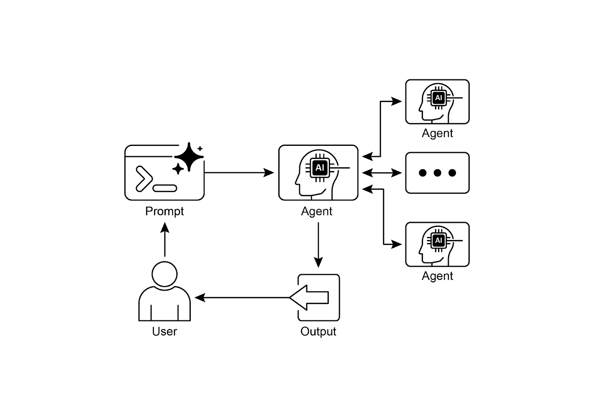

# 📚 Agentic Design Patterns (中文版)

> **提取时间**：2025-12-17 05:14:24
> **内容类型**：中文简体版本
> **总页数**：424 页
> **原始来源**：https://github.com/ginobefun/agentic-design-patterns-cn

---

# Chapter 15：Inter-Agent Communication (A2A) | <mark>第 15 章：智能体间通信 (A2A)</mark>

单个智能体在处理复杂多方面的问题时即使能力很强也常常面临局限性为了克服这一挑战智能体间通信使基于不同框架构建的智能体能够有效协作这种协作涉及无缝的协调任务委派和信息交换的协议是旨在促进这种通用通信的开放标准本章将探讨其实际应用及其在中的实现

## Inter-Agent Communication Pattern Overview ｜ <mark>智能体间通信模式概述</mark>

协议是旨在实现不同智能体框架之间通信与协作的开放标准它确保了互操作性允许使用或等技术开发的智能体协同工作而不受其来源或框架差异的影响得到了众多技术公司和服务提供商的支持包括和计划将集成到和中表明了其对开放协议的承诺此外和正在将支持集成到其平台和智能体中作为开源协议欢迎社区贡献以促进其发展和广泛采用

## Core Concepts of A2A ｜ <mark>A2A 的核心概念</mark>

协议为智能体交互提供了结构化方法建立在几个核心概念之上深入理解这些概念对于开发或集成兼容系统至关重要的基础组成部分包括核心参与者智能体卡片智能体发现通信与任务交互机制以及安全性接下来将对这些核心组成部分进行详细介绍

### Core Actors ｜ <mark>核心参与者</mark>

核心参与者涉及三个主要实体

- <mark> 用户 (User)：发起智能体协助请求。</mark>

- <mark>A2A 客户端 (客户端智能体)：代表用户请求操作或信息的应用程序或 AI 智能体。</mark>

- <mark>A2A 服务器 (远程智能体)：提供 HTTP 端点以处理客户端请求并返回结果的 AI 智能体或系统。远程智能体作为「不透明」系统运行, 这意味着客户端无需了解其内部操作细节。</mark>

智能体卡片

智能体卡片智能体的数字身份由其智能体卡片定义通常是文件该文件包含用于客户端交互和自动发现的关键信息包括智能体的身份端点和版本它还详细说明了支持的功能如流式传输或推送通知特定技能默认输入输出模式以及身份验证要求以下是的智能体卡片示例

```json
```

### Agent discovery | <mark>智能体发现</mark>

智能体发现它允许客户端找到描述可用服务器能力的智能体卡片此过程存在多种策略

智能体在标准化路径例如上托管其智能体卡片这种方法为公共或特定领域的使用提供了广泛且通常是自动化的可访问性

托管注册中心这些注册中心提供了一个集中的目录智能体卡片在此发布并可根据特定标准进行查询这非常适合需要集中管理和访问控制的企业环境

直接配置智能体卡片信息被嵌入或私下共享此方法适用于动态发现不那么重要的紧密耦合或私有系统

无论选择哪种方法保护智能体卡片端点都很重要这可以通过访问控制双向或网络限制来实现特别是当卡片包含敏感尽管非机密信息时

## Communications and Tasks | <mark>通信与任务</mark>

在框架中通信围绕异步任务构建异步任务是长时间运行流程的基本工作单元每个任务都被分配唯一标识符并经历一系列状态例如已提交处理中或已完成这种设计支持复杂操作中的并行处理智能体之间的通信通过消息进行

消息包含和一个或多个是描述消息的键值元数据如其优先级或创建时间承载实际交付的内容如纯文本文件或结构化数据智能体在任务期间生成的具体输出被称为与消息类似也由一个或多个部分组成并且可以在结果可用时以增量方式流式传输框架内的所有通信都通过进行并使用协议作为负载为了在多次交互中保持连续性使用服务器生成的来对相关任务进行分组并保留上下文

## Interaction Mechanisms | <mark>交互机制</mark>

提供了多种交互方法以适应各种应用需求每种方法都有其独特的机制

- <mark>同步请求/响应：用于快速、即时的操作。在这种模型中, 客户端发送请求并主动等待服务器处理, 服务器在单个同步交换中返回完整响应。</mark>
- <mark>异步轮询：适用于需要较长时间处理的任务。客户端发送一个请求, 服务器立即以 “处理中” 状态和任务 ID 进行确认。然后客户端可以自由执行其他操作, 并可以通过发送新请求定期轮询服务器以检查任务状态, 直到任务被标记为 “已完成” 或 “失败”。</mark>
- <mark>流式更新 (服务器发送事件-SSE)：非常适合接收实时、增量的结果。此方法建立了一个从服务器到客户端的持久性单向连接。它允许远程智能体持续推送更新, 例如状态变更或部分结果, 而无需客户端发出多个请求。</mark>
- <mark>推送通知 (Webhooks)：专为运行时间很长或资源密集型的任务设计, 在这些任务中维持长连接或频繁轮询效率低。客户端可以注册 webhook URL, 当任务状态发生重大变化 (例如完成时), 服务器将向该 URL 发送异步通知 (「推送」)。</mark>

智能体卡片指定了智能体是否支持流式传输或推送通知功能此外是模态无关的这意味着它不仅可以提供文本的交互模式还可以支持音频和视频等其他数据类型从而实现丰富的多模态应用流式传输和推送通知功能都在智能体卡片中指定

```json

# 同步请求示例
```

同步请求示例使用方法客户端发起请求并期望得到单一完整的响应相比之下流式请求使用方法建立持久连接允许智能体随时间推移发回多个增量更新或部分结果

```json

# 流式请求示例
```

## Security | <mark>安全性</mark>

智能体间通信智能体间通信是系统架构的重要组成部分它实现了智能体之间安全无缝的数据交换通过多种内置机制它确保了系统的稳健性和完整性

双向传输层安全建立加密和认证的连接以防止未经授权的访问和数据拦截确保通信安全

全面的审计日志所有智能体间的通信都被详细记录包括信息流涉及的智能体和执行的操作这个审计跟踪对于问责故障排查和安全分析至关重要

智能体卡片声明身份验证要求在智能体卡片中明确声明这是概述智能体身份能力和安全策略的配置工件这使得身份验证管理得以集中和简化

凭证处理智能体通常使用安全的凭证如令牌或密钥进行身份验证这些凭证通过标头传递这种方法可以防止凭证在或消息体中暴露从而增强整体安全性

与的对比

是与模型上下文协议互补的协议见图侧重于为智能体及其与外部数据和工具的交互构建上下文而则促进智能体之间的协调与通信从而实现任务委派和协作



图和协议的比较

的目标是在开发复杂的多智能体系统时提高效率降低集成成本并促进创新和互操作性因此深入理解的核心组件和操作方法对于在构建协作和互操作的智能体系统中有效设计实施和应用至关重要

## Practical Applications & Use Cases | <mark>实际应用与使用场景</mark>

智能体间通信对于在不同领域构建复杂的解决方案是不可或缺的它能实现模块化可扩展性并增强智能

多框架协作的主要使用场景是使独立智能体能够进行通信和协作无论其底层框架如何例如这对于构建复杂多智能体系统至关重要在这些系统中不同智能体专注于问题的不同方面

自动化工作流编排在企业环境中可以通过使智能体能够委派和协调任务来促进复杂的工作流例如一个智能体可能负责初始数据收集然后委派给另一个智能体进行分析最后再委派给第三个智能体生成报告所有这些都通过协议进行通信

动态信息检索智能体可以通信以检索和交换实时信息主智能体可能会向专门的数据获取智能体请求实时市场数据该智能体随后使用外部收集信息并将其发回

## Hands-On Code Example | <mark>动手代码示例</mark>

让我们来研究一下协议的实际应用位于的代码仓库提供了和的示例展示了各种智能体框架如和如何使用进行通信该仓库中的所有代码均在许可下发布为了进一步说明的核心概念我们将回顾一些代码片段重点介绍如何使用基于的智能体和经过认证的工具来设置服务器请看

```python

```

这段代码定义了异步函数用于构建它首先使用提供的客户端凭据初始化以访问随后创建实例配置指定的模型描述性名称以及管理用户日历的指令该智能体配备了来自的日历工具使其能够与交互并响应用户关于日历状态或修改的查询智能体的指令动态地包含了当前日期以提供时间上下文

为了说明如何构建智能体让我们看一下上示例中的关键部分下面的代码展示了如何使用特定指令和工具定义智能体请注意这里只显示了解释此功能所需的代码完整文件可以在此处访问

```python

```

这段代码演示了如何设置符合规范的日历智能体用于使用日历检查用户空闲状态它涉及验证密钥或配置以进行身份验证智能体的能力包括技能都在中定义该卡片还指定了智能体的网络地址随后创建智能体并配置了用于管理工件会话和内存的内存服务然后代码初始化应用程序集成了身份验证回调和协议处理器并使用启动它通过暴露该智能体

这些示例说明了构建符合规范智能体的过程从定义其能力到将其作为服务运行通过利用智能体卡片和开发人员可以创建能够与日历等工具集成的可互操作智能体这种实用方法展示了在建立多智能体生态系统中的应用

建议通过上的代码演示进一步探索该链接提供的资源包括和的客户端和服务器示例多智能体应用程序命令行界面以及各种智能体框架的实现示例

## At a Glance | <mark>概览</mark>

问题单个智能体特别是那些基于不同框架构建的智能体通常难以独立解决复杂多方面的问题主要挑战在于缺乏使这些智能体能够有效沟通和协作的通用语言或协议智能体间的孤立状态阻碍了复杂系统的创建在这些系统中多个专业智能体本可以结合其独特技能来解决更大的任务如果没有标准化方法集成这些异构智能体的成本高昂耗时并让更强大更有凝聚力的解决方案开发变得困难

解决方案智能体间通信协议为这个问题提供了开放标准化的解决方案它是基于的协议可实现互操作性允许不同智能体无缝协调委派任务和共享信息而不受其底层技术限制其核心组件是智能体卡片这是描述智能体能力技能和通信端点的数字身份文件便于发现和交互定义了各种交互机制包括同步和异步通信以支持不同的使用场景通过为智能体协作创建通用标准为构建复杂多智能体系统提供了模块化和可扩展的生态系统

经验法则当需要协调两个或多个智能体之间的协作时尤其是在它们使用不同框架例如构建的情况下请使用此模式它非常适合构建复杂模块化应用程序其中专门的智能体处理工作流的特定部分例如将数据分析委派给一个智能体将报告生成委派给另一个智能体当智能体需要动态发现和使用其他智能体的能力来完成任务时此模式也至关重要

可视化摘要



图智能体间通信模式

## Key Takeaways | <mark>关键要点</mark>

关键要点
- <mark>Google A2A 协议是一个开放的、基于 HTTP 的标准, 它促进了由不同框架构建的 AI 智能体之间的通信和协作。</mark>

- <mark>智能体卡片作为智能体的数字标识符, 允许其他智能体自动发现和理解其能力。</mark>

- <mark>A2A 提供同步请求-响应交互 (使用 <code>tasks/send</code>) 和流式更新 (使用 <code>tasks/sendSubscribe</code>), 以适应不同的通信需求。</mark>

- <mark>该协议支持多轮对话, 包括 <code>input-required</code> 状态, 允许智能体在交互过程中请求额外信息并保持上下文。</mark>

- <mark>A2A 鼓励采用模块化架构, 其中专门的智能体可以在不同端口上独立运行, 从而实现系统的可扩展性和分布式部署。</mark>

- <mark>像 Trickle AI 这样的工具有助于可视化和跟踪 A2A 通信, 帮助开发人员监控、调试和优化多智能体系统。</mark>

- <mark>A2A 是一个用于管理不同智能体之间任务和工作流的高级协议, 而模型上下文协议 (MCP) 则为 LLM 与外部资源交互提供了一个标准化的接口。</mark>

## Conclusions | <mark>结论</mark>

智能体间通信协议建立了至关重要的开放标准克服了单个智能体固有的孤立性通过提供通用的基于的框架它确保了在不同平台如或上构建的智能体之间的无缝协作和互操作性其核心组件是智能体卡片它作为数字身份清晰地定义了智能体的能力并使其他智能体能够动态发现该协议的灵活性支持各种交互模式包括同步请求异步轮询和实时流式传输满足了广泛的应用需求这使得创建模块化和可扩展的架构成为可能其中专门的智能体可以组合起来编排复杂的自动化工作流安全性是最基础的能力内置了和明确的身份验证要求等机制来保护通信虽然与等其他标准互补但其独特的重点在于智能体之间的高层协调和任务委派来自主流技术公司的强大支持和实际实现的可用性凸显了其日益增长的重要性该协议为开发人员构建更复杂分布式和智能的多智能体系统铺平了道路最终是促进协作式的创新和互操作生态系统的基础支柱

## References | <mark>参考文献</mark>
