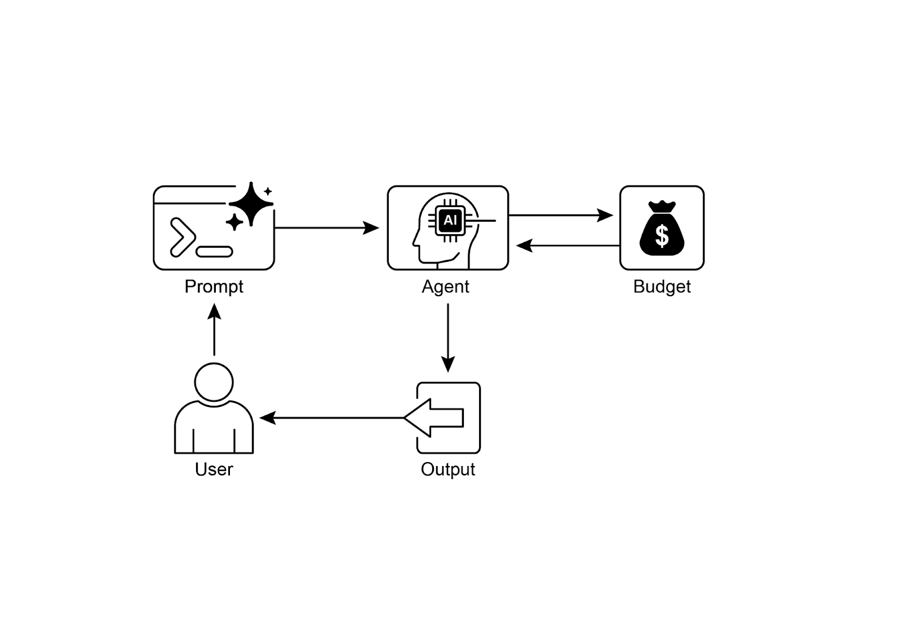

# 📚 Agentic Design Patterns (中文版)

> **提取时间**：2025-12-17 05:14:24
> **内容类型**：中文简体版本
> **总页数**：424 页
> **原始来源**：https://github.com/ginobefun/agentic-design-patterns-cn

---

# Chapter 16：Resource-Aware Optimization | <mark>第 16 章：资源感知优化</mark>

资源感知优化使具智能体特性的系统能够在运行过程中动态监控和管理计算时间和财务资源这与简单的规划不同， 后者主要关注动作序列资源感知优化要求智能体在执行动作时做出决策， 以在指定的资源预算内实现目标或优化效率这涉及在更准确但昂贵的模型与更快速但成本较低的模型之间进行选择， 或者决定是否为更精细的响应分配额外的计算资源， 还是返回更快速但不太详细的答案

例如， 考虑一个负责为金融分析师分析大型数据集的智能体如果分析师需要立即获得初步报告， 智能体可能会使用更快速更实惠的模型来快速总结关键趋势然而， 如果分析师需要为关键投资决策提供高度准确的预测， 并且有更大的预算和更多时间， 智能体将分配更多资源来使用强大较慢但更精确的预测模型此类别中的一个关键策略是后备机制， 当首选模型由于过载或限流而不可用时， 它充当保护措施为确保优雅降级， 系统会自动切换到默认或更实惠的模型， 从而维持服务连续性， 而不是完全失败

---

## Practical Applications & Use Cases | <mark>实际应用与用例</mark>

实际用例包括：

成本优化的使用： 智能体根据预算约束， 决定是使用大型昂贵的处理复杂任务， 还是使用较小更实惠的处理简单查询

延迟敏感操作： 在实时系统中， 智能体选择更快但可能不太全面的推理路径， 以确保及时响应

能源效率： 对于部署在边缘设备或电力有限的智能体， 优化其处理以节省电池寿命

服务可靠性的后备机制： 当主要选择不可用时， 智能体自动切换到备份模型， 确保服务连续性和优雅降级

数据使用管理： 智能体选择摘要数据检索而不是完整数据集下载， 以节省带宽或存储空间

自适应任务分配： 在多智能体系统中， 智能体根据当前计算负载或可用时间自行分配任务

---

## Hands-On Code Example | <mark>实战代码示例</mark>

一个用于回答用户问题的智能系统可以评估每个问题的难度对于简单查询， 它使用成本效益高的语言模型， 如对于复杂查询， 会考虑使用更强大但昂贵的语言模型（如）使用更强大模型的决定还取决于资源可用性， 特别是预算和时间约束该系统会动态选择适当的模型

例如， 考虑使用层次化智能体构建的旅行规划器高层规划涉及理解用户的复杂请求将其分解为多步骤行程并做出逻辑决策， 这将由复杂且更强大的（如）管理这是需要深入理解上下文和推理能力的规划器智能体

然而， 一旦确定了计划， 该计划中的各个任务（如查找航班价格检查酒店可用性或查找餐厅评论）本质上是简单重复的网络查询这些工具函数调用可以由更快速更实惠的模型（如）执行很容易理解为什么这些直接的网络搜索可以使用实惠的模型， 而复杂的规划阶段需要更先进模型的更强智能， 以确保连贯且合乎逻辑的旅行计划

的通过其多智能体架构支持这种方法， 允许模块化和可扩展的应用程序不同的智能体可以处理专门的任务模型灵活性支持直接使用各种模型， 包括和， 或通过集成其他模型的编排功能支持动态的由驱动的路由， 以实现自适应行为内置的评估功能允许系统化评估智能体性能， 可用于系统优化（参见评估与监控章节）

接下来， 将定义两个设置相同但使用不同模型和成本的智能体

```python

```

上述代码定义了两个智能体： 使用更昂贵的模型处理复杂查询， 而使用更实惠的模型处理简单查询

### Router Agent | <mark>路由智能体</mark>

路由智能体可以基于简单的指标（如查询长度）来引导查询， 其中较短的查询发送到成本较低的模型， 较长的查询发送到更强大的模型然而， 更复杂的路由智能体可以利用或模型来分析查询的细微差别和复杂性这个路由器可以确定哪个下游语言模型最合适例如， 请求事实回忆的查询被路由到模型， 而需要深入分析的复杂查询被路由到模型

优化技术可以进一步提高路由器的有效性提示调优涉及精心设计提示以指导路由器做出更好的路由决策在查询及其最优模型选择的数据集上对路由器进行微调， 可以提高其准确性和效率这种动态路由能力在响应质量和成本效益之间取得平衡

```python

```

上述代码实现了类， 它根据查询的复杂度将用户查询路由到适当的智能体它使用简单的指标（查询中的单词数）来确定复杂度短查询（少于个单词）被路由到， 而长查询被路由到

### Critique Agent | <mark>评论智能体</mark>

评论智能体评估来自语言模型的响应， 提供服务于多种功能的反馈对于自我修正， 它识别错误或不一致之处， 促使回答智能体改进其输出以提高质量它还系统化地评估响应以进行性能监控， 跟踪准确性和相关性等指标， 这些指标用于优化

此外， 其反馈可以为强化学习或微调提供信号； 例如， 持续识别模型的不充分响应可以改进路由智能体的逻辑虽然不直接管理预算， 但评论智能体通过识别次优路由选择（如将简单查询引导到模型或将复杂查询引导到模型， 从而导致不良结果）来促进间接预算管理这为改进资源分配和成本节约的调整提供了信息

评论智能体可以配置为仅审查来自回答智能体的生成文本， 或同时审查原始查询和生成文本， 从而能够全面评估响应与初始问题的对齐情况

```python
```

上述代码展示了评论智能体的系统提示模板该提示明确定义了智能体作为质量保证组件的角色， 职责包括评估研究结果的准确性识别缺失数据提出批判性问题提供建设性建议， 并验证最终输出的全面性和平衡性

评论智能体基于预定义的系统提示运行， 该提示概述了其角色职责和反馈方法为该智能体设计良好的提示必须清楚地确立其作为评估者的功能它应该指定需要重点关注的领域， 并强调提供建设性反馈而不是简单地否定提示还应鼓励识别优势和劣势， 并且必须指导智能体如何构建和呈现其反馈

---

## Hands-On Code with OpenAI | <mark>使用 OpenAI 的实战代码</mark>

该系统使用资源感知优化策略来高效处理用户查询它首先将每个查询分类为三个类别之一， 以确定最合适且最具成本效益的处理路径这种方法避免了在简单请求上浪费计算资源， 同时确保复杂查询获得必要的关注三个类别是：

（简单）： 用于可以直接回答而无需复杂推理或外部数据的直接问题

（推理）： 用于需要逻辑推理或多步骤思考过程的查询， 这些查询被路由到更强大的模型

（网络搜索）： 用于需要当前信息的问题， 会自动触发搜索以提供最新答案

该代码采用许可证， 可在上获取：

```python

```

该代码实现了一个提示路由系统来回答用户问题它首先从文件加载和所需的密钥核心功能在于将用户的提示分类为三个类别： （简单）（推理）或（网络搜索）专门的函数利用模型执行此分类步骤如果提示需要当前信息， 则使用执行搜索另一个函数根据分类选择适当的模型生成最终响应对于网络搜索查询， 搜索结果作为上下文提供给模型主函数协调此工作流程， 在生成响应之前调用分类和搜索（如果需要）函数它返回分类使用的模型和生成的答案该系统有效地将不同类型的查询引导到优化的方法以获得更好的响应

---

## Hands-On Code Example (OpenRouter) | <mark>使用 OpenRouter 的实战代码</mark>

通过单个端点提供对数百个模型的统一接口它提供自动故障转移和成本优化， 可通过您喜欢的或框架轻松集成

```python
```

此代码片段使用库与交互它向聊天完成端点发送请求， 包含用户消息请求包括带有密钥的授权标头和可选的站点信息目标是从指定的语言模型（在本例中为）获取响应

提供两种不同的方法来路由和确定用于处理给定请求的计算模型

自动模型选择： 此功能将请求路由到从精选的可用模型集中选择的优化模型选择基于用户提示的具体内容最终处理请求的模型标识符在响应的元数据中返回

```json
```

顺序模型回退： 此机制通过允许用户指定分层模型列表来提供操作冗余系统将首先尝试使用序列中指定的主要模型处理请求如果主要模型由于多种错误条件（如服务不可用速率限制或内容过滤）而无法响应， 系统将自动将请求重新路由到序列中的下一个指定模型此过程将持续进行， 直到列表中的某个模型成功执行请求或列表耗尽操作的最终成本和响应中返回的模型标识符将对应于成功完成计算的模型

```json
```

提供详细的排行榜（）， 根据累积令牌生产量对可用的模型进行排名它还提供来自不同提供商（）的最新模型（见图）


图： 网站

---

## Beyond Dynamic Model Switching：A Spectrum of Agent Resource Optimizations | <mark>超越动态模型切换：智能体资源优化的全景</mark>

资源感知优化在开发能够在现实世界约束下高效且有效运行的具智能体特性的系统中至关重要让我们看看许多其他技术：

动态模型切换是一种关键技术， 涉及基于手头任务的复杂性和可用计算资源对大型语言模型的战略选择面对简单查询时， 可以部署轻量级成本效益高的， 而复杂的多方面问题则需要使用更复杂和资源密集的模型

自适应工具使用与选择确保智能体能够从一组工具中智能选择， 为每个特定子任务选择最合适和最高效的工具， 并仔细考虑使用成本延迟和执行时间等因素这种动态工具选择通过优化外部和服务的使用来提高整体系统效率

上下文修剪与摘要在管理智能体处理的信息量方面发挥着至关重要的作用， 通过智能摘要和选择性地仅保留交互历史中最相关的信息来战略性地最小化提示令牌数并降低推理成本， 从而防止不必要的计算开销

主动资源预测涉及通过预测未来工作负载和系统需求来预测资源需求， 从而允许主动分配和管理资源， 确保系统响应性并防止瓶颈

成本敏感探索在多智能体系统中将优化考虑扩展到包括通信成本以及传统计算成本， 影响智能体协作和共享信息所采用的策略， 旨在最小化整体资源支出

能源高效部署专门针对具有严格资源约束的环境而定制， 旨在最小化具智能体特性系统的能源足迹， 延长运行时间并降低整体运行成本

并行化与分布式计算感知利用分布式资源来增强智能体的处理能力和吞吐量， 将计算工作负载分布到多台机器或处理器上， 以实现更高的效率和更快的任务完成

学习型资源分配策略引入学习机制， 使智能体能够基于反馈和性能指标随时间推移适应和优化其资源分配策略， 通过持续改进提高效率

优雅降级和后备机制确保具智能体特性的系统即使在资源约束严重时也能继续运行（尽管可能以降低的容量）， 优雅地降低性能并回退到替代策略以维持运行并提供基本功能

---

## At a Glance | <mark>要点速览</mark>

问题所在： 资源感知优化解决了在具智能体特性的系统中管理计算时间和财务资源消耗的挑战基于的应用程序可能既昂贵又缓慢， 为每个任务选择最佳模型或工具往往效率低下这在系统输出质量与生成所需资源之间产生了根本性权衡如果没有动态管理策略， 系统无法适应不同的任务复杂性或在预算和性能约束内运行

解决之道： 标准化解决方案是构建一个具智能体特性的系统， 根据手头的任务智能地监控和分配资源此模式通常使用路由智能体首先对传入请求的复杂性进行分类然后将请求转发到最合适的或工具简单查询使用快速廉价的模型， 复杂推理使用更强大的模型评论智能体可以通过评估响应质量进一步改进流程， 提供反馈以随时间改进路由逻辑这种动态的多智能体方法确保系统高效运行， 在响应质量和成本效益之间取得平衡

经验法则： 在以下情况下使用此模式： 在调用或计算能力的严格财务预算下运行； 构建对延迟敏感的应用程序， 其中快速响应时间至关重要； 在资源受限的硬件（如电池寿命有限的边缘设备）上部署智能体； 以编程方式平衡响应质量和运营成本之间的权衡； 以及管理复杂的多步骤工作流程， 其中不同任务具有不同的资源需求

---

## Visual Summary | <mark>可视化摘要</mark>



图： 资源感知优化设计模式

---

## Key Takeaways | <mark>核心要点</mark>

资源感知优化至关重要： 具智能体特性的系统可以动态管理计算时间和财务资源关于模型使用和执行路径的决策基于实时约束和目标做出

可扩展的多智能体架构： 的提供多智能体框架， 支持模块化设计不同的智能体（回答路由评论）处理特定任务

动态的由驱动的路由： 路由智能体根据查询复杂性和预算将查询引导到语言模型（简单查询使用， 复杂查询使用）这优化了成本和性能

评论智能体功能： 专门的评论智能体为自我修正性能监控和改进路由逻辑提供反馈， 增强系统有效性

通过反馈和灵活性进行优化： 评论的评估能力和模型集成灵活性有助于自适应和自我改进的系统行为

其他资源感知优化： 其他方法包括自适应工具使用与选择上下文修剪与摘要主动资源预测多智能体系统中的成本敏感探索能源高效部署并行化与分布式计算感知学习型资源分配策略优雅降级和后备机制， 以及关键任务优先级排序

---

## Conclusions | <mark>结论</mark>

资源感知优化对于具智能体特性系统的开发至关重要， 使其能够在现实世界约束下高效运行通过管理计算时间和财务资源， 智能体可以实现最佳性能和成本效益动态模型切换自适应工具使用和上下文修剪等技术对于实现这些效率至关重要包括学习型资源分配策略和优雅降级在内的高级策略增强了智能体在不同条件下的适应性和韧性将这些优化原则整合到智能体设计中是构建可扩展稳健和可持续的系统的基础

---

参考文献

智能体开发工具包（）：
和：
