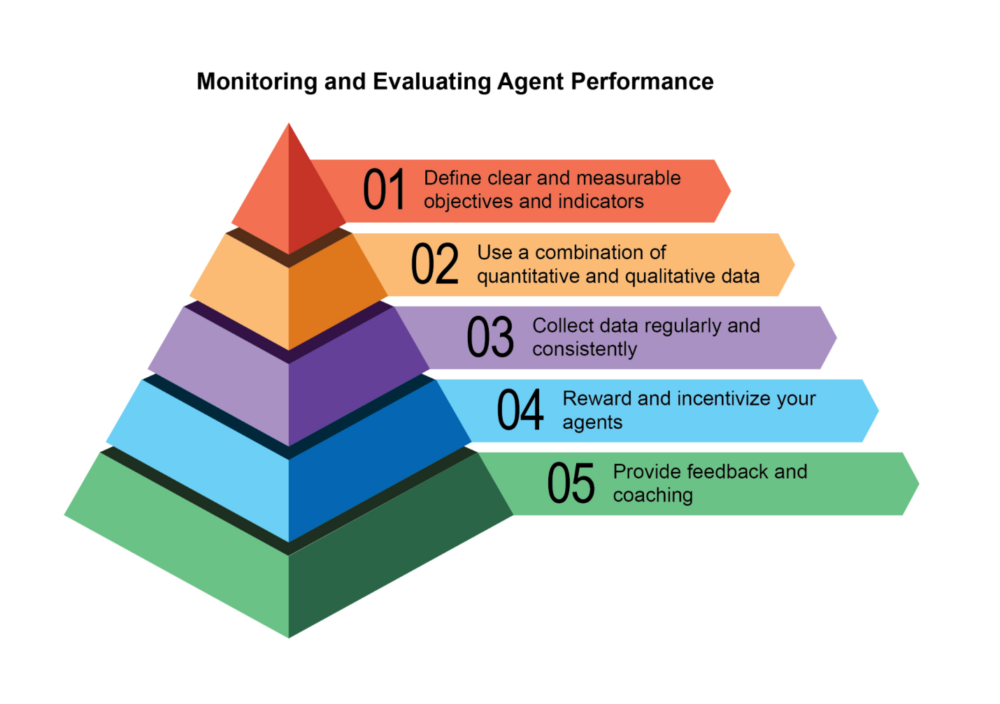
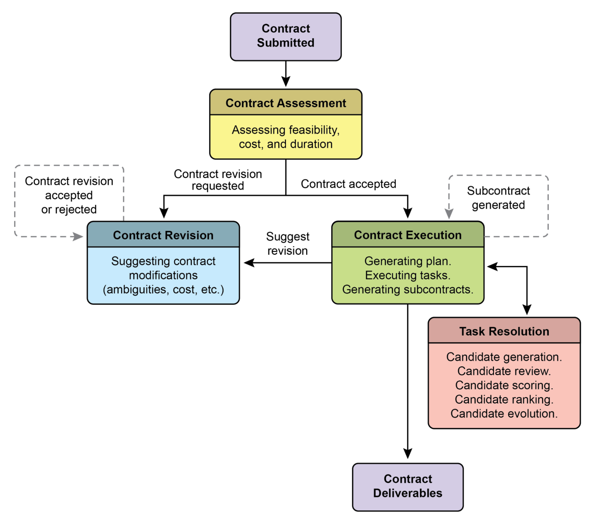
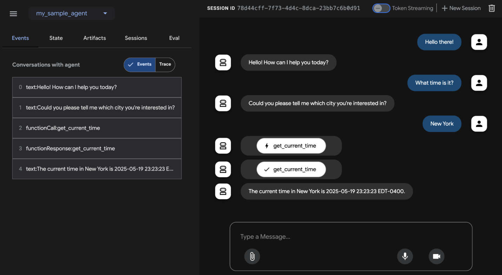
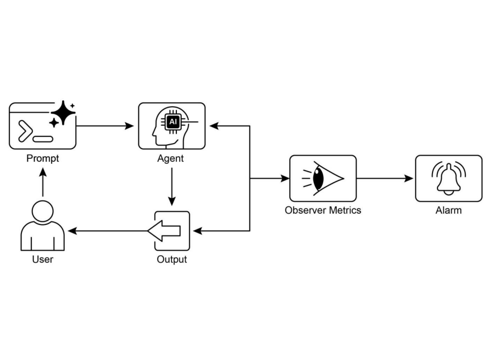

# 📚 Agentic Design Patterns (中文版)

> **提取时间**：2025-12-17 05:14:24
> **内容类型**：中文简体版本
> **总页数**：424 页
> **原始来源**：https://github.com/ginobefun/agentic-design-patterns-cn

---

# Chapter 19：Evaluation and Monitoring | <mark>第 19 章：评估与监控</mark>

本章探讨了使智能体能够系统性地评估自身性能监控目标进展并检测运行异常的方法论虽然第章概述了目标设定与监控， 第章讨论了推理机制， 但本章聚焦于对智能体有效性效率及需求合规性的持续性外部测量这包括定义指标建立反馈循环以及实施报告系统， 以确保智能体性能在运行环境中符合预期（见图）



图： 评估与监控的最佳实践

---

## Practical Applications & Use Cases | <mark>实际应用与用例</mark>

最常见的应用与用例：

- <mark><strong>实时系统中的性能跟踪：</strong>持续监控部署在生产环境中的智能体的准确性、延迟和资源消耗（例如，客户服务聊天机器人的解决率、响应时间）。</mark>

- <mark><strong>智能体改进的 A/B 测试：</strong>系统性地并行比较不同智能体版本或策略的性能，以识别最优方法（例如，为物流智能体尝试两种不同的规划算法）。</mark>

- <mark><strong>合规性与安全审计：</strong>生成自动化审计报告，跟踪智能体随时间对道德准则、监管要求和安全协议的遵守情况。这些报告可由人在回路中（Human-in-the-Loop）或另一个智能体进行验证，并可生成 KPI 或在发现问题时触发警报。</mark>

- <mark><strong>企业系统：</strong>为了在企业系统中管理具智能体特性的 AI（Agentic AI），需要一种新的控制工具——AI「合约」。这种动态协议将 AI 委托任务的目标、规则和控制进行编码。</mark>

- <mark><strong>漂移检测：</strong>随时间监控智能体输出的相关性或准确性，检测其性能何时因输入数据分布变化（概念漂移）或环境变化而下降。</mark>

- <mark><strong>智能体行为异常检测：</strong>识别智能体采取的异常或意外行为，这些行为可能表明错误、恶意攻击或涌现的非预期行为。</mark>

- <mark><strong>学习进展评估：</strong>对于设计为可学习的智能体，跟踪其学习曲线、特定技能的改进或在不同任务或数据集上的泛化能力。</mark>

---

## Hands-On Code Example | <mark>实战代码示例</mark>

为智能体开发一个全面的评估框架是一项具有挑战性的工作， 其复杂性可与一门学术学科或一本实质性出版物相媲美这种困难源于需要考虑的众多因素， 例如模型性能用户交互伦理影响和更广泛的社会影响然而， 对于实际实施而言， 可以将重点缩小到对智能体高效有效运作至关重要的关键用例上

智能体响应评估： 这一核心过程对于评估智能体输出的质量和准确性至关重要它涉及确定智能体是否针对给定输入提供相关正确合乎逻辑无偏见且准确的信息评估指标可能包括事实正确性流畅性语法精确性以及对用户预期目的的遵循程度

```py

```

函数通过在去除前导或尾随空格后， 对智能体的输出和预期输出执行精确的不区分大小写比较， 来计算智能体响应的基本准确性分数对于精确匹配， 它返回的分数， 否则返回， 表示二元的正确或错误评估这种方法虽然对于简单检查来说很直接， 但不考虑释义或语义等价性等变化

问题在于其比较方法该函数对两个字符串执行严格的逐字符比较在提供的示例中：

即使在去除空格并转换为小写后， 这两个字符串也不相同因此， 该函数将错误地返回的准确性分数， 尽管两个句子传达的是相同的意思

直接比较在评估语义相似性方面存在不足， 只有当智能体的响应完全匹配预期输出时才会成功更有效的评估需要先进的自然语言处理（）技术来辨别句子之间的意义对于现实场景中的智能体彻底评估， 更复杂的指标通常是不可或缺的这些指标可以包括字符串相似性度量（如距离和相似性）关键词分析（用于特定关键词的存在或缺失）使用嵌入模型的余弦相似性进行语义相似性分析作为评判者（）评估（稍后讨论用于评估细微的正确性和有用性）， 以及特定指标（如忠实度和相关性）

延迟监控： 智能体操作的延迟监控在智能体响应或操作速度是关键因素的应用中至关重要此过程测量智能体处理请求和生成输出所需的持续时间延迟升高会对用户体验和智能体的整体有效性产生不利影响， 特别是在实时或交互式环境中在实际应用中， 仅将延迟数据打印到控制台是不够的建议将此信息记录到持久化存储系统选项包括结构化日志文件（如）时间序列数据库（如）数据仓库（如）或可观测性平台（如）

跟踪交互的使用： 对于基于的智能体， 跟踪使用对于管理成本和优化资源分配至关重要交互的计费通常取决于处理的数量（输入和输出）因此， 高效的使用直接降低运营费用此外， 监控计数有助于识别提示工程或响应生成过程中潜在的改进领域

```py

```

本节介绍了一个概念性的类， 用于跟踪大语言模型交互中的使用情况该类包含输入和输出的计数器其方法通过分割提示和响应字符串来模拟计数在实际实现中， 将使用特定的分词器来获得精确的计数随着交互的发生， 监控器累积输入和输出的总数方法提供对这些累积总数的访问， 这对于成本管理和使用优化至关重要

使用作为评判者的有用性自定义指标： 评估智能体的有用性等主观品质带来了超越标准客观指标的挑战一个潜在的框架涉及使用作为评估者这种作为评判者（）的方法基于有用性的预定义标准来评估另一个智能体的输出利用的高级语言能力， 这种方法提供细微的类人的主观品质评估， 超越了简单的关键词匹配或基于规则的评估尽管仍在开发中， 但这项技术在自动化和扩展定性评估方面显示出前景

```py

```

该代码定义了一个类， 旨在使用生成式模型评估法律调查问题的质量它利用库与模型进行交互

核心功能涉及将调查问题与详细的评估标准一起发送到模型该标准指定了评判调查问题的五个标准： 清晰度与精确性中立性与偏见相关性与聚焦完整性以及对受众的适当性对于每个标准， 分配到的分数， 并且输出中需要详细的理由和反馈代码构建一个包含标准和待评估调查问题的提示

方法将此提示发送到配置的模型， 请求根据定义的结构格式化的响应预期的输出包括总体分数摘要理由每个标准的详细反馈关注点列表以及推荐操作该类处理模型交互期间的潜在错误， 例如解码问题或空响应该脚本通过评估法律调查问题的示例来演示其操作， 说明如何基于预定义标准评估质量

在结束之前， 让我们考虑各种评估方法的优缺点

评估方法优势劣势
人工评估捕捉细微行为难以扩展成本高且耗时， 因为涉及主观的人为因素
作为评判者一致高效且可扩展中间步骤可能被忽略， 受能力限制
自动化指标可扩展高效且客观在捕捉完整能力方面可能存在局限性

---

## Agents trajectories | <mark>智能体轨迹</mark>

评估智能体的轨迹至关重要， 因为传统的软件测试是不够的标准代码产生可预测的通过失败结果， 而智能体以概率方式运行， 需要对最终输出和智能体轨迹达到解决方案所采取的步骤序列进行定性评估评估多智能体系统具有挑战性， 因为它们不断变化这需要开发超越个体性能的复杂指标， 以衡量沟通和团队合作的有效性此外， 环境本身不是静态的， 要求评估方法（包括测试用例）随时间适应

这涉及检查决策质量推理过程和整体结果实施自动化评估是有价值的， 特别是对于原型阶段之后的开发分析轨迹和工具使用包括评估智能体实现目标所采用的步骤， 如工具选择策略和任务效率例如， 处理客户产品查询的智能体可能理想地遵循涉及意图确定数据库搜索工具使用结果审查和报告生成的轨迹智能体的实际操作与这个预期的或真实的（）轨迹进行比较， 以识别错误和低效比较方法包括精确匹配（要求与理想序列完美匹配）顺序匹配（正确操作按顺序， 允许额外步骤）任意顺序匹配（正确操作以任意顺序， 允许额外步骤）精确度（测量预测操作的相关性）召回率（测量捕获多少基本操作）和单工具使用（检查特定操作）指标选择取决于特定的智能体需求， 高风险场景可能要求精确匹配， 而更灵活的情况可能使用顺序或任意顺序匹配

智能体的评估涉及两种主要方法： 使用测试文件和使用评估集（）文件测试文件采用格式， 代表单个简单的智能体模型交互或会话， 非常适合在积极开发期间进行单元测试， 专注于快速执行和简单的会话复杂性每个测试文件包含一个具有多个回合的单个会话， 其中回合是用户智能体交互， 包括用户查询预期工具使用轨迹中间智能体响应和最终响应例如， 测试文件可能详细说明用户请求， 指定智能体使用工具及参数如和， 以及预期的最终响应测试文件可以组织到文件夹中， 并可能包含一个文件来定义评估标准评估集文件利用称为的数据集来评估交互， 包含多个可能很长的会话， 适合模拟复杂的多回合对话和集成测试评估集文件包含多个， 每个代表一个独特的会话， 具有一个或多个回合， 包括用户查询预期工具使用中间响应和参考最终响应示例评估集可能包括一个会话， 其中用户首先询问， 然后说， 定义预期的工具调用和工具调用， 以及总结骰子投掷和素数检查的最终响应

多智能体： 评估具有多个智能体的复杂系统很像评估团队项目由于有许多步骤和交接， 其复杂性是一个优势， 允许您检查每个阶段的工作质量您可以检查每个单独的智能体执行其特定工作的情况， 但也必须评估整个系统作为一个整体的表现

为此， 您需要提出关于团队动态的关键问题， 并通过具体示例支持：

- <mark>智能体是否有效合作？例如，在「航班预订智能体」确保航班后，它是否成功地将正确的日期和目的地传递给「酒店预订智能体」？合作失败可能导致为错误的周预订酒店。</mark>

- <mark>它们是否制定了良好的计划并坚持执行？想象一下，计划是先预订航班，然后预订酒店。如果「酒店智能体」在航班确认之前尝试预订房间，它就偏离了计划。您还要检查智能体是否卡住了，例如，无休止地搜索「完美」的租车，永远不进入下一步。</mark>

- <mark>是否为正确的任务选择了正确的智能体？如果用户询问旅行的天气，系统应该使用提供实时数据的专门「天气智能体」。如果它使用「通用知识智能体」给出像「夏天通常很温暖」这样的通用答案，则它为这项工作选择了错误的工具。</mark>

- <mark>最后，添加更多智能体是否会提高性能？如果您向团队添加新的「餐厅预订智能体」，它是否会使整体旅行规划更好、更有效率？还是它会造成冲突并减慢系统速度，表明存在可扩展性问题？</mark>

---

## From Agents to Advanced Contractors | <mark>从智能体到高级承包商</mark>

最近有人提出（， 等人）从简单的智能体演进到高级承包商， 从概率性的往往不可靠的系统转向更确定性和可问责的系统， 专为复杂高风险环境设计（见图）

当今常见的智能体基于简短未充分指定的指令运行， 这使它们适合简单演示， 但在生产环境中脆弱， 模糊性会导致失败承包商模型通过在用户和之间建立严格的正式化的关系来解决这个问题， 建立在明确定义且双方同意的条款基础上， 很像人类世界的法律服务协议这一转变由四个关键支柱支撑， 它们共同确保了先前超出自主系统范围的任务的清晰性可靠性和稳健执行

首先是正式化合约（）的支柱， 这是一个详细的规范， 作为任务的单一真实来源它远远超出了简单的提示例如， 财务分析任务的合约不会只是说分析上一季度的销售额； 它会要求一份页的报告， 分析年第一季度欧洲市场销售情况， 包括五个特定的数据可视化与年第一季度的比较分析， 以及基于包含的供应链中断数据集的风险评估此合约明确定义了所需的交付成果其精确规范可接受的数据源工作范围， 甚至预期的计算成本和完成时间， 使结果客观可验证

第二是协商与反馈的动态生命周期（）的支柱合约不是静态命令， 而是对话的开始承包商智能体可以分析初始条款并协商例如， 如果合约要求使用智能体无法访问的特定专有数据源， 它可以返回反馈说： 指定的数据库无法访问请提供凭据或批准使用替代公共数据库， 这可能会略微改变数据的粒度这个协商阶段还允许智能体标记模糊性或潜在风险， 在执行开始之前解决误解， 防止代价高昂的失败， 并确保最终输出完全符合用户的实际意图



图： 智能体之间的合约执行示例

第三个支柱是质量导向的迭代执行（）与设计为低延迟响应的智能体不同， 承包商优先考虑正确性和质量它基于自我验证和纠正的原则运作例如， 对于代码生成合约， 智能体不会只是编写代码； 它会生成多种算法方法， 针对合约中定义的一套单元测试编译并运行它们， 根据性能安全性和可读性等指标为每个解决方案评分， 并且只提交通过所有验证标准的版本这种生成审查和改进自己工作的内部循环， 直到满足合约规范， 对于建立对其输出的信任至关重要

最后， 第四个支柱是通过子合约的分层分解（）对于重大复杂性的任务， 主承包商智能体可以充当项目经理， 将主要目标分解为更小更可管理的子任务它通过生成新的正式的子合约来实现这一点例如， 构建电子商务移动应用程序的主合约可以由主智能体分解为设计开发用户身份验证模块创建产品数据库模式和集成支付网关的子合约这些子合约中的每一个都是一个完整的独立的合约， 具有自己的交付成果和规范， 可以分配给其他专业智能体这种结构化分解允许系统以高度组织化和可扩展的方式处理庞大多方面的项目， 标志着从简单工具过渡到真正自主和可靠的问题解决引擎

最终， 这个承包商框架通过将正式规范协商和可验证执行的原则直接嵌入到智能体的核心逻辑中， 重新构想了交互这种系统性方法将人工智能从一个有前途但往往不可预测的助手提升为一个能够以可审计的精度自主管理复杂项目的可靠系统通过解决模糊性和可靠性的关键挑战， 该模型为在信任和问责至关重要的关键任务领域部署铺平了道路

---

在结束之前， 让我们看一个支持评估的框架的具体示例使用进行智能体评估（见图）可以通过三种方法进行： 基于的（）用于交互式评估和数据集生成使用的程序化集成用于融入测试管道， 以及直接命令行界面（）用于适合定期构建生成和验证过程的自动化评估



图： 的评估支持

基于的可以交互式创建会话并将其保存到现有或新的评估集中， 显示评估状态集成允许通过调用将测试文件作为集成测试的一部分运行， 指定智能体模块和测试文件路径

命令行界面通过提供智能体模块路径和评估集文件来促进自动化评估， 并提供指定配置文件或打印详细结果的选项可以通过在评估集文件名后列出它们并用逗号分隔来选择更大评估集中的特定评估进行执行

---

## At a Glance | <mark>要点速览</mark>

问题所在： 智能体系统（）和在复杂动态的环境中运行， 其性能可能随时间而下降它们的概率性和非确定性特性意味着传统的软件测试不足以确保可靠性评估动态多智能体系统是一项重大挑战， 因为它们不断变化的本质及其环境要求开发自适应测试方法和复杂指标， 这些指标可以衡量超越个体性能的协作成功数据漂移意外交互工具调用和偏离预期目标等问题可能在部署后出现因此， 持续评估对于衡量智能体的有效性效率以及对运营和安全要求的遵守是必要的

解决之道： 标准化的评估与监控框架提供了一种系统性方法来评估和确保智能体的持续性能这涉及为准确性延迟和资源消耗（如的使用）定义清晰的指标它还包括先进的技术， 如分析智能体轨迹以理解推理过程， 以及采用作为评判者进行细微的定性评估通过建立反馈循环和报告系统， 该框架允许持续改进测试以及异常或性能漂移的检测， 确保智能体保持与其目标一致

经验法则： 在将智能体部署到实时性能和可靠性至关重要的实时生产环境时使用此模式此外， 当需要系统性地比较智能体的不同版本或其底层模型以推动改进时， 以及在需要合规性安全性和伦理审计的受监管或高风险领域运营时使用它当智能体的性能可能因数据或环境变化（漂移）而随时间下降时， 或当评估复杂的智能体行为（包括操作序列（轨迹）和主观输出（如有用性）的质量）时， 此模式也适用

可视化总结



图： 评估与监控设计模式

---

## Key Takeaways | <mark>关键要点</mark>

- <mark>评估智能体超越了传统测试，可以持续测量其在现实世界环境中的有效性、效率以及对需求的遵守。</mark>

- <mark>智能体评估的实际应用包括实时系统中的性能跟踪、改进的 A/B 测试、合规性审计以及检测行为漂移或异常。</mark>

- <mark>基本的智能体评估涉及评估响应准确性，而现实场景需要更复杂的指标，如延迟监控和基于 LLM 的智能体的 token 使用跟踪。</mark>

- <mark>智能体轨迹，即智能体采取的步骤序列，对于评估至关重要，将实际操作与理想的真实路径进行比较，以识别错误和低效。</mark>

- <mark>ADK 通过用于单元测试的单个测试文件和用于集成测试的综合评估集文件提供结构化评估方法，两者都定义了预期的智能体行为。</mark>

- <mark>智能体评估可以通过基于 Web 的 UI 进行交互式测试、使用 pytest 以编程方式进行 CI/CD 集成，或通过命令行界面进行自动化工作流程执行。</mark>

- <mark>为了使 AI 在复杂、高风险任务中可靠，我们必须从简单的提示转向精确定义可验证交付成果和范围的正式「合约」。这种结构化协议允许智能体协商、澄清模糊性并迭代验证其自身工作，将其从不可预测的工具转变为可问责和可信赖的系统。</mark>

---

## Conclusions | <mark>结论</mark>

总之， 有效评估智能体需要超越简单的准确性检查， 对其在动态环境中的性能进行持续多方面的评估这涉及对延迟和资源消耗等指标的实际监控， 以及通过其轨迹对智能体决策过程的复杂分析对于有用性等细微品质， 作为评判者等创新方法正变得至关重要， 而像这样的框架为单元测试和集成测试提供了结构化工具在多智能体系统中， 挑战加剧， 焦点转移到评估协作成功和有效合作上

为确保关键应用中的可靠性， 范式正从简单的由提示驱动的智能体转向受正式协议约束的高级承包商这些承包商智能体基于明确可验证的条款运作， 允许它们协商分解任务并自我验证其工作以满足严格的质量标准这种结构化方法将智能体从不可预测的工具转变为能够处理复杂高风险任务的可问责系统最终， 这一演进对于建立在关键任务领域部署复杂智能体所需的信任至关重要

---

## References | <mark>参考文献</mark>

相关研究包括：
