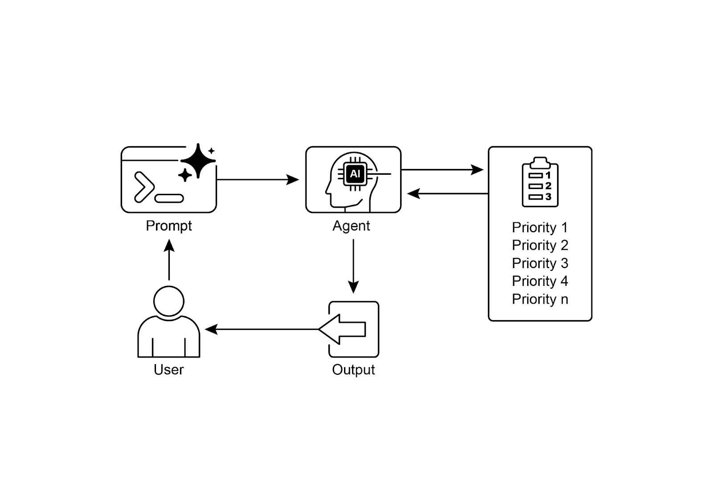

# 📚 Agentic Design Patterns (中文版)

> **提取时间**：2025-12-17 05:14:24
> **内容类型**：中文简体版本
> **总页数**：424 页
> **原始来源**：https://github.com/ginobefun/agentic-design-patterns-cn

---

# Chapter 20：Prioritization | <mark>第二十章：优先级排序</mark>

在复杂多变的环境中， 智能体常常面临大量潜在行动相互冲突的目标以及有限的资源如果缺乏明确的流程来决定下一步行动， 智能体可能会出现效率降低运行延迟， 甚至无法实现关键目标等问题优先级排序模式通过让智能体根据重要性紧迫性依赖关系和既定标准来评估和排序任务目标或行动， 解决了这一问题这确保智能体能够将精力集中在最关键的任务上， 从而提升效能并实现与目标的对齐

---

## Prioritization Pattern Overview | <mark>优先级排序模式概述</mark>

智能体使用优先级排序来有效管理任务目标和子目标， 从而指导后续行动这一过程有助于在面对多种需求时做出明智决策， 优先处理重要或紧急的活动， 而非不太关键的事项这在资源受限时间紧迫且目标可能相互冲突的现实场景中尤为重要

智能体优先级排序的基本要素通常包括以下几个方面首先， 标准定义为任务评估建立规则或指标， 可能包括紧迫性（任务的时间敏感度）重要性（对主要目标的影响）依赖关系（该任务是否是其他任务的前提）资源可用性（所需工具或信息的就绪状态）成本收益分析（投入与预期产出的对比）以及个性化智能体的用户偏好其次， 任务评估是根据这些定义的标准对每个潜在任务进行评估， 使用的方法从简单规则到大语言模型（）的复杂评分或推理不等第三， 调度或选择逻辑是指基于评估结果选择最优下一步行动或任务序列的算法， 可能使用队列或高级规划组件最后， 动态重新排序允许智能体在情况发生变化时（如出现新的关键事件或截止日期临近）调整优先级， 确保智能体的适应性和响应能力

优先级排序可以发生在多个层次： 选择总体目标（高层目标优先级排序）安排计划中的步骤顺序（子任务优先级排序）， 或从可用选项中选择下一个立即行动（行动选择）有效的优先级排序使智能体能够展现更智能高效和稳健的行为， 特别是在复杂的多目标环境中这与人类团队组织方式类似， 管理者会综合考虑所有成员的意见来确定任务优先级

---

## Practical Applications & Use Cases | <mark>实际应用场景</mark>

在各种实际应用中， 智能体展现出了对优先级排序的精妙运用， 以做出及时有效的决策

* <mark><strong>自动化客户支持：</strong>智能体优先处理紧急请求（如系统故障报告），而非常规事务（如密码重置）。它们还可能优先服务高价值客户。</mark>

* <mark><strong>云计算：</strong>AI 通过在高峰需求期间优先为关键应用分配资源，同时将不太紧急的批处理任务安排在非高峰时段来管理和调度资源，从而优化成本。</mark>

* <mark><strong>自动驾驶系统：</strong>持续对行动进行优先级排序以确保安全和效率。例如，制动避免碰撞的优先级高于保持车道纪律或优化燃油效率。</mark>

* <mark><strong>金融交易：</strong>交易机器人通过分析市场状况、风险承受能力、利润率和实时新闻等因素来确定交易优先级，从而快速执行高优先级交易。</mark>

* <mark><strong>项目管理：</strong>AI 智能体根据截止日期、依赖关系、团队可用性和战略重要性，对项目看板上的任务进行优先级排序。</mark>

* <mark><strong>网络安全：</strong>监控网络流量的智能体通过评估威胁严重程度、潜在影响和资产关键性来确定警报优先级，确保立即应对最危险的威胁。</mark>

* <mark><strong>个人助理 AI：</strong>利用优先级排序来管理日常生活，根据用户定义的重要性、即将到来的截止日期和当前情境组织日历事件、提醒和通知。</mark>

这些示例共同说明了优先级排序能力对于智能体在各种情境中提升性能和决策能力的重要性

---

## Hands-On Code Example | <mark>使用 LangChain 的实战代码</mark>

以下演示了如何使用开发项目经理智能体该智能体能够创建排序任务优先级并将任务分配给团队成员， 展示了大语言模型与定制工具在自动化项目管理中的应用

```python

```

该代码使用和实现了一个简单的任务管理系统， 旨在模拟由大语言模型驱动的项目经理智能体

系统采用类在内存中高效管理任务， 利用字典结构实现快速数据检索每个任务由模型表示， 包含唯一标识符描述文本可选优先级（）和可选分配对象等属性内存使用量因任务类型工作人员数量和其他因素而异任务管理器提供任务创建修改和检索所有任务的方法

智能体通过一组定义好的工具与任务管理器交互这些工具用于创建新任务分配任务优先级将任务分配给人员以及列出所有任务每个工具都被封装以便与实例交互使用模型来定义工具所需的参数， 从而确保数据验证

通过配置语言模型工具集和对话记忆组件来构建， 以保持上下文连续性定义了特定的来指导智能体在项目管理角色中的行为提示指示智能体首先创建任务， 然后根据指定分配优先级和人员， 最后提供完整的任务列表在缺少信息的情况下， 提示中规定了默认分配（如优先级和）

代码包含一个异步模拟函数（）来演示智能体的运行能力该模拟执行两个不同的场景： 管理指定人员的紧急任务， 以及管理输入最少的非紧急任务由于在中激活了， 智能体的动作和逻辑过程会输出到控制台

---

## At a Glance | <mark>要点速览</mark>

问题所在： 在复杂环境中运行的智能体面临大量潜在行动相互冲突的目标和有限的资源如果没有明确的方法来确定下一步行动， 这些智能体可能会变得低效和无效这可能导致严重的运行延迟， 甚至完全无法实现主要目标核心挑战是管理这些压倒性的选择， 以确保智能体有目的性和逻辑性地行动

解决之道： 优先级排序模式通过让智能体对任务和目标进行排序， 为这一问题提供了标准化解决方案这是通过建立明确标准（如紧迫性重要性依赖关系和资源成本）来实现的然后， 智能体根据这些标准评估每个潜在行动， 以确定最关键和最及时的行动方案这种具智能体特性的能力使系统能够动态适应变化的情况， 并有效管理受限资源通过专注于最高优先级项目， 智能体的行为变得更加智能稳健， 并与其战略目标保持一致

经验法则： 当具智能体特性的系统需要在资源受限的情况下自主管理多个（通常相互冲突的）任务或目标， 以便在动态环境中有效运行时， 应使用优先级排序模式

可视化总结：



图： 优先级排序设计模式

---

## Key Takeaways | <mark>核心要点</mark>

* <mark>优先级排序使 AI 智能体能够在复杂多变的环境中有效运作。</mark>

* <mark>智能体利用既定标准（如紧迫性、重要性和依赖关系）来评估和排序任务。</mark>

* <mark>动态重新排序使智能体能够根据实时变化调整其运行重点。</mark>

* <mark>优先级排序发生在多个层次，涵盖总体战略目标和即时战术决策。</mark>

* <mark>有效的优先级排序能够提升 AI 智能体的效率和运行稳健性。</mark>

---

## Conclusions | <mark>结语</mark>

总之， 优先级排序模式是高效的具智能体特性的的基石， 使系统能够有目的性和智能性地应对动态环境的复杂性它使智能体能够自主评估大量相互冲突的任务和目标， 就如何集中有限资源做出理性决策这种具智能体特性的能力超越了简单的任务执行， 使系统能够成为主动的战略决策者通过权衡紧迫性重要性和依赖关系等标准， 智能体展现出复杂的类人的推理过程

这种具智能体特性的行为的一个关键特征是动态重新排序， 它赋予智能体在条件变化时实时调整其关注点的自主性正如代码示例所展示的， 智能体能够解读模糊的请求， 自主选择并使用适当的工具， 并合理安排其行动顺序以实现目标这种自我管理工作流程的能力是真正具智能体特性的系统与简单自动化脚本的区别所在归根结底， 掌握优先级排序是创建能够在任何复杂现实场景中有效且可靠运行的稳健智能体的基础

---

## References | <mark>参考文献</mark>

人工智能在项目管理中的安全性研究： 信息系统项目中驱动的项目调度与资源分配案例研究

敏捷软件项目管理中的驱动决策支持系统： 增强风险缓解与资源分配
