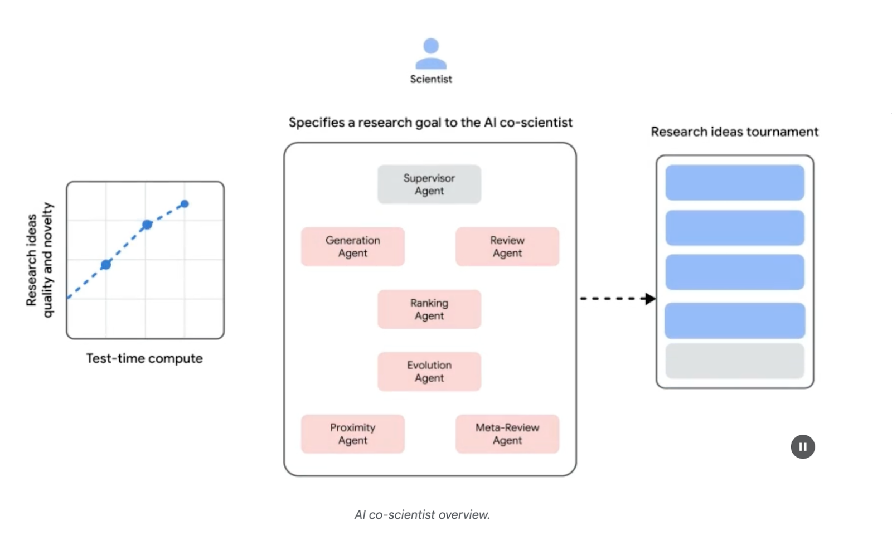
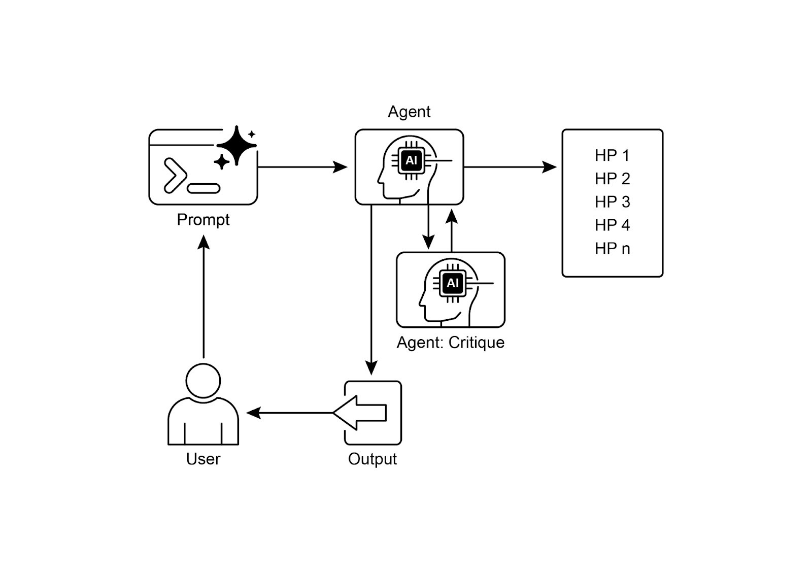

# 📚 Agentic Design Patterns (中文版)

> **提取时间**：2025-12-17 05:14:24
> **内容类型**：中文简体版本
> **总页数**：424 页
> **原始来源**：https://github.com/ginobefun/agentic-design-patterns-cn

---

# Chapter 21：Exploration and Discovery | <mark>第二十一章：探索与发现</mark>

本章探讨的模式使智能体能够主动寻找新信息发现新可能性， 并识别其运行环境中的未知之未知探索与发现模式不同于在预定义解决方案空间内的反应式行为或优化相反， 它们侧重于智能体主动进入陌生领域尝试新方法并生成新知识或理解对于在开放式复杂或快速演变的领域中运行的智能体来说， 这种模式至关重要， 因为在这些领域中， 静态知识或预编程解决方案是不够的它强调智能体扩展其理解和能力的潜力

---

## Practical Applications & Use Cases | <mark>实际应用场景</mark>

智能体拥有智能化优先排序和探索的能力， 这使其能够在各个领域中得到应用通过自主评估和排序潜在行动， 这些智能体可以在复杂环境中导航发现隐藏的洞察并推动创新这种优先探索的能力使它们能够优化流程发现新知识并生成内容

示例：

科学研究自动化： 智能体设计和运行实验分析结果并提出新假设， 以发现新材料候选药物或科学原理

游戏和策略生成： 智能体探索游戏状态， 发现涌现策略或识别游戏环境中的漏洞（例如）

市场研究和趋势发现： 智能体扫描非结构化数据（社交媒体新闻报告）以识别趋势消费者行为或市场机会

安全漏洞发现： 智能体探测系统或代码库以发现安全漏洞或攻击向量

创意内容生成： 智能体探索风格主题或数据的组合， 以生成艺术作品音乐作品或文学作品

个性化教育和培训： 导师根据学生的进度学习风格和需要改进的领域来优先安排学习路径和内容交付

### Google Co-Scientist | <mark>Google 协作科学家</mark>

协作科学家是开发的一个系统， 旨在作为计算科学协作者它协助人类科学家进行研究， 包括假设生成提案优化和实验设计等方面该系统基于大语言模型运行

协作科学家的开发旨在解决科学研究中的挑战这些挑战包括处理大量信息生成可测试的假设以及管理实验计划协作科学家通过执行涉及大规模信息处理和综合的任务来支持研究人员， 可能会揭示数据中的关系其目的是通过处理早期研究中计算密集型的方面来增强人类认知过程

系统架构和方法： 协作科学家的架构基于多智能体框架， 旨在模拟协作和迭代过程该设计集成了专门的智能体， 每个智能体在实现研究目标方面都有特定的角色监督智能体在异步任务执行框架内管理和协调这些单个智能体的活动， 该框架允许计算资源的灵活扩展

核心智能体及其功能包括（见图）：

生成智能体： 通过文献探索和模拟科学辩论生成初始假设来启动该过程

反思智能体： 作为同行评审者， 批判性地评估生成假设的正确性新颖性和质量

排名智能体： 采用基于评级的竞赛模式， 通过模拟科学辩论来比较排名和优先排序假设

演化智能体： 通过简化概念综合想法和探索非常规推理来持续优化排名靠前的假设

邻近智能体： 计算邻近图以聚类相似的想法， 并协助探索假设空间

元评审智能体： 综合所有评审和辩论的见解， 以识别共同模式并提供反馈， 使系统能够持续改进

该系统的运行基础依赖于， 它提供语言理解推理和生成能力该系统采用测试时计算扩展机制， 该机制分配更多的计算资源以迭代推理并增强输出该系统处理和综合来自不同来源的信息， 包括学术文献网络数据和数据库



图： （由作者提供）协作科学家： 从构思到验证

该系统遵循迭代的生成辩论和演化方法， 反映了科学方法在接收来自人类科学家的科学问题输入后， 该系统进入假设生成评估和优化的自我改进循环假设经过系统性评估， 包括智能体之间的内部评估和基于竞赛的排名机制

验证和结果： 协作科学家的实用性已在多项验证研究中得到证明， 特别是在生物医学领域， 通过自动化基准测试专家评审和端到端湿实验室实验来评估其性能

自动化和专家评估： 在具有挑战性的基准测试中， 该系统的内部评级与其结果的准确性一致， 在困难的钻石集上达到了的准确率对超过个研究目标的分析表明， 扩展测试时计算可以持续提高假设质量（通过评级衡量）在精心策划的个具有挑战性的问题集上， 协作科学家的表现优于其他最先进的模型和人类专家提供的最佳猜测解决方案在小规模评估中， 生物医学专家认为协作科学家的输出比其他基线模型更新颖更具影响力该系统提出的药物再利用提案（格式化为特定目标页面）也被六位肿瘤学专家小组评为高质量

端到端实验验证：

药物再利用： 对于急性髓系白血病（）， 该系统提出了新的候选药物其中一些， 如， 是完全新颖的建议， 之前没有用于的临床前证据随后的体外实验证实， 和其他建议的药物在多个细胞系中以临床相关浓度抑制肿瘤细胞活力

新靶点发现： 该系统识别出肝纤维化的新表观遗传靶点使用人类肝脏类器官的实验室实验验证了这些发现， 表明针对建议的表观遗传修饰剂的药物具有显著的抗纤维化活性识别出的药物之一已被批准用于另一种疾病， 为再利用提供了机会

抗菌素耐药性： 协作科学家独立重现了未发表的实验发现它被要求解释为什么某些可移动遗传元素（）在许多细菌物种中被发现在两天内， 该系统的最高排名假设是与不同的噬菌体尾部相互作用以扩大其宿主范围这反映了一个独立研究小组经过十多年研究才达到的新颖经实验验证的发现

增强和局限性： 协作科学家背后的设计理念强调增强而非完全自动化人类研究研究人员通过自然语言与系统交互并指导系统， 提供反馈贡献自己的想法， 并在科学家在回路中的协作范式中指导的探索过程然而， 该系统存在一些局限性其知识受限于对开放获取文献的依赖， 可能会错过付费墙后的关键先前工作它对负面实验结果的访问也有限， 而这些结果很少发表但对经验丰富的科学家至关重要此外， 该系统继承了底层大语言模型的局限性， 包括事实不准确或幻觉的可能性

安全性： 安全性是一个关键考虑因素， 该系统包含多重保护措施所有研究目标在输入时都会进行安全审查， 生成的假设也会被检查， 以防止系统被用于不安全或不道德的研究使用个对抗性研究目标进行的初步安全评估发现， 该系统可以稳健地拒绝危险输入为确保负责任的开发， 该系统正通过可信测试者计划向更多科学家提供， 以收集真实世界的反馈

---

## Hands-On Code Example | <mark>实战代码示例</mark>

让我们看一个探索与发现的智能体实际应用的具体示例： ， 这是在许可证下开发的项目

是一个自主研究工作流框架， 旨在增强而非替代人类科学工作该系统利用专门的大语言模型自动化科学研究过程的各个阶段， 从而使人类研究人员能够将更多认知资源用于概念化和批判性分析

该框架集成了， 这是一个用于自主研究智能体的去中心化存储库促进研究成果的存储检索和开发

通过不同的阶段指导研究过程：

文献综述： 在这个初始阶段， 由大语言模型驱动的专门智能体负责自主收集和批判性分析相关学术文献这涉及利用等外部数据库来识别综合和分类相关研究， 有效地为后续阶段建立全面的知识库

实验： 这个阶段包括实验设计的协作制定数据准备实验执行和结果分析智能体利用集成工具（如用于代码生成和执行的， 以及用于模型访问的）进行自动化实验该系统设计用于迭代优化， 智能体可以根据实时结果调整和优化实验程序

报告撰写： 在最后阶段， 该系统自动生成全面的研究报告这涉及将实验阶段的发现与文献综述的见解相结合， 根据学术惯例构建文档， 并集成外部工具（如）以进行专业格式化和图表生成

知识共享： 是一个平台， 使自主研究智能体能够共享访问和协作推进科学发现它允许智能体在先前发现的基础上构建， 促进累积性研究进展

的模块化架构确保了计算灵活性其目标是通过自动化任务来提高研究生产力， 同时保持人类研究人员的参与

代码分析： 虽然全面的代码分析超出了本书的范围， 但我想为你提供一些关键见解， 并鼓励你自己深入研究代码

评判： 为了模拟人类评估过程， 该系统采用三方智能体判断机制来评估输出这涉及部署三个不同的自主智能体， 每个智能体都配置为从特定角度评估生产， 从而共同模拟人类判断的细微和多方面性质这种方法允许更强大和全面的评估， 超越单一指标以捕获更丰富的定性评估

```python

```

判断智能体设计了特定的提示词， 紧密模拟人类评审者通常采用的认知框架和评估标准该提示词指导智能体通过类似于人类专家的视角来分析输出， 考虑相关性连贯性事实准确性和整体质量等因素通过设计这些提示词以镜像人类评审协议， 该系统旨在达到接近人类辨别力的评估复杂程度

````python

```json
```
````

在这个多智能体系统中， 研究过程围绕专门角色进行结构化， 反映典型的学术层级结构， 以简化工作流程并优化输出

教授智能体： 教授智能体作为主要研究主管， 负责建立研究议程定义研究问题并将任务委派给其他智能体该智能体设定战略方向并确保与项目目标保持一致

```python

```

博士后智能体： 博士后智能体的角色是执行研究这包括进行文献综述设计和实施实验以及生成研究成果（如论文）重要的是， 博士后智能体具有编写和执行代码的能力， 能够实际实施实验协议和数据分析该智能体是研究成果的主要生产者

```python

```

评审智能体： 评审智能体对博士后智能体的研究成果进行批判性评估， 评估论文和实验结果的质量有效性和科学严谨性该评估阶段模拟学术环境中的同行评审过程， 以确保在最终确定之前研究成果达到高标准

机器学习工程智能体： 机器学习工程智能体充当机器学习工程师， 与博士生进行对话式协作以开发代码它们的核心功能是生成简单的数据预处理代码， 整合从提供的文献综述和实验协议中得出的见解这确保数据格式正确并为指定实验做好准备

```python
```

软件工程智能体： 软件工程智能体指导机器学习工程智能体它们的主要目的是协助机器学习工程智能体为特定实验创建简单的数据准备代码软件工程智能体整合提供的文献综述和实验计划， 确保生成的代码简单明了并直接与研究目标相关

```python
```

总而言之， 代表了一个复杂的自主科学研究框架它旨在通过自动化关键研究阶段和促进协作式驱动的知识生成来增强人类研究能力该系统旨在通过管理日常任务来提高研究效率， 同时保持人类监督

---

## At a Glance | <mark>要点速览</mark>

问题所在： 智能体通常在预定义的知识范围内运行， 限制了它们处理新情况或开放式问题的能力在复杂和动态的环境中， 这种静态的预编程的信息不足以实现真正的创新或发现根本挑战是使智能体超越简单的优化， 主动寻找新信息并识别未知之未知这需要从纯粹的反应式行为转变为主动的智能体探索， 以扩展系统自身的理解和能力

解决之道： 标准化解决方案是构建专门设计用于自主探索和发现的智能体系统这些系统通常利用多智能体框架， 其中专门的大语言模型协作以模拟科学方法等过程例如， 可以为不同的智能体分配生成假设批判性审查假设和演化最有前景的概念等任务这种结构化的协作方法使系统能够智能地导航广阔的信息景观设计和执行实验， 并生成真正的新知识通过自动化探索的劳动密集型方面， 这些系统增强了人类智力并显著加快了发现的步伐

经验法则： 在解决方案空间未完全定义的开放式复杂或快速演变的领域中使用探索与发现模式它非常适合需要生成新假设策略或见解的任务， 例如科学研究市场分析和创意内容生成当目标是发现未知之未知而不仅仅是优化已知过程时， 这种模式至关重要

可视化总结：



图： 探索与发现设计模式

---

## Key Takeaways | <mark>核心要点</mark>

中的探索与发现使智能体能够主动追求新信息和新可能性， 这对于在复杂和不断演变的环境中导航至关重要

协作科学家等系统展示了智能体如何自主生成假设和设计实验， 补充人类科学研究

以的专门角色为例的多智能体框架通过自动化文献综述实验和报告撰写来改进研究

最终， 这些智能体旨在通过管理计算密集型任务来增强人类创造力和解决问题的能力， 从而加速创新和发现

---

## Conclusion | <mark>结语</mark>

总之， 探索与发现模式是真正智能体系统的本质， 定义了其超越被动遵循指令而主动探索环境的能力这种固有的智能体驱动力使能够在复杂领域中自主运行， 不仅执行任务， 而且独立设定子目标以发现新信息这种高级智能体行为通过多智能体框架最有力地实现， 其中每个智能体在更大的协作过程中体现特定的主动角色例如， 协作科学家的高度智能体系统具有自主生成辩论和演化科学假设的智能体

像这样的框架通过创建模仿人类研究团队的智能体层级结构来进一步构建这一点， 使系统能够自我管理整个发现生命周期该模式的核心在于编排涌现的智能体行为， 允许系统在最少的人工干预下追求长期的开放式目标这提升了人机合作伙伴关系， 将定位为真正的智能体协作者， 处理探索任务的自主执行通过将这种主动发现工作委托给智能体系统， 人类智力得到显著增强， 加速创新开发如此强大的智能体能力也需要对安全性和道德监督做出坚定承诺最终， 这种模式为创建真正的智能体提供了蓝图， 将计算工具转变为追求知识的独立目标寻求的合作伙伴

---

## References | <mark>参考文献</mark>

探索利用困境： 强化学习和不确定性决策中的基本问题

协作科学家：

： 使用智能体作为研究助手

： 迈向协作式自主研究：
