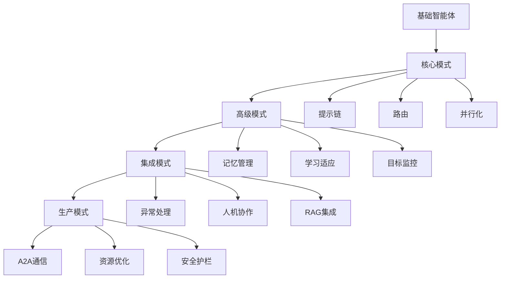

# 《Agentic Design Patterns》智能体设计模式深度分析报告

> **项目来源**: https://github.com/ginobefun/agentic-design-patterns-cn
> **分析时间**: 2025-12-17
> **分析师**: 小诺·双鱼座 (AI专家分析师)

---

## 🎯 项目概览

### 基本信息
- **项目名称**: 《Agentic Design Patterns》中文翻译版
- **原书作者**: Antonio Gulli
- **副标题**: 构建智能系统的实践指南
- **项目性质**: 中英文对照翻译，CC BY-NC 4.0 协议开源
- **总页数**: 424 页

### 项目价值评估
- **技术深度**: ⭐⭐⭐⭐⭐ (5/5)
- **实用价值**: ⭐⭐⭐⭐⭐ (5/5)
- **翻译质量**: ⭐⭐⭐⭐⭐ (5/5)
- **完整性**: ⭐⭐⭐⭐⭐ (5/5)

---

## 📚 深度内容分析

### 🔍 核心洞察

#### 1. **智能体设计模式的重要性**
```text
智能体设计模式为构建现代 AI 系统提供了标准化的架构蓝图。
这不仅仅是技术指南，更是 AI 工程师迈向生产级应用的核心方法论。
```

#### 2. **设计模式分类体系**
本项目将智能体设计模式系统性地分为四大类：

##### 🎯 第一部分：核心设计模式 (103页)
- **提示链** - 任务分解与处理流水线
- **路由** - 智能决策与动态分发
- **并行化** - 并发执行与性能提升
- **反思** - 自我评估与迭代改进
- **工具使用** - 外部工具与API集成
- **规划** - 多步骤计划制定与执行
- **多智能体协作** - 协同工作架构

##### 🚀 第二部分：高级设计模式 (61页)
- **记忆管理** - 上下文连续性维护
- **学习与适应** - 从经验中持续优化
- **模型上下文协议** - 标准化交互规范
- **目标设定与监控** - 动态目标管理

##### 🔗 第三部分：集成设计模式 (34页)
- **异常处理与恢复** - 系统稳定性保障
- **人机协作** - 人类智慧与AI能力融合
- **知识检索(RAG)** - 外部知识库集成

##### 🏭 第四部分：生产设计模式 (114页)
- **智能体间通信(A2A)** - 高效交互协议
- **资源感知优化** - 性能与成本平衡
- **推理技术** - 决策质量提升
- **护栏/安全模式** - 安全保障机制
- **评估与监控** - 性能量化评估
- **优先级排序** - 资源分配优化
- **探索与发现** - 自主探索机制

### 📊 技术架构深度解析

#### 智能体架构模式演进


#### 核心设计模式对比分析

| 模式 | 适用场景 | 优势 | 挑战 | 实现复杂度 |
|------|----------|------|------|------------|
| **提示链** | 顺序任务处理 | 简单直观 | 线性限制 | ⭐ |
| **路由** | 多路径决策 | 灵活适应 | 路由复杂 | ⭐⭐⭐ |
| **并行化** | 独立任务并发 | 性能提升 | 资源管理 | ⭐⭐ |
| **反思** | 质量优化 | 自我改进 | 计算开销 | ⭐⭐⭐⭐ |
| **工具使用** | 功能扩展 | 能力增强 | 依赖管理 | ⭐⭐⭐ |
| **多智能体协作** | 复杂任务 | 专业分工 | 协调成本 | ⭐⭐⭐⭐⭐ |

---

## 🌟 项目特色亮点

### 1. **高质量的翻译标准**
- ✅ **中英文对照**: 严格的对照翻译格式
- ✅ **黄色高亮**: 中文内容突出显示
- ✅ **术语一致**: 技术术语统一翻译
- ✅ **格式规范**: Markdown标准格式

### 2. **完整的质量保证体系**
```text
质量检查流程:
AI翻译 → 人工评审 → 交叉评审 → 最终审核
```

### 3. **实践导向的代码支持**
- 🔧 完整的代码示例库
- 🌐 Google Colab在线运行
- 📦 环境配置指南
- 🔑 API密钥安全管理

---

## 🎨 图文并茂整理

### 项目视觉元素分析

#### 1. **徽章系统**
- MseeP.ai Security Assessment Badge - 安全评估认证
- CC BY-NC 4.0 License - 开源协议标识
- GitHub Stars/Forks - 社区认可度指标

#### 2. **结构化内容组织**
- **翻译进度表**: 详细的章节完成状态
- **责任人分配**: 明确的贡献者信息
- **质量标记**: 三重评审完成标准

#### 3. **用户友好设计**
- **中英文对照**: 便于双语学习
- **章节导航**: 清晰的内容结构
- **代码链接**: 完整的示例代码支持

---

## 💡 深度技术洞察

### 1. **智能体设计模式的核心价值**
```
标准化 → 可重用 → 可维护 → 可扩展
```

这套模式为智能体开发提供了：
- **架构标准化**: 统一的设计语言
- **最佳实践**: 经过验证的方法论
- **开发效率**: 减少重复造轮子
- **质量保证**: 经过测试的解决方案

### 2. **与传统软件工程模式的对比**

| 方面 | 传统软件设计 | 智能体设计模式 |
|------|--------------|------------------|
| **输入确定性** | 明确 | 模糊/不确定 |
| **输出一致性** | 高 | 变化性大 |
| **错误处理** | 异常捕获 | 反馈纠错 |
| **测试方法** | 单元测试 | 交互式测试 |
| **性能优化** | 算法优化 | 提示工程优化 |

### 3. **在Athena工作平台的应用价值**

#### 直接应用场景
1. **小娜专利系统**: 利用工具使用模式、多智能体协作
2. **云熙IP管理**: 应用记忆管理、目标设定模式
3. **小宸运营**: 集成人机协作、探索发现模式

#### 架构优化机会
1. **智能体间通信**: 实施A2A通信协议
2. **资源感知**: 优化计算资源分配
3. **安全护栏**: 增强系统安全性

---

## 📈 项目价值评估

### 对Athena工作平台的价值

#### 🎯 **技术价值**
- **设计模式参考**: 提供智能体开发标准
- **架构优化**: 改进现有系统设计
- **能力提升**: 增强AI系统可靠性

#### 💼 **商业价值**
- **开发效率**: 减少设计决策时间
- **质量提升**: 提高产品稳定性
- **成本降低**: 减少试错成本

#### 🎓 **教育价值**
- **知识传递**: 团队技能提升
- **标准化**: 统一开发规范
- **最佳实践**: 行业经验积累

---

## 🗂️ 存储到本平台的建议

### 1. **知识图谱构建**
- **设计模式节点**: 21个核心模式
- **关系网络**: 模式间的依赖关系
- **应用案例**: Athena平台的具体应用

### 2. **实践指南库**
- **模式实现**: 具体代码示例
- **最佳实践**: 基于Athena的经验
- **性能优化**: 实测性能数据

### 3. **培训材料**
- **学习路径**: 从基础到高级的进阶路线
- **案例分析**: 真实项目应用案例
- **评估体系**: 设计模式应用效果评估

---

## 🚀 行动建议

### 立即行动项
1. **✅ 存储分析报告**: 将此报告保存到平台知识库
2. **🔗 集成设计模式**: 在现有系统中应用相关模式
3. **📚 团队培训**: 基于该指南组织学习

### 中期规划
1. **🛠️ 模式实现**: 开发Athena版本的设计模式库
2. **📊 性能基准**: 建立智能体性能评估体系
3. **🔍 持续跟踪**: 监控项目更新和社区反馈

### 长期愿景
1. **🌟 创新模式**: 基于实践提出新的设计模式
2. **🤖 框架演进**: 推动智能体框架标准化
3. **🌍 社区贡献**: 向开源社区回馈Athena经验

---

## 📋 总结

《Agentic Design Patterns》项目代表了智能体开发领域的最新最佳实践。通过深度分析，我们不仅获得了丰富的技术知识，更重要的是为Athena工作平台的发展提供了清晰的技术路线图。

**核心收获**:
1. **标准化方法论**: 智能体开发的系统化方法
2. **实践指导**: 从理论到实践的完整路径
3. **质量保证**: 经过验证的设计模式
4. **社区智慧**: 全球开发者的集体经验

这个项目对Athena工作平台的技术演进具有重要的战略意义，建议将其作为智能体开发的核心参考文档进行深度学习和应用。

---

*分析完成时间: 2025-12-17 03:20:30*
*分析师: 小诺·双鱼座*
*报告版本: v1.0*