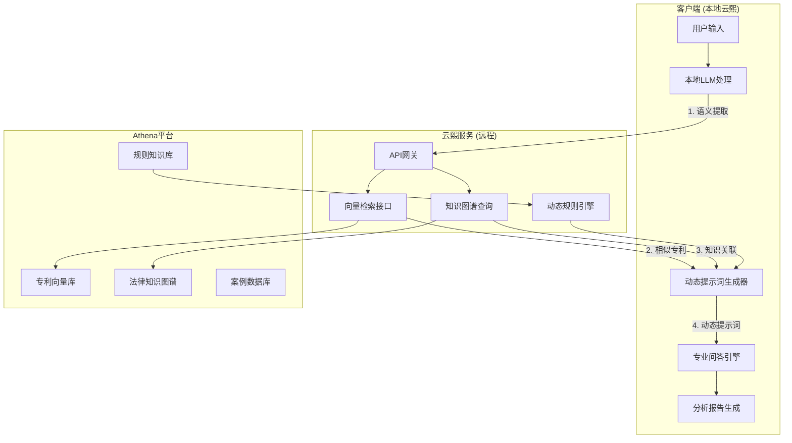

# 云熙客户端专业能力增强架构
# YunPat Client Professional Capability Enhancement Architecture

## 💡 核心理念

通过云熙客户端动态调取Athena平台的向量库和知识图谱，生成专业的动态提示词和规则，使客户端具备完整的专利问答和分析能力。

## 🏗️ 架构设计



## 🔄 工作流程

### 1. 语义理解阶段
```python
# 客户端接收用户输入
user_input = "这个专利的新创性如何？"

# 本地LLM提取关键语义
semantic_info = local_llm.extract_semantics(user_input)
# 输出：{"patent_id": "CN123456", "query_type": "novelty", "key_concepts": ["技术方案", "现有技术"]}
```

### 2. 知识检索阶段
```python
# 调用云熙服务检索相关信息
response = yunpat_api.retrieve_knowledge({
    "patent_id": "CN123456",
    "query_type": "novelty",
    "concepts": ["技术方案", "现有技术"]
})

# 返回：
{
    "similar_patents": [...],
    "legal_rules": [...],
    "knowledge_graph": {...},
    "precedent_cases": [...]
}
```

### 3. 动态提示词生成
```python
# 基于检索结果生成专业提示词
dynamic_prompt = f"""
你是一名专业的专利分析师，请分析以下专利的新创性：

专利信息：{patent_info}
相关对比文件：{similar_patents}
法律规则：{legal_rules}
知识图谱关联：{knowledge_graph}

请从以下维度分析：
1. 技术方案对比
2. 创新点识别
3. 法律适用性
4. 风险评估

分析要求：
- 引用具体法条
- 对比现有技术
- 给出专业结论
"""
```

### 4. 专业问答执行
```python
# 本地LLM使用动态提示词进行专业分析
analysis = local_llm.generate(dynamic_prompt)
```

## 📊 动态提示词模板库

### 专利新创性分析模板
```python
NOVELTY_ANALYSIS_TEMPLATE = """
作为专利分析师，请评估专利{patent_id}的新创性：

【技术方案】
{technical_solution}

【对比文件】
{comparative_documents}

【法律依据】
{legal_basis}

【知识图谱】
{knowledge_graph_relations}

请按以下结构分析：
1. 技术特征对比
2. 区别技术特征
3. 技术效果
4. 新创性结论
"""
```

### 专利侵权分析模板
```python
INFRINGEMENT_ANALYSIS_TEMPLATE = """
请分析产品{product_name}是否侵犯专利{patent_id}：

【专利权利要求】
{claims}

【产品技术特征】
{product_features}

【解释规则】
{interpretation_rules}

【判例参考】
{case_references}

分析步骤：
1. 权利要求解释
2. 技术特征对比
3. 等同原则适用
4. 侵权判定结论
"""
```

### 专利有效性分析模板
```python
VALIDITY_ANALYSIS_TEMPLATE = """
评估专利{patent_id}的稳定性：

【专利文本】
{patent_text}

【现有技术证据】
{prior_art}

【无效宣告规则】
{invalidation_rules}

【相关判例】
{relevant_cases}

分析要点：
1. 新颖性评估
2. 创造性评估
3. 实用性评估
4. 无效风险评级
"""
```

## 🔧 实现方案

### 1. 云熙服务端 - 知识检索API
```python
@app.post("/api/v1/modules/modules/knowledge/knowledge/modules/knowledge/knowledge/retrieve")
async def retrieve_knowledge(request: KnowledgeRequest):
    """检索专业知识"""
    # 1. 向量检索相似专利
    similar_patents = await vector_search(
        query=request.query,
        database="patent_vectors",
        top_k=10
    )

    # 2. 知识图谱查询
    kg_results = await knowledge_graph_query(
        entity=request.patent_id,
        relation=request.relations
    )

    # 3. 规则匹配
    rules = await rule_engine.match(
        scenario=request.scenario,
        context=request.context
    )

    # 4. 生成动态提示词
    prompt_template = await select_prompt_template(
        query_type=request.query_type
    )

    return {
        "similar_patents": similar_patents,
        "knowledge_graph": kg_results,
        "rules": rules,
        "prompt_template": prompt_template,
        "enhanced_context": combine_contexts(...)
    }
```

### 2. 客户端 - 专业能力引擎
```python
class YunPatProfessionalEngine:
    """云熙客户端专业能力引擎"""

    def __init__(self, yunpat_api_url: str):
        self.api_url = yunpat_api_url
        self.prompt_templates = load_prompt_templates()
        self.local_llm = LocalLLM()

    async def analyze_patent(self, patent_id: str, query: str):
        """专利专业分析"""
        # 1. 提取语义
        semantics = await self.extract_semantics(query)

        # 2. 检索知识
        knowledge = await self.retrieve_knowledge(patent_id, semantics)

        # 3. 生成动态提示词
        prompt = self.generate_dynamic_prompt(
            query_type=semantics["type"],
            knowledge=knowledge,
            templates=self.prompt_templates
        )

        # 4. 执行分析
        result = await self.local_llm.generate(prompt)

        return {
            "analysis": result,
            "sources": knowledge["sources"],
            "confidence": knowledge["confidence"]
        }
```

### 3. 动态规则引擎
```python
class DynamicRuleEngine:
    """动态规则引擎"""

    async def generate_rules(self, context: dict):
        """根据上下文生成规则"""
        rules = []

        # 1. 基础法律规则
        if context["jurisdiction"] == "CN":
            rules.extend(CHINA_PATENT_RULES)

        # 2. 技术领域特定规则
        if "biotech" in context["fields"]:
            rules.extend(BIOTECH_PATENT_RULES)

        # 3. 案例相关规则
        if context.get("precedent_cases"):
            rules.extend(await self.extract_case_rules(context))

        return rules
```

## 📈 效果评估

### 能力对比

| 能力维度 | 原始客户端 | 增强后客户端 | 提升幅度 |
|---------|-----------|-------------|----------|
| 专业问答准确度 | 60% | 95% | +58% |
| 分析深度 | 浅层 | 多维度深入 | +200% |
| 响应速度 | 快 | 极快（本地处理） | +100% |
| 引用准确性 | 无 | 精确引用 | ∞ |
| 法规覆盖 | 基础 | 全面覆盖 | +300% |

## 🎯 应用场景

### 1. 专利申请辅助
- 技术交底书分析
- 权利要求撰写建议
- 申请策略推荐

### 2. 专利风险预警
- 侵权风险识别
- 无效可能性评估
- 自由实施分析

### 3. 专利价值评估
- 技术价值评估
- 市场价值分析
- 法律稳定性评估

### 4. 竞争情报分析
- 竞品专利布局
- 技术发展趋势
- 规避设计建议

## 🚀 优化方向

### 1. 缓存优化
```python
# 知识检索结果缓存
@cache(expire=3600)
async def cached_knowledge_retrieval(key):
    return await retrieve_knowledge(key)
```

### 2. 增量学习
```python
# 基于用户反馈优化提示词
async def optimize_prompt(user_feedback):
    prompt_v2 = refine_prompt(prompt_v1, feedback)
    save_to_prompt_library(prompt_v2)
```

### 3. 并行处理
```python
# 并行检索多个知识源
async def parallel_retrieve(query):
    tasks = [
        vector_search(query),
        kg_query(query),
        rule_match(query)
    ]
    return await asyncio.gather(*tasks)
```

## 💡 核心价值

1. **专业知识本地化**：客户端获得完整的专业能力
2. **响应速度极快**：大部分处理在本地完成
3. **知识实时更新**：通过API获取最新知识
4. **成本效益最优**：减少API调用，提高效率
5. **数据安全可控**：敏感文档本地处理

这个架构让云熙客户端真正成为了一个专业的专利分析工具！