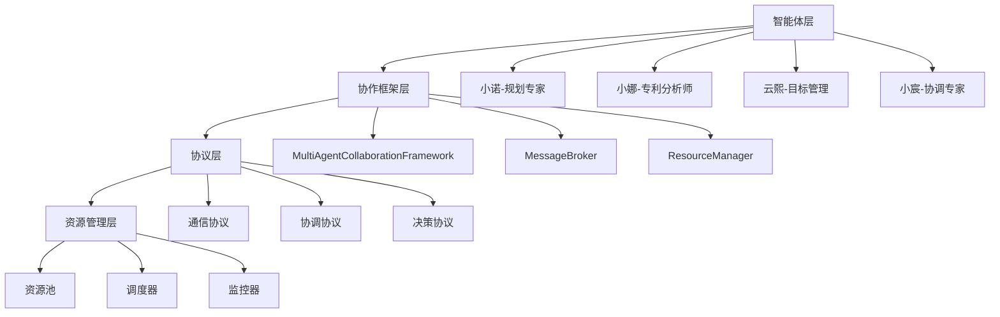

# 多智能体协作系统API文档

**版本**: 2.0
**最后更新**: 2025年12月17日
**作者**: AI开发团队

## 📋 目录

1. [系统概述](#系统概述)
2. [核心概念](#核心概念)
3. [API接口文档](#api接口文档)
4. [使用指南](#使用指南)
5. [配置参考](#配置参考)
6. [最佳实践](#最佳实践)
7. [故障排除](#故障排除)

---

## 系统概述

### 架构概览

多智能体协作系统是一个基于智能体设计模式的分布式协作平台，支持：

- 🤖 **智能体管理**: 智能体注册、状态监控、能力管理
- 🔄 **协作协议**: 通信、协调、决策协议
- 📊 **任务调度**: 智能任务分配、资源优化、负载均衡
- 🛡️ **错误处理**: 自动错误恢复、重试机制、降级策略
- 📈 **性能监控**: 实时性能指标、统计分析、报警机制

### 系统组件



---

## 核心概念

### 智能体 (Agent)

智能体是系统的基本执行单元，具有以下属性：

```python
@dataclass
class Agent:
    id: str                          # 智能体唯一标识
    name: str                        # 智能体名称
    capabilities: List[AgentCapability]  # 能力列表
    status: AgentStatus              # 当前状态
    current_load: int                # 当前负载
    max_load: int                    # 最大负载
    availability_schedule: Dict[str, Any]  # 可用性时间表
    metadata: Dict[str, Any]         # 元数据
```

### 智能体能力 (AgentCapability)

统一的能力定义系统：

```python
@dataclass
class UnifiedAgentCapability:
    name: str                              # 能力名称
    description: str                       # 能力描述
    type: CapabilityType                   # 能力类型
    proficiency: float                     # 熟练度 (0.0-1.0)
    availability: float                    # 可用性 (0.0-1.0)
    max_concurrent_tasks: int              # 最大并发任务数
    estimated_duration: timedelta          # 预估执行时间
    cost_per_hour: float                   # 每小时成本
```

### 协作协议 (Collaboration Protocol)

协议定义了智能体之间的交互规则：

- **通信协议**: 消息传递、广播、点对点通信
- **协调协议**: 任务分配、资源调度、冲突解决
- **决策协议**: 投票机制、共识达成、提案管理

---

## API接口文档

### 智能体管理API

#### 注册智能体

```python
async def register_agent(agent: Agent) -> bool:
    """
    注册新智能体到协作框架

    Args:
        agent: 智能体对象，包含ID、名称、能力等信息

    Returns:
        bool: 注册是否成功

    Example:
        agent = Agent(
            id="xiaonuo_001",
            name="小诺",
            capabilities=[
                UnifiedAgentCapability(
                    name="task_planning",
                    description="任务规划能力",
                    type=CapabilityType.TECHNICAL,
                    proficiency=0.9
                )
            ]
        )
        success = await framework.register_agent(agent)
    """
```

#### 获取智能体状态

```python
def get_agent_status(agent_id: str) -> Optional[Dict[str, Any]]:
    """
    获取智能体当前状态

    Args:
        agent_id: 智能体ID

    Returns:
        Dict: 智能体状态信息，包含：
            - id: 智能体ID
            - name: 智能体名称
            - status: 当前状态
            - current_load: 当前负载
            - capabilities: 能力列表
            - last_heartbeat: 最后心跳时间
    """
```

### 任务管理API

#### 创建任务

```python
def create_task(
    title: str,
    description: str,
    required_capabilities: List[str],
    priority: Priority = Priority.NORMAL,
    deadline: Optional[datetime] = None
) -> Task:
    """
    创建新任务

    Args:
        title: 任务标题
        description: 任务描述
        required_capabilities: 所需能力列表
        priority: 任务优先级
        deadline: 截止时间

    Returns:
        Task: 任务对象

    Example:
        task = create_task(
            title="专利分析任务",
            description="分析AI技术专利",
            required_capabilities=["patent_analysis"],
            priority=Priority.HIGH,
            deadline=datetime.now() + timedelta(hours=4)
        )
    """
```

### 协作会话API

#### 启动协作会话

```python
async def start_collaboration_session(
    task_id: str,
    agent_ids: List[str],
    config: Dict[str, Any]
) -> str:
    """
    启动协作会话

    Args:
        task_id: 任务ID
        agent_ids: 参与的智能体ID列表
        config: 协作配置，包含：
            - mode: 协作模式 (sequential, parallel, hierarchical)
            - coordinator: 协调者ID (层次协作模式)
            - workflow: 工作流定义

    Returns:
        str: 会话ID

    Example:
        session_id = await start_collaboration_session(
            task_id="task_001",
            agent_ids=["xiaona_agent", "xiaonuo_agent"],
            config={
                "mode": "hierarchical",
                "coordinator": "xiaona_agent",
                "workflow": ["analysis", "planning", "report"]
            }
        )
    """
```

---

## 使用指南

### 快速开始

#### 1. 初始化系统

```python
import asyncio
from core.collaboration import MultiAgentCollaborationFramework
from core.protocols import ProtocolManager

async def main():
    # 初始化框架
    framework = MultiAgentCollaborationFramework()
    protocol_manager = ProtocolManager()

    # 启动系统
    await framework.start_framework()

    print("系统初始化完成")

# 运行
asyncio.run(main())
```

#### 2. 注册智能体

```python
from core.collaboration.unified_capability import (
    UnifiedAgentCapability,
    CapabilityType
)

# 创建能力
planning_capability = UnifiedAgentCapability(
    name="task_planning",
    description="智能任务规划能力",
    type=CapabilityType.TECHNICAL,
    proficiency=0.9,
    max_concurrent_tasks=3,
    cost_per_hour=150.0
)

# 创建智能体
xiaonuo = Agent(
    id="xiaonuo_agent",
    name="小诺",
    capabilities=[planning_capability]
)

# 注册智能体
success = await framework.register_agent(xiaonuo)
print(f"小诺注册成功: {success}")
```

### 协作模式示例

#### 串行协作模式

```python
# 启动串行协作会话
session_id = await framework.start_collaboration_session(
    task.id,
    ["xiaonuo_agent", "yunxi_agent"],
    {
        "mode": "sequential",
        "workflow": ["planning", "goal_setting", "tracking"]
    }
)

print(f"串行协作会话启动: {session_id}")
```

---

## 最佳实践

### 1. 智能体设计

- **单一职责**: 每个智能体专注于特定领域
- **能力明确**: 清确定义每个能力的熟练度和限制
- **资源管理**: 合理设置最大负载和并发任务数
- **错误处理**: 实现优雅的错误处理和恢复机制

### 2. 任务设计

- **明确目标**: 清晰定义任务目标和成功标准
- **合理分解**: 将复杂任务分解为可管理的子任务
- **优先级管理**: 合理设置任务优先级和截止时间
- **依赖管理**: 明确定义任务间的依赖关系

### 3. 协作模式选择

- **串行模式**: 适用于有明确先后顺序的步骤
- **并行模式**: 适用于可独立执行的子任务
- **层次模式**: 适用于需要协调和管理的复杂任务
- **点对点模式**: 适用于对等协作场景

---

## 故障排除

### 常见问题

#### 1. 智能体注册失败

**问题**: 智能体注册返回False

**可能原因**:
- 智能体ID已存在
- 能力格式不正确
- 超过最大智能体数量限制

**解决方案**:
```python
# 检查智能体是否已存在
if agent.id in framework.agents:
    print(f"智能体 {agent.id} 已存在")

# 验证能力格式
for capability in agent.capabilities:
    if not hasattr(capability, 'name'):
        print("能力缺少name属性")
```

#### 2. 任务分配失败

**问题**: 任务无法分配给任何智能体

**解决方案**:
```python
# 查找合适的智能体
suitable_agents = framework.find_suitable_agents({
    "capabilities": task.required_capabilities
})

if not suitable_agents:
    print("没有找到合适的智能体")
    # 建议注册新的智能体或调整任务要求
```

### 调试技巧

#### 1. 启用详细日志

```python
import logging

# 设置日志级别
logging.basicConfig(
    level=logging.DEBUG,
    format='%(asctime)s - %(name)s - %(levelname)s - %(message)s'
)
```

#### 2. 监控系统状态

```python
# 获取框架状态
status = framework.get_framework_status()
print(f"注册智能体数: {status['agents']['total']}")
print(f"活动任务数: {status['tasks']['active']}")
```

---

## 联系方式

- **文档维护**: AI开发团队
- **技术支持**: 发送邮件至 support@athena-platform.com
- **Bug报告**: 通过GitHub Issues提交
- **功能请求**: 通过GitHub Discussions讨论

---

*本文档持续更新中，最新版本请查看项目仓库。*