# 🏛️ 多智能体协作架构图设计

## 1. 总体架构图

### 1.1 系统层次架构

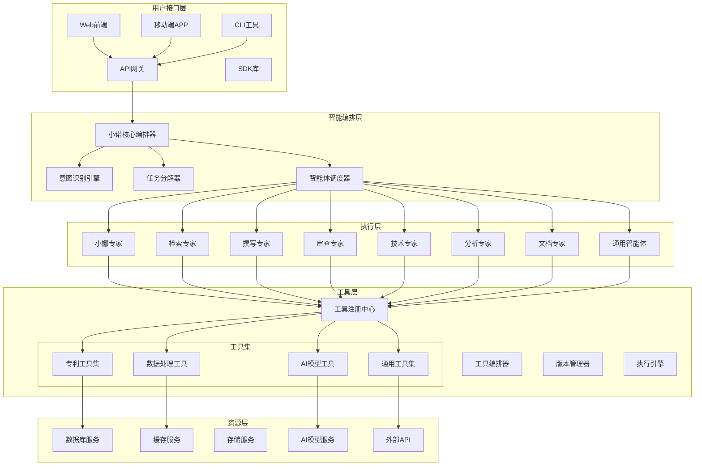

### 1.2 数据流架构图

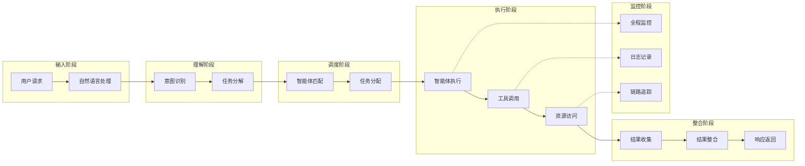

## 2. 智能体协作架构图

### 2.1 智能体协作模式

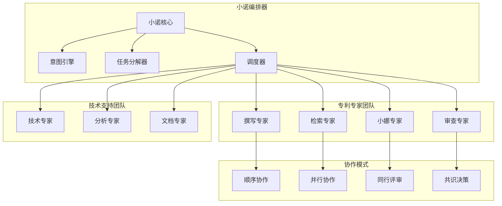

### 2.2 智能体通信架构

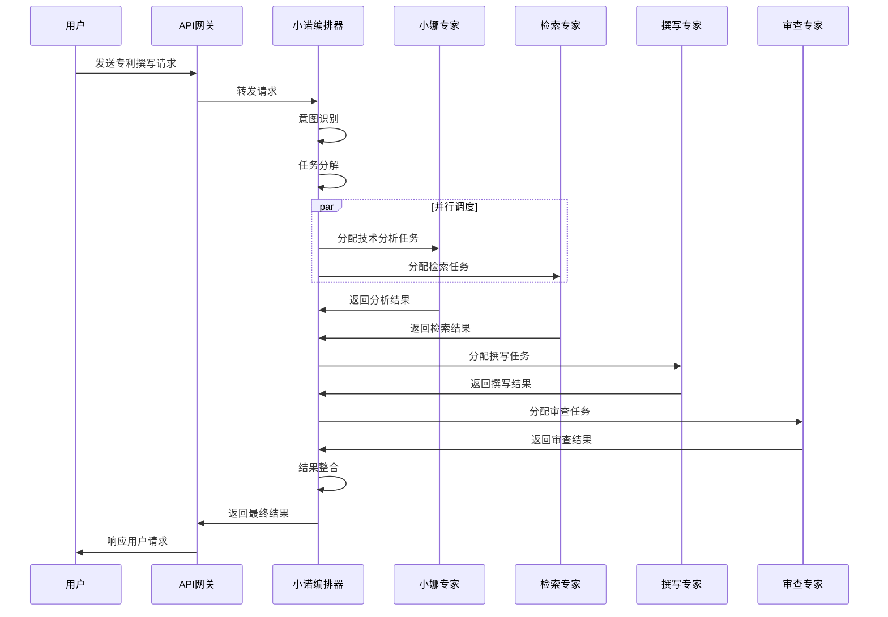

## 3. 工具系统架构图

### 3.1 工具生态系统

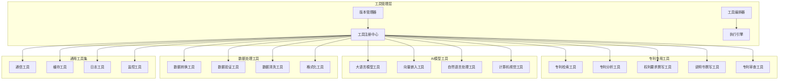

### 3.2 工具调用链架构

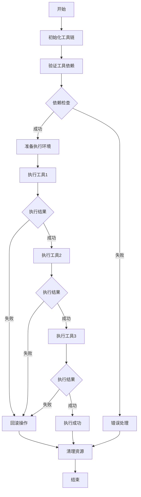

## 4. 专利撰写流水线架构图

### 4.1 流水线整体架构

```mermaid
graph LR
    subgraph "输入阶段"
        Input[技术交底书]
        Preprocess[预处理]
    end
    
    subgraph "分析阶段"
        TechAnalysis[技术分析]
        NoveltyEval[新颖性评估]
        PriorArtSearch[现有技术检索]
    end
    
    subgraph "撰写阶段"
        ClaimsDrafting[权利要求撰写]
        SpecWriting[说明书撰写]
        DrawingsGen[附图生成]
    end
    
    subgraph "审查阶段"
        QualityReview[质量审查]
        LegalCheck[法律合规检查]
        FormatCheck[格式检查]
    end
    
    subgraph "输出阶段"
        DocGeneration[文档生成]
        FinalReview[最终审查]
        Output[专利申请文件]
    end
    
    Input --> Preprocess
    Preprocess --> TechAnalysis
    Preprocess --> PriorArtSearch
    TechAnalysis --> NoveltyEval
    PriorArtSearch --> NoveltyEval
    NoveltyEval --> ClaimsDrafting
    ClaimsDrafting --> SpecWriting
    SpecWriting --> DrawingsGen
    DrawingsGen --> QualityReview
    QualityReview --> LegalCheck
    LegalCheck --> FormatCheck
    FormatCheck --> DocGeneration
    DocGeneration --> FinalReview
    FinalReview --> Output
```

### 4.2 流水线执行时序图

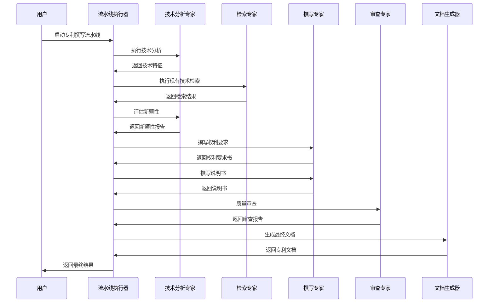

## 5. 通信协议架构图

### 5.1 通信层次架构

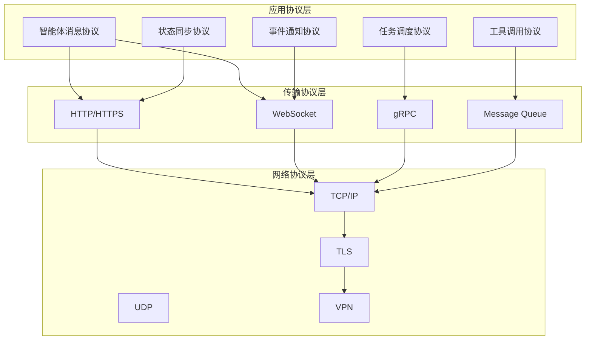

### 5.2 消息路由架构

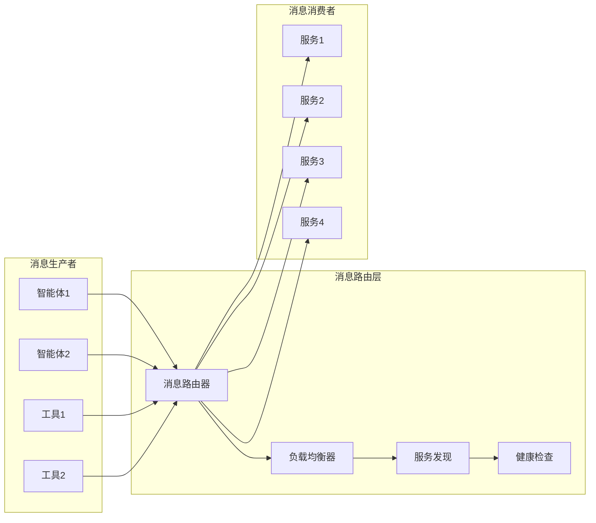

## 6. 可观测性架构图

### 6.1 监控体系架构

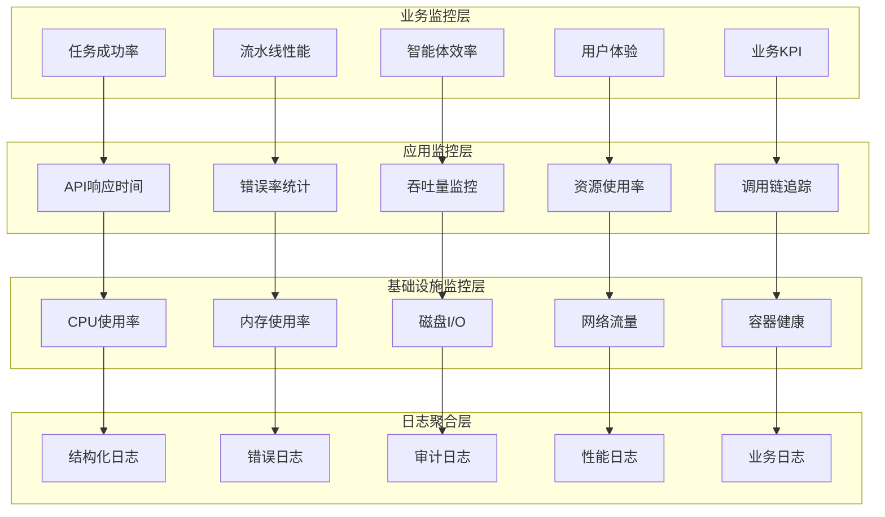

### 6.2 链路追踪架构

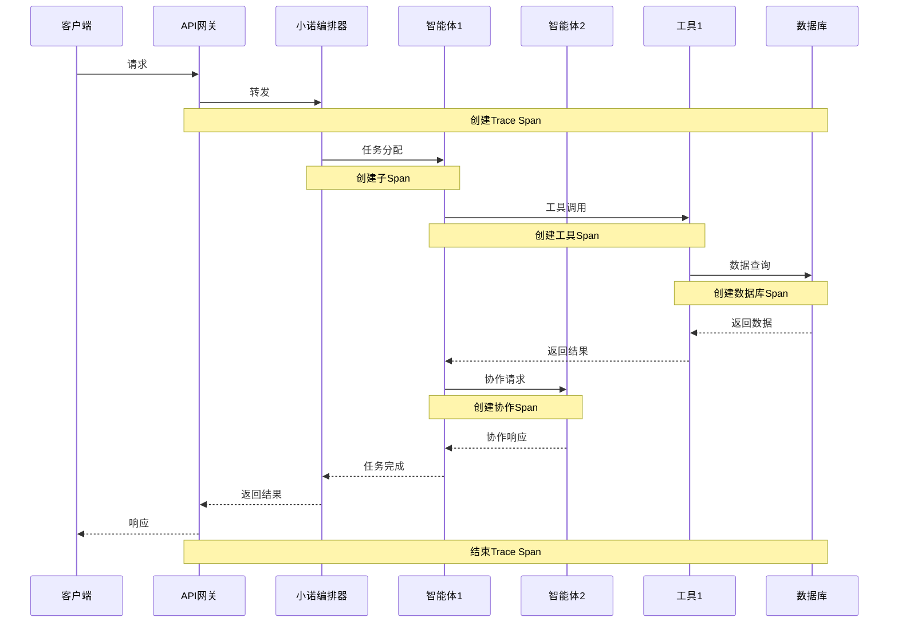

## 7. 部署架构图

### 7.1 容器化部署架构

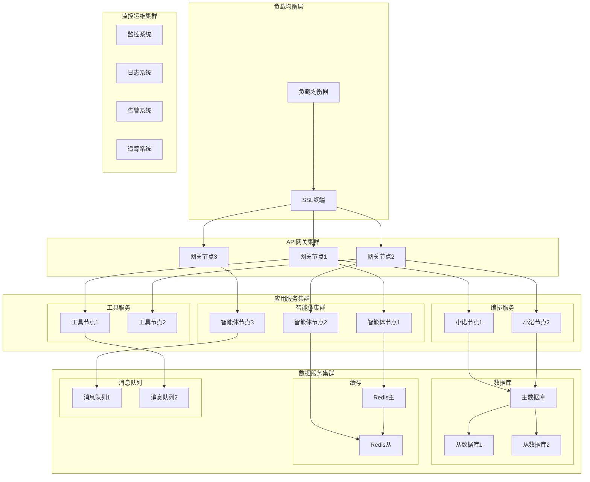

### 7.2 服务网格架构

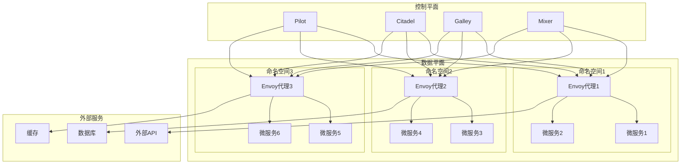

---

*架构图设计完成 - 企业级多智能体协作系统*