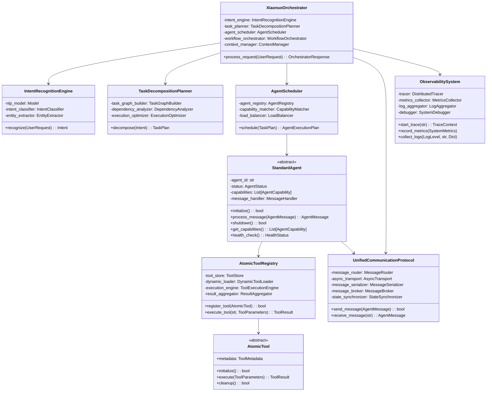
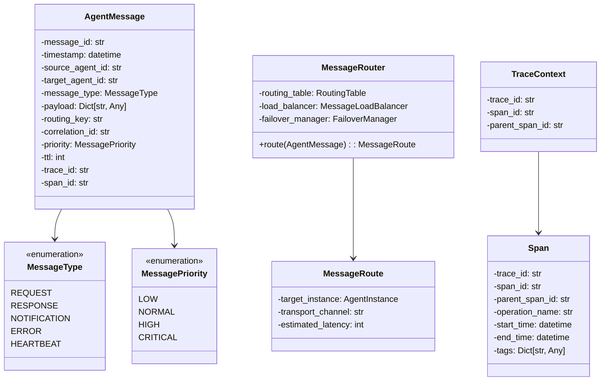
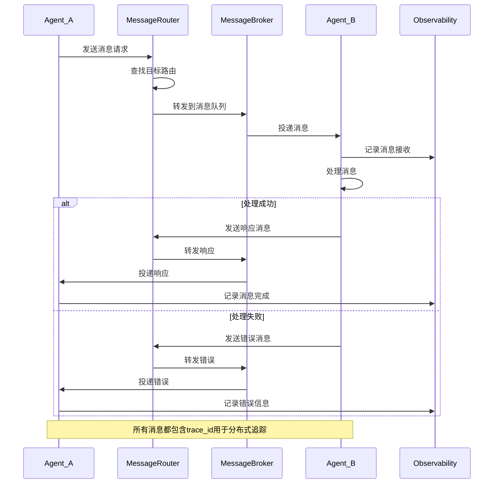
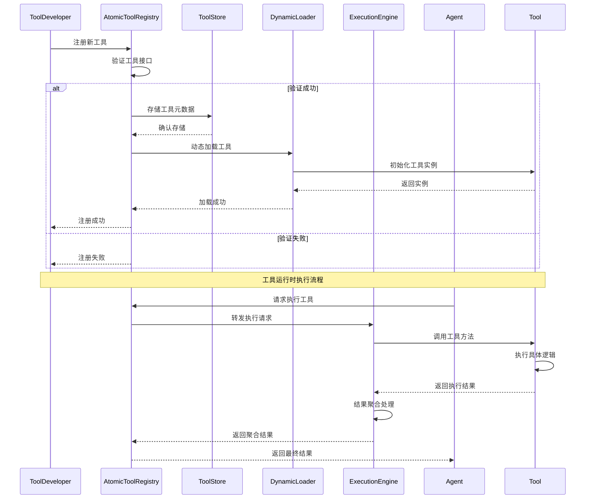
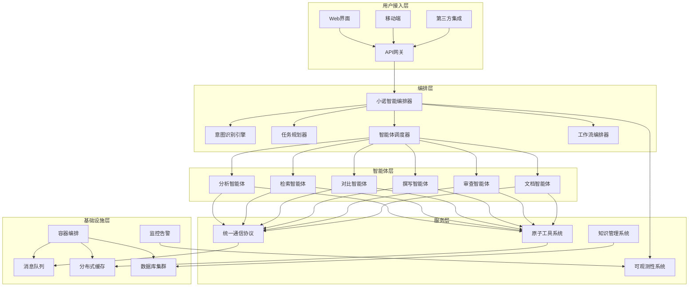
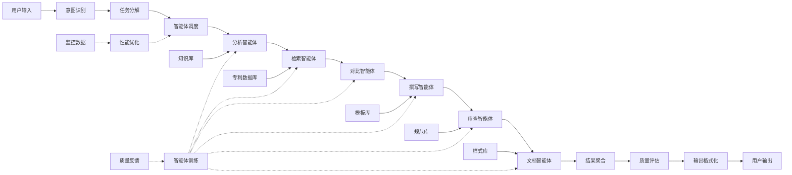
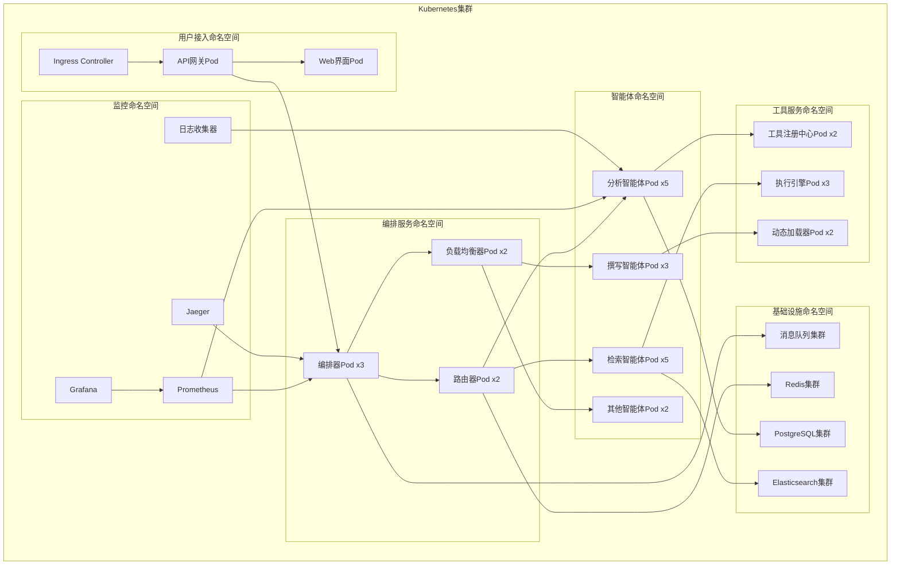
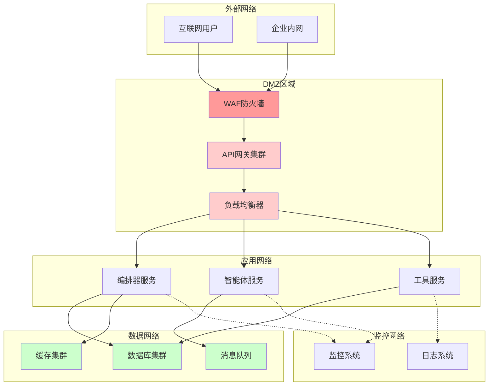

# 企业级多智能体协作架构 - 可视化设计

## 1. 系统类图

### 1.1 核心架构类图



### 1.2 专利撰写流水线类图

```mermaid
classDiagram
    class PatentWritingPipeline {
        -analysis_agent: TechnicalAnalysisAgent
        -search_agent: PatentSearchAgent
        -comparison_agent: TechnologyComparisonAgent
        -writing_agent: PatentWritingAgent
        -review_agent: PatentReviewAgent
        -document_agent: DocumentFormattingAgent
        -pipeline_orchestrator: PipelineOrchestrator
        -quality_controller: QualityController
        +execute_patent_writing(TechnicalDisclosure): PatentDocument
    }
    
    class TechnicalAnalysisAgent {
        -nlp_model: Model
        -keyword_extractor: KeywordExtractor
        -field_classifier: TechnologyFieldClassifier
        +analyze(TechnicalDisclosure): TechnicalAnalysisResult
    }
    
    class PatentSearchAgent {
        -search_engines: List[SearchEngine]
        -downloader: PatentDownloader
        -deduplicator: PatentDeduplicator
        +search(List[str], List[str]): PatentSearchResult
    }
    
    class TechnologyComparisonAgent {
        -similarity_analyzer: SimilarityAnalyzer
        -novelty_assessor: NoveltyAssessor
        +compare(TechnicalAnalysisResult, PatentSearchResult): ComparisonResult
    }
    
    class PatentWritingAgent {
        -template_engine: TemplateEngine
        -content_generator: ContentGenerator
        +write(TechnicalAnalysisResult, ComparisonResult): DraftPatentDocument
    }
    
    class PatentReviewAgent {
        -compliance_checker: ComplianceChecker
        -quality_assessor: QualityAssessor
        +review(DraftPatentDocument): ReviewedPatentDocument
    }
    
    class DocumentFormattingAgent {
        -formatter: DocumentFormatter
        -validator: FormatValidator
        +format(ReviewedPatentDocument): PatentDocument
    }
    
    PatentWritingPipeline --> TechnicalAnalysisAgent
    PatentWritingPipeline --> PatentSearchAgent
    PatentWritingPipeline --> TechnologyComparisonAgent
    PatentWritingPipeline --> PatentWritingAgent
    PatentWritingPipeline --> PatentReviewAgent
    PatentWritingPipeline --> DocumentFormattingAgent
    
    TechnicalAnalysisAgent --|> StandardAgent
    PatentSearchAgent --|> StandardAgent
    TechnologyComparisonAgent --|> StandardAgent
    PatentWritingAgent --|> StandardAgent
    PatentReviewAgent --|> StandardAgent
    DocumentFormattingAgent --|> StandardAgent
```



### 1.3 消息和协议类图



## 2. 系统时序图

### 2.1 专利撰写完整流程时序图

```mermaid
sequenceDiagram
    participant User
    participant API_Gateway
    participant XiaonuoOrchestrator
    participant IntentEngine
    participant TaskPlanner
    participant AgentScheduler
    participant AnalysisAgent
    participant SearchAgent
    participant ComparisonAgent
    participant WritingAgent
    participant ReviewAgent
    participant DocumentAgent
    participant MessageBroker
    participant Observability
    
    User->>API_Gateway: 提交技术交底书
    API_Gateway->>XiaonuoOrchestrator: 转发用户请求
    Observability->>Observability: 开始追踪 trace_id=tx_001
    
    XiaonuoOrchestrator->>IntentEngine: 意图识别
    IntentEngine->>IntentEngine: 分析文本内容
    IntentEngine-->>XiaonuoOrchestrator: 返回意图结果
    
    XiaonuoOrchestrator->>TaskPlanner: 任务分解
    TaskPlanner->>TaskPlanner: 构建任务图
    TaskPlanner-->>XiaonuoOrchestrator: 返回任务计划
    
    XiaonuoOrchestrator->>AgentScheduler: 智能体调度
    AgentScheduler->>AgentScheduler: 匹配能力和负载均衡
    AgentScheduler-->>XiaonuoOrchestrator: 返回执行计划
    
    par 并行执行智能体任务
        XiaonuoOrchestrator->>MessageBroker: 发送分析任务消息
        MessageBroker->>AnalysisAgent: 路由到分析智能体
        AnalysisAgent->>AnalysisAgent: 执行技术分析
        AnalysisAgent->>Observability: 记录性能指标
        AnalysisAgent-->>MessageBroker: 返回分析结果
        
        and
        
        AnalysisAgent完成时触发检索任务
        XiaonuoOrchestrator->>MessageBroker: 发送检索任务消息
        MessageBroker->>SearchAgent: 路由到检索智能体
        SearchAgent->>SearchAgent: 执行专利检索
        SearchAgent->>Observability: 记录检索指标
        SearchAgent-->>MessageBroker: 返回检索结果
        
        and
        
        检索Agent完成时触发对比分析任务
        XiaonuoOrchestrator->>MessageBroker: 发送对比分析任务
        MessageBroker->>ComparisonAgent: 路由到对比智能体
        ComparisonAgent->>ComparisonAgent: 执行技术对比
        ComparisonAgent->>Observability: 记录对比结果
        ComparisonAgent-->>MessageBroker: 返回对比结果
        
        and
        
        对比Agent完成时触发撰写任务
        XiaonuoOrchestrator->>MessageBroker: 发送撰写任务
        MessageBroker->>WritingAgent: 路由到撰写智能体
        WritingAgent->>WritingAgent: 执行专利撰写
        WritingAgent->>Observability: 记录撰写质量
        WritingAgent-->>MessageBroker: 返回草稿文档
        
        and
        
        撰写Agent完成时触发审查任务
        XiaonuoOrchestrator->>MessageBroker: 发送审查任务
        MessageBroker->>ReviewAgent: 路由到审查智能体
        ReviewAgent->>ReviewAgent: 执行合规性审查
        ReviewAgent->>Observability: 记录审查结果
        ReviewAgent-->>MessageBroker: 返回审查结果
        
        and
        
        审查Agent完成时触发格式化任务
        XiaonuoOrchestrator->>MessageBroker: 发送格式化任务
        MessageBroker->>DocumentAgent: 路由到文档智能体
        DocumentAgent->>DocumentAgent: 执行文档格式化
        DocumentAgent->>Observability: 记录格式化结果
        DocumentAgent-->>MessageBroker: 返回最终文档
    end
    
    MessageBroker->>XiaonuoOrchestrator: 汇总所有结果
    XiaonuoOrchestrator->>Observability: 记录流水线完成
    Observability->>Observability: 结束追踪 trace_id=tx_001
    
    XiaonuoOrchestrator-->>API_Gateway: 返回最终专利文档
    API_Gateway-->>User: 返回处理结果
```

### 2.2 智能体通信时序图



### 2.3 工具注册和执行时序图



## 3. 组件关系图

### 3.1 系统组件依赖关系图



### 3.2 数据流图



## 4. 部署架构图

### 4.1 Kubernetes部署架构



### 4.2 网络安全架构



## 5. 性能指标可视化

### 5.1 系统性能仪表板布局

```mermaid
graph TB
    subgraph "实时监控仪表板"
        A[总览面板]
        B[智能体性能]
        C[工具使用统计]
        D[消息队列状态]
        E[系统资源]
        F[错误率监控]
    end
    
    A --> A1[并发用户数]
    A --> A2[请求响应时间]
    A --> A3[系统可用性]
    A --> A4[今日处理量]
    
    B --> B1[各智能体QPS]
    B --> B2[处理成功率]
    B --> B3[平均执行时间]
    B --> B4[资源使用情况]
    
    C --> C1[工具调用次数]
    C --> C2[工具执行时间]
    C --> C3[工具成功率]
    C --> C4[热门工具排行]
    
    D --> D1[队列长度]
    D --> D2[消息处理速度]
    D --> D3[积压消息数]
    D --> D4[消费者延迟]
    
    E --> E1[CPU使用率]
    E --> E2[内存使用率]
    E --> E3[磁盘IO]
    E --> E4[网络流量]
    
    F --> F1[错误计数]
    F --> F2[错误分类]
    F --> F3[错误趋势]
    F --> F4[告警状态]
```



通过这些可视化图表，我们可以清晰地看到企业级多智能体协作架构的各个层面：

1. **类图**展示了系统的静态结构和组件关系
2. **时序图**展示了系统的动态交互和流程执行
3. **组件关系图**展示了系统各层次的依赖关系
4. **部署架构图**展示了系统的物理部署和网络架构
5. **性能指标图**展示了系统的监控和可观测性设计

这些图表为架构的实施、部署和运维提供了清晰的指导。