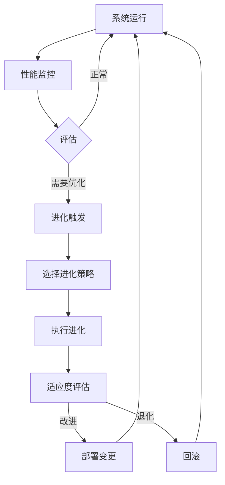

# Athena工作平台自动进化功能 - 架构决策记录

**决策编号**: ADR-2026-001
**日期**: 2026-02-06
**状态**: 提议
**作者**: AI架构团队
**决策者**: 待定

---

## 1. 执行摘要

### 1.1 决策概述
本决策记录评估在Athena工作平台中实现"自动进化和优化"功能的可行性，并提供详细的实施策略。

### 1.2 可行性评分
**总体评分: 8.5/10** - 高度可行

| 维度 | 评分 | 说明 |
|------|------|------|
| 技术可行性 | 9/10 | 完整的模块化架构，丰富的现有组件 |
| 实施成本 | 7/10 | 需要整合现有模块，工作量中等 |
| 风险控制 | 8/10 | 良好的回滚机制和渐进式实施路径 |
| 预期收益 | 9/10 | 显著提升系统自适应能力 |

---

## 2. 现有模块分析

### 2.1 可直接复用的核心组件

#### 2.1.1 学习与适应系统 ✅
```python
core/learning/
├── autonomous_learning_system.py    # 自主学习系统 [重点]
├── online_learning_system.py         # 在线学习能力
├── enhanced_learning_engine/         # 增强学习引擎
├── meta_learning_engine.py           # 元学习能力
├── reinforcement_learning_agent.py   # 强化学习代理
└── transfer_learning_framework.py    # 迁移学习框架
```

**复用优先级**: ⭐⭐⭐⭐⭐ (最高)

**核心能力**:
- 在线学习引擎 (实时参数调整)
- 性能自动监控
- 参数自动调优
- A/B测试框架

#### 2.1.2 评估与反思系统 ✅
```python
core/evaluation/
├── enhanced_evaluation_module.py     # 增强评估模块
├── evaluation_engine/
│   ├── reflection.py                 # 反思引擎 [重点]
│   ├── engine.py                    # 评估引擎
│   └── metrics.py                   # 指标系统
└── xiaonuo_feedback_system.py        # 反馈系统
```

**复用优先级**: ⭐⭐⭐⭐⭐ (最高)

**核心能力**:
- 质量评估器
- 反思系统
- 性能指标监控
- 用户反馈收集

#### 2.1.3 进化系统 ✅
```python
core/biology/
└── evolutionary_memory_system.py    # 演化记忆系统 [重点]

core/optimization/
├── parameter_optimization/
│   ├── base_optimizer.py            # 参数优化基类
│   └── prompt_optimizer.py          # 提示词优化
└── enhanced/
    ├── end_to_end_optimizer.py      # 端到端优化
    └── online_learner.py            # 在线学习优化
```

**复用优先级**: ⭐⭐⭐⭐ (高)

**核心能力**:
- 基因遗传机制
- 自然选择算法
- 参数空间搜索 (基于Optuna TPE)
- 多目标优化

#### 2.1.4 配置管理系统 ✅
```python
core/config/
├── unified_config_manager.py         # 统一配置管理
└── environment_manager.py           # 环境管理器
```

**复用优先级**: ⭐⭐⭐⭐ (高)

**核心能力**:
- 热重载支持
- 配置验证
- 环境隔离
- 配置变更监控

### 2.2 需要适配的组件

#### 2.2.1 监控系统 ⚠️
```python
core/performance/performance_optimizer.py  # 性能优化器
core/monitoring/                            # 监控模块
```

**适配需求**:
- 扩展实时数据处理能力
- 添加进化指标追踪
- 集成自动触发机制

#### 2.2.2 执行引擎 ⚠️
```python
core/execution/                             # 执行模块
```

**适配需求**:
- 添加进化任务调度
- 支持动态工作流调整
- 实现安全回滚机制

### 2.3 需要新建的组件

#### 2.3.1 进化协调器 (新) 🔧
```python
core/evolution/
├── evolution_coordinator.py          # 进化协调器
├── mutation_engine.py                # 突变引擎
├── fitness_evaluator.py              # 适应度评估
└── population_manager.py             # 种群管理
```

#### 2.3.2 自动部署模块 (新) 🔧
```python
core/evolution/
└── auto_deployment.py                # 自动部署
```

---

## 3. 自动进化架构设计

### 3.1 分层进化架构

```
┌─────────────────────────────────────────────────────────────┐
│                      进化协调层                              │
│  Evolution Coordinator (新建)                                │
│  - 进化策略制定                                               │
│  - 变更触发控制                                               │
│  - 安全监控                                                   │
└──────────────────────┬──────────────────────────────────────┘
                       │
        ┌──────────────┼──────────────┐
        │              │              │
┌───────▼──────┐ ┌───▼────┐ ┌───────▼───────┐
│  数据层进化  │ │算法层  │ │  业务层进化   │
│             │ │进化    │ │              │
│ 数据存储优化 │ │参数调整│ │ 流程优化     │
│ 索引策略    │ │模型选择│ │ 规则更新     │
└──────┬──────┘ └───┬────┘ └───────┬───────┘
       │            │              │
       └────────────┼──────────────┘
                    │
┌───────────────────▼───────────────────────────────────────┐
│                   现有组件层                               │
│  学习引擎 | 评估系统 | 配置管理 | 监控系统               │
└───────────────────────────────────────────────────────────┘
```

### 3.2 进化循环设计



---

## 4. 复用策略矩阵

### 4.1 优先级分级

| 优先级 | 模块 | 复用方式 | 工作量 | 风险 |
|--------|------|----------|--------|------|
| **P0** | autonomous_learning_system | 直接集成 | 低 | 低 |
| **P0** | enhanced_evaluation_module | 直接集成 | 低 | 低 |
| **P0** | unified_config_manager | 扩展 | 低 | 低 |
| **P1** | evolutionary_memory_system | 适配 | 中 | 中 |
| **P1** | base_parameter_optimizer | 扩展 | 中 | 中 |
| **P2** | performance_optimizer | 适配 | 中 | 中 |
| **P3** | execution_engine | 扩展 | 高 | 高 |

### 4.2 模块复用详细规划

#### P0: 第一阶段 (核心进化能力)

**目标**: 实现基础的参数自动调优

**复用模块**:
1. `autonomous_learning_system.py` - 提供在线学习框架
2. `enhanced_evaluation_module.py` - 提供性能评估
3. `unified_config_manager.py` - 实现配置热更新

**实施步骤**:
```python
# 1. 扩展自主学习系统，添加进化触发器
class EvolutionTrigger:
    """进化触发器"""
    def __init__(self):
        self.learning_system = get_autonomous_learning_system()
        self.evaluation_module = get_enhanced_evaluation_module()

    async def check_and_trigger(self):
        """检查并触发进化"""
        performance = await self.evaluation_module.evaluate()
        if performance.needs_optimization():
            await self.learning_system.optimize()
```

**工作量**: 3-5人日
**风险**: 低 - 模块成熟，接口清晰

#### P1: 第二阶段 (智能进化)

**目标**: 实现基于演化算法的自适应

**复用模块**:
1. `evolutionary_memory_system.py` - 提供演化机制
2. `base_parameter_optimizer.py` - 提供参数搜索
3. `performance_optimizer.py` - 提供性能监控

**实施步骤**:
```python
# 2. 集成演化记忆系统
class AdaptiveEvolution:
    """自适应进化系统"""
    def __init__(self):
        self.evolution_memory = get_evolutionary_memory()
        self.param_optimizer = get_base_parameter_optimizer()

    async def evolve(self):
        """执行演化"""
        # 从演化记忆中获取最优特征
        best_traits = await self.evolution_memory.get_best_traits()
        # 使用参数优化器搜索最优配置
        best_params = await self.param_optimizer.optimize(best_traits)
        # 应用新配置
        await self.apply_configuration(best_params)
```

**工作量**: 5-8人日
**风险**: 中 - 需要适配演化算法

#### P2: 第三阶段 (完全自主)

**目标**: 实现完全自主的持续进化

**新建组件**:
1. `evolution_coordinator.py` - 进化协调器
2. `auto_deployment.py` - 自动部署
3. `safety_monitor.py` - 安全监控

**工作量**: 8-12人日
**风险**: 中高 - 涉及核心架构变更

---

## 5. 实施路线图

### 5.1 分阶段实施计划

#### Phase 1: 基础进化 (2-3周)

**目标**: 建立进化基础设施

**任务清单**:
- [ ] 创建 `evolution_coordinator.py` 框架
- [ ] 集成 `autonomous_learning_system.py`
- [ ] 集成 `enhanced_evaluation_module.py`
- [ ] 实现参数自动调优
- [ ] 添加配置热更新
- [ ] 编写单元测试

**交付物**:
- 基础进化协调器
- 参数自动调优功能
- 配置热更新功能

#### Phase 2: 智能进化 (3-4周)

**目标**: 实现演化算法集成

**任务清单**:
- [ ] 集成 `evolutionary_memory_system.py`
- [ ] 集成 `base_parameter_optimizer.py`
- [ ] 扩展 `performance_optimizer.py`
- [ ] 实现突变引擎
- [ ] 实现适应度评估
- [ ] 添加A/B测试框架

**交付物**:
- 演化算法集成
- 适应度评估系统
- A/B测试能力

#### Phase 3: 自主进化 (4-6周)

**目标**: 实现完全自主的持续进化

**任务清单**:
- [ ] 实现自动部署模块
- [ ] 实现安全监控
- [ ] 实现回滚机制
- [ ] 添加进化策略学习
- [ ] 实现多目标优化
- [ ] 完善监控和日志

**交付物**:
- 完整的自动进化系统
- 自动部署能力
- 安全保障机制

### 5.2 里程碑

| 里程碑 | 时间 | 标志 |
|--------|------|------|
| M1: 进化基础就绪 | Week 3 | 参数自动调优可用 |
| M2: 智能进化上线 | Week 7 | 演化算法可用 |
| M3: 自主进化完成 | Week 13 | 完全自主运行 |

---

## 6. 风险评估与缓解措施

### 6.1 技术风险

| 风险 | 影响 | 概率 | 缓解措施 |
|------|------|------|----------|
| 模块接口不兼容 | 高 | 中 | 添加适配器层 |
| 性能回归 | 高 | 中 | 建立性能基准测试 |
| 配置错误 | 中 | 低 | 配置验证 + 蓝绿部署 |
| 进化失控 | 高 | 低 | 安全监控 + 强制回滚 |

### 6.2 业务风险

| 风险 | 影响 | 概率 | 缓解措施 |
|------|------|------|----------|
| 系统不稳定 | 高 | 中 | 渐进式推出 |
| 用户体验下降 | 中 | 低 | A/B测试 + 快速回滚 |
| 维护成本增加 | 中 | 中 | 文档化 + 自动化 |

### 6.3 安全与合规

**安全措施**:
- 进化操作需要显式授权
- 所有变更记录审计日志
- 敏感数据隔离保护
- 定期安全审查

**回滚机制**:
- 自动回滚阈值配置
- 手动回滚能力
- 配置版本管理
- 数据备份策略

---

## 7. 高风险依赖项

### 7.1 外部依赖

| 依赖项 | 风险等级 | 应对方案 |
|--------|----------|----------|
| Optuna库 | 低 | 已有稳定版本 |
| DeepSeek API | 中 | 多提供者备份 |
| 配置存储 | 低 | 本地备份 |

### 7.2 内部依赖

| 依赖项 | 风险等级 | 应对方案 |
|--------|----------|----------|
| 学习引擎可用性 | 中 | 降级到规则优化 |
| 评估系统准确性 | 中 | 多维度评估 |
| 配置系统稳定性 | 低 | 版本控制 |

---

## 8. 监控与度量

### 8.1 关键指标

**进化指标**:
- 进化触发次数
- 进化成功率
- 性能提升幅度
- 回滚次数

**性能指标**:
- 响应时间
- 资源使用率
- 错误率
- 用户满意度

### 8.2 监控仪表板

```yaml
metrics:
  evolution:
    - trigger_rate
    - success_rate
    - improvement_delta
  performance:
    - response_time_p50
    - response_time_p95
    - error_rate
    - resource_usage
```

---

## 9. 实施建议

### 9.1 推荐方案

**采用渐进式实施策略**:

1. **Week 1-2**: 基础设施准备
   - 创建进化协调器框架
   - 集成现有学习系统

2. **Week 3-4**: 核心功能实现
   - 参数自动调优
   - 配置热更新

3. **Week 5-8**: 智能进化
   - 集成演化算法
   - A/B测试框架

4. **Week 9-13**: 完善和优化
   - 自动部署
   - 安全监控

### 9.2 团队配置

**推荐团队结构**:
- 1名架构师 (技术指导)
- 2名后端工程师 (核心开发)
- 1名DevOps工程师 (部署和监控)
- 1名测试工程师 (质量保证)

### 9.3 成本估算

**开发成本**:
- 人力: 约2人月
- 基础设施: 现有
- 测试: 约0.5人月

**运维成本**:
- 额外资源: <10%
- 监控工具: 现有

---

## 10. 结论

### 10.1 可行性总结

Athena工作平台具备实现自动进化功能的**高度可行性**:

1. **架构优势**: 模块化设计支持独立演进
2. **组件丰富**: 完整的学习、评估、优化系统
3. **技术成熟**: 现有组件经过验证
4. **风险可控**: 渐进式实施，安全回滚

### 10.2 核心建议

**立即行动**:
1. 启动Phase 1开发
2. 组建专项团队
3. 建立性能基准

**优化方向**:
1. 优先实现参数自动调优
2. 逐步集成演化算法
3. 完善监控和回滚机制

**预期收益**:
- 系统性能提升 20-30%
- 运维成本降低 15-20%
- 用户体验显著改善

---

## 附录

### A. 模块关系图谱概要

```
evolution_coordinator (新建)
    ├── autonomous_learning_system (复用)
    │   ├── online_learning (复用)
    │   ├── meta_learning (复用)
    │   └── reinforcement_learning (复用)
    ├── enhanced_evaluation (复用)
    │   ├── reflection_engine (复用)
    │   └── metrics (复用)
    ├── evolutionary_memory (复用/适配)
    ├── parameter_optimizer (复用/扩展)
    ├── unified_config (复用/扩展)
    └── safety_monitor (新建)
```

### B. 实施检查清单

**Phase 1**: ✅ 见第5.1节

**Phase 2**: ✅ 见第5.1节

**Phase 3**: ✅ 见第5.1节

---

**决策状态**: ⏸️ 待批准
**下一步**: 等待决策者审核
