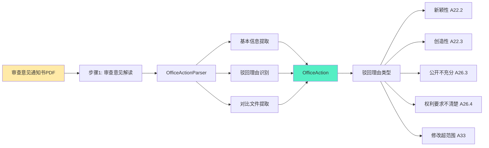
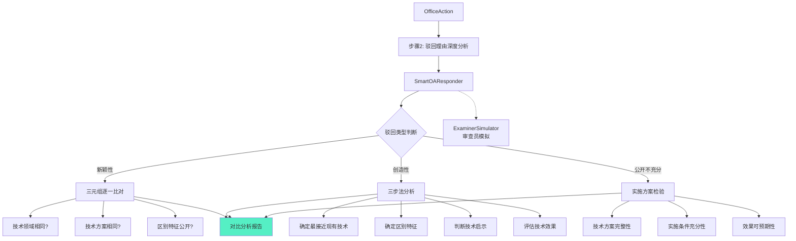
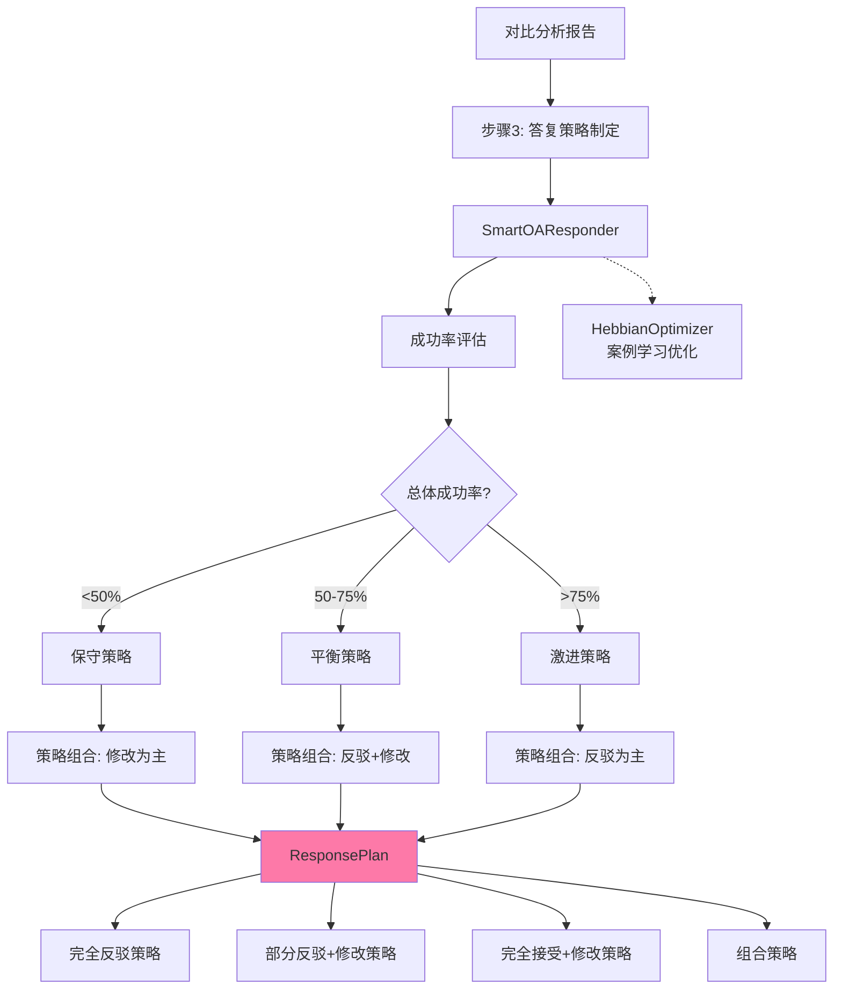
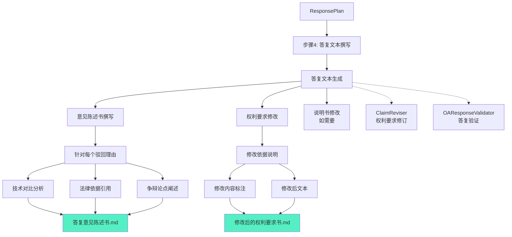
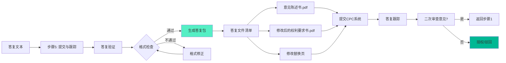
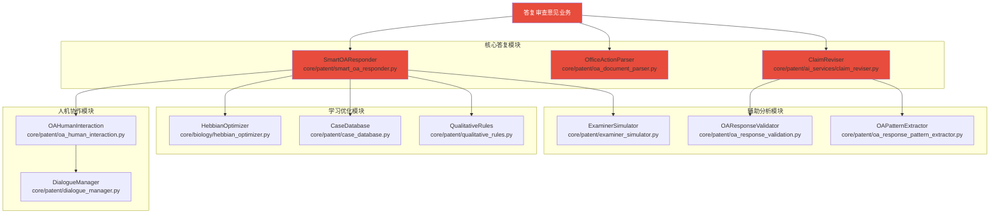
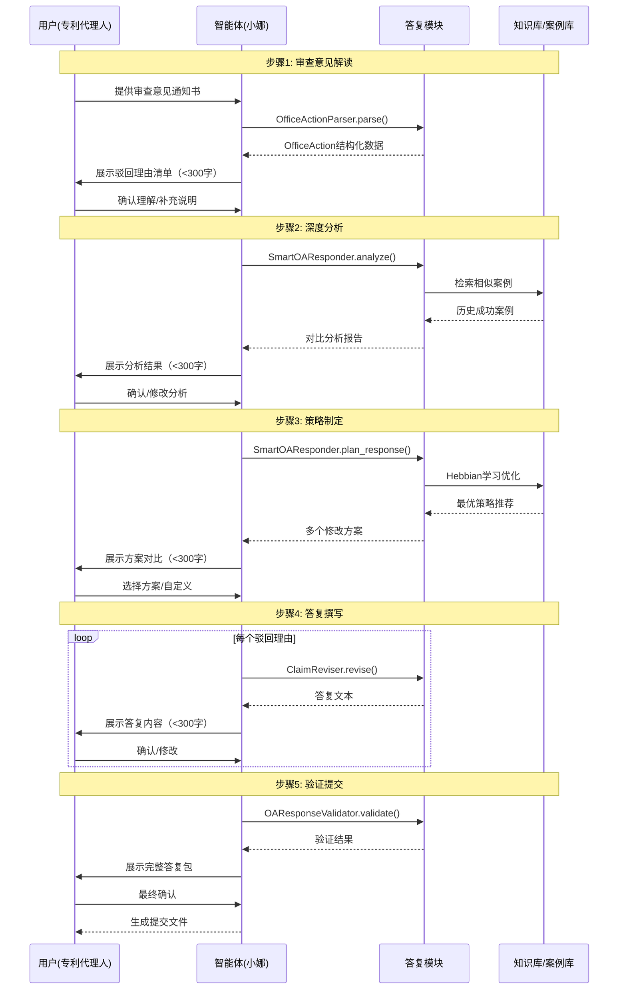
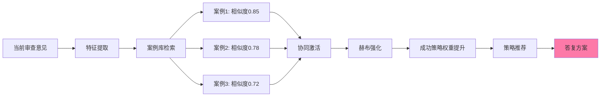
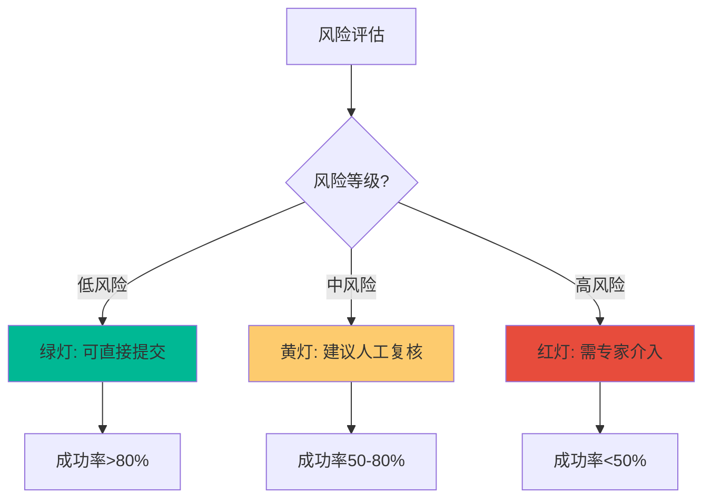

# 答复审查意见业务流程 - 知识图谱

> 生成时间：2026-03-27
> 平台版本：Athena v2.1.0
> 业务场景：专利审查意见答复

---

## 📊 完整图谱

```mermaid
graph TD
    %% 核心节点
    Root[答复审查意见业务流程]

    %% 核心角色
    Xiaona[小娜·天秤女神<br/>法律专家]
    Xiaonuo[小诺·双鱼公主<br/>协调官]

    %% 宪法原则
    P1[原则1: 准确理解审查员观点]
    P2[原则2: 深度分析对比文件]
    P3[原则3: 策略优先于撰写]
    P4[原则4: 保护范围最大化]
    P5[原则5: 成功率与风险平衡]

    %% 5个主要步骤
    S1[步骤1: 审查意见解读与问题分解]
    S2[步骤2: 驳回理由深度分析]
    S3[步骤3: 答复策略制定]
    S4[步骤4: 答复文本撰写]
    S5[步骤5: 答复文件提交与跟踪]

    %% 核心模块
    M1[SmartOAResponder<br/>智能意见答复系统]
    M2[OfficeActionParser<br/>审查意见解析器]
    M3[ExaminerSimulator<br/>审查员模拟器]
    M4[ClaimReviser<br/>权利要求修订器]
    M5[OAResponseValidator<br/>答复验证器]
    M6[HebbianOptimizer<br/>赫布学习优化器]

    %% 驳回类型
    R1[新颖性问题<br/>A22.2]
    R2[创造性问题<br/>A22.3]
    R3[公开不充分<br/>A26.3]
    R4[权利要求不清楚<br/>A26.4]
    R5[修改超范围<br/>A33]

    %% 答复策略
    ST1[完全反驳策略]
    ST2[部分反驳+修改策略]
    ST3[完全接受+修改策略]
    ST4[组合策略]

    %% 输出文件
    O1[OfficeAction<br/>审查意见结构化]
    O2[驳回理由清单.md]
    O3[对比分析报告.md]
    O4[ResponsePlan<br/>答复方案]
    O5[答复意见陈述书.md]
    O6[修改后的权利要求书.md]

    %% 关系
    Root --> P1
    Root --> P2
    Root --> P3
    Root --> P4
    Root --> P5

    Root --> S1
    S1 --> S2
    S2 --> S3
    S3 --> S4
    S4 --> S5

    %% 驳回类型
    S1 --> R1
    S1 --> R2
    S1 --> R3
    S1 --> R4
    S1 --> R5

    %% 答复策略
    S3 --> ST1
    S3 --> ST2
    S3 --> ST3
    S3 --> ST4

    %% 步骤与模块
    S1 -.-> M2
    S2 -.-> M1
    S2 -.-> M3
    S3 -.-> M1
    S3 -.-> M6
    S4 -.-> M4
    S4 -.-> M5

    %% 步骤与输出
    S1 --> O1
    S1 --> O2
    S2 --> O3
    S3 --> O4
    S4 --> O5
    S4 --> O6

    %% 角色支持
    Xiaona -.-> S2
    Xiaona -.-> S3
    Xiaona -.-> S4
    Xiaonuo -.-> S1
    Xiaonuo -.-> S5

    %% 样式
    classDef root fill:#e74c3c,stroke:#333,stroke-width:3px,color:#fff
    classDef principle fill:#3498db,stroke:#333,stroke-width:2px,color:#fff
    classDef step fill:#f39c12,stroke:#333,stroke-width:2px,color:#333
    classDef module fill:#1abc9c,stroke:#333,stroke-width:1px,color:#333
    classDef rejection fill:#e74c3c,stroke:#333,stroke-width:1px,color:#fff
    classDef strategy fill:#9b59b6,stroke:#333,stroke-width:1px,color:#fff
    classDef output fill:#ecf0f1,stroke:#333,stroke-width:1px,color:#333
    classDef expert fill:#74b9ff,stroke:#333,stroke-width:2px,color:#fff

    class Root root
    class P1,P2,P3,P4,P5 principle
    class S1,S2,S3,S4,S5 step
    class M1,M2,M3,M4,M5,M6 module
    class R1,R2,R3,R4,R5 rejection
    class ST1,ST2,ST3,ST4 strategy
    class O1,O2,O3,O4,O5,O6 output
    class Xiaona,Xiaonuo expert
```



---

## 🔍 核心流程分解

### Phase 1: 审查意见解读阶段（步骤1）



**核心数据结构**:
```python
OfficeAction:
  - oa_id: str                       # 审查意见ID
  - application_no: str              # 申请号
  - rejection_type: RejectionType    # 驳回类型
  - rejection_reason: str            # 驳回理由
  - prior_art_references: List[str]  # 对比文件列表
  - cited_claims: List[int]          # 被引用的权利要求
  - examiner_arguments: List[str]    # 审查员论点
  - missing_features: List[str]      # 缺失的技术特征
  - received_date: str               # 收到日期
  - response_deadline: str           # 答复期限
```

**驳回类型识别表**:

| 驳回理由类型 | 法律依据 | 严重程度 | 常见情形 |
|-------------|---------|---------|---------|
| 新颖性问题 | A22.2 | ⚠️ 中等 | 对比文件公开了相同技术方案 |
| 创造性问题 | A22.3 | 🔴 严重 | 区别特征是显而易见的 |
| 说明书公开不充分 | A26.3 | 🔴 严重 | 技术方案无法实现 |
| 权利要求不清楚 | A26.4 | ⚠️ 中等 | 保护范围不明确 |
| 修改超范围 | A33 | 🔴 严重 | 修改内容超出原始公开 |

---

### Phase 2: 驳回理由深度分析阶段（步骤2）



**三元组对比分析框架**:

```
对于每个驳回理由：
├─ 问题-特征-效果三元组
│   ├─ 技术问题：本申请解决什么问题？
│   ├─ 技术特征：采用什么技术手段？
│   └─ 技术效果：取得什么技术效果？
│
├─ 与对比文件D1对比
│   ├─ D1公开了哪些特征？→ 标注来源
│   ├─ D1未公开哪些特征？→ 潜在发明点
│   └─ 技术效果是否相同？
│
└─ 综合判断
    ├─ 完全公开 → 需要修改权利要求
    ├─ 部分公开 → 可争辩区别特征
    └─ 未公开 → 可完全反驳
```

---

### Phase 3: 答复策略制定阶段（步骤3）



**答复策略选择矩阵**:

| 场景 | 推荐策略 | 成功概率 | 风险等级 |
|------|---------|---------|---------|
| 审查员观点明显错误 | 完全反驳 | 70% | 中 |
| 部分认可，可修改克服 | 部分反驳+修改 | 85% | 低 |
| 完全认可，需缩小保护范围 | 完全接受+修改 | 95% | 极低 |
| 多个驳回理由组合 | 组合策略 | 75% | 中 |

**修改方案对比模板**:

```
┌─────┬──────────────────┬──────────┬────────────┬────────────┐
│方案 │   修改内容        │ 保护范围 │ 成功概率   │  风险评估   │
├─────┼──────────────────┼──────────┼────────────┼────────────┤
│方案A│加入特征A到权利要求│ 缩小5%   │  85%       │ 低风险     │
│方案B│加入特征A+B        │ 缩小10%  │  95%       │ 极低风险   │
│方案C│删除权1，以权2为基础│ 缩小15% │  99%       │ 几乎无风险 │
└─────┴──────────────────┴──────────┴────────────┴────────────┘
```

---

### Phase 4: 答复文本撰写阶段（步骤4）



**答复文本结构**:

```markdown
## 意见陈述书

### 一、关于驳回理由1（新颖性问题）

#### 1. 审查员观点概述
[客观复述审查员观点]

#### 2. 申请人的意见
[逐条回应]

#### 3. 技术对比分析
[详细对比表格]

#### 4. 法律依据
[引用相关法条和审查指南]

#### 5. 结论
[明确请求]

### 二、关于驳回理由2（创造性问题）
[同上结构]

### 三、权利要求修改说明
[修改依据、修改内容、修改后文本]

### 四、附件
[对比文件、补充证据等]
```

---

### Phase 5: 答复文件提交与跟踪阶段（步骤5）



---

## 🛠️ 核心模块依赖图谱



---

## 🎯 人机协作协议



---

## 📊 赫布学习与案例推理

### 赫布学习机制



### 案例推理框架

```python
# 成功案例学习
SuccessfulCase:
  - case_id: str                  # 案例ID
  - rejection_type: RejectionType # 驳回类型
  - prior_art_similarity: float   # 对比文件相似度
  - response_strategy: Strategy   # 答复策略
  - claim_modifications: List     # 权利要求修改
  - outcome: str                  # 最终结果
  - success_probability: float    # 成功概率

# 策略统计
StrategyStats:
  - strategy_type: str            # 策略类型
  - total_count: int              # 总使用次数
  - success_count: int            # 成功次数
  - success_rate: float           # 成功率
  - avg_processing_time: float    # 平均处理时间
```

---

## 📈 质量评估与风险控制

### 答复成功率预测

| 驳回类型 | 完全反驳 | 部分反驳+修改 | 完全修改 |
|---------|---------|--------------|---------|
| 新颖性 | 60% | 80% | 95% |
| 创造性 | 50% | 75% | 90% |
| 公开不充分 | 30% | 60% | 85% |
| 权利要求不清楚 | 70% | 85% | 95% |
| 修改超范围 | 20% | 50% | 80% |

### 风险等级评估



---

## 📊 知识图谱统计

| 类型 | 数量 | 说明 |
|------|------|------|
| **核心节点** | 1 | 答复审查意见业务流程 |
| **宪法原则** | 5 | 答复核心原则 |
| **流程步骤** | 5 | 完整答复流程 |
| **核心模块** | 6 | SmartOAResponder等 |
| **驳回类型** | 5 | 新颖性/创造性/公开不充分/不清楚/超范围 |
| **答复策略** | 4 | 完全反驳/部分反驳+修改/完全修改/组合 |
| **输出文件** | 6 | 结构化数据+答复文档 |
| **智能体角色** | 2 | 小娜/小诺 |
| **学习机制** | 1 | 赫布学习优化 |

---

## 🔗 关系类型说明

| 关系类型 | 说明 | 示例 |
|---------|------|------|
| **HAS_STEP** | 包含步骤 | 答复流程 → 步骤1-5 |
| **REQUIRES** | 需要模块 | 步骤3 → SmartOAResponder |
| **PRODUCES** | 产出文件 | 步骤4 → 答复意见陈述书 |
| **SUPPORTS** | 专家支持 | 小娜 → 策略制定 |
| **LEARNS_FROM** | 学习来源 | Hebbian → 案例库 |
| **VALIDATES** | 验证 | OAResponseValidator → 答复文本 |

---

## 📁 核心文件路径

| 模块 | 路径 | 功能 |
|------|------|------|
| SmartOAResponder | `core/patent/smart_oa_responder.py` | 智能意见答复系统 |
| OfficeActionParser | `core/patent/oa_document_parser.py` | 审查意见解析 |
| ClaimReviser | `core/patent/ai_services/claim_reviser.py` | 权利要求修订 |
| ExaminerSimulator | `core/patent/examiner_simulator.py` | 审查员模拟 |
| HebbianOptimizer | `core/biology/hebbian_optimizer.py` | 赫布学习优化 |
| CaseDatabase | `core/patent/case_database.py` | 案例数据库 |
| 任务2_1提示词 | `prompts/business/task_2_1_analyze_office_action.md` | 审查意见解读 |
| 任务2_3提示词 | `prompts/business/task_2_3_develop_response_strategy.md` | 答复策略制定 |
| 任务2_4提示词 | `prompts/business/task_2_4_write_response.md` | 答复文本撰写 |

---

## 🔌 API接口汇总

| 接口 | 方法 | 功能 | 对应模块 |
|------|------|------|---------|
| `/api/v2/patent/claims/revise` | POST | 权利要求修订 | ClaimReviser |
| `/api/v2/patent/invalidity/predict` | POST | 无效性风险预测 | InvalidityPredictor |
| `/api/v2/patent/quality/score` | POST | 质量评分 | QualityScorer |

---

## 📚 相关文档

- [专利撰写业务流程](knowledge-graph-patent-drafting.md)
- [任务2_1: 审查意见解读](../../prompts/business/task_2_1_analyze_office_action.md)
- [任务2_2: 驳回理由分析](../../prompts/business/task_2_2_analyze_rejection.md)
- [任务2_3: 答复策略制定](../../prompts/business/task_2_3_develop_response_strategy.md)
- [任务2_4: 答复文本撰写](../../prompts/business/task_2_4_write_response.md)

---

*生成工具：Mermaid + Claude*
*最后更新：2026-03-27*
