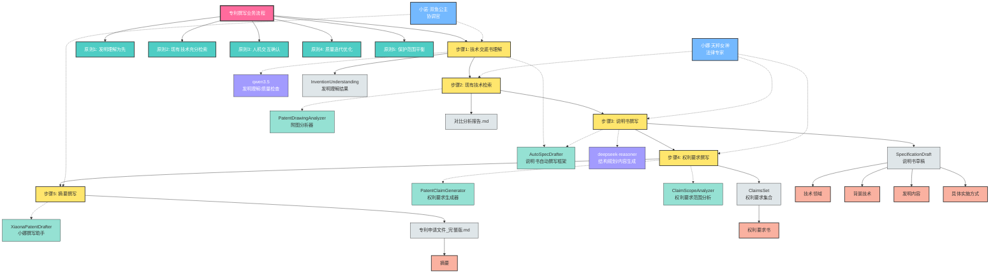
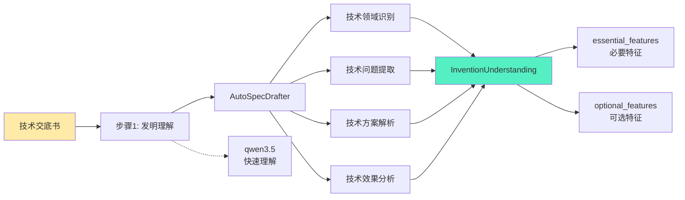
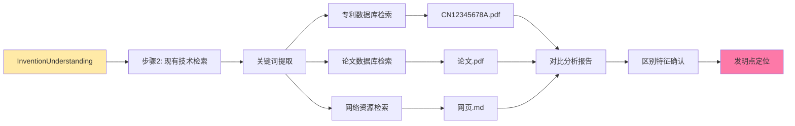
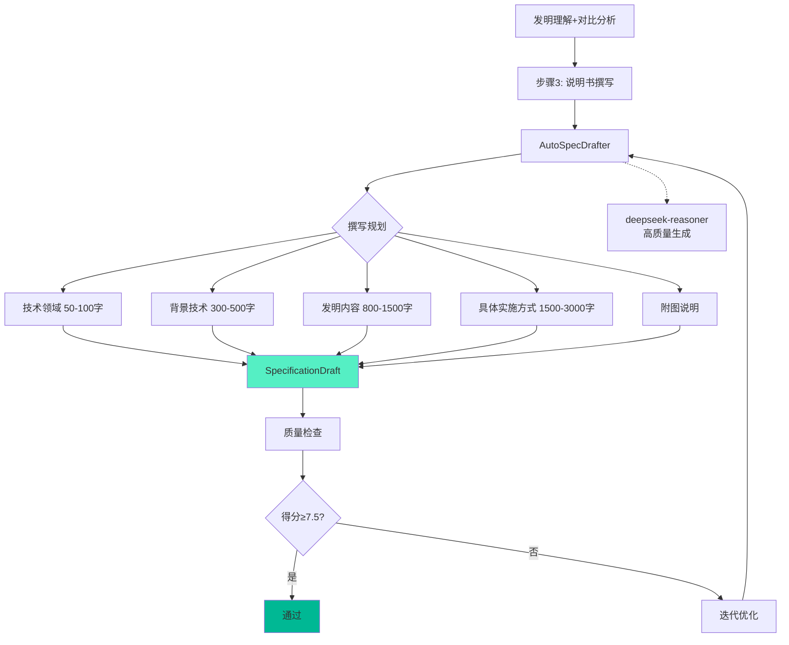
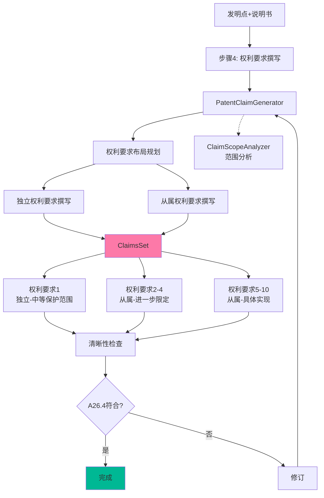
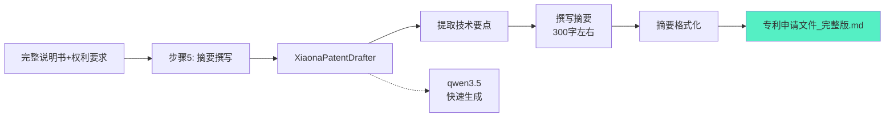
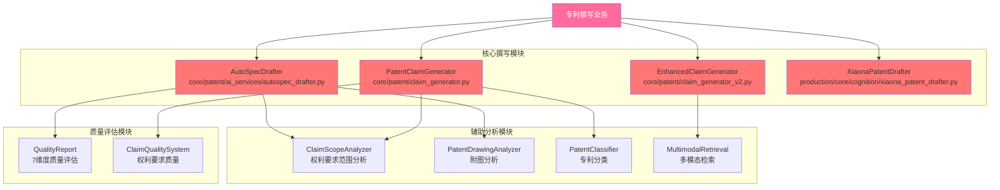
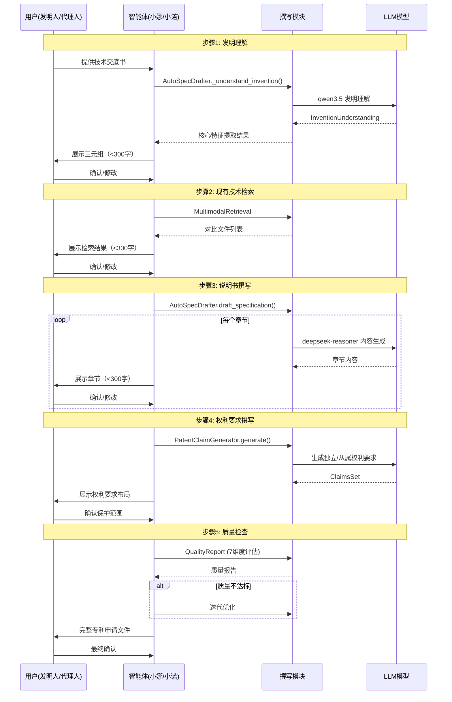
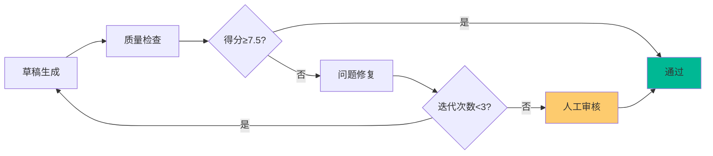

# 专利撰写业务流程 - 知识图谱

> 生成时间：2026-03-27
> 平台版本：Athena v2.1.0
> 业务场景：专利申请文件撰写

---

## 📊 完整图谱



---

## 🔍 核心流程分解

### Phase 1: 发明理解阶段（步骤1）



**核心数据结构**:
```python
InventionUnderstanding:
  - invention_title: str           # 发明名称
  - invention_type: InventionType  # 发明类型(device/method/product)
  - technical_field: str           # 技术领域
  - core_innovation: str           # 核心创新点
  - technical_problem: str         # 技术问题
  - technical_solution: str        # 技术方案
  - technical_effects: List[str]   # 技术效果列表
  - essential_features: List[TechnicalFeature]   # 必要特征
  - optional_features: List[TechnicalFeature]    # 可选特征
  - confidence_score: float        # 理解置信度
```

---

### Phase 2: 检索与分析阶段（步骤2）



**API接口**:
| 接口 | 功能 | 模块 |
|------|------|------|
| `POST /api/v2/patent/classify` | 专利分类 | PatentClassifier |
| `POST /api/v2/patent/search/semantic` | 语义检索 | MultimodalRetrieval |

---

### Phase 3: 说明书撰写阶段（步骤3）



**模型配置**:
```python
MODEL_CONFIG = {
    "understanding": {"model": "qwen3.5", "provider": "ollama", "temperature": 0.3},
    "planning": {"model": "deepseek-reasoner", "provider": "deepseek", "temperature": 0.2},
    "generation": {"model": "deepseek-reasoner", "provider": "deepseek", "temperature": 0.3},
    "quality_check": {"model": "qwen3.5", "provider": "ollama", "temperature": 0.2}
}
```

---

### Phase 4: 权利要求撰写阶段（步骤4）



**权利要求类型模板**:
| 类型 | 模板结构 |
|------|---------|
| 装置 | `一种[装置名称]，其特征在于：[组件1]，与所述[组件1]连接的[组件2]...` |
| 方法 | `一种[方法名称]，包括以下步骤：[步骤1]；[步骤2]...` |
| 系统 | `一种[系统名称]，包括：[模块1]；[模块2]；其中，[模块1]被配置为[功能]...` |
| 组合物 | `一种[组合物名称]，包括：[组分1]，其含量为[范围1]...` |

---

### Phase 5: 摘要撰写阶段（步骤5）



---

## 🛠️ 核心模块依赖图谱



---

## 🎯 人机协作协议



---

## 📈 质量评估体系

### 7维度质量评估

| 维度 | 说明 | 权重 | 阈值 |
|------|------|------|------|
| **completeness** | 完整性 | 15% | ≥7.5 |
| **clarity** | 清晰性 | 15% | ≥7.5 |
| **accuracy** | 准确性 | 15% | ≥7.5 |
| **sufficiency** | 充分性(A26.3) | 20% | ≥7.5 |
| **consistency** | 一致性 | 10% | ≥7.5 |
| **compliance** | 规范性 | 10% | ≥7.5 |
| **support** | 支持性(A26.4) | 15% | ≥7.5 |

### 质量迭代流程



---

## 📊 知识图谱统计

| 类型 | 数量 | 说明 |
|------|------|------|
| **核心节点** | 1 | 专利撰写业务流程 |
| **宪法原则** | 5 | 撰写核心原则 |
| **流程步骤** | 5 | 完整撰写流程 |
| **核心模块** | 5 | AutoSpec/ClaimGenerator等 |
| **LLM模型** | 2 | qwen3.5/deepseek-reasoner |
| **输出数据结构** | 5 | InventionUnderstanding/ClaimsSet等 |
| **最终文档** | 6 | 说明书各章节+权利要求+摘要 |
| **智能体角色** | 2 | 小娜/小诺 |
| **质量维度** | 7 | 7维度评估体系 |

---

## 🔗 关系类型说明

| 关系类型 | 说明 | 示例 |
|---------|------|------|
| **HAS_STEP** | 包含步骤 | 撰写流程 → 步骤1-5 |
| **REQUIRES** | 需要模块 | 步骤3 → AutoSpecDrafter |
| **USES_MODEL** | 使用模型 | 发明理解 → qwen3.5 |
| **PRODUCES** | 产出文件 | 步骤3 → SpecificationDraft |
| **SUPPORTS** | 专家支持 | 小娜 → 权利要求撰写 |
| **VALIDATES** | 质量验证 | QualityReport → 说明书 |

---

## 📁 核心文件路径

| 模块 | 路径 | 功能 |
|------|------|------|
| AutoSpecDrafter | `core/patent/ai_services/autospec_drafter.py` | 说明书自动撰写 |
| PatentClaimGenerator | `core/patent/claim_generator.py` | 权利要求生成 |
| EnhancedClaimGenerator | `core/patent/claim_generator_v2.py` | 增强版权利要求生成 |
| XiaonaPatentDrafter | `production/core/cognition/xiaona_patent_drafter.py` | 小娜撰写助手 |
| ClaimScopeAnalyzer | `core/patent/ai_services/claim_scope_analyzer.py` | 权利要求范围分析 |
| 任务1_1提示词 | `prompts/business/task_1_1_understand_disclosure.md` | 技术交底书理解 |
| 任务1_3提示词 | `prompts/business/task_1_3_write_specification.md` | 说明书撰写 |
| 任务1_4提示词 | `prompts/business/task_1_4_write_claims.md` | 权利要求撰写 |

---

## 🔌 API接口汇总

| 接口 | 方法 | 功能 | 对应论文 |
|------|------|------|---------|
| `/api/v2/patent/classify` | POST | 专利分类(CPC/IPC) | PatentSBERTa |
| `/api/v2/patent/claims/revise` | POST | 权利要求修订 | Patent-CR |
| `/api/v2/patent/quality/score` | POST | 质量评分 | 论文#20 |
| `/api/v2/patent/search/semantic` | POST | 语义检索 | - |

---

*生成工具：Mermaid + Claude*
*最后更新：2026-03-27*
