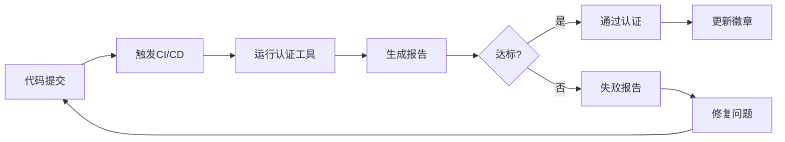

# Agent认证指南
# Agent Certification Guide

> **版本**: 1.0.0
> **最后更新**: 2026-04-21
> **状态**: 正式发布

---

## 目录

1. [认证概述](#认证概述)
2. [认证标准](#认证标准)
3. [认证流程](#认证流程)
4. [使用认证工具](#使用认证工具)
5. [常见问题](#常见问题)
6. [最佳实践](#最佳实践)

---

## 认证概述

Agent认证是确保所有Agent符合统一接口标准和质量要求的自动化验证过程。

### 认证目的

- **接口一致性**: 确保所有Agent遵循统一的接口规范
- **质量保证**: 验证代码质量、测试覆盖率和文档完整性
- **可维护性**: 促进代码的可维护性和可扩展性
- **用户体验**: 提供一致的Agent使用体验

### 认证徽章

认证通过的Agent将获得认证徽章，可在README和其他文档中展示：

```
[](docs/guides/AGENT_CERTIFICATION_GUIDE.md)
```

---

## 认证标准

认证标准分为5个维度，总计100分：

### 1. 接口合规性 (30分)

| 检查项 | 分数 | 说明 |
|--------|------|------|
| 必需方法 | 10分 | 实现所有必需的接口方法 |
| 基类继承 | 10分 | 继承BaseXiaonaComponent |
| 能力注册 | 10分 | 正确注册Agent能力 |

**必需方法列表**:
- `__init__`: 构造函数
- `_initialize`: 初始化钩子
- `get_capabilities`: 获取能力列表
- `get_info`: 获取Agent信息
- `get_system_prompt`: 获取系统提示词
- `execute`: 执行方法
- `validate_input`: 输入验证

### 2. 测试覆盖率 (25分)

| 测试数量 | 分数 |
|----------|------|
| ≥ 10个测试 | 25分 |
| ≥ 5个测试 | 20分 |
| ≥ 3个测试 | 15分 |
| < 3个测试 | 10分 |

测试文件应位于: `tests/agents/test_{agent_name}.py`

### 3. 代码质量 (20分)

| 检查项 | 分数 |
|--------|------|
| 类文档字符串 | 5分 |
| 方法文档字符串 | 10分 |
| 类型注解 | 5分 |

### 4. 文档完整性 (15分)

| 检查项 | 分数 |
|--------|------|
| README提及 | 5分 |
| 专门文档 | 10分 |

### 5. 最佳实践 (10分)

| 实践 | 分数 |
|------|------|
| 使用logger | 2分 |
| 错误处理 | 2分 |
| 配置支持 | 2分 |
| 状态管理 | 2分 |
| 异步支持 | 2分 |

---

## 认证流程

### 自动化认证流程



### 认证状态

| 状态 | 说明 | 条件 |
|------|------|------|
| ✅ PASSED | 通过认证 | ≥80分且所有必需项通过 |
| ⚠️ WARNING | 警告 | ≥60分但存在非必需问题 |
| ❌ FAILED | 未通过 | <60分或必需项失败 |
| ⏳ PENDING | 待认证 | 认证中 |

---

## 使用认证工具

### 本地认证

在开发环境中使用认证工具检查Agent：

```bash
# 认证单个Agent
python tools/agent_certifier.py --agent core.agents.xiaona.retriever_agent.RetrieverAgent

# 认证所有Agent
python tools/agent_certifier.py --all

# 生成报告
python tools/agent_certifier.py --all --report certification_report.json

# 严格模式（所有检查项必须通过）
python tools/agent_certifier.py --all --strict
```

### CI/CD认证

认证自动在以下情况触发：

1. **推送代码**到main或develop分支
2. **创建PR**到main或develop分支
3. **手动触发**: GitHub Actions页面
4. **定时执行**: 每周日凌晨

### 查看认证结果

认证结果在以下位置查看：

1. **GitHub Actions Summary**: PR/commit页面
2. **认证报告Artifact**: JSON格式详细报告
3. **认证徽章**: README中的SVG徽章

---

## 常见问题

### Q1: 认证失败后如何修复？

按照认证报告中的提示逐项修复：

1. 查看失败的检查项
2. 阅读错误消息和建议
3. 修复代码或补充测试
4. 重新运行认证

### Q2: 如何添加新的能力到Agent？

在`_initialize`方法中注册能力：

```python
def _initialize(self) -> None:
    self._register_capabilities([
        AgentCapability(
            name="new_capability",
            description="新能力描述",
            input_types=["text"],
            output_types=["json"],
            estimated_time=5.0
        )
    ])
```

### Q3: 测试覆盖率不足怎么办？

添加更多测试用例：

```python
# tests/agents/test_myagent.py

def test_myagent_initialization():
    """测试Agent初始化"""
    agent = MyAgent(agent_id="test")
    assert agent.agent_id == "test"

@pytest.mark.asyncio
async def test_myagent_execute():
    """测试Agent执行"""
    agent = MyAgent(agent_id="test")
    result = await agent.execute(context)
    assert result.status == AgentStatus.COMPLETED
```

### Q4: 如何提高代码质量得分？

1. 添加完整的文档字符串
2. 使用类型注解
3. 遵循PEP 8代码风格
4. 添加错误处理

---

## 最佳实践

### 1. 开发前检查

在开发新Agent前，先了解接口规范：

```bash
# 查看基类定义
cat core/agents/xiaona/base_component.py

# 查看示例Agent
cat core/agents/xiaona/retriever_agent.py
```

### 2. 持续认证

在开发过程中定期运行认证：

```bash
# 每次重要更改后
git commit -m "feat: 添加新功能"
python tools/agent_certifier.py --agent core.agents.xiaona.my_agent.MyAgent
```

### 3. 测试先行

先编写测试，再实现功能：

```python
# 1. 先写测试
def test_new_feature():
    agent = MyAgent(agent_id="test")
    result = agent.new_feature(input_data)
    assert result == expected_output

# 2. 再实现功能
class MyAgent(BaseXiaonaComponent):
    def new_feature(self, input_data):
        # 实现
        pass
```

### 4. 文档同步

代码和文档同步更新：

```bash
# 更新代码后
git add core/agents/xiaona/my_agent.py

# 同时更新文档
git add docs/agents/my_agent.md
```

---

## 附录

### A. 认证报告示例

```json
{
  "timestamp": "2026-04-21T10:00:00",
  "summary": {
    "total": 5,
    "passed": 3,
    "warning": 1,
    "failed": 1
  },
  "agents": [
    {
      "agent_name": "RetrieverAgent",
      "status": "passed",
      "score": 92.5,
      "max_score": 100.0,
      "percentage": 92.5,
      "checks": {
        "interface_compliance": {
          "passed": true,
          "score": 30,
          "max_score": 30,
          "message": "接口合规性检查: 30/30"
        },
        "test_coverage": {
          "passed": true,
          "score": 25,
          "max_score": 25,
          "message": "测试覆盖检查: 25/25"
        }
      }
    }
  ]
}
```

### B. 认证检查清单

- [ ] 继承BaseXiaonaComponent
- [ ] 实现所有必需方法
- [ ] 注册Agent能力
- [ ] 添加文档字符串
- [ ] 使用类型注解
- [ ] 编写测试用例
- [ ] 添加错误处理
- [ ] 使用logger记录日志
- [ ] 编写Agent文档

### C. 相关资源

- [Agent接口标准](../design/UNIFIED_AGENT_INTERFACE_STANDARD.md)
- [Agent开发指南](AGENT_INTERFACE_IMPLEMENTATION_GUIDE.md)
- [Agent迁移指南](AGENT_INTERFACE_MIGRATION_GUIDE.md)
- [测试最佳实践](../development/TESTING_BEST_PRACTICES.md)

---

**维护者**: Infrastructure-Agent
**反馈**: 请提交Issue到项目仓库
