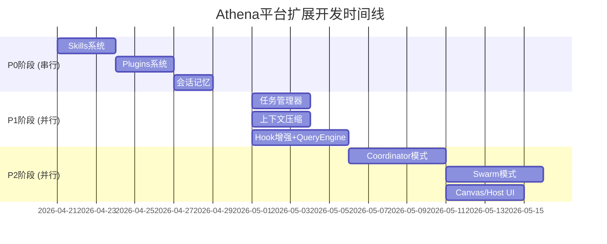

# Athena平台扩展功能 - 总体开发计划

**项目**: Athena工作平台 - OpenHarness功能扩展
**开发模式**: 测试驱动开发 (TDD)
**团队规模**: 4个子智能体
**开发周期**: 35天 (5周)
**开始日期**: 2026-04-21

---

## 📊 项目概览

### 目标
从OpenHarness借鉴并实现9大功能模块，扩展Athena平台能力。

### 功能模块
| 模块 | 代码量 | 复杂度 | 负责人 | 阶段 |
|-----|-------|-------|-------|------|
| Skills系统 | ~500行 | 中 | Agent-Alpha | P0 |
| Plugins系统 | ~700行 | 中 | Agent-Beta | P0 |
| 会话记忆 | ~300行 | 低 | Agent-Gamma | P0 |
| 任务管理器 | ~600行 | 中 | Agent-Beta | P1 |
| 上下文压缩 | ~500行 | 高 | Agent-Gamma | P1 |
| Hook增强 | ~400行 | 低 | Agent-Alpha | P1 |
| Query Engine | ~500行 | 中 | Agent-Alpha | P1 |
| Coordinator | ~1,000行 | 高 | Agent-Delta | P2 |
| Swarm模式 | ~1,200行 | 高 | Agent-Delta | P2 |
| Canvas/Host UI | ~800行 | 高 | Agent-Delta | P2 |

**总计**: ~6,500行代码

---

## 🗓️ 开发时间线



---

## 📅 详细时间表

### 第1周 (Day 1-5): P0启动

**Agent-Alpha**: Skills系统
- Day 1-3: Skills系统核心实现

**Agent-Beta**: Plugins系统准备
- Day 1-3: 等待Skills系统完成
- Day 4-6: Plugins系统实现

**Agent-Gamma**: 会话记忆准备
- Day 1-6: 等待Plugins系统完成

### 第2周 (Day 6-10): P0完成 + P1启动

**Agent-Gamma**: 会话记忆
- Day 7-8: 会话记忆系统

**Agent-Alpha/Beta/Gamma**: P1并行开发
- Day 9-10: Hook增强、任务管理器、上下文压缩启动

### 第3周 (Day 11-15): P1并行开发

**并行开发**:
- Agent-Beta: 任务管理器 (Day 11-13)
- Agent-Gamma: 上下文压缩 (Day 14-16)
- Agent-Alpha: Hook增强 + Query Engine (Day 11-15)

### 第4周 (Day 16-22): P1完成 + P2启动

**Agent-Delta**: Coordinator模式
- Day 16-20: Coordinator实现

### 第5周 (Day 23-30): P2并行开发

**Agent-Delta**:
- Day 23-27: Swarm模式
- Day 28-31: Canvas/Host UI

---

## 🎯 开发原则

### 1. 测试驱动开发 (TDD)

**流程**:
```
Red → Green → Refactor
 ↓      ↓        ↓
写测试  实现代码  重构
```

**要求**:
- ✅ 每个功能先写测试
- ✅ 测试覆盖率 > 80%
- ✅ 所有测试通过才能提交
- ✅ 使用pytest框架

**示例**:
```python
# 1. 先写测试 (Red)
def test_skill_registration():
    registry = SkillRegistry()
    skill = SkillDefinition(id="test", name="Test")
    registry.register(skill)
    assert registry.get_skill("test") == skill

# 2. 运行测试 (失败)
# pytest tests/skills/test_skill_registry.py

# 3. 实现代码 (Green)
class SkillRegistry:
    def register(self, skill: SkillDefinition):
        self._skills[skill.id] = skill
    
    def get_skill(self, skill_id: str):
        return self._skills.get(skill_id)

# 4. 运行测试 (通过)
# pytest tests/skills/test_skill_registry.py

# 5. 重构优化
```

### 2. 代码质量标准

**强制标准**:
- ✅ 遵循PEP 8规范
- ✅ 使用类型注解 (Python 3.9+)
- ✅ Docstring覆盖率 > 90%
- ✅ 通过ruff检查
- ✅ 通过mypy类型检查

**提交前检查**:
```bash
# 格式化
black . --line-length 100

# Linting
ruff check .
ruff check . --fix

# 类型检查
mypy core/

# 测试
pytest tests/ -v --cov=core --cov-report=html
```

### 3. 文档要求

**每个功能模块必须包含**:
- ✅ 设计文档 (`docs/design/`)
- ✅ API文档 (`docs/api/`)
- ✅ 使用指南 (`docs/guides/`)
- ✅ 示例代码 (`examples/`)

### 4. Git工作流

**分支策略**:
```bash
# 主分支
main (生产)

# 开发分支
feature/skills-system
feature/plugins-system
feature/context-compression
# ...
```

**提交规范**:
```bash
# 格式
<type>(<scope>): <subject>

<body>

<footer>

# 类型
feat: 新功能
fix: 修复bug
refactor: 重构
docs: 文档
test: 测试
chore: 构建/工具

# 示例
feat(skills): 实现Skills系统核心功能

- 实现SkillDefinition数据结构
- 实现SkillRegistry注册表
- 实现技能加载器
- 测试覆盖率: 90%

Closes #123
```

---

## 🤖 协作机制

### 每日站会 (Daily Standup)

**时间**: 每天早上9:00
**时长**: 15分钟
**参与**: 4个子智能体

**议程**:
1. 昨日完成的任务
2. 今日计划的任务
3. 遇到的阻碍
4. 需要的协助

### 每周评审 (Weekly Review)

**时间**: 每周五下午
**时长**: 1小时

**议程**:
1. 本周完成的任务
2. 测试覆盖率报告
3. 代码质量指标
4. 下周计划调整

### 里程碑检查 (Milestone Review)

**Milestone 1** (Day 8): P0阶段完成
- [ ] Skills系统测试通过
- [ ] Plugins系统测试通过
- [ ] 会话记忆测试通过
- [ ] 集成测试通过

**Milestone 2** (Day 18): P1阶段完成
- [ ] 任务管理器测试通过
- [ ] 上下文压缩测试通过
- [ ] Hook增强完成
- [ ] Query Engine完成

**Milestone 3** (Day 35): P2阶段完成
- [ ] Coordinator模式完成
- [ ] Swarm模式完成
- [ ] Canvas/Host UI完成
- [ ] 全部集成测试通过

---

## 📈 质量指标

### 代码质量
- [ ] 测试覆盖率 > 80%
- [ ] 代码通过率100%
- [ ] 文档覆盖率 > 90%
- [ ] 无P0/P1缺陷

### 性能指标
- [ ] API响应时间 < 100ms (P95)
- [ ] 内存占用 < 500MB
- [ ] 并发支持 > 100 QPS
- [ ] 无内存泄漏

### 安全指标
- [ ] 无已知安全漏洞
- [ ] 权限检查完整
- [ ] 输入验证完整
- [ ] 敏感数据加密

---

## 🚀 部署计划

### 开发环境
- Python 3.11+
- Poetry依赖管理
- pytest测试框架
- Docker容器化

### 测试环境
- 自动化测试 (GitHub Actions)
- 集成测试 (每次提交)
- 性能测试 (每日)
- 安全扫描 (每周)

### 生产环境
- 灰度发布 (10% → 50% → 100%)
- 蓝绿部署
- 监控告警
- 回滚预案

---

## 📋 风险管理

### 技术风险
| 风险 | 概率 | 影响 | 缓解措施 |
|-----|------|------|---------|
| Python 3.9兼容性 | 中 | 中 | 早期测试 |
| 性能不达标 | 低 | 高 | 性能测试+优化 |
| 集成问题 | 中 | 中 | 增量集成 |

### 进度风险
| 风险 | 概率 | 影响 | 缓解措施 |
|-----|------|------|---------|
| 任务延期 | 中 | 中 | 缓冲时间 |
| 依赖阻塞 | 低 | 高 | 并行开发 |

---

## 🎯 成功标准

### P0阶段 (Day 8)
- ✅ 3个系统全部实现
- ✅ 测试覆盖率 > 80%
- ✅ 集成测试通过
- ✅ 文档完整

### P1阶段 (Day 18)
- ✅ 4个功能全部实现
- ✅ 性能指标达标
- ✅ 代码质量达标

### P2阶段 (Day 35)
- ✅ 3个高级模式全部实现
- ✅ 端到端测试通过
- ✅ 生产环境部署

---

## 📚 相关文档

### 设计文档
- `docs/design/SKILLS_SYSTEM_DESIGN.md`
- `docs/design/PLUGINS_SYSTEM_DESIGN.md`
- `docs/design/COORDINATOR_DESIGN.md`
- `docs/design/SWARM_DESIGN.md`

### 任务清单
- `docs/plans/AGENT_ALPHA_TASKS.md`
- `docs/plans/AGENT_BETA_TASKS.md`
- `docs/plans/AGENT_GAMMA_TASKS.md`
- `docs/plans/AGENT_DELTA_TASKS.md`

### 总体任务
- `docs/plans/OPENHARNESS_EXTENSION_TASK_CHECKLIST.md`

---

## 🎉 项目愿景

通过35天的协同开发，将Athena平台打造成：
- ✅ **可扩展**: Skills + Plugins系统
- ✅ **高性能**: 上下文压缩 + 优化
- ✅ **智能化**: Coordinator + Swarm模式
- ✅ **易用性**: Canvas/Host UI

成为业界领先的AI Agent协作平台！

---

**项目经理**: Claude Code
**创建日期**: 2026-04-20
**最后更新**: 2026-04-20
