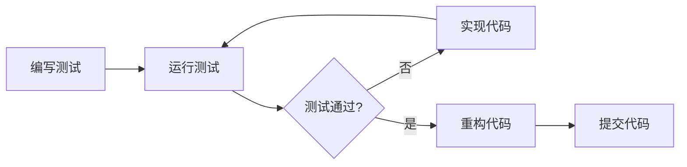

# Athena 平台扩展功能开发任务清单

**项目**: Athena工作平台 - OpenHarness 功能扩展
**开发模式**: 测试驱动开发 (TDD)
**团队**: 4个子智能体协同开发
**开始日期**: 2026-04-20

---

## 📋 总体任务分配

### 子智能体角色分工

| 智能体 | 角色 | 专长 | 主要负责 |
|-------|------|------|---------|
| **Agent-Alpha** | 架构师 | Skills系统、Query Engine | P0扩展功能 |
| **Agent-Beta** | 系统工程师 | Plugins系统、任务管理器 | P0扩展功能 |
| **Agent-Gamma** | 优化专家 | 上下文压缩、会话记忆 | P1优化功能 |
| **Agent-Delta** | 高级架构师 | Coordinator、Swarm模式 | P2高级模式 |

---

## 🔴 P0 阶段 - 扩展性功能 (串行开发)

### 任务组 1: Skills 系统 (Agent-Alpha 负责)

#### 任务 1.1: 设计 Skills 系统架构
- [ ] **设计阶段**
  - [ ] 分析 OpenHarness Skills 系统
  - [ ] 定义 SkillDefinition 数据结构
  - [ ] 设计 SkillRegistry 接口
  - [ ] 设计技能加载流程
  - [ ] 创建 `core/skills/` 目录结构

- [ ] **测试先行 (TDD)**
  - [ ] 编写技能注册表测试 `tests/skills/test_skill_registry.py`
    - [ ] 测试技能注册
    - [ ] 测试技能查询
    - [ ] 测试技能列表
    - [ ] 测试技能分类
  - [ ] 编写技能加载器测试 `tests/skills/test_skill_loader.py`
    - [ ] 测试目录扫描
    - [ ] 测试技能解析
    - [ ] 测试技能验证

- [ ] **实现阶段**
  - [ ] 实现 `core/skills/types.py` - 数据类型定义
    - [ ] SkillDefinition dataclass
    - [ ] SkillCategory 枚举
    - [ ] SkillMetadata 类
  - [ ] 实现 `core/skills/registry.py` - 技能注册表
    - [ ] SkillRegistry 类
    - [ ] register() 方法
    - [ ] get_skill() 方法
    - [ ] list_skills() 方法
    - [ ] find_skills() 方法
  - [ ] 实现 `core/skills/loader.py` - 技能加载器
    - [ ] load_skills_from_directory()
    - [ ] validate_skill()
    - [ ] parse_skill_metadata()
  - [ ] 实现 `core/skills/bundled/` - 内置技能
    - [ ] patent_analysis 技能
    - [ ] legal_writing 技能
    - [ ] case_search 技能

- [ ] **集成测试**
  - [ ] 集成到 Agent Loop
  - [ ] 测试技能动态加载
  - [ ] 测试技能热重载

#### 任务 1.2: 实现技能与工具的映射
- [ ] **设计阶段**
  - [ ] 定义技能到工具的映射规则
  - [ ] 设计技能组合逻辑

- [ ] **测试先行**
  - [ ] 编写映射测试 `tests/skills/test_skill_tool_mapping.py`
    - [ ] 测试单技能多工具
    - [ ] 测试多技能组合
    - [ ] 测试技能冲突检测

- [ ] **实现阶段**
  - [ ] 实现 `core/skills/tool_mapper.py`
    - [ ] SkillToolMapper 类
    - [ ] map_tools_to_skills()
    - [ ] get_tools_for_skill()

#### 任务 1.3: 文档和示例
- [ ] 编写 Skills 系统使用文档
- [ ] 创建 3 个示例技能
- [ ] 编写技能开发指南

---

### 任务组 2: Plugins 系统 (Agent-Beta 负责)

#### 任务 2.1: 设计 Plugins 系统架构
- [ ] **设计阶段**
  - [ ] 分析 OpenHarness Plugins 系统
  - [ ] 定义 Plugin 数据结构
  - [ ] 设计 PluginRegistry 接口
  - [ ] 设计插件发现机制
  - [ ] 创建 `core/plugins/` 目录结构

- [ ] **测试先行 (TDD)**
  - [ ] 编写插件注册表测试 `tests/plugins/test_plugin_registry.py`
    - [ ] 测试插件注册
    - [ ] 测试插件查询
    - [ ] 测试插件依赖检查
  - [ ] 编写插件加载器测试 `tests/plugins/test_plugin_loader.py`
    - [ ] 测试插件发现
    - [ ] 测试插件加载
    - [ ] 测试插件卸载
    - [ ] 测试插件隔离

- [ ] **实现阶段**
  - [ ] 实现 `core/plugins/types.py` - 数据类型定义
    - [ ] PluginDefinition 类
    - [ ] PluginMetadata 类
    - [ ] PluginDependency 类
    - [ ] PluginStatus 枚举
  - [ ] 实现 `core/plugins/registry.py` - 插件注册表
    - [ ] PluginRegistry 类
    - [ ] register_plugin()
    - [ ] get_plugin()
    - [ ] list_plugins()
    - [ ] check_dependencies()
  - [ ] 实现 `core/plugins/loader.py` - 插件加载器
    - [ ] discover_plugins()
    - [ ] load_plugin()
    - [ ] unload_plugin()
    - [ ] validate_plugin()
  - [ ] 实现 `core/plugins/isolation.py` - 插件隔离
    - [ ] PluginSandbox 类
    - [ ] 隔离执行环境
    - [ ] 资源限制

#### 任务 2.2: 插件与工具系统集成
- [ ] **测试先行**
  - [ ] 编写集成测试 `tests/plugins/test_plugin_tool_integration.py`
    - [ ] 测试插件工具注册
    - [ ] 测试插件工具调用
    - [ ] 测试插件生命周期钩子

- [ ] **实现阶段**
  - [ ] 实现 `core/plugins/tool_integration.py`
    - [ ] PluginToolRegistry
    - [ ] 插件工具自动注册
    - [ ] 插件工具包装器

#### 任务 2.3: 插件开发框架
- [ ] **测试先行**
  - [ ] 编写插件模板测试
  - [ ] 测试插件脚手架生成

- [ ] **实现阶段**
  - [ ] 创建插件模板 `plugins/template/`
  - [ ] 实现插件脚手架工具 `scripts/create_plugin.py`
  - [ ] 编写插件开发文档

---

### 任务组 3: 会话记忆系统 (Agent-Gamma 负责)

#### 任务 3.1: 设计文件记忆系统
- [ ] **设计阶段**
  - [ ] 分析 OpenHarness 记忆系统
  - [ ] 设计记忆文件结构
  - [ ] 设计记忆索引机制
  - [ ] 创建 `core/memory/file_memory.py`

- [ ] **测试先行 (TDD)**
  - [ ] 编写文件记忆测试 `tests/memory/test_file_memory.py`
    - [ ] 测试创建记忆条目
    - [ ] 测试删除记忆条目
    - [ ] 测试搜索记忆
    - [ ] 测试更新索引
    - [ ] 测试并发访问控制

- [ ] **实现阶段**
  - [ ] 实现 `core/memory/file_memory.py`
    - [ ] FileMemoryManager 类
    - [ ] add_memory_entry()
    - [ ] remove_memory_entry()
    - [ ] search_memory()
    - [ ] list_memory_files()
  - [ ] 实现 `core/memory/index.py`
    - [ ] MemoryIndex 类
    - [ ] update_index()
    - [ ] rebuild_index()
  - [ ] 实现 `core/memory/lock.py`
    - [ ] 文件锁机制
    - [ ] 原子写入操作

#### 任务 3.2: 集成到四层记忆系统
- [ ] **测试先行**
  - [ ] 编写集成测试 `tests/memory/test_four_tier_integration.py`
    - [ ] 测试文件记忆与HOT层集成
    - [ ] 测试记忆迁移逻辑
    - [ ] 测试记忆查询统一接口

- [ ] **实现阶段**
  - [ ] 扩展现有 `core/memory/` 系统
  - [ ] 添加文件记忆到COLD层
  - [ ] 实现记忆自动同步

---

## 🟡 P1 阶段 - 优化功能 (并行开发)

### 任务组 4: 任务管理器 (Agent-Beta 负责)

#### 任务 4.1: 实现后台任务管理
- [ ] **设计阶段**
  - [ ] 定义任务数据结构
  - [ ] 设计任务生命周期
  - [ ] 设计任务输出日志
  - [ ] 创建 `core/tasks/` 目录

- [ ] **测试先行 (TDD)**
  - [ ] 编写任务管理器测试 `tests/tasks/test_task_manager.py`
    - [ ] 测试创建Shell任务
    - [ ] 测试创建Agent任务
    - [ ] 测试任务状态追踪
    - [ ] 测试任务取消
    - [ ] 测试任务输出读取

- [ ] **实现阶段**
  - [ ] 实现 `core/tasks/types.py`
    - [ ] TaskRecord dataclass
    - [ ] TaskStatus 枚举
    - [ ] TaskType 枚举
  - [ ] 实现 `core/tasks/manager.py`
    - [ ] BackgroundTaskManager 类
    - [ ] create_shell_task()
    - [ ] create_agent_task()
    - [ ] cancel_task()
    - [ ] list_tasks()
    - [ ] get_task()
  - [ ] 实现 `core/tasks/output.py`
    - [ ] 任务输出日志
    - [ ] 实时输出流
    - [ ] 输出文件轮转

#### 任务 4.2: WebSocket 任务通知
- [ ] **测试先行**
  - [ ] 编写任务通知测试 `tests/tasks/test_task_websocket.py`
    - [ ] 测试任务状态推送
    - [ ] 测试任务输出流式推送
    - [ ] 测试任务完成通知

- [ ] **实现阶段**
  - [ ] 集成到 Gateway WebSocket
  - [ ] 实现任务事件推送
  - [ ] 实现任务输出流式传输

---

### 任务组 5: 上下文压缩 (Agent-Gamma 负责)

#### 任务 5.1: 实现Token计数器
- [ ] **测试先行 (TDD)**
  - [ ] 编写Token计数测试 `tests/context/test_token_counter.py`
    - [ ] 测试中文字符计数
    - [ ] 测试英文单词计数
    - [ ] 测试代码块计数
    - [ ] 测试准确度(误差<5%)

- [ ] **实现阶段**
  - [ ] 实现 `core/context/token_counter.py`
    - [ ] TokenCounter 类
    - [ ] count_tokens()
    - [ ] estimate_tokens()
    - [ ] 支持多种Tokenizer

#### 任务 5.2: 实现上下文压缩器
- [ ] **测试先行**
  - [ ] 编写压缩器测试 `tests/context/test_compactor.py`
    - [ ] 测试消息优先级排序
    - [ ] 测试工具结果移除
    - [ ] 测试长消息压缩
    - [ ] 测试关键信息保留
    - [ ] 测试压缩比目标(>50%)

- [ ] **实现阶段**
  - [ ] 实现 `core/context/compactor.py`
    - [ ] ContextCompactor 类
    - [ ] compact_messages()
    - [ ] prioritize_messages()
    - [ ] compress_message()
  - [ ] 实现压缩策略
    - [ ] 移除旧工具结果
    - [ ] 压缩长文本消息
    - [ ] 保留系统提示词
    - [ ] 保留最近N轮对话

#### 任务 5.3: 集成到Agent Loop
- [ ] **测试先行**
  - [ ] 编写集成测试 `tests/context/test_agent_loop_integration.py`
    - [ ] 测试自动触发压缩
    - [ ] 测试压缩后对话连续性
    - [ ] 测试压缩性能(<100ms)

- [ ] **实现阶段**
  - [ ] 修改 `core/agents/agent_loop_enhanced.py`
  - [ ] 添加Token监控
  - [ ] 自动触发压缩
  - [ ] 压缩事件通知

---

### 任务组 6: Hook系统增强 (Agent-Alpha 负责)

#### 任务 6.1: 扩展Hook类型
- [ ] **测试先行**
  - [ ] 编写Hook测试 `tests/hooks/test_hook_types.py`
    - [ ] 测试Agent启动Hook
    - [ ] 测试Agent停止Hook
    - [ ] 测试消息发送Hook
    - [ ] 测试错误处理Hook

- [ ] **实现阶段**
  - [ ] 扩展 `core/tools/hooks.py`
  - [ ] 添加新Hook类型
    - [ ] AGENT_STARTUP
    - [ ] AGENT_SHUTDOWN
    - [ ] MESSAGE_SEND
    - [ ] ERROR_RECOVERY
  - [ ] 实现Hook优先级
  - [ ] 实现Hook条件执行

#### 任务 6.2: 实现Hook执行器
- [ ] **测试先行**
  - [ ] 编写执行器测试 `tests/hooks/test_executor.py`
    - [ ] 测试Hook执行顺序
    - [ ] 测试Hook异常隔离
    - [ ] 测试Hook超时处理
    - [ ] 测试Hook结果聚合

- [ ] **实现阶段**
  - [ ] 实现 `core/hooks/executor.py`
    - [ ] HookExecutor 类
    - [ ] execute_hooks()
    - [ ] register_hook()
    - [ ] 异常处理机制

---

### 任务组 7: Query Engine (Agent-Alpha 负责)

#### 任务 7.1: 实现查询引擎
- [ ] **设计阶段**
  - [ ] 分析OpenHarness QueryEngine
  - [ ] 设计对话历史管理
  - [ ] 设计查询循环
  - [ ] 创建 `core/query/` 目录

- [ ] **测试先行 (TDD)**
  - [ ] 编写QueryEngine测试 `tests/query/test_query_engine.py`
    - [ ] 测试消息提交
    - [ ] 测试历史管理
    - [ ] 测试查询循环
    - [ ] 测试流式响应
    - [ ] 测试成本追踪

- [ ] **实现阶段**
  - [ ] 实现 `core/query/engine.py`
    - [ ] QueryEngine 类
    - [ ] submit_message()
    - [ ] clear_history()
    - [ ] get_stats()
  - [ ] 实现 `core/query/history.py`
    - [ ] ConversationHistory 类
    - [ ] add_message()
    - [ ] get_messages()
    - [ ] trim_history()

#### 任务 7.2: 成本追踪
- [ ] **测试先行**
  - [ ] 编写成本测试 `tests/query/test_cost_tracker.py`
    - [ ] 测试Token计数
    - [ ] 测试成本计算
    - [ ] 测试成本限制

- [ ] **实现阶段**
  - [ ] 实现 `core/query/cost_tracker.py`
    - [ ] CostTracker 类
    - [ ] track_usage()
    - [ ] get_total_cost()
    - [ ] check_budget()

---

## 🟢 P2 阶段 - 高级模式 (并行开发)

### 任务组 8: Coordinator模式 (Agent-Delta 负责)

#### 任务 8.1: 设计协调器架构
- [ ] **设计阶段**
  - [ ] 分析OpenHarness Coordinator
  - [ ] 设计Worker接口
  - [ ] 设计任务分配算法
  - [ ] 设计结果聚合逻辑
  - [ ] 创建 `core/coordination/` 目录

- [ ] **测试先行 (TDD)**
  - [ ] 编写协调器测试 `tests/coordination/test_coordinator.py`
    - [ ] 测试任务分解
    - [ ] 测试Worker分配
    - [ ] 测试并行执行
    - [ ] 测试结果聚合
    - [ ] 测试错误恢复

- [ ] **实现阶段**
  - [ ] 实现 `core/coordination/coordinator.py`
    - [ ] Coordinator 类
    - [ ] coordinate_task()
    - [ ] assign_workers()
    - [ ] aggregate_results()
  - [ ] 实现 `core/coordination/worker.py`
    - [ ] Worker 接口
    - [ ] execute_subtask()
    - [ ] report_progress()

#### 任务 8.2: 任务分解算法
- [ ] **测试先行**
  - [ ] 编写任务分解测试
    - [ ] 测试简单任务分解
    - [ ] 测试复杂任务分解
    - [ ] 测试任务依赖解析

- [ ] **实现阶段**
  - [ ] 实现 `core/coordination/task_decomposer.py`
    - [ ] TaskDecomposer 类
    - [ ] decompose_task()
    - [ ] identify_subtasks()
    - [ ] build_dependency_graph()

---

### 任务组 9: Swarm模式 (Agent-Delta 负责)

#### 任务 9.1: 实现Swarm编排器
- [ ] **设计阶段**
  - [ ] 分析OpenHarness Swarm
  - [ ] 设计Swarm架构
  - [ ] 设计并行执行引擎
  - [ ] 设计投票机制
  - [ ] 创建 `core/swarm/` 目录

- [ ] **测试先行 (TDD)**
  - [ ] 编写Swarm测试 `tests/swarm/test_swarm.py`
    - [ ] 测试Swarm初始化
    - [ ] 测试并行执行
    - [ ] 测试结果投票
    - [ ] 测试失败重试
    - [ ] 测试Swarm性能

- [ ] **实现阶段**
  - [ ] 实现 `core/swarm/orchestrator.py`
    - [ ] SwarmOrchestrator 类
    - [ ] orchestrate()
    - [ ] parallel_execute()
  - [ ] 实现 `core/swarm/voting.py`
    - [ ] VotingStrategy 类
    - [ ] majority_vote()
    - [ ] weighted_vote()
    - [ ] consensus_vote()

#### 任务 9.2: 多实例管理
- [ ] **测试先行**
  - [ ] 编写实例管理测试
    - [ ] 测试实例创建
    - [ ] 测试实例销毁
    - [ ] 测试实例池管理

- [ ] **实现阶段**
  - [ ] 实现 `core/swarm/instance_manager.py`
    - [ ] AgentInstanceManager 类
    - [ ] create_instance()
    - [ ] destroy_instance()
    - [ ] get_instance_pool()

---

### 任务组 10: Canvas/Host UI (Agent-Delta 负责)

#### 任务 10.1: 实现UI渲染系统
- [ ] **设计阶段**
  - [ ] 分析OpenHarness Canvas
  - [ ] 设计UI组件系统
  - [ ] 设计渲染引擎
  - [ ] 创建 `services/ui_host/` 目录

- [ ] **测试先行 (TDD)**
  - [ ] 编写UI测试 `tests/ui/test_renderer.py`
    - [ ] 测试组件渲染
    - [ ] 测试事件处理
    - [ ] 测试状态管理

- [ ] **实现阶段**
  - [ ] 实现 `services/ui_host/renderer.py`
    - [ ] UIRenderer 类
    - [ ] render_component()
    - [ ] handle_event()
  - [ ] 实现 `services/ui_host/components/`
    - [ ] 基础UI组件
    - [ ] 表单组件
    - [ ] 列表组件
    - [ ] 卡片组件

#### 任务 10.2: WebSocket UI集成
- [ ] **测试先行**
  - [ ] 编写UI WebSocket测试
    - [ ] 测试UI更新推送
    - [ ] 测试用户交互处理

- [ ] **实现阶段**
  - [ ] 扩展Gateway WebSocket
  - [ ] 实现UI消息协议
  - [ ] 实现双向数据绑定

---

## 🔄 开发流程

### TDD 开发循环

每个任务遵循以下流程：

### 串行+并行开发策略

**P0阶段** (串行):
1. Agent-Alpha: Skills系统 (3天)
2. Agent-Beta: Plugins系统 (3天)  
3. Agent-Gamma: 会话记忆 (2天)

**P1阶段** (并行):
- Agent-Beta: 任务管理器
- Agent-Gamma: 上下文压缩
- Agent-Alpha: Hook+Query Engine

**P2阶段** (并行):
- Agent-Delta: Coordinator+Swarm+UI

---

## 📊 进度追踪

### 每日站会检查清单

每个智能体每日汇报：
- [ ] 昨日完成的任务
- [ ] 今日计划的任务
- [ ] 遇到的阻碍
- [ ] 测试覆盖率
- [ ] 代码质量指标

### 里程碑检查点

**Milestone 1** (Day 8): P0阶段完成
- [ ] Skills系统可用
- [ ] Plugins系统可用
- [ ] 会话记忆可用
- [ ] 集成测试通过

**Milestone 2** (Day 15): P1阶段完成
- [ ] 任务管理器可用
- [ ] 上下文压缩可用
- [ ] Hook系统增强
- [ ] Query Engine可用

**Milestone 3** (Day 30): P2阶段完成
- [ ] Coordinator模式可用
- [ ] Swarm模式可用
- [ ] Canvas/Host UI可用

---

## 🎯 质量标准

### 代码质量
- [ ] 测试覆盖率 > 80%
- [ ] 所有测试通过
- [ ] 代码审查通过
- [ ] 文档完整

### 性能指标
- [ ] 响应时间 < 100ms (P95)
- [ ] 内存占用 < 500MB
- [ ] 无内存泄漏
- [ ] 并发支持 > 100 QPS

---

**创建者**: Claude Code
**最后更新**: 2026-04-20
