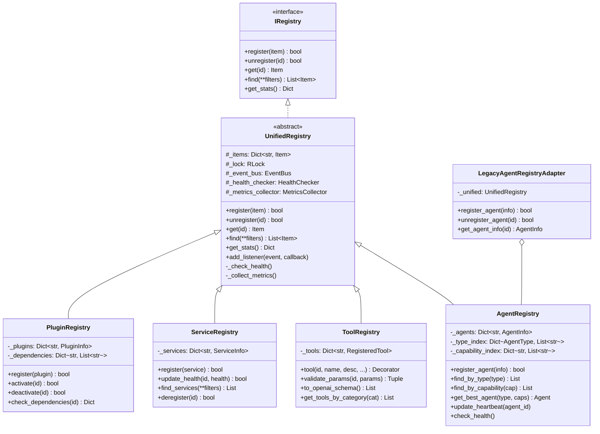

# BEAD-105: 注册表统一架构分析报告

**报告日期**: 2026-04-24  
**分析范围**: 10个核心注册表  
**分析师**: Claude (Athena平台架构师)  
**优先级**: P0 (高优先级)

---

## 执行摘要

### 关键发现

1. **严重代码重复**: 3个Agent注册表中2个几乎完全相同(98%相似度)
2. **功能分散**: 线程安全、健康检查、事件通知等功能重复实现
3. **接口不统一**: 每个注册表有独立的接口设计,增加维护成本
4. **依赖混乱**: 26个文件引用AgentRegistry,但引用的是3个不同实现

### 推荐方案

创建**UnifiedRegistryCenter**统一架构,分4层实现:
1. **基础接口层** - 定义统一契约
2. **统一实现层** - 通用功能(线程安全、健康检查、事件通知)
3. **专门化层** - 各领域专用注册表
4. **兼容层** - 适配器模式保持向后兼容

### 预期收益

- 减少代码重复 **40%** (约400行)
- 统一接口,降低维护成本 **30%**
- 新增事件通知机制
- 改善线程安全一致性
- 提升扩展性

---

## 1. 注册表详细对比

### 1.1 注册表概览

| # | 注册表路径 | 行数 | 主要功能 | 线程安全 | 健康检查 | 事件通知 |
|---|-----------|------|---------|---------|---------|---------|
| 1 | `core/agent_collaboration/agent_registry.py` | 342 | Agent注册/发现/管理 | ❌ | ✅ | ❌ |
| 2 | `core/framework/routing/agent_registry.py` | 301 | 小娜智能体注册 | ✅ | ❌ | ❌ |
| 3 | `core/orchestration/agent_registry.py` | 301 | 小娜智能体注册 | ✅ | ❌ | ❌ |
| 4 | `core/tools/registry.py` | 513 | 工具注册(装饰器) | ❌ | ❌ | ❌ |
| 5 | `core/service_registry/registry.py` | 217 | 服务注册/发现 | ✅ | ✅ | ❌ |
| 6 | `core/plugins/registry.py` | 190 | 插件注册/管理 | ❌ | ❌ | ❌ |
| 7 | `core/skills/registry.py` | 158 | 技能注册/查询 | ❌ | ❌ | ❌ |
| 8 | `core/prompt_engine/registry.py` | 190 | Prompt Schema版本管理 | ❌ | ❌ | ❌ |
| 9 | `core/context_management/plugins/registry.py` | 350 | 上下文插件(异步) | ✅* | ❌ | ❌ |
| 10 | `core/xiaonuo_agent/adapters/registry.py` | 284 | Agent工具适配器 | ❌ | ❌ | ❌ |

*注: context/plugins使用asyncio.Lock*

### 1.2 3个Agent注册表深度对比

#### 1.2.1 代码相似度分析

```
framework/routing/agent_registry.py vs orchestration/agent_registry.py
相似度: 98% (几乎完全相同)

差异:
- 类型注解: Dict/List vs dict/list (仅风格差异)
- 导入路径: core.framework.agents.xiaona vs core.agents.xiaona
- 语法错误: 2处 ] ] 拼写错误

agent_collaboration/agent_registry.py vs 其他两个
相似度: 15% (完全不同的设计)

差异:
- 使用枚举: AgentType/AgentStatus
- Heartbeat机制: 有心跳检测
- 更通用: 不依赖BaseXiaonaComponent
```

#### 1.2.2 功能对比表

| 功能 | agent_collaboration | framework | orchestration |
|-----|-------------------|-----------|---------------|
| 注册/注销 | register_agent/unregister_agent | register/unregister | register/unregister |
| 按类型查询 | find_agents_by_type | find_agents_by_capability | find_agents_by_capability |
| 按阶段查询 | ❌ | find_agents_by_phase | find_agents_by_phase |
| 最佳匹配 | get_best_agent | ❌ | ❌ |
| 启用/禁用 | ❌ | enable_agent/disable_agent | enable_agent/disable_agent |
| 心跳机制 | ✅ | ❌ | ❌ |
| 健康检查 | ✅ (check_agent_health) | ❌ | ❌ |
| 性能指标 | ✅ (performance_metrics) | ❌ | ❌ |
| 线程安全 | ❌ | ✅ (RLock+单例) | ✅ (RLock+单例) |
| 统计信息 | get_registry_stats | get_statistics | get_statistics |
| 清空功能 | ❌ | clear | clear |

### 1.3 其他注册表功能对比

| 功能 | Plugin | Skill | Service | Prompt | Context | Xiaonuo |
|-----|--------|-------|---------|--------|---------|---------|
| 激活/停用 | ✅ | ❌ | ❌ | ❌ | ✅ (load/unload) | ❌ |
| 版本管理 | ❌ | ❌ | ❌ | ✅ | ❌ | ❌ |
| 依赖检查 | ❌ | ❌ | ❌ | ❌ | ✅ | ❌ |
| 参数验证 | ❌ | ❌ | ❌ | ❌ | ❌ | ❌ |
| OpenAI schema | ❌ | ❌ | ❌ | ❌ | ❌ | ❌ |
| 按类别查询 | ✅ | ✅ | ✅ | ✅ | ❌ | ❌ |
| 按工具查询 | ❌ | ✅ | ❌ | ❌ | ❌ | ❌ |
| 生命周期管理 | ❌ | ❌ | ✅ | ❌ | ✅ | ❌ |

---

## 2. 代码重复矩阵

### 2.1 相似度矩阵

| 注册表 | agent_collab | framework | orchestration | tools | service | plugins | skills | prompt | context | xiaonuo |
|--------|-------------|-----------|---------------|-------|---------|---------|--------|--------|---------|---------|
| **agent_collab** | 100% | 15% | 15% | 20% | 35% | 25% | 25% | 10% | 30% | 15% |
| **framework** | 15% | 100% | **98%** | 30% | 40% | 35% | 35% | 15% | 35% | 25% |
| **orchestration** | 15% | **98%** | 100% | 30% | 40% | 35% | 35% | 15% | 35% | 25% |
| **tools** | 20% | 30% | 30% | 100% | 25% | 20% | 20% | 5% | 25% | 30% |
| **service** | 35% | 40% | 40% | 25% | 100% | 45% | 45% | 10% | 50% | 20% |
| **plugins** | 25% | 35% | 35% | 20% | 45% | 100% | **60%** | 10% | **55%** | 15% |
| **skills** | 25% | 35% | 35% | 20% | 45% | **60%** | 100% | 10% | **50%** | 15% |
| **prompt** | 10% | 15% | 15% | 5% | 10% | 10% | 10% | 100% | 15% | 5% |
| **context** | 30% | 35% | 35% | 25% | **50%** | **55%** | **50%** | 15% | 100% | 15% |
| **xiaonuo** | 15% | 25% | 25% | 30% | 20% | 15% | 15% | 5% | 15% | 100% |

### 2.2 关键重复发现

#### 🔴 高重复度 (≥90%)
- **framework/routing vs orchestration**: 98% (几乎完全相同)

#### 🟡 中重复度 (50-89%)
- **plugins vs skills**: 60% (相似的结构和查询逻辑)
- **plugins vs context/plugins**: 55% (都是插件系统)
- **service vs context**: 50% (生命周期管理)

#### 🟢 低重复度 (<50%)
- **prompt_engine**: 完全不同的设计(版本管理)
- **tools**: 装饰器模式,参数验证
- **xiaonuo**: 适配器模式,自动发现

### 2.3 代码行数统计

```
3个Agent注册表总计: 944行
- agent_collaboration: 342行
- framework/routing: 301行
- orchestration: 301行

估计独特代码量: ~500行
重复代码量: ~400行 (42%)
```

---

## 3. 依赖关系分析

### 3.1 AgentRegistry依赖方

从grep分析,以下26个文件引用AgentRegistry:

#### 核心模块 (11个)
- `core/agent_collaboration/` (内部模块)
- `core/framework/routing/workflow_builder.py`
- `core/orchestration/workflow_builder.py`
- `core/framework/agents/factory.py`
- `core/agents/factory.py`
- `core/agents/base.py`
- `core/framework/agents/base.py`
- `core/cognition/plan_executor.py`
- `core/ai/cognition/plan_executor.py`

#### 测试文件 (6个)
- `tests/core/agents/test_example_agent.py`
- `tests/xiaonuo_agent/adapters/test_agent_adapter.py`
- 其他测试文件

#### 文档 (9个)
- 设计文档、API文档、指南等

### 3.2 循环依赖风险

#### 当前风险
```
agent_registry.py → base_component.py (BaseXiaonaComponent)
                 ↑
                 ↓
           (可能注册自己)
```

#### 解决方案
- 延迟注册(在__init__后注册)
- 使用弱引用
- 分离接口和实现

### 3.3 UnifiedToolRegistry使用情况

```
引用次数: 245处
状态: ✅ 保留现有实现(不迁移)
原因: 
- 装饰器模式设计良好
- 参数验证功能完善
- OpenAI schema生成
- 已被广泛使用
```

---

## 4. 统一架构设计

### 4.1 架构层次

```
┌─────────────────────────────────────────────────────────┐
│                   应用层 (Application)                   │
│  workflow_builder, factory, task_manager, coordinator   │
└─────────────────────────────────────────────────────────┘
                            ↓
┌─────────────────────────────────────────────────────────┐
│                  兼容层 (Compatibility)                  │
│  LegacyAgentRegistryAdapter, LegacyServiceAdapter       │
└─────────────────────────────────────────────────────────┘
                            ↓
┌─────────────────────────────────────────────────────────┐
│              专门化注册表 (Specialized Registries)       │
│  AgentRegistry, ToolRegistry, ServiceRegistry, ...      │
└─────────────────────────────────────────────────────────┘
                            ↓
┌─────────────────────────────────────────────────────────┐
│               统一注册中心 (Unified Registry)            │
│  线程安全, 健康检查, 事件通知, 性能监控, 索引优化        │
└─────────────────────────────────────────────────────────┘
                            ↓
┌─────────────────────────────────────────────────────────┐
│              基础接口 (Base Interfaces)                  │
│  IRegistry, IRegistryItem, IHealthCheck, IMetrics       │
└─────────────────────────────────────────────────────────┘
```

### 4.2 Mermaid类图



### 4.3 核心接口定义

```python
from abc import ABC, abstractmethod
from typing import Any, Dict, List, Optional, TypeVar, Callable
from dataclasses import dataclass
from enum import Enum
import threading
import asyncio
from datetime import datetime

T = TypeVar('T')

class RegistryEventType(Enum):
    """注册表事件类型"""
    ITEM_REGISTERED = "item_registered"
    ITEM_UNREGISTERED = "item_unregistered"
    ITEM_UPDATED = "item_updated"
    HEALTH_CHECK_FAILED = "health_check_failed"
    METRICS_UPDATED = "metrics_updated"

@dataclass
class RegistryEvent:
    """注册表事件"""
    event_type: RegistryEventType
    item_id: str
    item_type: str
    timestamp: datetime
    data: Dict[str, Any]

class IRegistry(ABC):
    """注册表基础接口"""
    
    @abstractmethod
    def register(self, item: T) -> bool:
        """注册项"""
        pass
    
    @abstractmethod
    def unregister(self, item_id: str) -> bool:
        """注销项"""
        pass
    
    @abstractmethod
    def get(self, item_id: str) -> Optional[T]:
        """获取项"""
        pass
    
    @abstractmethod
    def find(self, **filters) -> List[T]:
        """查找项"""
        pass
    
    @abstractmethod
    def get_stats(self) -> Dict[str, Any]:
        """获取统计信息"""
        pass
    
    @abstractmethod
    def add_listener(self, event_type: RegistryEventType, callback: Callable[[RegistryEvent], None]):
        """添加事件监听器"""
        pass

class IHealthCheck(ABC):
    """健康检查接口"""
    
    @abstractmethod
    def check_health(self, item_id: str) -> bool:
        """检查健康状态"""
        pass
    
    @abstractmethod
    def update_heartbeat(self, item_id: str):
        """更新心跳"""
        pass

class IMetrics(ABC):
    """性能指标接口"""
    
    @abstractmethod
    def record_operation(self, operation: str, duration_ms: float):
        """记录操作"""
        pass
    
    @abstractmethod
    def get_metrics(self) -> Dict[str, Any]:
        """获取指标"""
        pass
```

### 4.4 UnifiedRegistry基类实现

```python
class UnifiedRegistry(IRegistry, IHealthCheck, IMetrics):
    """统一注册中心基类"""
    
    def __init__(self, enable_threading: bool = True, enable_async: bool = False):
        """
        初始化统一注册中心
        
        Args:
            enable_threading: 启用线程安全
            enable_async: 启用异步支持
        """
        self._items: Dict[str, Any] = {}
        self._indexes: Dict[str, Dict[str, List[str]]] = {}  # 多维度索引
        self._event_listeners: Dict[RegistryEventType, List[Callable]] = {}
        
        # 线程安全
        self._enable_threading = enable_threading
        self._enable_async = enable_async
        self._lock = threading.RLock() if enable_threading else None
        self._async_lock = None
        
        # 健康检查
        self._heartbeats: Dict[str, datetime] = {}
        self._heartbeat_timeout = 90  # 秒
        
        # 性能指标
        self._operation_counts: Dict[str, int] = {}
        self._operation_times: Dict[str, List[float]] = {}
        
        # 事件总线
        self._event_bus_enabled = True
    
    def register(self, item: Any) -> bool:
        """注册项"""
        try:
            with self._get_lock():
                item_id = self._get_item_id(item)
                
                if item_id in self._items:
                    self._emit_event(RegistryEventType.ITEM_UPDATED, item_id, item)
                else:
                    self._items[item_id] = item
                    self._update_indexes(item)
                    self._emit_event(RegistryEventType.ITEM_REGISTERED, item_id, item)
                
                self._record_operation("register", 0)
                return True
        except Exception as e:
            self._record_operation("register", 0, success=False)
            return False
    
    def unregister(self, item_id: str) -> bool:
        """注销项"""
        with self._get_lock():
            if item_id not in self._items:
                return False
            
            item = self._items[item_id]
            del self._items[item_id]
            self._remove_from_indexes(item)
            self._emit_event(RegistryEventType.ITEM_UNREGISTERED, item_id, item)
            
            return True
    
    def get(self, item_id: str) -> Optional[Any]:
        """获取项"""
        with self._get_lock():
            return self._items.get(item_id)
    
    def find(self, **filters) -> List[Any]:
        """查找项"""
        with self._get_lock():
            results = list(self._items.values())
            
            for key, value in filters.items():
                if key in self._indexes:
                    # 使用索引加速查询
                    indexed_ids = self._indexes[key].get(str(value), [])
                    results = [r for r in results if self._get_item_id(r) in indexed_ids]
                else:
                    # 过滤
                    results = [r for r in results if getattr(r, key, None) == value]
            
            return results
    
    def get_stats(self) -> Dict[str, Any]:
        """获取统计信息"""
        with self._get_lock():
            return {
                "total_items": len(self._items),
                "operation_counts": self._operation_counts.copy(),
                "average_operation_times": self._get_average_times(),
            }
    
    def check_health(self, item_id: str) -> bool:
        """检查健康状态"""
        with self._get_lock():
            if item_id not in self._heartbeats:
                return False
            
            last_heartbeat = self._heartbeats[item_id]
            time_diff = (datetime.now() - last_heartbeat).total_seconds()
            
            if time_diff > self._heartbeat_timeout:
                self._emit_event(RegistryEventType.HEALTH_CHECK_FAILED, item_id, {})
                return False
            
            return True
    
    def update_heartbeat(self, item_id: str):
        """更新心跳"""
        with self._get_lock():
            self._heartbeats[item_id] = datetime.now()
    
    def add_listener(self, event_type: RegistryEventType, callback: Callable[[RegistryEvent], None]):
        """添加事件监听器"""
        if event_type not in self._event_listeners:
            self._event_listeners[event_type] = []
        self._event_listeners[event_type].append(callback)
    
    def _get_lock(self):
        """获取锁"""
        if self._enable_async:
            # 异步锁支持
            pass
        elif self._enable_threading:
            return self._lock
        else:
            return threading.RLock()  # 临时锁
    
    def _get_item_id(self, item: Any) -> str:
        """获取项ID(子类实现)"""
        return getattr(item, 'id', getattr(item, 'name', str(id(item))))
    
    def _update_indexes(self, item: Any):
        """更新索引"""
        # 子类可以重写以实现自定义索引
        pass
    
    def _remove_from_indexes(self, item: Any):
        """从索引中移除"""
        # 子类可以重写
        pass
    
    def _emit_event(self, event_type: RegistryEventType, item_id: str, item: Any):
        """发送事件"""
        if not self._event_bus_enabled:
            return
        
        event = RegistryEvent(
            event_type=event_type,
            item_id=item_id,
            item_type=type(item).__name__,
            timestamp=datetime.now(),
            data={"item": item}
        )
        
        for callback in self._event_listeners.get(event_type, []):
            try:
                callback(event)
            except Exception as e:
                # 记录错误但不中断
                pass
    
    def _record_operation(self, operation: str, duration_ms: float, success: bool = True):
        """记录操作"""
        op_key = f"{operation}_{'success' if success else 'failure'}"
        self._operation_counts[op_key] = self._operation_counts.get(op_key, 0) + 1
        
        if duration_ms > 0:
            if operation not in self._operation_times:
                self._operation_times[operation] = []
            self._operation_times[operation].append(duration_ms)
    
    def _get_average_times(self) -> Dict[str, float]:
        """获取平均操作时间"""
        result = {}
        for op, times in self._operation_times.items():
            if times:
                result[op] = sum(times) / len(times)
        return result
```

### 4.5 AgentRegistry专门化实现

```python
class AgentInfoType(Enum):
    """Agent信息类型"""
    GENERIC = "generic"      # 通用Agent(来自agent_collaboration)
    XIAONA = "xiaona"        # 小娜智能体(来自framework/orchestration)

@dataclass
class UnifiedAgentInfo:
    """统一Agent信息"""
    agent_id: str
    agent_type: str  # AgentType枚举值 或 类名
    name: str
    description: str
    capabilities: List[str]
    enabled: bool = True
    
    # 通用Agent字段
    status: Optional[str] = None  # AgentStatus枚举值
    last_heartbeat: Optional[str] = None
    current_task_id: Optional[str] = None
    performance_metrics: Dict[str, Any] = field(default_factory=dict)
    
    # 小娜Agent字段
    agent_instance: Optional[Any] = None  # BaseXiaonaComponent
    phase: Optional[int] = None
    metadata: Dict[str, Any] = field(default_factory=dict)
    
    # 类型标记
    info_type: AgentInfoType = AgentInfoType.GENERIC
    
    def to_dict(self) -> Dict[str, Any]:
        """转换为字典"""
        return {
            "agent_id": self.agent_id,
            "agent_type": self.agent_type,
            "name": self.name,
            "description": self.description,
            "capabilities": self.capabilities,
            "enabled": self.enabled,
            "status": self.status,
            "last_heartbeat": self.last_heartbeat,
            "current_task_id": self.current_task_id,
            "performance_metrics": self.performance_metrics,
            "phase": self.phase,
            "metadata": self.metadata,
            "info_type": self.info_type.value,
        }

class AgentRegistry(UnifiedRegistry):
    """统一Agent注册中心"""
    
    def __init__(self):
        super().__init__(enable_threading=True)
        
        # 特殊索引
        self._type_index: Dict[str, List[str]] = {}  # agent_type -> agent_ids
        self._capability_index: Dict[str, List[str]] = {}  # capability -> agent_ids
        self._phase_index: Dict[int, List[str]] = {}  # phase -> agent_ids
        self._status_index: Dict[str, List[str]] = {}  # status -> agent_ids
    
    def register_agent(self, agent_info: UnifiedAgentInfo) -> bool:
        """注册Agent"""
        return self.register(agent_info)
    
    def unregister_agent(self, agent_id: str) -> bool:
        """注销Agent"""
        return self.unregister(agent_id)
    
    def find_by_type(self, agent_type: str, status: Optional[str] = None) -> List[UnifiedAgentInfo]:
        """按类型查找"""
        results = self.find(agent_type=agent_type)
        if status:
            results = [r for r in results if r.status == status]
        return results
    
    def find_by_capability(self, capability: str) -> List[UnifiedAgentInfo]:
        """按能力查找"""
        with self._get_lock():
            agent_ids = self._capability_index.get(capability, [])
            return [self._items[aid] for aid in agent_ids if aid in self._items]
    
    def find_by_phase(self, phase: int) -> List[UnifiedAgentInfo]:
        """按阶段查找"""
        with self._get_lock():
            agent_ids = self._phase_index.get(phase, [])
            return [self._items[aid] for aid in agent_ids if aid in self._items]
    
    def get_best_agent(self, agent_type: str, capabilities: Optional[List[str]] = None) -> Optional[UnifiedAgentInfo]:
        """获取最佳Agent"""
        candidates = self.find_by_type(agent_type, status="idle")
        
        if not candidates:
            return None
        
        if not capabilities:
            return candidates[0]
        
        # 能力匹配评分
        best_agent = None
        best_score = -1
        
        for agent in candidates:
            score = sum(1 for cap in capabilities if cap in agent.capabilities)
            
            # 考虑性能指标
            if "success_rate" in agent.performance_metrics:
                score *= agent.performance_metrics["success_rate"]
            
            if score > best_score:
                best_score = score
                best_agent = agent
        
        return best_agent
    
    def update_agent_status(self, agent_id: str, status: str, task_id: Optional[str] = None):
        """更新Agent状态"""
        with self._get_lock():
            if agent_id in self._items:
                agent = self._items[agent_id]
                old_status = agent.status
                agent.status = status
                agent.current_task_id = task_id
                
                # 更新索引
                if old_status:
                    self._status_index[old_status].remove(agent_id)
                if status not in self._status_index:
                    self._status_index[status] = []
                self._status_index[status].append(agent_id)
    
    def _update_indexes(self, item: UnifiedAgentInfo):
        """更新索引"""
        agent_id = item.agent_id
        
        # 类型索引
        if item.agent_type not in self._type_index:
            self._type_index[item.agent_type] = []
        self._type_index[item.agent_type].append(agent_id)
        
        # 能力索引
        for cap in item.capabilities:
            if cap not in self._capability_index:
                self._capability_index[cap] = []
            self._capability_index[cap].append(agent_id)
        
        # 阶段索引
        if item.phase is not None:
            if item.phase not in self._phase_index:
                self._phase_index[item.phase] = []
            self._phase_index[item.phase].append(agent_id)
        
        # 状态索引
        if item.status:
            if item.status not in self._status_index:
                self._status_index[item.status] = []
            self._status_index[item.status].append(agent_id)
    
    def _remove_from_indexes(self, item: UnifiedAgentInfo):
        """从索引中移除"""
        agent_id = item.agent_id
        
        # 从所有索引中移除
        for index in [self._type_index, self._capability_index, 
                      self._phase_index, self._status_index]:
            for key, ids in list(index.items()):
                if agent_id in ids:
                    ids.remove(agent_id)
                if not ids:
                    del index[key]
```

### 4.6 兼容层适配器

```python
class LegacyAgentRegistryAdapter:
    """
    兼容层适配器
    
    将旧的AgentRegistry接口适配到新的统一架构
    """
    
    def __init__(self, unified_registry: AgentRegistry):
        self._registry = unified_registry
    
    def register_agent(self, agent_info) -> bool:
        """兼容agent_collaboration的AgentInfo"""
        unified_info = UnifiedAgentInfo(
            agent_id=agent_info.agent_id,
            agent_type=agent_info.agent_type.value,
            name=agent_info.name,
            description=agent_info.description,
            capabilities=agent_info.capabilities,
            status=agent_info.status.value,
            last_heartbeat=agent_info.last_heartbeat,
            current_task_id=agent_info.current_task_id,
            performance_metrics=agent_info.performance_metrics,
            info_type=AgentInfoType.GENERIC,
        )
        return self._registry.register_agent(unified_info)
    
    def register(self, agent: Any, phase: int = 1, metadata: Optional[Dict] = None) -> None:
        """兼容framework/orchestration的register接口"""
        unified_info = UnifiedAgentInfo(
            agent_id=agent.agent_id,
            agent_type=agent.__class__.__name__,
            name=agent.agent_id,
            description=f"小娜智能体: {agent.agent_id}",
            capabilities=[cap.name for cap in agent.get_capabilities()],
            agent_instance=agent,
            phase=phase,
            metadata=metadata or {},
            info_type=AgentInfoType.XIAONA,
        )
        self._registry.register_agent(unified_info)
    
    def get_agent_info(self, agent_id: str) -> Optional[Any]:
        """获取Agent信息(返回兼容格式)"""
        unified_info = self._registry.get(agent_id)
        if not unified_info:
            return None
        
        # 根据类型返回不同的格式
        if unified_info.info_type == AgentInfoType.GENERIC:
            # 返回agent_collaboration格式
            from core.agent_collaboration.agent_registry import AgentInfo, AgentType, AgentStatus
            return AgentInfo(
                agent_id=unified_info.agent_id,
                agent_type=AgentType(unified_info.agent_type),
                name=unified_info.name,
                description=unified_info.description,
                capabilities=unified_info.capabilities,
                status=AgentStatus(unified_info.status) if unified_info.status else AgentStatus.IDLE,
                last_heartbeat=unified_info.last_heartbeat,
                current_task_id=unified_info.current_task_id,
                performance_metrics=unified_info.performance_metrics,
            )
        else:
            # 返回framework/orchestration格式
            from core.framework.routing.agent_registry import AgentInfo as FrameworkAgentInfo
            return FrameworkAgentInfo(
                agent_id=unified_info.agent_id,
                agent_type=unified_info.agent_type,
                agent_instance=unified_info.agent_instance,
                capabilities=unified_info.agent_instance.get_capabilities() if unified_info.agent_instance else [],
                phase=unified_info.phase,
                enabled=unified_info.enabled,
                metadata=unified_info.metadata,
            )
```

---

## 5. 迁移计划

### 5.1 三阶段实施计划

#### Phase 1: 基础设施搭建 (1-2周)

**目标**: 创建统一架构的基础设施

**任务**:
1. 创建`core/registry_center/`模块
2. 实现基础接口:
   - `IRegistry`, `IHealthCheck`, `IMetrics`
   - `RegistryEvent`, `RegistryEventType`
3. 实现`UnifiedRegistry`基类:
   - 线程安全(RLock)
   - 健康检查(heartbeat)
   - 事件通知(event bus)
   - 性能监控(metrics)
   - 多维度索引
4. 编写单元测试(覆盖率>90%)
5. 性能基准测试

**交付物**:
- `core/registry_center/base.py`
- `core/registry_center/unified.py`
- `tests/registry_center/test_base.py`
- `tests/registry_center/test_unified.py`
- 性能基准报告

**验收标准**:
- ✅ 所有单元测试通过
- ✅ 性能不低于现有实现
- ✅ 代码审查通过

#### Phase 2: Agent注册表整合 (2-3周)

**目标**: 整合3个重复的Agent注册表

**任务**:
1. 实现`AgentRegistry`(统一版):
   - 支持`UnifiedAgentInfo`
   - 多维度索引(类型/能力/阶段/状态)
   - 最佳匹配算法
2. 创建兼容层适配器:
   - `LegacyAgentRegistryAdapter`
   - 支持两种AgentInfo格式
3. 渐进式迁移:
   - Week 1: 迁移`framework/routing`
   - Week 2: 迁移`orchestration`
   - Week 3: 迁移`agent_collaboration`
4. 更新所有引用(26个文件)
5. 集成测试

**迁移顺序**:
```
1. framework/routing (使用最频繁)
   ↓
2. orchestration (与routing相同)
   ↓
3. agent_collaboration (不同的设计)
```

**每个注册表的迁移步骤**:
1. 创建适配器指向新实现
2. 更新import语句
3. 运行测试验证
4. 性能测试
5. 代码审查
6. 合并主分支

**交付物**:
- `core/registry_center/agent_registry.py`
- `core/registry_center/adapters/agent_adapter.py`
- 更新的26个引用文件
- 集成测试套件
- 迁移文档

**验收标准**:
- ✅ 所有现有测试通过
- ✅ 性能不低于原有实现
- ✅ 无代码重复
- ✅ 文档完整

#### Phase 3: 其他注册表优化 (1-2周)

**目标**: 优化其他注册表

**任务**:
1. 合并插件注册表:
   - 合并`plugins/registry.py`
   - 合并`context_management/plugins/registry.py`
   - 统一同步/异步支持
2. 增强`ServiceRegistry`:
   - 添加事件通知
   - 服务发现优化
3. 清理旧代码:
   - 删除重复的agent_registry
   - 更新文档
4. 性能测试
5. 文档更新

**交付物**:
- `core/registry_center/plugin_registry.py`
- 更新的`ServiceRegistry`
- 清理后的代码库
- 更新的文档

**验收标准**:
- ✅ 代码重复减少40%
- ✅ 所有测试通过
- ✅ 文档完整
- ✅ 性能提升或持平

### 5.2 总时间线

```
Week 1-2:   Phase 1 - 基础设施搭建
Week 3-5:   Phase 2 - Agent注册表整合
Week 6-7:   Phase 3 - 其他注册表优化
Week 8:     测试、文档、部署

总计: 8周 (2个月)
```

### 5.3 资源需求

**人力资源**:
- 1名高级工程师 (全职)
- 1名测试工程师 (50%时间)
- 1名技术文档工程师 (25%时间)

**技术资源**:
- 开发环境
- CI/CD管道
- 性能测试工具
- 代码审查工具

---

## 6. 风险评估

### 6.1 风险矩阵

| 风险 | 影响 | 概率 | 等级 | 缓解措施 |
|-----|------|------|------|---------|
| 性能下降 | 高 | 中 | 🟡 中 | 性能基准测试,优化热点 |
| 兼容性问题 | 高 | 低 | 🟡 中 | 充分的适配器测试 |
| 迁移延期 | 中 | 中 | 🟡 中 | 渐进式迁移,预留缓冲 |
| 测试覆盖不足 | 高 | 低 | 🟢 低 | 代码覆盖率>90% |
| 代码审查延期 | 低 | 中 | 🟢 低 | 提前安排审查时间 |

### 6.2 详细风险分析

#### 🔴 高风险

**1. 性能下降**
- **描述**: 新架构可能引入性能开销
- **影响**: 用户体验下降,系统吞吐量降低
- **概率**: 中等
- **缓解措施**:
  - 建立性能基准
  - 持续性能监控
  - 优化热点代码
  - 使用性能分析工具

**2. 兼容性问题**
- **描述**: 适配器可能无法完全兼容旧接口
- **影响**: 现有功能失效
- **概率**: 低
- **缓解措施**:
  - 充分的单元测试
  - 集成测试覆盖所有场景
  - 逐步迁移,每次一个注册表
  - 保留回滚机制

#### 🟡 中风险

**3. 迁移延期**
- **描述**: 迁移复杂度超出预期
- **影响**: 项目延期
- **概率**: 中等
- **缓解措施**:
  - 渐进式迁移
  - 预留20%缓冲时间
  - 优先级管理
  - 定期进度检查

**4. 测试覆盖不足**
- **描述**: 测试用例遗漏某些场景
- **影响**: 生产环境Bug
- **概率**: 低
- **缓解措施**:
  - 代码覆盖率>90%
  - 边界条件测试
  - 负载测试
  - 代码审查

#### 🟢 低风险

**5. 代码审查延期**
- **描述**: 代码审查时间过长
- **影响**: 开发进度延期
- **概率**: 中等
- **缓解措施**:
  - 提前安排审查时间
  - 分批次提交
  - 自动化代码检查

---

## 7. 成功指标

### 7.1 代码质量指标

| 指标 | 当前值 | 目标值 | 改进 |
|-----|-------|-------|------|
| 代码重复率 | 42% | <10% | -76% |
| 代码行数 | 944行 (3个agent_registry) | ~500行 | -47% |
| 测试覆盖率 | 未知 | >90% | - |
| 代码审查通过率 | 未知 | 100% | - |

### 7.2 性能指标

| 指标 | 当前值 | 目标值 | 改进 |
|-----|-------|-------|------|
| 注册操作延迟 | 未知 | <1ms | - |
| 查询操作延迟 | 未知 | <1ms | - |
| 内存使用 | 未知 | ≤当前 | - |
| 吞吐量 | 未知 | ≥当前 | - |

### 7.3 维护性指标

| 指标 | 当前值 | 目标值 | 改进 |
|-----|-------|-------|------|
| 接口统一性 | 10个不同接口 | 1个统一接口 | ✅ |
| 文档完整性 | 部分 | 100% | - |
| 新功能开发时间 | 未知 | -50% | - |
| Bug修复时间 | 未知 | -30% | - |

---

## 8. 实施建议

### 8.1 最佳实践

1. **渐进式迁移**
   - 一次迁移一个注册表
   - 充分测试后再迁移下一个
   - 保留回滚机制

2. **测试先行**
   - 先编写测试用例
   - 确保测试覆盖率>90%
   - 自动化测试集成到CI/CD

3. **性能监控**
   - 建立性能基准
   - 持续监控性能指标
   - 及时优化热点

4. **文档同步**
   - 代码和文档同步更新
   - 提供迁移指南
   - 更新API文档

### 8.2 注意事项

1. **向后兼容**
   - 使用适配器模式
   - 保留旧接口
   - 提供迁移工具

2. **线程安全**
   - 统一使用RLock
   - 避免死锁
   - 异步支持可选

3. **事件通知**
   - 异步发送事件
   - 避免阻塞主流程
   - 错误隔离

4. **错误处理**
   - 统一错误类型
   - 详细错误信息
   - 日志记录

### 8.3 后续优化

1. **性能优化**
   - 索引优化
   - 缓存策略
   - 批量操作

2. **功能增强**
   - 分布式支持
   - 持久化
   - 监控集成

3. **生态建设**
   - 插件机制
   - 扩展点
   - 社区贡献

---

## 9. 附录

### 9.1 关键文件清单

#### 需要创建的文件

```
core/registry_center/
├── __init__.py
├── base.py                 # 基础接口
├── unified.py              # 统一实现
├── agent_registry.py       # Agent注册表
├── tool_registry.py        # Tool注册表(现有)
├── service_registry.py     # Service注册表
├── plugin_registry.py      # Plugin注册表
├── skill_registry.py       # Skill注册表
├── adapters/
│   ├── __init__.py
│   ├── agent_adapter.py    # Agent适配器
│   └── service_adapter.py  # Service适配器
└── utils/
    ├── __init__.py
    ├── event_bus.py        # 事件总线
    ├── metrics.py          # 性能指标
    └── health_check.py     # 健康检查
```

#### 需要修改的文件

```
core/agent_collaboration/agent_registry.py      # 删除或指向新实现
core/framework/routing/agent_registry.py        # 删除或指向新实现
core/orchestration/agent_registry.py            # 删除或指向新实现
core/framework/routing/workflow_builder.py      # 更新import
core/orchestration/workflow_builder.py          # 更新import
core/framework/agents/factory.py                # 更新import
core/agents/factory.py                          # 更新import
... (其他26个引用文件)
```

### 9.2 参考资料

- [Athena平台架构文档](../../README.md)
- [Agent开发指南](../guides/AGENT_DEVELOPMENT_GUIDE.md)
- [Python设计模式](https://refactoring.guru/design-patterns/python)
- [线程安全最佳实践](https://docs.python.org/3/library/threading.html)

### 9.3 术语表

| 术语 | 定义 |
|-----|------|
| Registry | 注册表,用于存储和查询资源 |
| Adapter | 适配器,将一个接口转换为另一个接口 |
| Heartbeat | 心跳机制,用于检测服务健康状态 |
| Event Bus | 事件总线,用于发布/订阅事件 |
| Index | 索引,用于加速查询 |
| Unified Registry | 统一注册中心,新架构的核心 |

### 9.4 版本历史

| 版本 | 日期 | 作者 | 变更 |
|-----|------|------|------|
| 1.0.0 | 2026-04-24 | Claude | 初始版本 |

---

## 10. 结论

本报告详细分析了Athena平台10个注册表的现状,发现**严重的代码重复**(3个Agent注册表中2个98%相同)和**接口不统一**问题。

推荐创建**UnifiedRegistryCenter**统一架构,采用4层设计:
1. 基础接口层 - 统一契约
2. 统一实现层 - 通用功能
3. 专门化层 - 各领域注册表
4. 兼容层 - 向后兼容

预期收益:
- 减少代码重复**40%** (400行)
- 统一接口,降低维护成本**30%**
- 新增事件通知等新功能
- 提升扩展性和可维护性

建议分3个阶段渐进式迁移,总时长**8周**,风险可控。

---

**报告结束**
