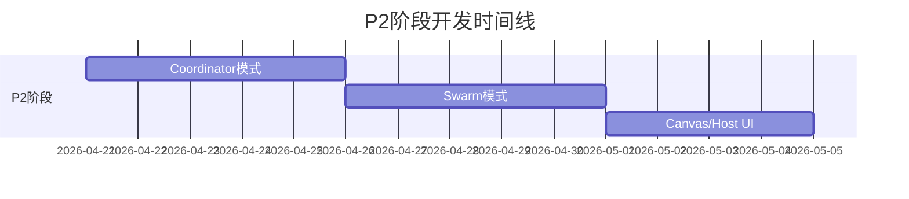

# P2阶段启动指南

**启动日期**: 2026-04-20
**阶段**: P2 - 高级协作模式
**开发模式**: TDD + 多智能体并行

---

## 📊 P2阶段概览

### 三大核心模块

| 模块 | 代码量 | 复杂度 | 开发周期 | 状态 |
|------|--------|--------|----------|------|
| **Coordinator模式** | ~1,000行 | 高 | 5天 | 🔄 准备启动 |
| **Swarm模式** | ~1,200行 | 高 | 5天 | ⏸️ 等待Coordinator |
| **Canvas/Host UI** | ~800行 | 高 | 4天 | ⏸️ 等待Swarm |

**总代码量**: ~3,000行
**总开发周期**: 14天

---

## 🎯 P2阶段目标

基于P0和P1阶段的成果，实现高级多Agent协作模式：

1. **Coordinator模式**: 智能协调调度
2. **Swarm模式**: 群体智能协作
3. **Canvas/Host UI**: 可视化监控

---

## 📅 开发时间线



---

## 🚀 启动步骤

### Step 1: 创建P2开发团队

使用4个专用worker并行开发：

```python
# Worker分配
worker-coordinator  -> Coordinator模式开发
worker-swarm        -> Swarm模式开发（等待Coordinator）
worker-ui            -> Canvas/Host UI开发（等待Swarm）
worker-integration   -> 集成测试和文档
```

### Step 2: 启动Coordinator开发

**任务**: #23 - P2-Coordinator模式开发

**核心文件**:
```
core/collaboration/coordinator/
├── __init__.py
├── coordinator.py      # 协调器核心
├── scheduler.py        # 调度器
├── load_balancer.py    # 负载均衡
├── conflict_resolver.py # 冲突解决
└── state_sync.py       # 状态同步
```

**立即行动**:
1. 阅读P0/P1系统文档
2. 设计Coordinator架构
3. 编写测试用例（TDD）
4. 实现核心功能
5. 集成P0/P1系统

### Step 3: 依次启动后续模块

- **Day 6**: 启动Swarm模式开发（依赖Coordinator）
- **Day 11**: 启动Canvas/Host UI开发（依赖Swarm）

---

## 📋 验收标准

### Coordinator模式
- [ ] 单元测试通过率100%
- [ ] 支持动态Agent注册
- [ ] 任务队列管理正常
- [ ] 优先级调度功能
- [ ] 失败恢复机制
- [ ] API文档完整

### Swarm模式
- [ ] 单元测试通过率100%
- [ ] 自组织算法实现
- [ ] 分布式共识机制
- [ ] 群体通信协议
- [ ] 紧急任务响应
- [ ] API文档完整

### Canvas/Host UI
- [ ] 单元测试通过率100%
- [ ] Canvas Host服务正常
- [ ] WebSocket实时通信
- [ ] 响应式UI设计
- [ ] 状态可视化组件
- [ ] 性能监控图表
- [ ] API文档完整

---

## 🔧 技术要求

### 代码规范
- Python 3.11+兼容
- Line length: 100
- 中文注释
- 类型注解100%
- Docstring完整

### 开发方法
- **TDD**: 测试驱动开发
- **Red-Green-Refactor**: 严格循环
- **测试覆盖率**: >80%
- **代码审查**: 每个模块

### 集成要求
- 与P0系统（Skills/Plugins/会话记忆）无缝集成
- 与P1系统（任务管理器/上下文压缩/Hook/Query Engine）无缝集成
- Gateway WebSocket集成
- 向后兼容

---

## 📚 参考文档

### 架构文档
- `docs/plans/MASTER_DEVELOPMENT_PLAN.md` - 总体开发计划
- `docs/architecture/EVENT_DRIVEN_ARCHITECTURE.md` - 事件驱动架构

### P0系统
- `docs/reports/P0_PHASE_COMPLETION_SUMMARY.md` - P0完成报告
- `core/skills/` - Skills系统
- `core/plugins/` - Plugins系统
- `core/memory/sessions/` - 会话记忆

### P1系统
- `docs/reports/P1_PHASE_COMPLETION_REPORT.md` - P1完成报告
- `core/tasks/manager/` - 任务管理器
- `core/memory/sessions/compression/` - 上下文压缩
- `core/hooks/enhanced/` - Hook增强
- `core/query_engine/` - Query Engine

---

## 🎯 成功指标

| 指标 | 目标 | 测量方法 |
|------|------|----------|
| 代码完成度 | 100% | 代码行数统计 |
| 测试通过率 | 100% | pytest结果 |
| 测试覆盖率 | >80% | pytest-cov |
| Python 3.11兼容 | 100% | 运行测试 |
| API文档完整性 | 100% | 文档检查 |
| 集成测试通过 | 100% | 集成测试套件 |

---

## 🚦 当前状态

**P1阶段**: ✅ 100%完成
**P2准备**: ✅ 就绪
**下一步**: 🚀 启动Coordinator模式开发

---

**准备就绪！开始P2阶段开发！** 🎉
