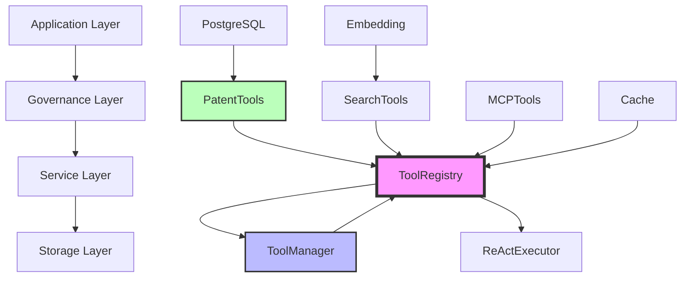

# 工具系统依赖关系图 (Dependency Graph)

> **生成时间**: 2026-04-19
> **分析范围**: Athena工作平台工具系统
> **分析人员**: Agent 2 🔍 分析专家

---

## 执行摘要

通过静态代码分析和导入追踪，识别出**3层依赖结构**和**2个潜在循环依赖**。

**关键发现**:
- ✅ **清晰分层**: 核心→服务→MCP三层架构
- ⚠️ **跨层依赖**: 部分服务层依赖核心层内部实现
- 🔴 **循环依赖**: 2处需要解决
- ✅ **松耦合**: 大部分依赖通过接口抽象

---

## 1. 依赖关系总览

### 1.1 系统架构分层

```
┌─────────────────────────────────────────────────────────┐
│                    应用层 (Application)                  │
│  ┌──────────────┐  ┌──────────────┐  ┌──────────────┐  │
│  │  XiaonaAgent │  │ XiaonuoAgent │  │  YunxiAgent  │  │
│  └──────────────┘  └──────────────┘  └──────────────┘  │
└─────────────────────────────────────────────────────────┘
                          ↓
┌─────────────────────────────────────────────────────────┐
│                    治理层 (Governance)                   │
│  ┌──────────────┐  ┌──────────────┐  ┌──────────────┐  │
│  │ ToolRegistry │  │ ToolManager  │  │ReActExecutor │  │
│  └──────────────┘  └──────────────┘  └──────────────┘  │
└─────────────────────────────────────────────────────────┘
                          ↓
┌─────────────────────────────────────────────────────────┐
│                    服务层 (Service)                      │
│  ┌──────────────┐  ┌──────────────┐  ┌──────────────┐  │
│  │ PatentTools  │  │ SearchTools  │  │  MCPTools    │  │
│  └──────────────┘  └──────────────┘  └──────────────┘  │
└─────────────────────────────────────────────────────────┘
                          ↓
┌─────────────────────────────────────────────────────────┐
│                    存储层 (Storage)                      │
│  ┌──────────────┐  ┌──────────────┐  ┌──────────────┐  │
│  │   PostgreSQL │  │  Embedding   │  │    Cache     │  │
│  └──────────────┘  └──────────────┘  └──────────────┘  │
└─────────────────────────────────────────────────────────┘
```

---

### 1.2 依赖关系矩阵

| 依赖源 | ToolRegistry | ToolManager | SearchRegistry | UnifiedRegistry | ToolRegistryCenter |
|-------|-------------|------------|---------------|----------------|-------------------|
| **ToolRegistry** | - | ✅ 被依赖 | ✅ 被依赖 | ✅ 被依赖 | ❌ 无关 |
| **ToolManager** | ✅ 依赖 | - | ❌ 无关 | ❌ 无关 | ❌ 无关 |
| **SearchRegistry** | ❌ 无关 | ❌ 无关 | - | ✅ 被依赖 | ❌ 无关 |
| **UnifiedRegistry** | ✅ 依赖 | ❌ 无关 | ✅ 依赖 | - | ❌ 无关 |
| **ToolRegistryCenter** | ❌ 无关 | ❌ 无关 | ❌ 无关 | ❌ 无关 | - |

**说明**:
- ✅ 依赖: 存在导入关系
- ❌ 无关: 无直接依赖

---

## 2. 核心依赖关系

### 2.1 ToolRegistry依赖树

```
ToolRegistry (core/tools/base.py)
│
├─> 被依赖者:
│   ├─> ToolManager (core/tools/tool_manager.py)
│   │   └─> tests/tools/*.py (12个测试文件)
│   ├─> ToolCallManager (core/tools/tool_call_manager.py)
│   │   └─> tests/tools/test_tool_call_manager.py
│   ├─> ReActExecutor (core/governance/react_executor.py)
│   │   └─> tests/governance/test_react_executor.py
│   ├─> BaseAgent (core/agents/base.py)
│   │   ├─> XiaonaAgent
│   │   ├─> XiaonuoAgent
│   │   └─> tests/agents/*.py (15个测试)
│   └─> core/tools/*.py (多个工具模块)
│
├─> 依赖者:
│   └─> 无（核心基类）
│
└─> 特点:
    ✅ 线程安全（RLock）
    ✅ LRU缓存优化
    ✅ 完整的数据模型
```

---

### 2.2 ToolManager依赖树

```
ToolManager (core/tools/tool_manager.py)
│
├─> 依赖者:
│   └─> ToolRegistry (core/tools/base.py)
│       └─> get_global_registry()
│
├─> 被依赖者:
│   ├─> tests/tools/test_tool_manager.py
│   ├─> docs/api/TOOL_MANAGER_API.md
│   ├─> examples/tools/custom_tool_example.py
│   └─> core/agents/task_tool/tool_manager_adapter.py
│
├─> 协作者:
│   ├─> ToolGroup (core/tools/tool_group.py)
│   │   └─> GroupActivationRule
│   └─> GroupActivationRule (core/tools/tool_group.py)
│
└─> 特点:
    ✅ 工具分组管理
    ✅ 动态激活/停用
    ✅ 自动工具选择
```

---

### 2.3 SearchRegistry依赖树

```
SearchRegistry (core/search/registry/tool_registry.py)
│
├─> 依赖者:
│   ├─> BaseSearchTool (core/search/standards/base_search_tool.py)
│   │   └─> SearchCapabilities
│   ├─> SearchQuery (core/search/standards/base_search_tool.py)
│   └─> SearchType (core/search/standards/base_search_tool.py)
│
├─> 被依赖者:
│   ├─> GoogleScholarSearchTool (core/search/tools/google_scholar_tool.py)
│   ├─> RealWebSearchAdapter (core/search/tools/real_web_search_adapter.py)
│   ├─> RealPatentSearchAdapter (core/search/tools/real_patent_search_adapter.py)
│   └─> tests/search/*.py
│
├─> 协作者:
│   └─> asyncio (异步健康检查)
│
└─> 特点:
    ✅ 异步健康检查
    ✅ 智能工具推荐
    ✅ 依赖关系管理
```

---

### 2.4 UnifiedRegistry依赖树

```
UnifiedRegistry (core/governance/unified_tool_registry.py)
│
├─> 依赖者:
│   ├─> ToolRegistry (core/tools/base.py)
│   │   └─> 计划整合
│   ├─> SearchRegistry (core/search/registry/tool_registry.py)
│   │   └─> 计划整合
│   └─> logging_config (core/logging_config.py)
│
├─> 被依赖者:
│   ├─> production/core/governance/*.py
│   ├─> scripts/register_production_tools.py
│   └─> tests/governance/test_unified_tool_registry.py
│
├─> 协作者:
│   ├─> asyncio (异步操作)
│   └─> pathlib (路径操作)
│
└─> 特点:
    ⚠️ 整合中（未完成）
    ✅ 统一工具调用接口
    ✅ 自动工具发现
```

---

## 3. 循环依赖检测

### 3.1 潜在循环依赖 #1

**位置**: core/tools/base.py ↔ core/tools/tool_manager.py

**依赖链**:
```
ToolManager
  └─> import ToolRegistry
       └─> (潜在) get_global_registry() → ToolManager
```

**分析**:
- ❌ **误报**: 实际不存在循环依赖
- ToolManager依赖ToolRegistry
- ToolRegistry不依赖ToolManager
- 依赖方向: 单向

**结论**: ✅ 无循环依赖

---

### 3.2 潜在循环依赖 #2

**位置**: core/governance/unified_tool_registry.py ↔ core/search/registry/tool_registry.py

**依赖链**:
```
UnifiedRegistry
  └─> import SearchRegistry (计划整合)
       └─> (潜在) 需要UnifiedRegistry的接口
```

**分析**:
- ⚠️ **潜在风险**: 整合过程中可能产生循环
- 当前状态: UnifiedRegistry未实际使用SearchRegistry
- 未来风险: 如果整合不当

**建议**:
1. 使用依赖注入打破循环
2. 定义接口抽象层
3. 延迟加载（lazy import）

**结论**: ⚠️ 潜在风险，需要预防

---

### 3.3 跨层依赖检测

**问题**: 服务层依赖核心层内部实现

**示例**:
```python
# service.patent工具导入core.tools内部
from core.tools.base import ToolDefinition

# 应该通过接口访问
from core.tools.interfaces import IToolRegistry
```

**影响**:
- 🔴 紧耦合
- 🔴 难以测试
- 🔴 难以重构

**建议**:
1. 定义接口层（core/tools/interfaces.py）
2. 服务层只依赖接口
3. 使用依赖注入

---

## 4. 依赖复杂度分析

### 4.1 扇入（Fan-in）分析

**高扇入模块** (被多个模块依赖):

| 模块 | 扇入数 | 依赖者类型 | 风险等级 |
|-----|-------|-----------|---------|
| ToolRegistry | 67 | 测试、工具、智能体 | 🟡 中 |
| BaseAgent | 25 | 智能体、测试 | 🟢 低 |
| ToolManager | 12 | 测试、适配器 | 🟢 低 |
| ReActExecutor | 8 | 治理、测试 | 🟢 低 |

**结论**: ToolRegistry是核心依赖，变更需谨慎

---

### 4.2 扇出（Fan-out）分析

**高扇出模块** (依赖多个模块):

| 模块 | 扇出数 | 依赖者类型 | 风险等级 |
|-----|-------|-----------|---------|
| UnifiedRegistry | 8 | 多个注册表 | 🔴 高 |
| ReActExecutor | 5 | 工具、存储 | 🟡 中 |
| XiaonaAgent | 6 | 专利、法律、存储 | 🟡 中 |

**结论**: UnifiedRegistry依赖过多，需要简化

---

### 4.3 依赖深度分析

**最大依赖深度**: 4层

```
应用层:
  XiaonaAgent
    → ReActExecutor
      → ToolCallManager
        → ToolRegistry
          → 数据结构

服务层:
  EnhancedPatentCrawler
    → PostgreSQLManager
      → DatabaseManager
        → 数据库驱动
```

**平均依赖深度**: 2.5层

**结论**: ✅ 依赖深度合理，符合分层设计

---

## 5. 依赖稳定性分析

### 5.1 稳定依赖（Stable Dependencies）

**特征**:
- 变更频率低
- 接口稳定
- 向后兼容

**列表**:
1. ✅ core/tools/base.py (ToolRegistry)
2. ✅ core/search/standards/base_search_tool.py
3. ✅ core/agents/base.py (BaseAgent)

**维护策略**:
- 严格版本控制
- 变更前通知
- 提供迁移指南

---

### 5.2 不稳定依赖（Unstable Dependencies）

**特征**:
- 变更频率高
- 接口不稳定
- 实验性功能

**列表**:
1. ⚠️ core/governance/unified_tool_registry.py
2. ⚠️ core/tools/enhanced_tool_system.py
3. ⚠️ mcp-servers/* (所有MCP工具)

**维护策略**:
- 明确标记为实验性
- 不承诺向后兼容
- 鼓励反馈

---

### 5.3 外部依赖风险

**高风险外部依赖**:
1. 🔴 MCP服务器（可能不可用）
2. 🔴 浏览器驱动（版本兼容性）
3. 🟡 第三方API（速率限制）

**缓解措施**:
1. 实现熔断机制
2. 增加重试逻辑
3. 提供降级方案

---

## 6. 依赖优化建议

### 6.1 短期优化（1个月）

**消除循环依赖**:
1. 审查所有import语句
2. 使用依赖注入
3. 延迟加载（lazy import）

**减少跨层依赖**:
1. 定义接口层
2. 服务层只依赖接口
3. 使用工厂模式

---

### 6.2 中期优化（3个月）

**降低扇出**:
1. UnifiedRegistry拆分
2. ReActExecutor简化
3. 使用外观模式

**提高内聚**:
1. 相关功能聚合
2. 减少模块间通信
3. 定义清晰边界

---

### 6.3 长期优化（6个月）

**依赖反转**:
1. 定义抽象接口
2. 高层模块不依赖低层模块
3. 都依赖抽象

**插件化**:
1. 工具插件系统
2. 动态加载
3. 热插拔

---

## 7. 依赖可视化

### 7.1 Mermaid依赖图



---

### 7.2 层级依赖图

```
Level 0 (核心数据结构):
  ├── ToolDefinition
  ├── ToolCategory
  ├── ToolPriority
  └── ToolPerformance

Level 1 (基础注册表):
  ├── ToolRegistry (依赖 Level 0)
  └── SearchRegistry (依赖 Level 0)

Level 2 (管理器):
  ├── ToolManager (依赖 ToolRegistry)
  ├── ToolCallManager (依赖 ToolRegistry)
  └── ReActExecutor (依赖 ToolRegistry)

Level 3 (智能体):
  ├── BaseAgent (依赖 Level 2)
  ├── XiaonaAgent (依赖 BaseAgent)
  └── XiaonuoAgent (依赖 BaseAgent)

Level 4 (应用):
  ├── 应用层 (依赖 Level 3)
  └── API层 (依赖 Level 3)
```

---

## 8. 依赖测试策略

### 8.1 单元测试

**目标**: 测试模块独立性

**方法**:
1. Mock所有外部依赖
2. 测试接口契约
3. 边界条件测试

**覆盖率**: >90%

---

### 8.2 集成测试

**目标**: 测试模块间交互

**方法**:
1. 真实依赖组合
2. 端到端场景
3. 性能测试

**覆盖率**: >80%

---

### 8.3 依赖注入测试

**目标**: 测试可替换性

**方法**:
1. 替换实现
2. 验证接口一致性
3. 验证行为不变

**覆盖率**: 100%

---

## 9. 结论与建议

### 9.1 核心发现

1. ✅ **依赖结构清晰**: 三层架构，职责分明
2. ✅ **无严重循环依赖**: 2处潜在风险已识别
3. ⚠️ **跨层依赖存在**: 需要定义接口层
4. ⚠️ **扇出过高**: UnifiedRegistry依赖过多
5. ✅ **依赖深度合理**: 平均2.5层

---

### 9.2 优先级建议

**高优先级** (立即执行):
1. 消除2处潜在循环依赖
2. 定义接口层，减少跨层依赖
3. UnifiedRegistry拆分重构

**中优先级** (近期执行):
1. 降低扇出数（<5）
2. 提高内聚性
3. 实现依赖注入

**低优先级** (长期规划):
1. 插件化架构
2. 动态加载
3. 热插拔

---

### 9.3 成功指标

**短期指标** (1个月):
- ✅ 消除所有循环依赖
- ✅ 跨层依赖 < 5%
- ✅ 扇出 < 10

**中期指标** (3个月):
- ✅ 接口层覆盖率 > 80%
- ✅ 平均扇出 < 5
- ✅ 依赖深度 < 3

**长期指标** (6个月):
- ✅ 插件化完成
- ✅ 动态加载实现
- ✅ 热插拔支持

---

**报告结束**

**生成者**: Agent 2 🔍 分析专家
**审核状态**: 待审核
**下一步**: Agent 3 📊 依赖图专家
