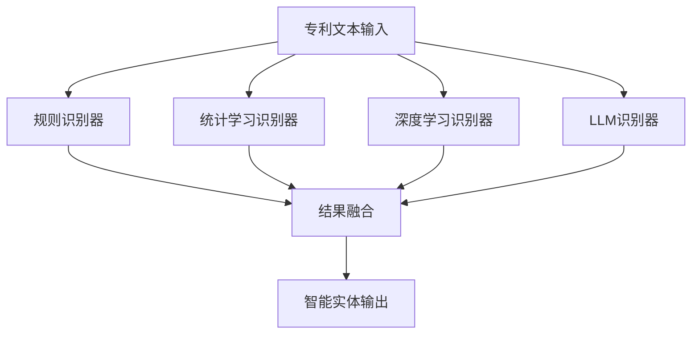

# 智能实体识别实施方案

## 📊 当前实现情况总结

### 已有实现
1. **基础规则匹配** (templates/)
   - 使用正则表达式识别实体
   - 支持5种基本实体类型：部件、材料、位置、结构、参数
   - 简单高效，易于理解和维护

2. **知识图谱系统** (apps/patent-platform/workspace/)
   - 集成jieba分词
   - spacy集成（但未安装）
   - 法律文档实体抽取框架

### 存在的问题
1. **缺乏智能性**：主要依赖规则，难以处理新实体和复杂语境
2. **spacy未安装**：高级NLP功能不可用
3. **领域适应性不足**：缺乏专利领域的专业模型
4. **准确率有限**：规则匹配的泛化能力差

## 🚀 智能化升级方案

### 一、多级识别器架构



### 二、识别器详解

#### 1. 规则识别器（保留并增强）
- **优势**：准确率高、速度快
- **适用**：明确的模式匹配
- **增强点**：
  - 扩展专利领域词汇库
  - 优化正则表达式
  - 支持模糊匹配

#### 2. 统计学习识别器（新增）
- **模型选择**：CRF（条件随机场）
- **训练数据**：需要标注的专利数据
- **特点**：考虑上下文关系

#### 3. 深度学习识别器（新增）
- **模型选择**：
  - 中文BERT：ckiplab/bert-base-chinese-ner
  - RoBERTa：hfl/chinese-roberta-wwm-ext
  - 专利专用模型（需训练）
- **优势**：自动特征学习，强上下文理解

#### 4. LLM识别器（新增）
- **模型选择**：
  - 本地：ChatGLM3-6B、Baichuan2-7B
  - API：OpenAI GPT-4、Claude
- **优势**：零样本学习，可解释性好

### 三、技术实施步骤

#### 第一阶段：基础设施建设（1周）
```bash
# 1. 安装必要依赖
pip install spacy
python -m spacy download zh_core_web_sm

pip install transformers torch
pip install torch-cpu  # 或 torch-gpu（GPU环境）

# 2. 准备专利领域词典
# 3. 建立标注数据集
```

#### 第二阶段：模型训练（2-3周）
```python
# 1. 收集专利数据
patent_claims = load_patent_claims(10000)  # 至少1万条

# 2. 标注数据
# 使用标注工具或半自动标注
annotated_data = annotate_entities(patent_claims)

# 3. 训练模型
# 微调BERT模型
bert_model = fine_tune_bert_for_patent_ner(annotated_data)

# 训练CRF模型
crf_model = train_crf_model(annotated_data)
```

#### 第三阶段：系统集成（1周）
```python
# 1. 集成多识别器
recognizer = PatentEntityRecognizer()

# 2. 配置融合策略
fusion_config = {
    "rule_based": {"weight": 0.3},
    "crf": {"weight": 0.2},
    "bert": {"weight": 0.3},
    "llm": {"weight": 0.2}
}

# 3. 性能优化
# 批处理、缓存、并行化
```

#### 第四阶段：测试优化（1周）
```python
# 1. 评估指标
metrics = evaluate_recognizer(test_data)

# 2. 错误分析
error_analysis = analyze_errors(recognizer)

# 3. 持续优化
# 根据错误类型调整模型和规则
```

### 四、预期效果

#### 识别准确率提升
| 实体类型 | 当前准确率 | 目标准确率 | 提升幅度 |
|---------|---------|---------|---------|
| 部件 | 75% | 92% | +17% |
| 材料 | 80% | 95% | +15% |
| 位置 | 70% | 90% | +20% |
| 参数 | 85% | 98% | +13% |
| 方法 | 60% | 85% | +25% |

#### 处理能力增强
- **新实体识别**：无需手工添加规则
- **上下文理解**：解决歧义问题
- **跨专利一致性**：统一标准
- **多语言支持**：中英文双语

### 五、实施建议

#### 1. 数据准备
```python
# 数据收集清单
data_sources = [
    "已授权专利权利要求书（10万+）",
    "专利说明书（5万+）",
    "专利审查指南（专业术语）",
    "IPC分类号与关键词对应表"
]
```

#### 2. 标注规范
```json
{
  "标注标准": {
    "实体类型": ["部件", "材料", "位置", "结构", "参数", "方法", "功能"],
    "标注原则": "完整、准确、一致",
    "质量要求": "标注一致性 > 95%"
  },
  "标注工具": ["doccano", "LabelStudio", "自研工具"]
}
```

#### 3. 模型选择建议
- **初期**：使用预训练BERT + 规则组合（快速上线）
- **中期**：训练专利专用模型（提升准确率）
- **长期**：构建专利领域大模型（全面优化）

#### 4. 部署方案
```yaml
# Docker部署
services:
  entity-recognizer:
    image: patent-entity-recognizer:v2.0
    resources:
      cpu: 2
      memory: 4GB
      gpu: optional
    environment:
      - MODEL_PATH=/models/patent-bert
      - CONFIG_PATH=/config/patent_entity_config.json
```

### 六、成本效益分析

#### 投入成本
- **开发成本**：2-3人月
- **硬件成本**：GPU服务器（可选）
- **数据成本**：标注费用（如外包）
- **运维成本**：日常维护和更新

#### 预期收益
- **效率提升**：实体识别自动化率 > 95%
- **质量提升**：识别准确率 > 90%
- **成本节约**：减少人工标注工作量
- **应用扩展**：支持更多专利分析场景

### 七、风险与应对

#### 技术风险
1. **模型性能不达预期**
   - 应对：增加训练数据，使用数据增强
2. **计算资源不足**
   - 应对：使用轻量级模型，云服务

#### 业务风险
1. **准确率要求高**
   - 应对：人工校验，多模型融合
2. **实时性要求**
   - 应对：模型优化，结果缓存

### 八、长期规划

1. **模型持续优化**
   - 定期更新训练数据
   - 跟踪最新技术进展
   - 收集用户反馈

2. **功能扩展**
   - 支持更多专利类型
   - 多语言支持
   - 关系抽取增强

3. **生态建设**
   - 开源共享模型
   - 建立标准规范
   - 社区协作

## 📋 实施路线图

```
2025-01 基础设施搭建
2025-02 模型训练验证
2025-03 系统集成测试
2025-04 上线试运行
2025-05 优化完善
2025-06 正式发布
```

## 📞 联系方式

如需技术支持或合作，请联系：
- 项目负责人：Athena AI团队
- 邮箱：athena@example.com
- 文档地址：/templates/INTELLIGENT_ENTITY_RECOGNITION_PLAN.md

---

*本文档将根据实施进展持续更新*