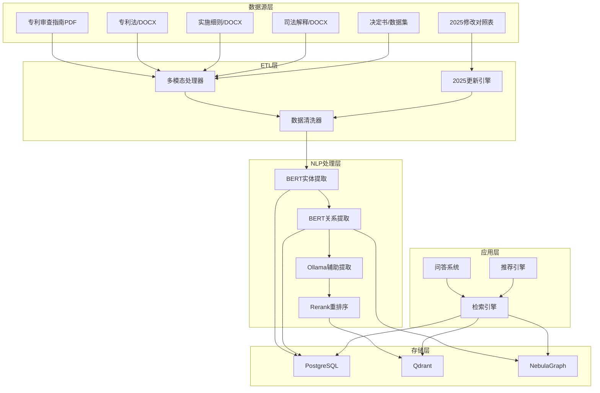

# 专利规则构建系统架构设计

## 系统概述

基于PostgreSQL（元数据存储）、Qdrant（向量检索）、NebulaGraph（知识图谱）和本地NLP系统，构建最高质量的专利规则知识库。以《专利审查指南》为核心，集成专利法、实施细则、司法解释等，实现智能检索和问答。

## 系统架构



## 技术栈详细说明

### 1. 存储层

#### PostgreSQL (关系数据库)
```sql
-- 文档元数据表
CREATE TABLE documents (
    id UUID PRIMARY KEY DEFAULT gen_random_uuid(),
    source_type VARCHAR(50) NOT NULL,  -- guideline/law/regulation/judgment
    title TEXT NOT NULL,
    version VARCHAR(20) DEFAULT '2025',
    file_path TEXT,
    file_hash TEXT,
    status VARCHAR(20) DEFAULT 'processed',
    created_at TIMESTAMP DEFAULT NOW(),
    updated_at TIMESTAMP DEFAULT NOW(),
    metadata JSONB
);

-- 章节内容表
CREATE TABLE sections (
    id UUID PRIMARY KEY DEFAULT gen_random_uuid(),
    document_id UUID REFERENCES documents(id),
    section_id VARCHAR(100) NOT NULL,  -- P2-C4-S3.2
    level INTEGER NOT NULL,  -- 1=部分,2=章,3=节,4=小节
    title TEXT NOT NULL,
    content TEXT,
    parent_id VARCHAR(100),
    full_path TEXT,
    page_range TEXT,
    modification_2025 JSONB,  -- 2025修改内容
    chunk_id VARCHAR(100),  -- Qdrant向量ID
    graph_vertex_id VARCHAR(100)  -- NebulaGraph顶点ID
);

-- 实体表
CREATE TABLE entities (
    id UUID PRIMARY KEY DEFAULT gen_random_uuid(),
    entity_type VARCHAR(50) NOT NULL,
    entity_text TEXT NOT NULL,
    entity_value TEXT,
    section_id UUID REFERENCES sections(id),
    position_start INTEGER,
    position_end INTEGER,
    confidence DECIMAL(5,2),
    extraction_method VARCHAR(20),  -- bert/rule/ollama
    created_at TIMESTAMP DEFAULT NOW()
);

-- 关系表
CREATE TABLE relations (
    id UUID PRIMARY KEY DEFAULT gen_random_uuid(),
    source_entity_id UUID REFERENCES entities(id),
    target_entity_id UUID REFERENCES entities(id),
    relation_type VARCHAR(50) NOT NULL,
    confidence DECIMAL(5,2),
    extraction_method VARCHAR(20),
    created_at TIMESTAMP DEFAULT NOW()
);
```

#### Qdrant (向量数据库)
```python
collection_config = {
    "patent_rules": {
        "vector_size": 1024,
        "distance": "Cosine",
        "hnsw_config": {
            "m": 16,
            "ef_construct": 64
        }
    }
}

payload_schema = {
    "section_id": "keyword",
    "text": "text",
    "metadata": {
        "document_id": "uuid",
        "level": "integer",
        "full_path": "text",
        "version": "text",
        "source_type": "text"
    }
}
```

#### NebulaGraph (知识图谱)
```ngql
-- 创建空间
CREATE SPACE IF NOT EXISTS patent_rules;

-- Tag定义
CREATE TAG IF NOT EXISTS Document (
    id string,
    title string,
    version string,
    source_type string
);

CREATE TAG IF NOT EXISTS LawArticle (
    id string,
    text string,
    version string,
    article_number string
);

CREATE TAG IF NOT EXISTS GuidelineSection (
    id string,
    level int,
    title string,
    content string,
    full_path string,
    modification_2025 string
);

CREATE TAG IF NOT EXISTS JudicialInterpretation (
    id string,
    title string,
    content string,
    court string,
    date string
);

CREATE TAG IF NOT EXISTS Modification2025 (
    id string,
    old_content string,
    new_content string,
    change_type string,
    applied_date string
);

-- Edge定义
CREATE EDGE IF NOT EXISTS REFERENCES ();
CREATE EDGE IF NOT EXISTS INTERPRETS ();
CREATE EDGE IF NOT EXISTS MODIFIED_BY ();
CREATE EDGE IF NOT EXISTS DEFINES ();
CREATE EDGE IF NOT EXISTS APPLIES_TO ();
CREATE EDGE IF NOT EXISTS CONTAINS_EXAMPLE ();
```

### 2. NLP处理层

#### 实体类型定义
```python
ENTITY_TYPES = {
    # 法律条文
    "LAW_ARTICLE": "法律条文",
    "LAW_SECTION": "法条条款",

    # 审查指南
    "GUIDELINE_PART": "指南部分",
    "GUIDELINE_CHAPTER": "指南章节",
    "GUIDELINE_SECTION": "指南节",
    "GUIDELINE_SUBSECTION": "指南小节",
    "GUIDELINE_EXAMPLE": "指南案例",
    "GUIDELINE_NOTE": "指南注释",

    # 司法解释
    "JUDICIAL_INTERPRETATION": "司法解释",
    "INTERPRETATION_RULE": "解释规则",
    "CASE_REFERENCE": "案例引用",

    # 2025修改
    "MODIFICATION_2025": "2025年修改",
    "NEW_SECTION": "新增章节",
    "DELETED_SECTION": "删除章节",
    "AI_SECTION": "AI相关章节",
    "BITSTREAM_SECTION": "比特流章节",

    # 概念实体
    "CONCEPT": "概念",
    "DEFINITION": "定义",
    "TERM": "术语",
    "CONDITION": "条件",
    "EXCEPTION": "例外",
    "REQUIREMENT": "要求",
    "PROCEDURE": "程序",
    "STANDARD": "标准",
    "CRITERION": "标准",
    "EXAMPLE_CASE": "案例示例",
    "PRIOR_ART": "现有技术",
    "TECH_FEATURE": "技术特征",
    "APPLICATION_FIELD": "应用领域",

    # 特殊实体
    "INVENTION": "发明",
    "UTILITY_MODEL": "实用新型",
    "DESIGN": "外观设计",
    "PATENT_RIGHT": "专利权",
    "INFRINGEMENT": "侵权",
    "LICENSING": "许可",
    "ASSIGNMENT": "转让"
}

RELATION_TYPES = {
    # 结构关系
    "HAS_PART": "包含部分",
    "HAS_CHAPTER": "包含章",
    "HAS_SECTION": "包含节",
    "HAS_SUBSECTION": "包含小节",
    "CONTAINS": "包含",

    # 引用关系
    "REFERENCES": "引用",
    "CITES": "引用",
    "ACCORDING_TO": "根据",
    "BASED_ON": "基于",
    "IN_ACCORDANCE_WITH": "依据",

    # 解释关系
    "INTERPRETS": "解释",
    "CLARIFIES": "澄清",
    "ILLUSTRATES": "说明",
    "EXAMPLES": "举例",

    # 逻辑关系
    "DEFINES": "定义",
    "IS_DEFINED_AS": "被定义为",
    "APPLIES_TO": "适用于",
    "DOES_NOT_APPLY_TO": "不适用于",
    "CONDITION_FOR": "是...的条件",
    "EXCEPTION_TO": "是...的例外",
    "REQUIRES": "要求",
    "PROHIBITS": "禁止",
    "PERMITS": "允许",

    # 比较关系
    "RELATED_TO": "相关于",
    "SIMILAR_TO": "类似于",
    "DIFFERENT_FROM": "区别于",
    "OPPOSITE_OF": "相反于",
    "SUPERIOR_TO": "优于",
    "INFERIOR_TO": "劣于",

    # 时间关系
    "MODIFIED_BY": "被修改为",
    "REPLACES": "替代",
    "SUPERSEDES": "废止",
    "PRECEDES": "先于",
    "SUCCEEDS": "后于",

    # 2025特殊关系
    "INTRODUCED_2025": "2025年引入",
    "AMENDED_2025": "2025年修订",
    "DELETED_2025": "2025年删除",
    "AI_RELATED": "AI相关",
    "BITSTREAM_RELATED": "比特流相关"
}
```

### 3. 2025年修改处理

#### 新增内容识别
```python
NEW_SECTIONS_2025 = {
    "AI审查标准": [
        "人工智能相关发明的审查标准",
        "算法模型的创造性判断",
        "训练数据的公开要求",
        "AI歧视防范"
    ],
    "比特流保护": [
        "单纯比特流的法律保护范围",
        "计算机程序的保护限制",
        "技术方案与比特流的区分"
    ],
    "生物技术": [
        "基因编辑技术的审查",
        "生物序列的专利保护",
        "医疗方法的例外情况"
    ]
}

MODIFICATION_EXAMPLES = {
    "创造性标准": {
        "2023": "技术方案的整体性考虑",
        "2025": "技术方案的进步性，特别考虑AI和大数据领域",
        "rationale": "2025年新增AI和大数据作为特殊考量因素"
    }
}
```

## 数据流程

### 1. ETL流程
```
原始数据 → 多模态处理 → 2025更新 → NLP提取 → 质量验证 → 存储系统
```

### 2. 检索流程
```
用户查询 → 向量检索 → 重排序 → 图谱遍历 → 结果融合 → 答案生成
```

### 3. 质量保证
```
实体提取F1 > 0.95
关系提取准确率 > 0.90
向量检索mAP > 0.95
端到端精度 > 0.90
```

## 实施优先级

1. **Phase 1 (Week 1)**: 数据源集成和基础处理
   - 处理现有PDF/DOCX文档
   - 实现2025年修改对照表
   - 基础实体提取

2. **Phase 2 (Week 2)**: 知识图谱构建
   - 完整实体关系提取
   - NebulaGraph数据导入
   - 图谱验证

3. **Phase 3 (Week 3)**: 向量库构建
   - 高质量向量生成
   - Rerank模型集成
   - 性能优化

4. **Phase 4 (Week 4)**: 系统集成和测试
   - RAG系统构建
   - 端到端测试
   - 文档和部署

## 关键创新点

1. **多模态OCR处理**: 利用M4 Pro加速，处理PDF图像和复杂表格
2. **2025年修改集成**: 自动化应用最新修改，确保法律时效性
3. **BERT+Ollama双重保障**: 高精度提取 + LLM辅助验证
4. **分布式知识图谱**: NebulaGraph支持海量数据扩展
5. **自适应检索**: Rerank动态优化检索结果

## 性能指标

- **处理能力**: 100MB/分钟文档处理速度
- **存储规模**: 支持10M+文本处理
- **检索延迟**: <200ms端到端响应
- **准确率**: F1 > 0.95
- **并发支持**: 100+并发查询

## 扩展性设计

1. **新增法规类型**: 通过配置文件轻松添加新的法律文件
2. **自定义实体类型**: 支持业务特定的实体定义
3. **多语言支持**: 预留中英文双语扩展接口
4. **实时更新**: 支持法规变更的增量更新
5. **分布式部署**: 支持多节点集群部署

## 数据安全和隐私

1. **本地处理**: 所有数据本地处理，不依赖外部API
2. **加密存储**: 敏感数据加密存储
3. **访问控制**: 基于角色的访问控制
4. **审计日志**: 完整的操作审计轨迹
5. **数据脱敏**: 个人信息自动脱敏

本系统设计确保最高质量的数据处理和最准确的知识检索，为专利审查提供强大的智能支持。