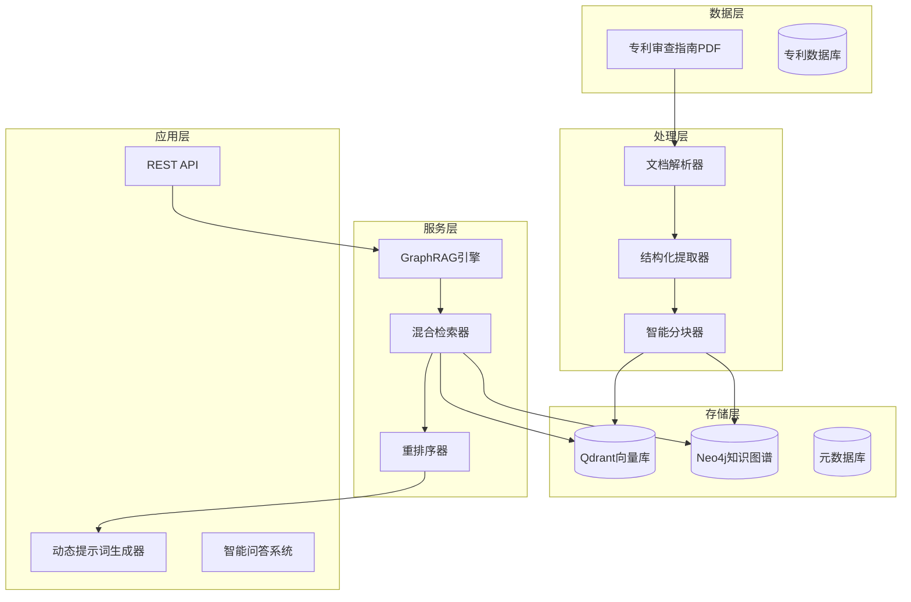

# 专利审查指南 GraphRAG 系统实施计划

## 📋 项目概述

构建"专利审查指南向量库"和"专利审查指南知识图谱"，实现基于GraphRAG的智能检索系统，为专利业务提供精准的规则提取和动态提示词生成。

**文件**: `专利审查指南（最新版）.pdf`
**目标**: 构建最高质量的法律法规知识图谱和向量化检索系统

## 🏗️ 系统架构设计



## 📅 实施阶段

### 第一阶段：基础设施搭建（第1-2周）

#### 1.1 环境准备
```bash
# 创建项目目录
mkdir -p /Users/xujian/Athena工作平台/patent_guideline_system
cd /Users/xujian/Athena工作平台/patent_guideline_system

# 安装必要依赖
pip install pdfplumber neo4j sentence-transformers
pip install BAAI/bge-large-zh-v1.5 FlagEmbedding
pip install networkx matplotlib
```

#### 1.2 目录结构
```
patent_guideline_system/
├── src/
│   ├── parsers/
│   │   ├── pdf_parser.py
│   │   ├── structure_parser.py
│   │   └── reference_extractor.py
│   ├── models/
│   │   ├── neo4j_models.py
│   │   └── graph_schema.py
│   ├── vectorization/
│   │   ├── embedder.py
│   │   └── chunker.py
│   ├── retrieval/
│   │   ├── graph_rag.py
│   │   └── hybrid_search.py
│   └── utils/
│       ├── text_utils.py
│       └── config.py
├── data/
│   ├── raw/                 # 原始PDF
│   ├── processed/           # 处理后的JSON
│   └── embeddings/          # 向量数据
├── scripts/
│   ├── import_to_neo4j.py
│   ├── create_vector_index.py
│   └── test_system.py
└── notebooks/
    ├── exploration.ipynb
    └── visualization.ipynb
```

### 第二阶段：数据解析与结构化（第3-4周）

#### 2.1 PDF文档解析器
```python
# parsers/pdf_parser.py
class PatentGuidelineParser:
    def __init__(self, pdf_path):
        self.pdf_path = pdf_path
        self.patterns = {
            'part': r'^第[一二三四五六七八九十]部分',
            'chapter': r'^第[一二三四五六七八九十]+章',
            'section': r'^\d+\.\d+',
            'subsection': r'^\d+\.\d+\.\d+',
            'case': r'^【例\d+】',
            'reference': r'参见本部分.*第.*节|根据专利法.*第.*条'
        }

    def parse(self):
        """解析PDF，返回结构化数据"""
        pass
```

#### 2.2 层级结构提取
- **Level 1**: 部分（如"第二部分 实质审查"）
- **Level 2**: 章（如"第四章 创造性"）
- **Level 3**: 节（如"3.2 创造性的概念"）
- **Level 4**: 条（如"3.2.1 创造性的判断原则"）
- **Level 5**: 段落/规则（最小语义单元）

#### 2.3 引用关系提取
```python
# 示例引用类型
references = [
    "参见本部分第二章第2.1节",
    "根据专利法第二十二条",
    "如本章第3.1.2节所述",
    "【例1】所示的典型案例"
]
```

### 第三阶段：知识图谱构建（第5-6周）

#### 3.1 Neo4j Schema设计

```cypher
// 创建节点类型约束
CREATE CONSTRAINT ON (p:Part) ASSERT p.id IS UNIQUE;
CREATE CONSTRAINT ON (c:Chapter) ASSERT c.id IS UNIQUE;
CREATE CONSTRAINT ON (s:Section) ASSERT s.id IS UNIQUE;
CREATE CONSTRAINT ON (co:Concept) ASSERT co.name IS UNIQUE;
CREATE CONSTRAINT ON (l:LawArticle) ASSERT l.id IS UNIQUE;

// 节点属性
// Part节点
// - id: "P2" (唯一标识)
// - title: "第二部分 实质审查"
// - number: 2

// Section节点
// - id: "P2-C4-S3.2.1"
// - title: "创造性的判断方法"
// - content: "完整文本内容"
// - level: 4
// - parent_id: "P2-C4-S3.2"
// - full_path: "第二部分 > 第四章 > 3.2 > 3.2.1"
```

#### 3.2 关系设计
```cypher
// 结构关系
(:Part)-[:HAS_CHAPTER]->(:Chapter)-[:HAS_SECTION]->(:Section)

// 引用关系
(:Section)-[:REFERS_TO]->(:Section)
(:Section)-[:REFERENCED_BY]->(:Section)

// 法律依据
(:Section)-[:BASED_ON]->(:LawArticle)

// 概念关联
(:Section)-[:MENTIONS]->(:Concept)
(:Section)-[:DEFINES]->(:Concept)

// 案例关联
(:Section)-[:CONTAINS_EXAMPLE]->(:Case)
(:Case)-[:ILLUSTRATES]->(:Concept)

// 逻辑关系
(:Section)-[:CONDITION_FOR]->(:Concept)
(:Section)-[:EXCEPTION_TO]->(:Section)
(:Section)-[:REQUIREMENT_FOR]->(:Concept)
```

### 第四阶段：向量化存储（第7-8周）

#### 4.1 模型选择与配置
```python
# 使用BGE-Large-ZH-v1.5 (1024维)
from sentence_transformers import SentenceTransformer

model = SentenceTransformer('BAAI/bge-large-zh-v1.5')
vector_size = 1024
```

#### 4.2 智能分块策略（Small-to-Big）
```python
class HierarchicalChunker:
    def __init__(self, parent_chunk_size=1000, child_chunk_size=300):
        self.parent_size = parent_chunk_size
        self.child_size = child_chunk_size

    def chunk_section(self, section):
        """
        将Section切分为父子块
        返回: {
            'parent': {'id': '', 'text': '', 'metadata': {}},
            'children': [{'id': '', 'text': '', 'parent_id': ''}]
        }
        """
        pass
```

#### 4.3 元数据增强
```python
# 在向量化前增强文本
def enhance_text(chunk, section_info):
    """
    将层级信息注入文本
    """
    enhanced = f"""
    文档层级: {section_info['full_path']}
    章节标题: {section_info['title']}
    内容: {chunk['text']}
    """
    return enhanced.strip()
```

### 第五阶段：GraphRAG检索系统（第9-10周）

#### 5.1 混合检索实现
```python
class GraphRAGRetriever:
    def __init__(self):
        self.neo4j_driver = Neo4jDriver()
        self.vector_store = QdrantClient()
        self.reranker = BGEGELargeReranker()

    async def retrieve(self, query, top_k=5):
        # 1. 向量检索
        vector_results = await self.vector_search(query, top_k*2)

        # 2. 图谱扩展
        graph_results = await self.graph_expansion(vector_results)

        # 3. 重排序
        final_results = await self.rerank(query, vector_results + graph_results)

        return final_results[:top_k]
```

#### 5.2 动态提示词生成
```python
class DynamicPromptGenerator:
    def generate_prompt(self, query, retrieved_context, patent_info):
        """
        基于检索到的审查指南规则生成动态提示词
        """
        prompt = f"""
        作为专利审查专家，请根据以下审查指南分析专利申请：

        用户问题：{query}

        相关审查指南：
        {self.format_guidelines(retrieved_context)}

        专利信息：
        {self.format_patent_info(patent_info)}

        请提供：
        1. 审查依据
        2. 具体分析
        3. 结论建议
        """
        return prompt
```

## 🛠️ 核心实施步骤

### 步骤1：PDF解析实现
```python
# scripts/parse_guideline.py
def parse_patent_guideline():
    parser = PatentGuidelineParser("规则/专利审查指南（最新版）.pdf")
    structured_data = parser.parse()

    # 保存为JSON
    with open("data/processed/guideline_structure.json", "w") as f:
        json.dump(structured_data, f, ensure_ascii=False, indent=2)
```

### 步骤2：Neo4j数据导入
```python
# scripts/import_to_neo4j.py
def import_to_neo4j(structured_data):
    driver = Neo4jDriver("bolt://localhost:7687", "neo4j", "password")

    with driver.session() as session:
        # 创建节点
        session.execute_write(create_parts_tx, structured_data['parts'])
        session.execute_write(create_chapters_tx, structured_data['chapters'])
        session.execute_write(create_sections_tx, structured_data['sections'])

        # 创建关系
        session.execute_write(create_references_tx, structured_data['references'])
```

### 步骤3：向量索引创建
```python
# scripts/create_vector_index.py
def create_vector_index():
    # 加载结构化数据
    with open("data/processed/guideline_structure.json") as f:
        data = json.load(f)

    # 初始化模型
    model = SentenceTransformer('BAAI/bge-large-zh-v1.5')

    # 初始化向量库
    qdrant = QdrantClient()
    qdrant.create_collection(
        collection_name="patent_guideline",
        vectors_config=models.VectorParams(size=1024, distance=models.Distance.COSINE)
    )

    # 分块并向量化
    chunker = HierarchicalChunker()
    for section in data['sections']:
        chunks = chunker.chunk_section(section)

        # 向量化子块
        texts = [c['text'] for c in chunks['children']]
        embeddings = model.encode(texts)

        # 存储向量
        points = []
        for i, (chunk, embedding) in enumerate(zip(chunks['children'], embeddings)):
            points.append(PointStruct(
                id=chunk['id'],
                vector=embedding.tolist(),
                payload={
                    'text': chunk['text'],
                    'parent_id': chunk['parent_id'],
                    'section_id': chunk['section_id'],
                    'title': chunk['title'],
                    'level': chunk['level']
                }
            ))

        qdrant.upsert(
            collection_name="patent_guideline",
            points=points
        )
```

## 📊 关键性能指标

### 数据质量指标
- [ ] 层级结构准确率 > 98%
- [ ] 引用关系提取完整率 > 95%
- [ ] 概念实体识别准确率 > 90%

### 检索性能指标
- [ ] 向量检索响应时间 < 100ms
- [ ] 图谱遍历响应时间 < 200ms
- [ ] 混合检索准确率 > 85%

### 应用效果指标
- [ ] 相关规则检索召回率 > 90%
- [ ] 动态提示词生成准确率 > 85%
- [ ] 用户满意度 > 90%

## 🎯 项目里程碑

- **第2周末**: 完成环境搭建和目录结构
- **第4周末**: 完成PDF解析和结构化提取
- **第6周末**: 完成Neo4j知识图谱构建
- **第8周末**: 完成向量化和索引创建
- **第10周末**: 完成GraphRAG系统实现

## 💡 创新亮点

1. **父子索引策略**：保持上下文完整性，提高检索精度
2. **引用关系实体化**：解决法律条款跳跃性阅读难题
3. **层级信息注入**：避免相似术语在不同章节的混淆
4. **GraphRAG架构**：结合向量语义和图谱逻辑的双重优势

## 📈 预期收益

1. **检索效率提升**：从全文搜索提升到语义+逻辑双重检索
2. **规则覆盖率提高**：确保所有相关审查规则都被检索到
3. **决策支持增强**：为专利审查提供精准的规则依据
4. **自动化水平提升**：动态生成专业的审查提示词

## 🚀 下一步行动

1. **立即开始**：创建项目目录和基础环境
2. **本周完成**：PDF解析器的初步实现
3. **持续迭代**：逐步完善各个模块功能

---

*此计划将分阶段实施，确保每个环节都达到"最高质量"标准。*