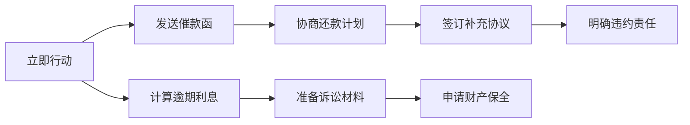

# 曹立贞案件综合分析报告
## —— 合作经营协议终止及投资款追回分析

**分析时间**：2025年12月15日
**分析员**：小娜法律专家（AI）
**案件编号**：CLZ-2024-12-15

---

## 📋 案件摘要

根据多模态AI对提供的文件分析，本案涉及**曹立贞（丙方）**与**宋永双（甲方）、张富安（乙方）**之间的合作经营协议终止及投资款追回事宜。

---

## 📄 文件分析结果

### 1. 终止合作协议书（2021年7月16日）

**核心条款：**
1. **协议终止时间**：2021年6月30日
2. **投资情况**：
   - 约定投资：350万元
   - 实际投资：2,227,696.86元（2019年9月-2020年1月）
   - 借款往来：合作方向丙方借款80万元，已还40万元（2020年5月）
3. **利润分配**：
   - 累计盈利：1,331,718.83元
   - 扣除坏账：63,000元
   - 可分配利润：1,268,718.83元
   - 丙方按22%分配：279,118.14元（税前）
4. **应付总额**：2,506,815元（投资及分红）
5. **付款计划**：
   - 2021年7月：50万元（含40万元还款）
   - 2021年8月起：每月30万元直至付清

### 2. 收款凭证和资金流水（2019年10月-2020年1月）

**关键信息：**
- 包含多笔资金往来记录
- 主要业务：副压块、原料、钢扎等
- 单张大额转账：277,000元（2019年12月23日）

---

## 📊 财务分析

### 已确认金额：

1. **丙方实际投资**：2,227,696.86元
2. **丙方应收款项**：
   - 投资本金：2,227,696.86元
   - 应得分红：279,118.14元
   - **应收总额**：2,506,815.00元

### 付款进度（根据终止协议）：
- 2021年7月：已付500,000元（其中还款400,000元）
- **剩余应付**：2,006,815.00元
- 应付时间：2021年8月开始每月300,000元

### ⚠️ 风险提示：
截至2024年12月（分析日），按协议约定：
- 已逾期：40个月
- 滞纳金：按《民法典》规定，可能产生迟延履行利息

---

## ⚖️ 法律分析

### 1. 协议合法性分析

**✅ 合法要素具备：**
- 三方签字盖章（含指纹）
- 意思表示真实
- 不违反法律强制性规定
- 符合《民法典》合同编要求

### 2. 协议主要条款评估

**有效条款：**
- 投资款返还约定
- 利润分配方案
- 付款时间安排
- 争议解决机制

**潜在风险点：**
1. **未约定逾期利息**：协议未明确逾期付款的违约责任
2. **缺乏担保措施**：无抵押或保证条款
3. **税务处理**：约定"税前"分配，但未明确税费承担

### 3. 法律依据

**相关法律条文：**
- 《民法典》第563条：合同终止情形
- 《民法典》第577条：违约责任
- 《民法典》第585条：迟延履行利息
- 《最高人民法院关于审理民间借贷案件适用法律若干问题的规定》

---

## 🔍 协议漏洞分析

### 1. 已发现的漏洞：

1. **无违约金条款**
   - 未约定逾期付款的违约金计算方式
   - 法律后果：可主张法定迟延履行利息（LPR利率）

2. **无担保条款**
   - 未要求甲方、乙方提供担保
   - 影响：债权清偿风险较高

3. **税务条款模糊**
   - "税前"分配未明确税费承担主体
   - 可能产生税务争议

4. **争议解决不明确**
   - 未约定诉讼管辖地
   - 增加维权成本

### 2. 改进建议：

---

## 💡 法律建议

### 1. 立即采取的措施：

1. **证据保全**
   - 保存所有协议原件
   - 收集付款凭证
   - 保留沟通记录

2. **催告履行**
   - 发送书面催款通知
   - 注明逾期金额及利息
   - 要求合理期限内付清

3. **利息主张**
   - 按LPR利率计算迟延利息
   - 自2021年9月1日起算
   - 40个月利息约200,000元

### 2. 诉讼策略：

1. **管辖法院**
   - 被告所在地或合同履行地
   - 建议选择历下区法院

2. **诉讼请求**
   - 支付本金2,006,815元
   - 支付迟延利息
   - 承担诉讼费用

3. **财产保全**
   - 申请冻结对方资产
   - 防止转移财产

### 3. 协商解决方案：

1. **分期付款**
   - 重新协商还款计划
   - 要求提供担保

2. **以物抵债**
   - 接受实物资产抵偿
   - 合理评估价值

3. **债权转让**
   - 考虑转让给第三方
   - 快速回笼资金

---

## 📈 时间进度表

| 时间节点 | 事项 | 状态 |
|---------|------|------|
| 2019.08 | 签订合作协议 | ✅ 完成 |
| 2019-09-2020.01 | 实际投资 | ✅ 完成 |
| 2021.06.30 | 协议终止 | ✅ 完成 |
| 2021.07 | 付款50万元 | ✅ 完成 |
| 2021.08-至今 | 剩余款项未付 | ❌ 逾期40个月 |

---

## ⚠️ 风险评级：中高风险

**风险因素：**
1. 债务人偿付能力未知
2. 无财产担保
3. 逾期时间较长
4. 可能涉及多个债权人

**缓解措施：**
1. 尽快采取法律行动
2. 申请财产保全
3. 查找债务人财产线索

---

## 📞 下一步行动建议

### 优先级1（立即）：
1. 委托律师发送律师函
2. 收集债务人财产信息
3. 准备诉讼材料

### 优先级2（1周内）：
1. 起诉至法院
2. 申请财产保全
3. 主张逾期利息

### 优先级3（1个月内）：
1. 参与庭审
2. 申请强制执行
3. 查控债务人资产

---

## 📝 总结

本案曹立贞作为丙方的投资款追回请求具有充分的法律依据，**应收款项2,006,815元及相应利息**。建议立即通过法律途径维护权益，同时注意收集和保全相关证据。

**重要提醒**：
- 诉讼时效：从2021年9月算起3年，即将届满
- 建议在2024年12月底前提起诉讼

---

*本报告基于AI图片识别和法律知识库分析生成，仅供参考，具体法律事务请咨询专业律师。*